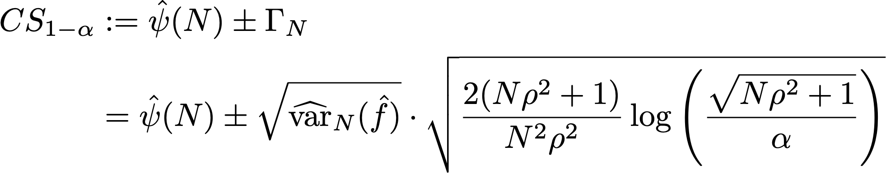
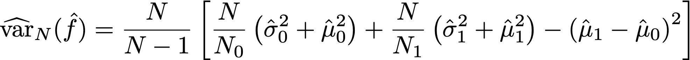

# 了解實驗報告中的統計計算 {#experiment-report-calculations}

本頁會記錄Adobe Journey Optimizer行銷活動的實驗報告中使用的詳細統計計算。

請注意，本頁僅供技術使用者使用。

## 轉換率

實驗中的每個處理&#x200B;**的轉換率或**&#x200B;平均值，μν`ν`定義為量度總和與指派給該量度的設定檔數目之比，Nν：

{width="125" align="center"}

這裡，Yiν是已指派給指定變體`i`ν&#x200B;*的每個設定檔*&#x200B;的目標量度值。 當目標量度是「唯一」量度時（即是執行特定動作的設定檔數計數），會顯示為轉換率，並格式化為百分比。 當量度是「計數」或「總值」量度（分別例如電子郵件開啟次數、收入）時，該量度的平均估計會顯示為「每個設定檔計數」或「每個設定檔的值」。

如有需要，範例標準差會與運算式搭配使用：

{width="225" align="center"}

## 提升度 {#lift}

變數&#x200B;*ν*&#x200B;與控制變數&#x200B;*ν0*&#x200B;之間的提升度是轉換率的相對「差異」，定義如下，其中個別轉換率的定義如上所示。 這會以百分比顯示。

{width="125" align="center"}

 

## 適用於個別處理的隨時有效信賴區間

Journey Experimentation面板會顯示實驗中個別處理方式的「隨時有效」信賴區間（信賴序列）。

個別變體`ν`的信賴序列是Adobe所使用的統計方法的核心。 您可以在[此頁面](https://doi.org/10.48550/arXiv.2103.06476)上找到其定義（轉載自[Waudby-Smith et al.]）。

如果您有興趣估計目標引數`ψ`，例如實驗中的變體轉換率，一系列「固定時間」信賴區間(CI)與時間一致信賴序列(CS)之間的二分法可歸納如下：

{width="500" align="center"}

對於規則信賴區間，目標引數位於值ċn範圍內的機率保證，只在`n`的單一固定值有效（其中`n`是樣本數目）。 相反地，對於信賴序列，我們保證在任何時候/所有樣本大小`t`的值，感興趣引數的「true」值都在界限內。

這隱含幾項對線上測試非常重要的深層含意：

* CS可在新資料可用時選擇性地更新。
* 實驗可以持續監控、自適應停止或繼續。
* type-I錯誤會在所有停止時間（包括資料相依時間）受到控制。

Adobe使用漸近信賴序列，對具有平均預估值`μ`的個別變體而言，其形式為：

{width="300" align="center"}

其中：

* `N`是該變體的單位數。
* `σ`是標準差的樣本估計值（定義於上面）。
* `α`是所需的型別I錯誤（或覆蓋範圍錯誤機率）層級。 此值一律設為0.05。
* ρ2是一個常數，可調整CS最緊密的樣本大小。 Adobe已選擇通用值ρ2 = 10-2.8，該值適用於線上實驗中所見的轉換率型別。

## 信賴度 {#confidence}

Adobe使用的信賴度是「隨時有效」的信賴度，這是透過反轉平均處理效果的信賴度序列所取得。

更精確地說，在兩個樣本&#x200B;*t*&#x200B;測試中兩個變體之間的平均值差異中，此測試的:1p *— 值與平均值差異的信賴區間之間有1*&#x200B;對應。 類比，透過反轉平均處理效果估計器的（隨時有效）信賴序列，可獲得隨時有效的&#x200B;*p* — 值：

{width="200" align="center"}

在此，*E*&#x200B;為預期值。 使用的估計器是反向傾向加權(IPW)估計器。 考慮N = N0 +N1個單位，如果單位已指派給變體`i`=0,1，則以Ai=0,1標示的每個單位`ν`的變體指派。 如果使用者被指派有固定機率（傾向） π0， (1-π0)，且其結果量度為Yi，則平均處理效果的IPW估計器是：

{width="400" align="center"}

注意&#x200B;*f*&#x200B;為影響函式，Waudby-Smith等 顯示此估算程式的信賴序列為：

{width="500" align="center"}

以經驗估計值取代指派概率： π0 = N0/N，變數項可以個別樣本平均估計值μ0,1和標準差估計值σ0,1表示：

{width="500" align="center"}

接下來，回想一下，對於測試統計值z = (μA-μ0/σp)的常規假設測試，在`p` — 值與信賴區間之間存在對應關係：

{width="500" align="center"}

其中`Φ`是標準常數的累積分佈。 對於隨時有效的`p`值，根據以上定義的平均處理效果的信賴序列，我們可以反轉此關係：

{width="600" align="center"}

最後，**隨時有效的信賴度**&#x200B;為：

{width="200" align="center"}

## 宣告實驗為有結論

對於雙臂實驗，Journey Optimizer Experimentation面板會顯示訊息，指出當隨時有效的信賴度超過95% （亦即隨時有效的&#x200B;**— 值低於5%）時，實驗具有**&#x200B;結論性`p`。

當存在兩個以上的變體時，會套用Bonferonni校正，以控制族別錯誤率。 對於具有`K`個處理和單一基準（控制）處理的實驗，有`K-1`個獨立的假設測試。 Bonferonni校正表示如果隨時有效的`p`值（以上所定義）低於臨界值`α/(K-1)`，我們拒絕控制項和給定變體具有相等平均值的Null假設。

## 績效最佳的手臂

當一個實驗宣告為具有結論性時，會顯示表現最佳的臂。 這是包含控制項的Set中，具有最佳效能（最高平均或轉換率）的臂，以及具有低於Bonferonni臨界值`p`值的所有臂。
