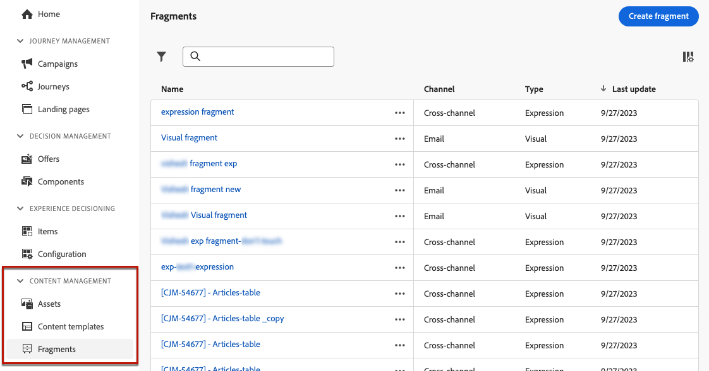

# 開始使用片段 {#fragments}

>[!CONTEXTUALHELP]
>id="ajo_create_fragment"
>title="定義您專屬的內容片段"
>abstract="建立及管理獨立的內容片段，以便在多個歷程和行銷活動中重複使用你的內容。"
>additional-url="https://experienceleague.adobe.com/zh-hant/docs/journey-optimizer/using/content-management/fragments/create-fragments" text="建立內容片段"

片段是可重複使用的元件，可在跨[!DNL Journey Optimizer]個行銷活動和歷程的一封或多封電子郵件中參考。 此功能可讓您預先建置多個自訂內容區塊，可供行銷使用者在改良的設計程式中快速組合電子郵件內容。

➡️ [瞭解如何管理、編寫和使用這些影片中的片段](#video-fragments)

若要充分利用片段：

* **建立您自己的片段**：從草稿開始建立視覺化或運算式片段，或將內容儲存為片段。 [瞭解如何建立片段](create-fragments.md)。 此外，您可以運用Journey Optimizer **內容REST API**&#x200B;來管理內容片段。 如需詳細資訊，請參閱[Journey Optimizer API檔案](https://developer.adobe.com/journey-optimizer-apis/references/content/){target="_blank"}。
* **重複使用您的片段：**&#x200B;視需要在內容中多次使用這些片段。 請參閱[新增視覺化片段](../email/use-visual-fragments.md)和[運用運算式片段](../personalization/use-expression-fragments.md)

## 開始之前 {#fragment-prerequisites}

若要建立、編輯、封存和發佈片段，您需要&#x200B;**[!DNL Content Library Manager]**&#x200B;產品設定檔中包含的&#x200B;**[!DNL Manage library items]**&#x200B;和&#x200B;**[發佈片段]**&#x200B;權限。[了解更多](../administration/ootb-product-profiles.md#content-library-manager)

在此版本中，適用下列限制：

* **視覺片段**&#x200B;僅適用於電子郵件頻道。
* **運算式片段**&#x200B;不適用於應用程式內頻道。

[此區段](../start/guardrails.md#fragments-guardrails)中有更多套用至片段的護欄。

## 視覺效果和運算式片段 {#visual-expression}

可用的片段類型有兩種：

* **視覺片段**&#x200B;是預先定義的視覺化區塊，您可以使用[電子郵件Designer](../email/get-started-email-design.md)或在[內容範本](../email/use-email-templates.md)中，在多個電子郵件傳遞中重複使用。
* **運算式片段**&#x200B;是預先定義的運算式，可從[個人化編輯器](../personalization/personalization-build-expressions.md)中的專用專案取得。

所有已建立的片段都可以從&#x200B;**[!UICONTROL 內容管理]** > **[!UICONTROL 片段]**&#x200B;左側功能表存取。 [瞭解如何管理片段](../content-management/manage-fragments.md)

## 作法影片 {#video-fragments}

瞭解如何在&#x200B;**中管理、編寫及使用**&#x200B;視覺化片段[!DNL Journey Optimizer]。

>[!VIDEO](https://video.tv.adobe.com/v/3451193/?captions=chi_hant&quality=12)

瞭解如何在&#x200B;**中管理、編寫及使用**&#x200B;運算式片段[!DNL Journey Optimizer]。

>[!VIDEO](https://video.tv.adobe.com/v/3438930/?captions=chi_hant&quality=12)
