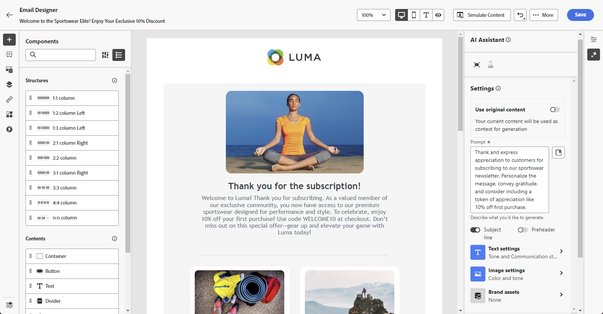
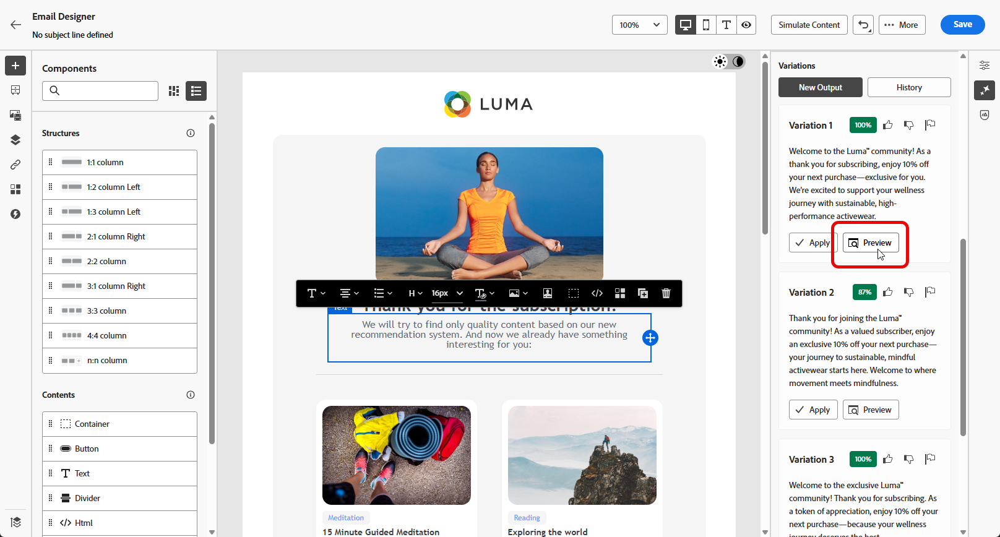
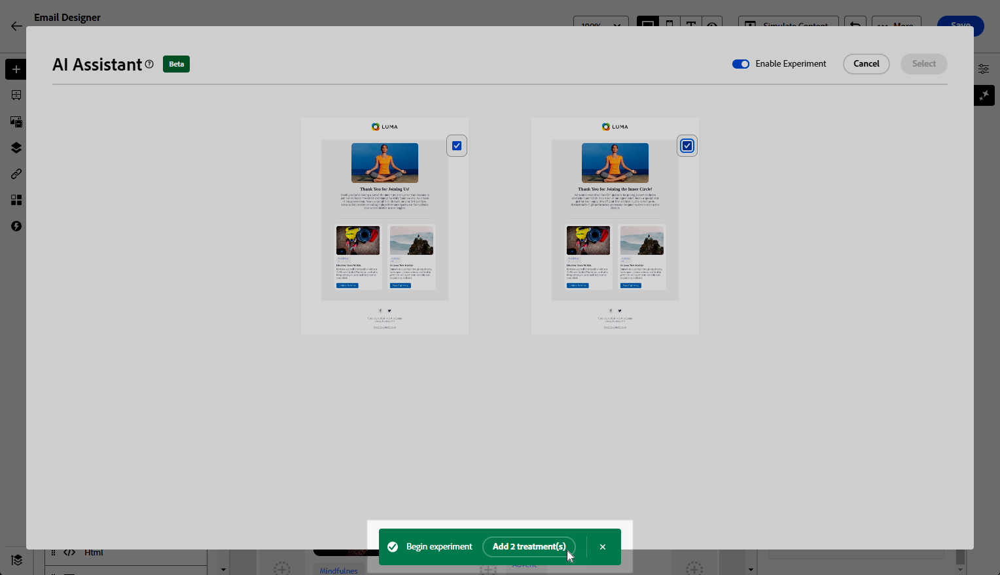
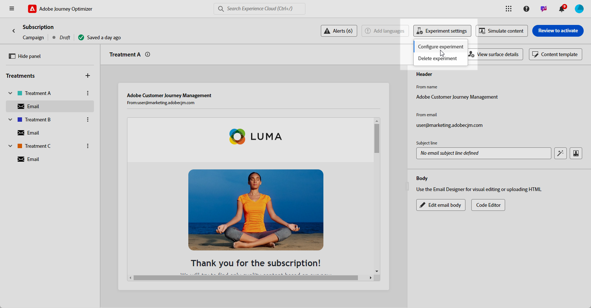

# 使用 AI 助理進行內容實驗 {#generative-experimentation}

>[!BEGINSHADEBOX]

**目錄**

* [開始使用 AI 助理](gs-generative.md)
* [使用 AI 助理產生電子郵件](generative-email.md)
* [使用 AI 助理產生簡訊](generative-sms.md)
* [使用 AI 助理推播產生](generative-push.md)
* 使用 AI 助理進行內容實驗

>[!ENDSHADEBOX]

當您製作好訊息並加以個人化後，請使用Adobe Journey Optimizer中的AI助理來提升您的內容，其中包括內容實驗功能。 此工具可讓您定義多種傳送處理方式、各種內容，以測量目標對象的效能。

1. 建立您的行銷活動，並使用AI助理產生您的變體。

   在此範例中，我們已產生包含促銷代碼的訂閱確認電子郵件。

   

1. 瀏覽產生的&#x200B;**[!UICONTROL 變數]**，然後按一下&#x200B;**[!UICONTROL 預覽]**&#x200B;以檢視所選變數的全熒幕版本。

   

1. 選取&#x200B;**[!UICONTROL 啟用實驗]**&#x200B;以開始為您的實驗建立&#x200B;**[!UICONTROL 處理]**。

1. 選取您要納入實驗中的變數。

1. 按一下&#x200B;**新增X處理**。

   

1. 從您的內容實驗視窗，存取&#x200B;**[!UICONTROL 實驗設定]**&#x200B;按鈕以設定實驗。 [進一步瞭解內容實驗](../content-management/content-experiment.md)

   

1. 當您的內容實驗準備就緒時，從行銷活動摘要頁面，您可以按一下&#x200B;**[!UICONTROL 檢閱以啟動]**&#x200B;以顯示行銷活動的摘要。 如果有任何引數不正確或遺失，則會顯示警報。 [了解更多](../content-management/content-experiment.md#treatment-experiment)

1. 在啟動行銷活動之前，請仔細檢查所有設定是否正確，然後按一下[啟用]。****

在成功設定行銷活動並個人化行銷活動後，您可以在行銷活動報告中追蹤您的行銷活動。 [了解更多](../reports/campaign-global-report.md)
