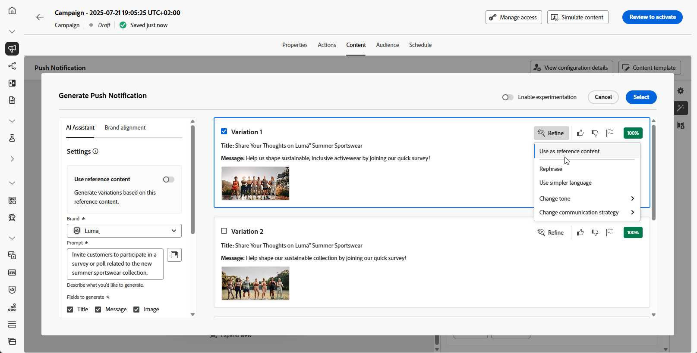

# 使用AI助理產生完整內容 {#generative-full-content}

>[!IMPORTANT]
>
>開始使用此功能之前，請先閱讀相關的[護欄與限制](gs-generative.md#generative-guardrails)。
> 
>
>您必須先同意[使用者合約](https://www.adobe.com/tw/legal/licenses-terms/adobe-dx-gen-ai-user-guidelines.html)，才能在Journey Optimizer中使用AI小幫手。 如需詳細資訊，請聯絡您的 Adobe 代表。

使用Journey Optimizer中的AI助理，在您的電子郵件、網路、登陸頁面和推播通知頻道中產生完整的內容體驗。 AI Assistant可建立與受眾產生共鳴的完整內容，協助您最佳化傳遞的影響。

## 適用於電子郵件與網路頻道 {#email-web-channels}

AI Assistant可以為您的電子郵件行銷活動、網頁和登入頁面產生完整的內容體驗，產生文字和影像。 這項強大的功能可協助您建立吸引人的品牌內內容，連結所有數位接觸點的對象。

### 存取及設定 {#access-configure}

開始使用AI助理建立內容之前，您需要設定行銷活動或歷程並開啟內容編輯器。 使用下列步驟準備您的工作區並存取AI助理面板。

1. 建立及設定您的行銷活動或歷程：
   * **電子郵件**：建立並設定您的電子郵件行銷活動後，請按一下&#x200B;**[!UICONTROL 編輯內容]**。 [了解更多](../campaigns/create-campaign.md)
   * **網頁**：建立並設定網頁之後，請按一下[編輯網頁]****。 [了解更多](../web/create-web.md)
   * **登陸頁面**：建立並設定您的登陸頁面後，請按一下&#x200B;**[!UICONTROL 開啟設計工具]**。 [了解更多](../landing-pages/create-lp.md)

1. 從右側功能表選取&#x200B;**[!UICONTROL AI小幫手]** （或&#x200B;**[!UICONTROL 顯示網頁內容小幫手]**）。

   {zoomable="yes"}

### 產生內容 {#generate-content}

開啟AI助理後，您現在可以設定產生設定，以建立符合您的品牌和行銷活動目標的內容。 自訂文字和影像引數、新增品牌資產，並提供提示以引導AI為您的受眾產生相關變數。

1. 選取您的&#x200B;**[!UICONTROL 品牌]**，以確保AI產生的內容符合您的品牌規格。 [進一步瞭解](brands.md)品牌。

1. 說明您要在&#x200B;**[!UICONTROL 提示]**&#x200B;欄位中產生的內容，以微調內容。

   如果您正在尋求製作提示的協助，請存取&#x200B;**[!UICONTROL 提示資料庫]**，其中提供各種提示概念，以改進您的行銷活動。 [進一步瞭解提示最佳實務](ai-assistant-prompting-guide.md)

   {zoomable="yes"}

1. **對於電子郵件**，您可以切換&#x200B;**[!UICONTROL 主旨列]**&#x200B;和&#x200B;**[!UICONTROL 預先標題]**&#x200B;選項以將其包含在變體產生中。

1. 使用&#x200B;**[!UICONTROL 文字設定]**&#x200B;選項量身打造您的提示：

   * **[!UICONTROL 通訊策略]**：選擇最適合您產生文字的通訊樣式。
   * **[!UICONTROL 語言]**：選擇您產生內容的語言。
   * **[!UICONTROL 音調]**：音調應該會與您的對象產生共鳴。 無論您是要提供豐富資訊、好玩或有說服力，AI Assistant都能據以調整訊息。

     {zoomable="yes"}

1. 選擇您的&#x200B;**[!UICONTROL 影像設定]**：

   * **[!UICONTROL 內容型別]**：這會分類視覺元素的性質，區分不同的視覺呈現形式，例如像片、圖形或藝術品。
   * **[!UICONTROL 視覺強度]**：您可以調整影像的強度來控制影像的影響。 較低的設定(2)可建立更柔和、更克制的外觀，而較高的設定(10)則可讓影像更生動、視覺效果更強大。
   * **[!UICONTROL 色彩和色調]**：影像中顏色的整體外觀及其傳達的氣氛或氣氛。
   * **[!UICONTROL 照明]**：這指的是影像中的閃電，它會塑造大氣層，並反白標示特定的元素。
   * **[!UICONTROL 構成]**：這指的是影像框架中元素的排列

     {zoomable="yes"}

1. 從&#x200B;**[!UICONTROL 參考內容]**&#x200B;功能表，按一下&#x200B;**[!UICONTROL 上傳檔案]**&#x200B;以新增任何品牌資產，該資產包含可提供額外內容AI助理的內容或選取先前上傳的內容。

   先前上傳的檔案可在&#x200B;**[!UICONTROL 已上傳的參考內容]**&#x200B;下拉式清單中使用。 只需切換您要納入產生代的資產。

   {zoomable="yes"}

1. 提示就緒後，請按一下[產生]。****

### 精簡並完成 {#refine-finalize}

產生內容變化後，您可以微調結果以確保它們符合您的確切要求。 檢閱品牌一致性、調整語調和語言，並準備內容以在您的行銷活動或歷程中啟用。

1. 產生之後，瀏覽&#x200B;**[!UICONTROL 變數]**。

1. 按一下百分比圖示可檢視您的&#x200B;**[!UICONTROL 品牌一致性分數]**，並識別與您的品牌之間的任何不一致性。

   深入瞭解[品牌一致性分數](brands-score.md)。

   {zoomable="yes"}

1. 按一下&#x200B;**[!UICONTROL 預覽]**&#x200B;以檢視所選變數的全熒幕版本，或按一下&#x200B;**[!UICONTROL 套用]**&#x200B;以取代您目前的內容。

1. 導覽至&#x200B;**[!UICONTROL 預覽]**&#x200B;視窗中的&#x200B;**[!UICONTROL 調整]**&#x200B;選項，以存取其他自訂功能：

   * **[!UICONTROL 重新寫詞]**：重新寫入郵件，同時保留其意義。 此選項可協助您產生替代用語、改善流量或調整詞句，而不變更核心訊息。

   * **[!UICONTROL 使用較簡單的語言]**：利用AI Assistant簡化您的語言，確保更廣大的受眾擁有清晰易懂的語言。

   * **[!UICONTROL 翻譯]**：簡化您的語言，確保更廣大的受眾能清楚無誤地瞭解。

   * **[!UICONTROL 變更語調]**：調整訊息的語調，以更符合您的通訊風格，例如，讓訊息更友好、更專業、更緊急，或更具啟發性。

   * **[!UICONTROL 變更通訊策略]**：根據您的目標修改傳訊方式，例如建立緊急狀態或強調令人興奮的吸引力。

     {zoomable="yes"}

1. 開啟&#x200B;**[!UICONTROL 品牌一致性]**&#x200B;標籤，檢視您的內容如何與您的[品牌指南](brands.md)一致。

1. 找到適當的內容後，按一下&#x200B;**[!UICONTROL 選取]**。

   您也可以為內容啟用實驗。 [了解更多](generative-experimentation.md)

1. 插入個人化欄位，以根據設定檔資料自訂您的內容。 然後，按一下&#x200B;**[!UICONTROL 模擬內容]**&#x200B;按鈕以控制呈現，並使用測試設定檔檢查個人化設定。 [了解更多](../personalization/personalize.md)

1. 檢閱並啟用您的內容：
   * **電子郵件**：當您定義內容、對象和排程時，就可以準備電子郵件行銷活動了。 [了解更多](../campaigns/review-activate-campaign.md)
   * **網頁**：一旦您定義您的網頁行銷活動設定，並視需要編輯您的內容，您就可以檢閱並啟動您的網頁行銷活動。 [了解更多](../web/create-web.md#activate-web-campaign)
   * **登陸頁面**：一旦您的登陸頁面準備就緒，您就可以發佈該頁面，以供訊息使用。 [了解更多](../landing-pages/create-lp.md#publish-landing-page)

## 適用於行動裝置頻道 {#mobile-channels}

AI Assistant也支援行動推播通知的內容產生，讓您為行動應用程式建立吸引人的標題、訊息和影像。 這可協助您在包括行動裝置在內的所有客戶接觸點維持一致的高品質通訊。

### 存取及設定 {#mobile-access-configure}

若要使用AI助理推送通知，請先設定您的推送行銷活動並開啟內容編輯器。 以下步驟將引導您準備行銷活動並存取AI助理工具。

1. 建立並設定推播通知行銷活動後，請按一下&#x200B;**[!UICONTROL 編輯內容]**。

   有關如何設定推播通知行銷活動的詳細資訊，請參閱[此頁面](../push/create-push.md)。

1. 填寫行銷活動的&#x200B;**[!UICONTROL 基本詳細資料]**。 完成後，按一下&#x200B;**[!UICONTROL 編輯內容]**。

1. 視需要個人化您的推播通知。 [了解更多](../push/design-push.md)

1. 存取&#x200B;**[!UICONTROL 顯示AI助理]**&#x200B;功能表。

   {zoomable="yes"}

### 產生內容 {#mobile-generate-content}

存取用於推播通知的AI Assistant後，您可以設定產生設定，以建立吸引人的行動內容。 定義您的文字和影像偏好設定、選取品牌資產，並使用提示產生推播通知變化，以吸引您的行動使用者。

1. 啟用AI助理的&#x200B;**[!UICONTROL 使用原始內容]**&#x200B;選項，以根據選取的內容個人化新內容。

1. 選取您的&#x200B;**[!UICONTROL 品牌]**，以確保AI產生的內容符合您的品牌規格。 [進一步瞭解](brands.md)品牌。

   請注意，品牌功能會以私人測試版發佈，未來發佈的版本將逐步提供給所有客戶。

1. 說明您要在&#x200B;**[!UICONTROL 提示]**&#x200B;欄位中產生的內容，以微調內容。

   如果您正在尋求製作提示的協助，請存取&#x200B;**[!UICONTROL 提示資料庫]**，其中提供各種提示概念，以改進您的行銷活動。

   {zoomable="yes"}

1. 選擇要產生的欄位： **[!UICONTROL 標題]**、**[!UICONTROL 訊息]**&#x200B;和/或&#x200B;**[!UICONTROL 影像]**。

1. 使用&#x200B;**[!UICONTROL 文字設定]**&#x200B;選項量身打造您的提示：

   * **[!UICONTROL 通訊策略]**：選擇最適合您產生文字的通訊樣式。
   * **[!UICONTROL 語言]**：選擇您產生內容的語言。
   * **[!UICONTROL 音調]**：您的推播通知音調應該會對您的對象產生共鳴。 無論您是要提供豐富資訊、好玩或有說服力，AI Assistant都能據以調整訊息。

     推播通知的{zoomable="yes"}

1. 選擇您的&#x200B;**[!UICONTROL 影像設定]**：

   * **[!UICONTROL 內容型別]**：這會分類視覺元素的性質，區分不同的視覺呈現形式，例如像片、圖形或藝術品。
   * **[!UICONTROL 視覺強度]**：您可以調整影像的強度來控制影像的影響。 較低的設定(2)可建立更柔和、更克制的外觀，而較高的設定(10)則可讓影像更生動、視覺效果更強大。
   * **[!UICONTROL 色彩和色調]**：影像中顏色的整體外觀及其傳達的氣氛或氣氛。
   * **[!UICONTROL 照明]**：這指的是影像中的閃電，它會塑造大氣層，並反白標示特定的元素。
   * **[!UICONTROL 構成]**：這指的是影像框架中元素的排列

     {zoomable="yes"}

1. 從&#x200B;**[!UICONTROL 參考內容]**&#x200B;功能表，按一下&#x200B;**[!UICONTROL 上傳檔案]**&#x200B;以新增任何品牌資產，該資產包含可提供額外內容AI助理的內容或選取先前上傳的內容。

   先前上傳的檔案可在&#x200B;**[!UICONTROL 已上傳的參考內容]**&#x200B;下拉式清單中使用。 只需切換您要納入產生代的資產。

1. 提示就緒後，請按一下[產生]。****

### 精簡並完成 {#mobile-refine-finalize}

檢閱您產生的推播通知變化後，您可以改善內容以使其完美。 在啟動推播行銷活動之前，使用精簡工具來調整語言和語氣、驗證品牌一致性並個人化內容。

1. 瀏覽產生的&#x200B;**[!UICONTROL 變數]**。

1. 按一下百分比圖示可檢視您的&#x200B;**[!UICONTROL 品牌一致性分數]**，並識別與您的品牌之間的任何不一致性。

   深入瞭解[品牌一致性分數](brands-score.md)。

   {zoomable="yes"}

1. 按一下&#x200B;**[!UICONTROL 預覽]**&#x200B;以檢視所選變數的全熒幕版本，或按一下&#x200B;**[!UICONTROL 套用]**&#x200B;以取代您目前的內容。

1. 導覽至&#x200B;**[!UICONTROL 預覽]**&#x200B;視窗中的&#x200B;**[!UICONTROL 調整]**&#x200B;選項，以存取其他自訂功能：

   * **[!UICONTROL 使用作為參考內容]**：選擇的變體將作為參考內容以產生其他結果。

   * **[!UICONTROL 重新寫詞]**：重新寫入郵件，同時保留其意義。 此選項可協助您產生替代用語、改善流量或調整詞句，而不變更核心訊息。

   * **[!UICONTROL 使用較簡單的語言]**：利用AI Assistant簡化您的語言，確保更廣大的受眾擁有清晰易懂的語言。

   * **[!UICONTROL 變更語調]**：調整訊息的語調，以更符合您的通訊風格，例如，讓訊息更友好、更專業、更緊急，或更具啟發性。

   * **[!UICONTROL 變更通訊策略]**：根據您的目標修改傳訊方式，例如建立緊急狀態或強調令人興奮的吸引力。

     {zoomable="yes"}

1. 開啟&#x200B;**[!UICONTROL 品牌一致性]**&#x200B;標籤，檢視您的內容如何與您的[品牌指南](brands.md)一致。

1. 找到適當的內容後，按一下&#x200B;**[!UICONTROL 選取]**。

   您也可以為內容啟用實驗。 [了解更多](generative-experimentation.md)

1. 插入個人化欄位，以根據設定檔資料自訂推播通知內容。 然後，按一下&#x200B;**[!UICONTROL 模擬內容]**&#x200B;按鈕以控制呈現，並使用測試設定檔檢查個人化設定。 [了解更多](../personalization/personalize.md)

定義內容、對象和排程後，您就可以準備推播行銷活動。 [了解更多](../campaigns/review-activate-campaign.md)

## 操作說明影片 {#video}

瞭解如何使用Journey Optimizer中的AI助理產生完整的內容體驗。

>[!VIDEO](https://video.tv.adobe.com/v/3433552)
