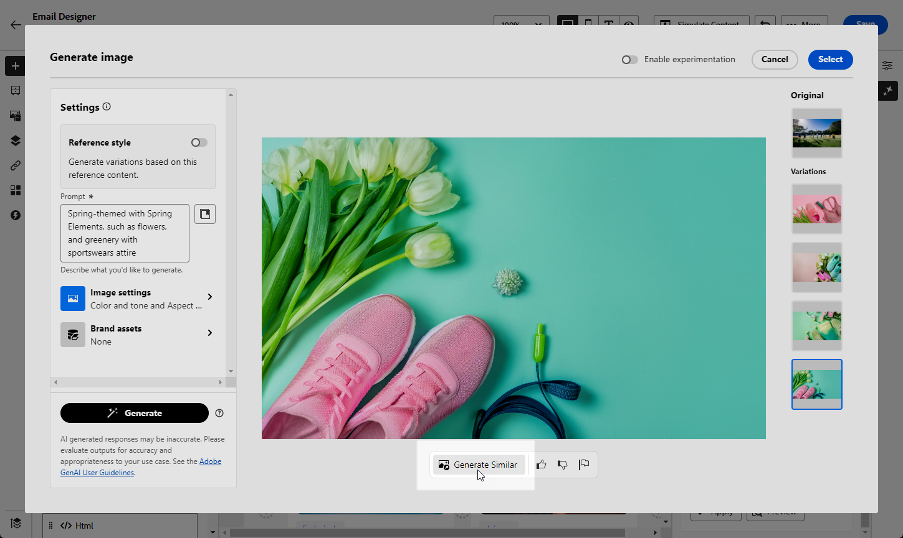
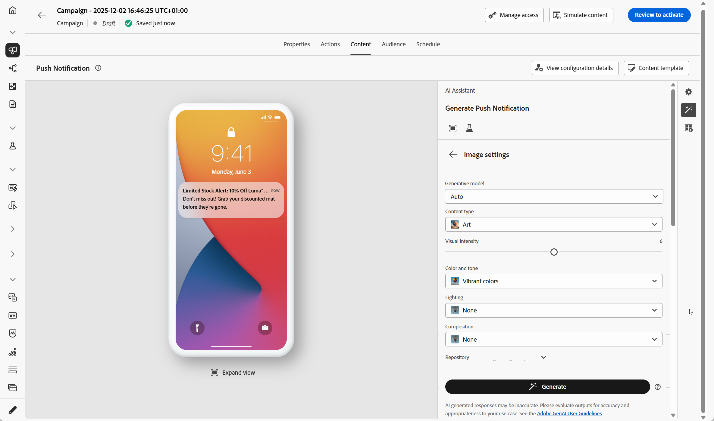

# 使用AI助理產生影像 {#generative-image}

>[!IMPORTANT]
>
>開始使用此功能之前，請先閱讀相關的[護欄與限制](gs-generative.md#generative-guardrails)。
> 
>
>您必須先同意[使用者合約](https://www.adobe.com/tw/legal/licenses-terms/adobe-dx-gen-ai-user-guidelines.html)，才能在Journey Optimizer中使用AI小幫手。 如需詳細資訊，請聯絡您的 Adobe 代表。

使用Journey Optimizer中的AI助理產生吸引人的視覺內容，透過電子郵件、網頁、登陸頁面和推播通知來增強您的訊息。 AI Assistant可協助您最佳化和改善資產，確保受眾獲得更方便好用且吸引人的體驗。

## 適用於電子郵件與網路頻道 {#email-web-channels}

AI助理可以為您的電子郵件行銷活動、網頁體驗和登入頁面產生完整的視覺體驗。 此功能可讓您在品牌上製作吸引目光的影像，並在數位接觸點與您的對象產生共鳴。

### 存取及設定 {#access-configure}

若要開始使用AI助理產生影像，請先設定您的行銷活動或歷程，然後開啟內容編輯器。 請依照下列步驟準備您的工作區並存取AI Assistant面板。

1. 建立及設定您的行銷活動或歷程：
   * **電子郵件**：建立並設定您的電子郵件行銷活動後，請按一下&#x200B;**[!UICONTROL 編輯內容]**。 [了解更多](../email/create-email.md)
   * **網頁**：建立並設定網頁之後，請按一下[編輯網頁]&#x200B;**&#x200B;**。 [了解更多](../web/create-web.md)
   * **登陸頁面**：建立並設定您的登陸頁面後，請按一下&#x200B;**[!UICONTROL 開啟設計工具]**。 [了解更多](../landing-pages/create-lp.md)

1. 選取您要使用AI助理變更的資產。

1. 從右側功能表選取&#x200B;**[!UICONTROL AI小幫手]** （或&#x200B;**[!UICONTROL 顯示網頁內容小幫手]**）。

   {zoomable="yes"}

### 產生內容 {#generate-content}

瞭解如何製作有效的提示並設定影像設定，以使用AI Assistant產生吸引人的視覺效果。 自訂引數（例如外觀比例、視覺強度和光線），以建立符合您品牌和促銷活動目標的影像。

1. 啟用AI助理的&#x200B;**[!UICONTROL 參考樣式]**&#x200B;選項，以根據參考內容個人化新內容。 您也可以上傳影像以將內容新增至您的變數。

1. 選取您的&#x200B;**[!UICONTROL 品牌]**，以確保AI產生的內容符合您的品牌規格。 [進一步瞭解](brands.md)品牌。

1. 說明您要在&#x200B;**[!UICONTROL 提示]**&#x200B;欄位中產生的內容，以微調內容。

   如果您正在尋求製作提示的協助，請存取&#x200B;**[!UICONTROL 提示資料庫]**，其中提供各種提示概念，以改進您的行銷活動。

   {zoomable="yes"}

1. 使用&#x200B;**[!UICONTROL 影像設定]**&#x200B;選項量身打造您的提示：

   * **[!UICONTROL 外觀比例]**：這會決定資產的寬度和高度。 您可以選擇一般比率，例如16:9、4:3、3:2或1:1，或者您可以輸入自訂大小。
   * **[!UICONTROL 內容型別]**：這會分類視覺元素的性質，區分不同的視覺呈現形式，例如像片、圖形或藝術品。
   * **[!UICONTROL 視覺強度]**：您可以調整影像的強度來控制影像的影響。 較低的設定(2)可建立更柔和、更克制的外觀，而較高的設定(10)則可讓影像更生動、視覺效果更強大。
   * **[!UICONTROL 色彩和色調]**：影像中顏色的整體外觀及其傳達的氣氛或氣氛。
   * **[!UICONTROL 照明]**：這指的是影像中的閃電，它會塑造大氣層，並反白標示特定的元素。
   * **[!UICONTROL 構成]**：這指的是影像框架中元素的排列

     {zoomable="yes"}

1. 從&#x200B;**[!UICONTROL 參考內容]**&#x200B;功能表，按一下&#x200B;**[!UICONTROL 上傳檔案]**&#x200B;以新增任何品牌資產，該資產包含可提供額外內容AI助理的內容或選取先前上傳的內容。

   先前上傳的檔案可在&#x200B;**[!UICONTROL 已上傳的參考內容]**&#x200B;下拉式清單中使用。 只需切換您要納入產生代的資產。

1. 在您滿意提示組態之後，請按一下[產生]。**&#x200B;**

### 精簡並完成 {#refine-finalize}

產生影像變化後，您可以檢閱結果、檢查品牌一致性、在Adobe Express中編輯，並為您的內容選取最佳選項。

1. 瀏覽&#x200B;**[!UICONTROL 變數建議]**&#x200B;以尋找所需的資產。

1. 按一下百分比圖示可檢視您的&#x200B;**[!UICONTROL 品牌一致性分數]**，並識別與您的品牌之間的任何不一致性。

   深入瞭解[品牌一致性分數](brands-score.md)。

   {zoomable="yes"}

1. 按一下&#x200B;**[!UICONTROL 預覽]**&#x200B;以檢視所選變數的全熒幕版本，或按一下&#x200B;**[!UICONTROL 套用]**&#x200B;以取代您目前的內容。

1. 導覽至&#x200B;**[!UICONTROL 預覽]**&#x200B;視窗中的&#x200B;**[!UICONTROL 調整]**&#x200B;選項，以存取其他自訂功能：

   * **[!UICONTROL 產生類似專案]**&#x200B;以檢視與此變體相關的影像。
   * **[!UICONTROL 在Adobe Express中編輯]**&#x200B;以進一步自訂您的資產。

[進一步瞭解Adobe Express整合](../integrations/express.md)

   * **[!UICONTROL 儲存]**&#x200B;以儲存資產以供稍後存取。

     {zoomable="yes"}

1. 找到適當的內容後，按一下&#x200B;**[!UICONTROL 選取]**。

   您也可以為內容啟用實驗。 [了解更多](generative-experimentation.md)

1. 定義訊息內容後，按一下&#x200B;**[!UICONTROL 模擬內容]**&#x200B;按鈕以控制呈現，並使用測試設定檔檢查個人化設定。 [了解更多](../personalization/personalize.md)

1. 檢閱並啟用您的內容：
   * **電子郵件**：當您定義內容、對象和排程時，就可以準備電子郵件行銷活動了。 [了解更多](../campaigns/review-activate-campaign.md)
   * **網頁**：一旦您定義您的網頁行銷活動設定，並視需要編輯您的內容，您就可以檢閱並啟動您的網頁行銷活動。 [了解更多](../web/create-web.md#activate-web-campaign)
   * **登陸頁面**：一旦您的登陸頁面準備就緒，您就可以發佈該頁面，以供訊息使用。 [了解更多](../landing-pages/create-lp.md#publish-landing-page)

## 適用於行動裝置頻道 {#mobile-channels}

AI Assistant可讓您產生推送通知的吸引人影像，協助您建立吸引人的視覺行動通訊，吸引觀眾注意並與觀眾產生共鳴。

### 存取及設定 {#mobile-access-configure}

若要使用AI助理推送通知，您必須設定推送傳遞，並導覽至內容編輯器。 這些步驟將引導您建立傳遞和存取AI助理功能。

1. 建立及設定推播通知傳遞之後，請按一下[編輯內容]。**&#x200B;**

   如需設定推播傳遞的詳細資訊，請參閱[此頁面](../push/create-push.md)。

1. 視需要個人化您的推播通知。 [了解更多](../push/design-push.md)

1. 存取&#x200B;**[!UICONTROL 顯示AI助理]**&#x200B;功能表。

   ![顯示[顯示AI小幫手]功能表的熒幕擷圖](assets/push-genai-1.png){zoomable="yes"}

### 產生內容 {#mobile-generate-content}

存取AI Assistant後，您可以調整產生設定以建立與您的品牌一致的影像，並支援您的推播通知目標。 設定提示和影像引數，以產生針對行動顯示器最佳化的視覺效果。

1. 選取您的&#x200B;**[!UICONTROL 品牌]**，以確保AI產生的內容符合您的品牌規格。 [進一步瞭解](brands.md)品牌。

   請注意，品牌功能會以私人測試版發佈，未來發佈的版本將逐步提供給所有客戶。

1. 說明您要在&#x200B;**[!UICONTROL 提示]**&#x200B;欄位中產生的內容，以微調內容。

   如果您正在尋求製作提示的協助，請存取&#x200B;**[!UICONTROL 提示資料庫]**，其中提供各種提示概念，以改進您的行銷活動。

   為推播產生{zoomable="yes"}

1. 選取&#x200B;**[!UICONTROL 影像]**&#x200B;作為要產生的欄位。

1. 選擇您的&#x200B;**[!UICONTROL 影像設定]**：

   * **[!UICONTROL 內容型別]**：這會分類視覺元素的性質，區分不同的視覺呈現形式，例如像片、圖形或藝術品。
   * **[!UICONTROL 視覺強度]**：您可以調整影像的強度來控制影像的影響。 較低的設定(2)可建立更柔和、更克制的外觀，而較高的設定(10)則可讓影像更生動、視覺效果更強大。
   * **[!UICONTROL 色彩和色調]**：影像中顏色的整體外觀及其傳達的氣氛或氣氛。
   * **[!UICONTROL 照明]**：這指的是影像中的閃電，它會塑造大氣層，並反白標示特定的元素。
   * **[!UICONTROL 構成]**：這指的是影像框架中元素的排列

     為推播產生{zoomable="yes"}

1. 從&#x200B;**[!UICONTROL 參考內容]**&#x200B;功能表，按一下&#x200B;**[!UICONTROL 上傳檔案]**&#x200B;以新增任何品牌資產，該資產包含可提供額外內容AI助理的內容或選取先前上傳的內容。

   先前上傳的檔案可在&#x200B;**[!UICONTROL 已上傳的參考內容]**&#x200B;下拉式清單中使用。 只需切換您要納入產生代的資產。

1. 提示就緒後，請按一下[產生]。**&#x200B;**

### 精簡並完成 {#mobile-refine-finalize}

產生推播通知的影像變化後，您可以微調結果以確保其符合您的確切需求。 檢閱品牌一致性、視需要在Adobe Express中編輯，並為您的行動裝置行銷活動選取最佳影像。

1. 瀏覽產生的&#x200B;**[!UICONTROL 變數]**。

1. 按一下百分比圖示可檢視您的&#x200B;**[!UICONTROL 品牌一致性分數]**，並識別與您的品牌之間的任何不一致性。

   深入瞭解[品牌一致性分數](brands-score.md)。

   {zoomable="yes"}

1. 按一下&#x200B;**[!UICONTROL 預覽]**&#x200B;以檢視所選變數的全熒幕版本，或按一下&#x200B;**[!UICONTROL 套用]**&#x200B;以取代您目前的內容。

1. 開啟&#x200B;**[!UICONTROL 品牌一致性]**&#x200B;標籤，檢視您的內容如何與您的[品牌指南](brands.md)一致。

1. 找到適當的內容後，按一下&#x200B;**[!UICONTROL 選取]**。

   您也可以為內容啟用實驗。 [了解更多](generative-experimentation.md)

定義內容、對象和排程後，您就可以準備推播行銷活動。 [了解更多](../campaigns/review-activate-campaign.md)

