# 使用 AI 助理產生登陸頁面 {#generative-lp}

>[!IMPORTANT]
>
>* 開始使用此功能之前，請先閱讀相關的[護欄與限制](gs-generative.md#generative-guardrails)。
>
>
>* 您必須接受[使用者合約](https://www.adobe.com/legal/licenses-terms/adobe-dx-gen-ai-user-guidelines.html)，才能在Journey Optimizer中使用AI小幫手。 如需詳細資訊，請聯絡您的 Adobe 代表。

使用由創作AI提供支援的Journey Optimizer AI Assistant，轉換您的登陸頁面。

輕鬆建立具影響力的內容，包括完整頁面、量身打造的文字片段，以及可引起觀眾共鳴的自訂視覺效果，進而促進參與度和互動。

探索以下標籤，瞭解如何在Journey Optimizer中使用AI助理。

>[!BEGINTABS]

>[!TAB 產生完整登陸頁面]

在下列範例中，我們將利用AI助理來調整現有的登入頁面範本。

1. 建立及設定您的登入頁面後，請按一下[編輯內容]。**&#x200B;**

   如需如何設定登入頁面的詳細資訊，請參閱[此頁面](../landing-pages/create-lp.md)。

1. 視需要個人化您的版面配置，並存取&#x200B;**[!UICONTROL AI助理]**&#x200B;功能表。

   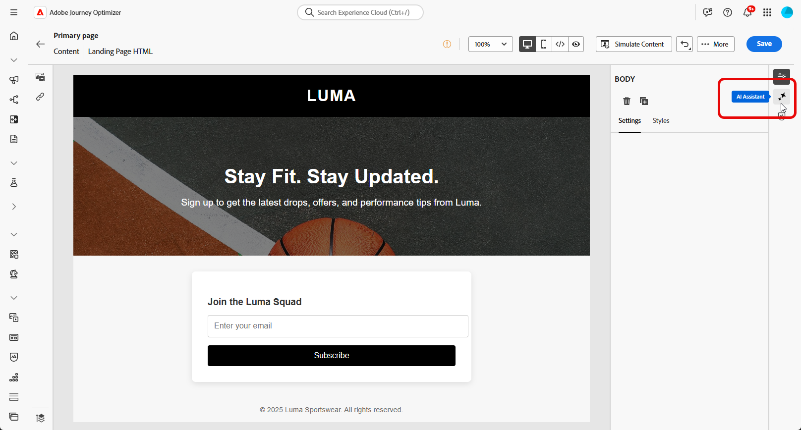{zoomable="yes"}

1. 啟用AI助理的&#x200B;**[!UICONTROL 使用原始內容]**&#x200B;選項，以根據選取的內容個人化新內容。

1. 說明您要在&#x200B;**[!UICONTROL 提示]**&#x200B;欄位中產生的內容，以微調內容。

   如果您正在尋求製作提示的協助，請存取&#x200B;**[!UICONTROL 提示程式庫]**，它提供各種提示概念，以改善您的登陸頁面。

   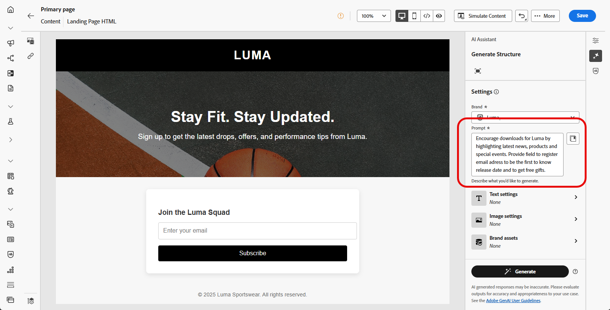{zoomable="yes"}

1. 使用&#x200B;**[!UICONTROL 文字設定]**&#x200B;選項量身打造您的提示：

   * **[!UICONTROL 通訊策略]**：選擇最適合您產生文字的通訊樣式。
   * **[!UICONTROL 語言]**：西班牙文、義大利文、瑞典文和挪威文等語言選項已發佈為私人測試版，未來版本將逐步提供給所有客戶。
   * **[!UICONTROL 膚色]**：登陸頁面的膚色應該會對您的對象產生共鳴。 無論您是要提供豐富資訊、好玩或有說服力，AI Assistant都能據以調整訊息。

   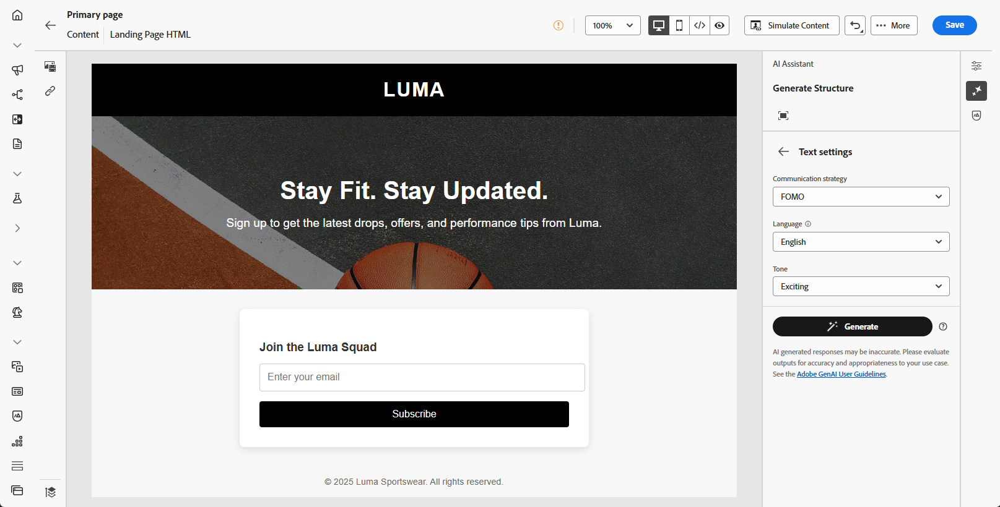{zoomable="yes"}

1. 選擇您的&#x200B;**[!UICONTROL 影像設定]**：

   * **[!UICONTROL 內容型別]**：這會分類視覺元素的性質，區分不同的視覺呈現形式，例如像片、圖形或藝術品。
   * **[!UICONTROL 視覺強度]**：您可以調整影像的強度來控制影像的影響。 較低的設定(2)可建立更柔和、更克制的外觀，而較高的設定(10)則可讓影像更生動、視覺效果更強大。
   * **[!UICONTROL 色彩和色調]**：影像中顏色的整體外觀及其傳達的氣氛或氣氛。
   * **[!UICONTROL 照明]**：這指的是影像中的閃電，它會塑造大氣層，並反白標示特定的元素。
   * **[!UICONTROL 構成]**：這指的是影像框架中元素的排列

   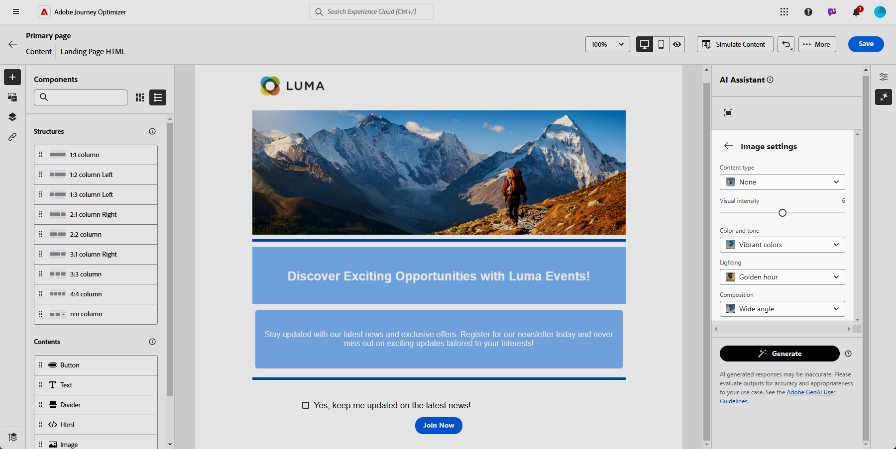{zoomable="yes"}

1. 從&#x200B;**[!UICONTROL 品牌資產]**&#x200B;功能表，按一下&#x200B;**[!UICONTROL 上傳品牌資產]**，新增任何包含可提供額外內容AI助理或選取先前上傳之內容的品牌資產。

   先前上傳的檔案可在&#x200B;**[!UICONTROL 已上傳的品牌資產]**&#x200B;下拉式清單中使用。 只需切換您要納入產生代的資產。

1. 提示就緒後，請按一下[產生]。**&#x200B;**

1. 瀏覽產生的&#x200B;**[!UICONTROL 變數]**。

   按一下&#x200B;**[!UICONTROL 預覽]**&#x200B;以檢視所選變數的全熒幕版本，或按一下&#x200B;**[!UICONTROL 套用]**&#x200B;以取代您目前的內容。

1. 按一下百分比圖示可檢視您的&#x200B;**[!UICONTROL 品牌一致性分數]**，並識別與您的品牌之間的任何不一致性。

   深入瞭解[品牌一致性分數](brands-score.md)。

   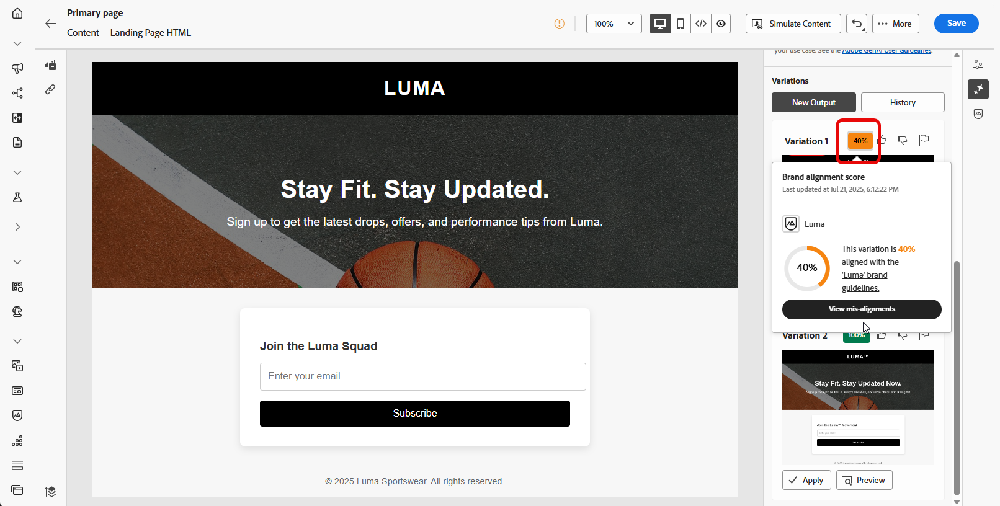{zoomable="yes"}

1. 導覽至&#x200B;**[!UICONTROL 預覽]**&#x200B;視窗中的&#x200B;**[!UICONTROL 調整]**&#x200B;選項，以存取其他自訂功能：

   * **[!UICONTROL 重述]**： AI助理可以不同的方式重述您的訊息，讓您的寫作保持新鮮，並吸引不同受眾。

   * **[!UICONTROL 使用較簡單的語言]**：利用AI Assistant簡化您的語言，確保更廣大的受眾擁有清晰易懂的語言。

   您也可以變更文字的&#x200B;**[!UICONTROL 音調]**&#x200B;和&#x200B;**[!UICONTROL 通訊策略]**。

   {zoomable="yes"}

1. 開啟&#x200B;**[!UICONTROL 品牌一致性]**&#x200B;標籤，檢視您的內容如何與您的[品牌指南](brands.md)一致。

1. 找到適當的內容後，按一下&#x200B;**[!UICONTROL 選取]**。

1. 插入個人化欄位，以根據設定檔資料自訂您的登入頁面內容。 然後，按一下&#x200B;**[!UICONTROL 模擬內容]**&#x200B;按鈕以控制呈現，並使用測試設定檔檢查個人化設定。 [了解更多](../personalization/personalize.md)

一旦登入頁面準備就緒後，您就可以發佈該頁面，以供訊息使用。 [了解更多](../landing-pages/create-lp.md#publish-landing-page)

>[!TAB 純文字產生]

在下列範例中，我們將利用AI助理來增強登陸頁面的內容。

1. 建立及設定您的登入頁面後，請按一下[編輯內容]。**&#x200B;**

   如需如何設定登入頁面的詳細資訊，請參閱[此頁面](../landing-pages/create-lp.md)。

1. 選取&#x200B;**[!UICONTROL 文字元件]**&#x200B;以僅鎖定特定內容。 並存取&#x200B;**[!UICONTROL AI助理]**&#x200B;功能表。

   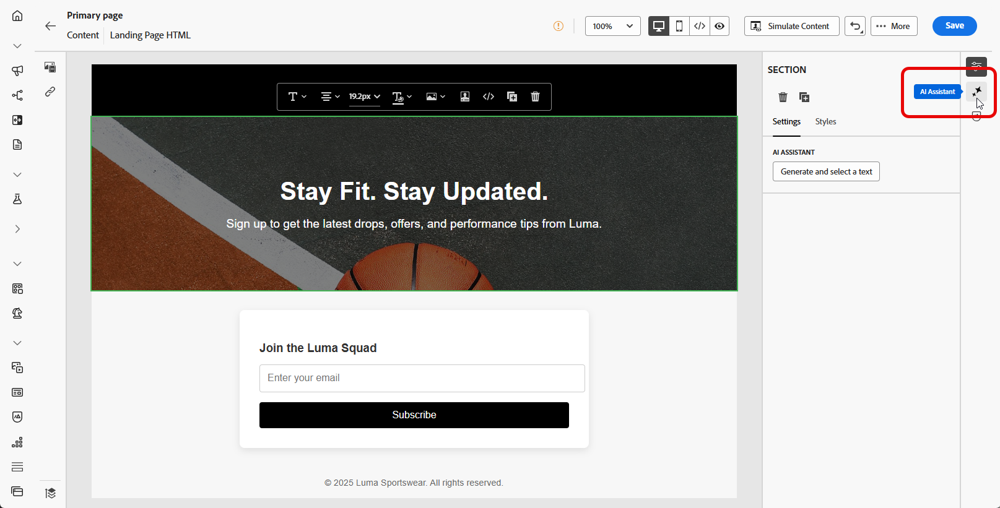{zoomable="yes"}

1. 啟用AI助理的&#x200B;**[!UICONTROL 使用原始內容]**&#x200B;選項，以根據選取的內容個人化新內容。

1. 說明您要在&#x200B;**[!UICONTROL 提示]**&#x200B;欄位中產生的內容，以微調內容。

   如果您正在尋求製作提示的協助，請存取&#x200B;**[!UICONTROL 提示程式庫]**，其中提供各種提示概念，以改善您的登入頁面。

   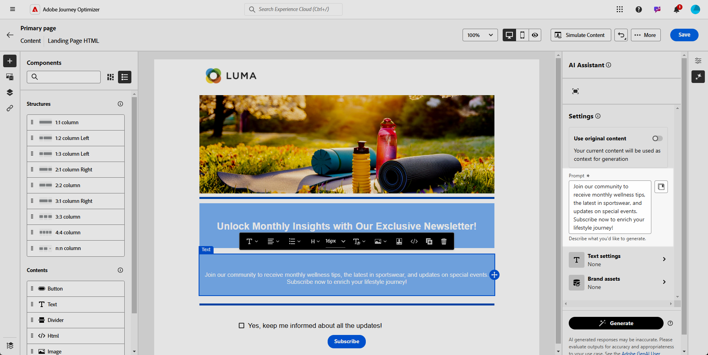{zoomable="yes"}

1. 使用&#x200B;**[!UICONTROL 文字設定]**&#x200B;選項量身打造您的提示：

   * **[!UICONTROL 通訊策略]**：選擇最適合您產生文字的通訊樣式。
   * **[!UICONTROL 語言]**：西班牙文、義大利文、瑞典文和挪威文等語言選項已發佈為私人測試版，未來版本將逐步提供給所有客戶。
   * **[!UICONTROL 膚色]**：登陸頁面的膚色應該會對您的對象產生共鳴。 無論您是要提供豐富資訊、好玩或有說服力，AI Assistant都能據以調整訊息。
   * **文字長度**：使用滑桿來選取所要的文字長度。

   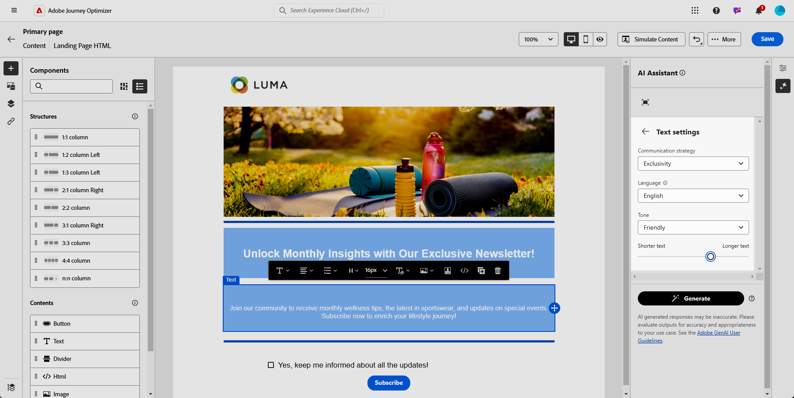{zoomable="yes"}

1. 從&#x200B;**[!UICONTROL 品牌資產]**&#x200B;功能表，按一下&#x200B;**[!UICONTROL 上傳品牌資產]**，新增任何包含可提供額外內容AI助理或選取先前上傳之內容的品牌資產。

   先前上傳的檔案可在&#x200B;**[!UICONTROL 已上傳的品牌資產]**&#x200B;下拉式清單中使用。 只需切換您要納入產生代的資產。

1. 提示就緒後，請按一下[產生]。**&#x200B;**

1. 瀏覽產生的&#x200B;**[!UICONTROL 變數]**。

   按一下&#x200B;**[!UICONTROL 預覽]**&#x200B;以檢視所選變數的全熒幕版本，或按一下&#x200B;**[!UICONTROL 套用]**&#x200B;以取代您目前的內容。

1. 按一下百分比圖示可檢視您的&#x200B;**[!UICONTROL 品牌一致性分數]**，並識別與您的品牌之間的任何不一致性。

   深入瞭解[品牌一致性分數](brands-score.md)。

   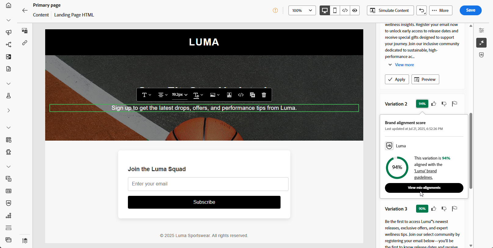{zoomable="yes"}

1. 導覽至&#x200B;**[!UICONTROL 預覽]**&#x200B;視窗中的&#x200B;**[!UICONTROL 調整]**&#x200B;選項，以存取其他自訂功能：

   * **[!UICONTROL 使用作為參考內容]**：選擇的變體將作為參考內容以產生其他結果。

   * **[!UICONTROL 精心設計]**： AI助理可以協助您展開特定主題，提供其他詳細資訊，以增進瞭解與參與。

   * **[!UICONTROL 摘要]**：冗長的資訊可能會讓登陸頁面收件者超載。 使用AI Assistant將要點濃縮為清晰、簡潔的摘要，以吸引注意並鼓勵他們進一步閱讀。

   * **[!UICONTROL 重述]**:The AI Assistant能以不同方式重述您的訊息，讓您撰寫內容保持新鮮，並吸引不同受眾。

   * **[!UICONTROL 使用較簡單的語言]**：利用AI Assistant簡化您的語言，確保更廣大的受眾擁有清晰易懂的語言。

   您也可以變更文字的&#x200B;**[!UICONTROL 音調]**&#x200B;和&#x200B;**[!UICONTROL 通訊策略]**。

   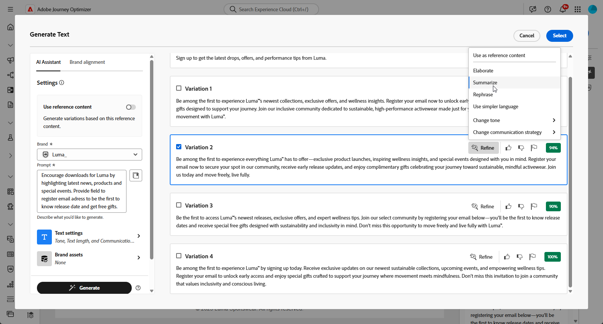{zoomable="yes"}

1. 開啟&#x200B;**[!UICONTROL 品牌一致性]**&#x200B;標籤，檢視您的內容如何與您的[品牌指南](brands.md)一致。

1. 找到適當的內容後，按一下&#x200B;**[!UICONTROL 選取]**。

1. 插入個人化欄位，以根據設定檔資料自訂您的登入頁面內容。 然後，按一下&#x200B;**[!UICONTROL 模擬內容]**&#x200B;按鈕以控制呈現，並使用測試設定檔檢查個人化設定。 [了解更多](../personalization/personalize.md)

一旦登入頁面準備就緒後，您就可以發佈該頁面，以供訊息使用。 [了解更多](../landing-pages/create-lp.md#publish-landing-page)

>[!TAB 僅限影像的產生]

在以下範例中，瞭解如何運用AI Assistant來最佳化和改善您的資產，確保更方便使用者的體驗。

1. 建立及設定您的登入頁面後，請按一下[編輯內容]。**&#x200B;**

   如需如何設定登入頁面的詳細資訊，請參閱[此頁面](../landing-pages/create-lp.md)。

1. 選取您要使用AI助理變更的資產。

1. 從右側功能表選取&#x200B;**[!UICONTROL AI小幫手]**。

   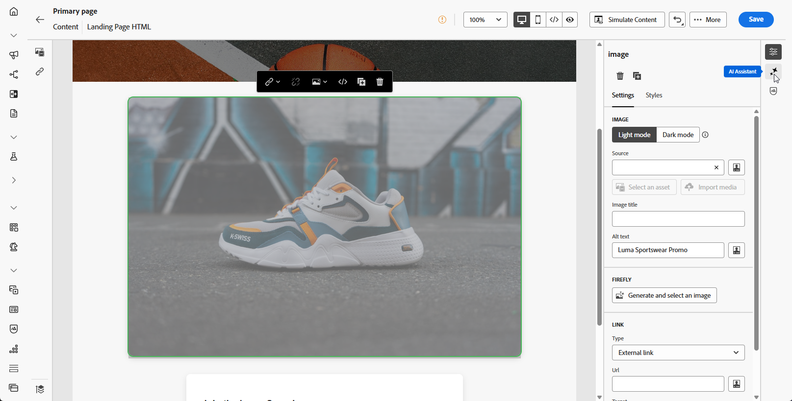{zoomable="yes"}

1. 啟用AI助理的&#x200B;**[!UICONTROL 參考樣式]**&#x200B;選項，以根據參考內容個人化新內容。 您也可以上傳影像以將內容新增至您的變數。

1. 說明您要在&#x200B;**[!UICONTROL 提示]**&#x200B;欄位中產生的內容，以微調內容。

   如果您正在尋求製作提示的協助，請存取&#x200B;**[!UICONTROL 提示程式庫]**，其中提供各種提示概念，以改善您的登入頁面。

   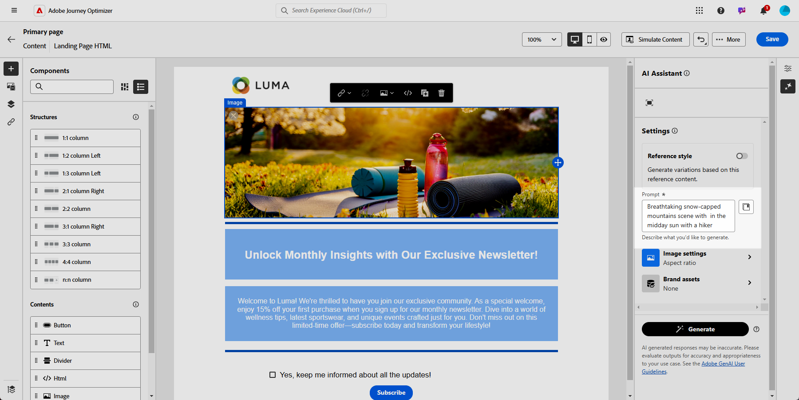{zoomable="yes"}

1. 使用&#x200B;**[!UICONTROL 影像設定]**&#x200B;選項量身打造您的提示：

   * **[!UICONTROL 外觀比例]**：這會決定資產的寬度和高度。 您可以選擇一般比率，例如16:9、4:3、3:2或1:1，或者您可以輸入自訂大小。
   * **[!UICONTROL 內容型別]**：這會分類視覺元素的性質，區分不同的視覺呈現形式，例如像片、圖形或藝術品。
   * **[!UICONTROL 視覺強度]**：您可以調整影像的強度來控制影像的影響。 較低的設定(2)可建立更柔和、更克制的外觀，而較高的設定(10)則可讓影像更生動、視覺效果更強大。
   * **[!UICONTROL 色彩和色調]**：影像中顏色的整體外觀及其傳達的氣氛或氣氛。
   * **[!UICONTROL 照明]**：這指的是影像中的閃電，它會塑造大氣層，並反白標示特定的元素。
   * **[!UICONTROL 構成]**：這指的是影像框架中元素的排列

   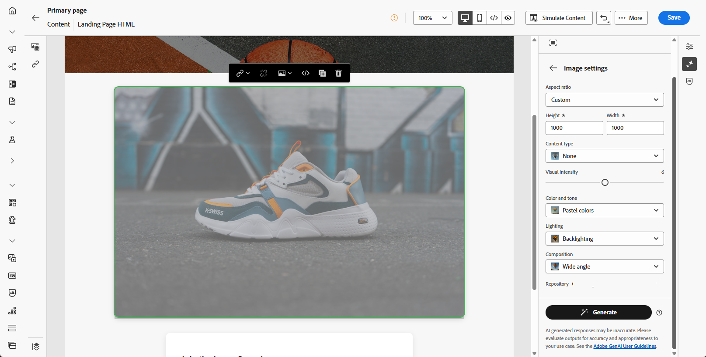{zoomable="yes"}

1. 從&#x200B;**[!UICONTROL 品牌資產]**&#x200B;功能表，按一下&#x200B;**[!UICONTROL 上傳品牌資產]**，新增任何包含可提供額外內容AI助理或選取先前上傳之內容的品牌資產。

   先前上傳的檔案可在&#x200B;**[!UICONTROL 已上傳的品牌資產]**&#x200B;下拉式清單中使用。 只需切換您要納入產生代的資產。

1. 在您滿意提示組態之後，請按一下[產生]。**&#x200B;**

1. 瀏覽產生的&#x200B;**[!UICONTROL 變數]**。

   按一下&#x200B;**[!UICONTROL 預覽]**&#x200B;以檢視所選變數的全熒幕版本，或按一下&#x200B;**[!UICONTROL 套用]**&#x200B;以取代您目前的內容。

1. 按一下百分比圖示可檢視您的&#x200B;**[!UICONTROL 品牌一致性分數]**，並識別與您的品牌之間的任何不一致性。

   深入瞭解[品牌一致性分數](brands-score.md)。

   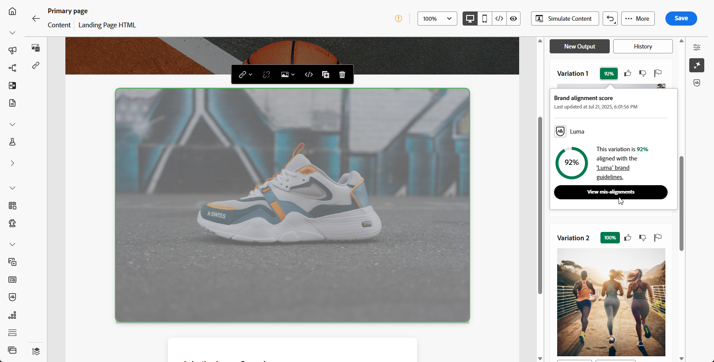{zoomable="yes"}

1. 導覽至&#x200B;**[!UICONTROL 預覽]**&#x200B;視窗中的&#x200B;**[!UICONTROL 調整]**&#x200B;選項，以存取其他自訂功能：

   * **[!UICONTROL 產生類似專案]**&#x200B;以檢視與此變體相關的影像。
   * **[!UICONTROL 在Adobe Express中編輯]**&#x200B;以進一步自訂您的資產。

[進一步瞭解Adobe Express整合](../integrations/express.md)

   * **[!UICONTROL 儲存]**&#x200B;以儲存資產以供稍後存取。

   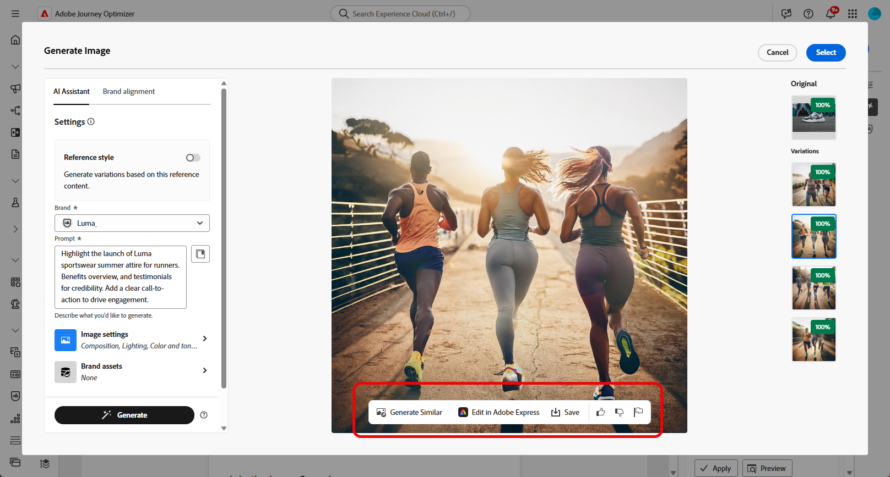{zoomable="yes"}

1. 開啟&#x200B;**[!UICONTROL 品牌一致性]**&#x200B;標籤，檢視您的內容如何與您的[品牌指南](brands.md)一致。

1. 找到適當的內容後，按一下&#x200B;**[!UICONTROL 選取]**。

1. 定義訊息內容後，按一下&#x200B;**[!UICONTROL 模擬內容]**&#x200B;按鈕以控制呈現，並使用測試設定檔檢查個人化設定。 [了解更多](../personalization/personalize.md)

一旦登入頁面準備就緒後，您就可以發佈該頁面，以供訊息使用。 [了解更多](../landing-pages/create-lp.md#publish-landing-page)

>[!ENDTABS]
