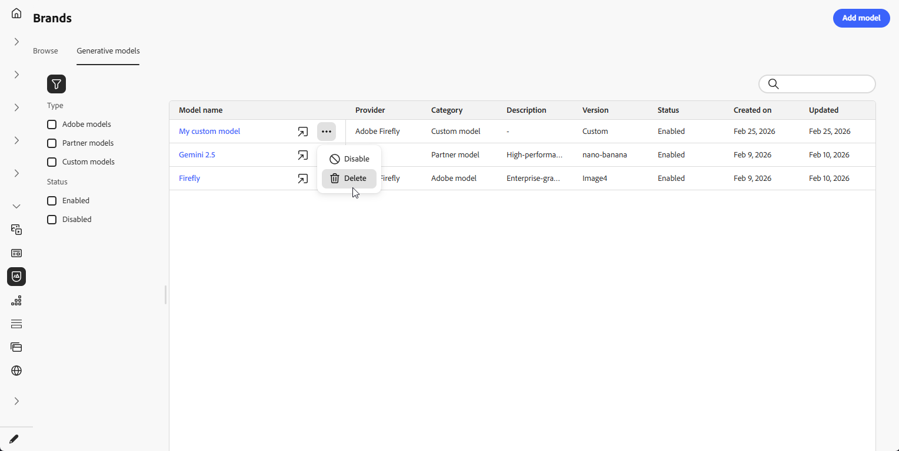
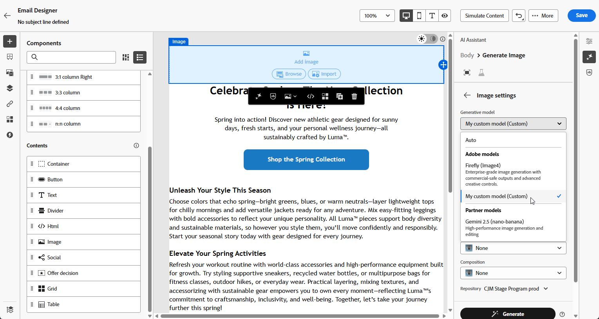

# 建立和管理產生模型 {#generative-models}

使用內建模型、自訂Firefly模型和協力廠商影像產生提供者，擴展您的AI影像建立功能，以符合您的特定需求並改善品牌一致性。

選擇符合您需求的正確模式：

- **[!UICONTROL Adobe模型]**&#x200B;由Firefly Image Model 4提供技術支援，現成可用立即產生影像，無需額外設定。
- 由Gemini 2.5 Flash支援的&#x200B;**[!UICONTROL 合作夥伴機型]**&#x200B;針對特定使用案例提供特殊功能。
- **[!UICONTROL 自訂模型]**&#x200B;是在您自己的資產上訓練並由您的組織新增的品牌特定模型。

  在&#x200B;**[!UICONTROL Adobe Firefly檔案]**&#x200B;中進一步瞭解[自訂模型](https://helpx.adobe.com/firefly/web/work-with-enterprise-features/train-custom-models/custom-models-overview.html)

在設定之後，當您在內容中建立影像時，可以選取任何產生模型。 [進一步瞭解如何產生影像](generative-image.md)。

## 管理產生模型

從集中位置管理您的產生模型。 檢視所有可用的模式、篩選和搜尋以尋找特定模式，並為您的品牌設定其設定。

1. 從&#x200B;**[!UICONTROL 品牌]**&#x200B;功能表，選取&#x200B;**[!UICONTROL 產生式模型]**&#x200B;標籤。

   {zoomable="yes"}

1. 按一下圖示以存取篩選功能表。 依&#x200B;**[!UICONTROL 型別]**&#x200B;或&#x200B;**[!UICONTROL 狀態]**&#x200B;篩選模型。

   {zoomable="yes"}

1. 使用搜尋列依名稱尋找特定的產生模型。

1. 按一下圖示以存取進階功能表，您可在此啟用或停用模型，或將其刪除。

   請注意，只能刪除&#x200B;**[!UICONTROL 自訂模型]**。

   {zoomable="yes"}

1. 按一下[新增模型]****，從頭開始建立新的產生模型。

現在當您在內容中建立影像時，可以選取任何產生模型。 [進一步瞭解如何產生影像](generative-image.md)。

## 新增產生模型

>[!IMPORTANT]
>
>建立自訂Firefly模型需要Firefly ETLA合約。

自訂Firefly模型是在您自己的資產上訓練的品牌專屬AI模型，可讓您產生與品牌識別、風格和視覺准則完全一致的影像。

透過建立自訂Firefly模型提供者，您可以將AI功能擴展至預設模型之外，並確保產生的內容一致地反映您品牌獨特的審美觀和要求。

➡️ [瞭解如何訓練您的自訂模型](https://helpx.adobe.com/firefly/web/work-with-enterprise-features/train-custom-models/train-firefly-custom-models.html)

1. 從&#x200B;**[!UICONTROL 品牌]**&#x200B;功能表，存取&#x200B;**[!UICONTROL 產生式模型]**&#x200B;索引標籤，然後按一下&#x200B;**[!UICONTROL 新增模型]**。

   {zoomable="yes"}

1. 輸入模型的&#x200B;**[!UICONTROL 名稱]**。

1. 輸入您的&#x200B;**[!UICONTROL 模型識別碼]**。

   若要尋找Firefly模型ID，請存取Firefly網站並導覽至您訓練的模型。 發佈後，模型的管理區段中會提供唯一識別碼。 如需詳細資訊，請參閱[Firefly自訂模型檔案](https://helpx.adobe.com/firefly/web/work-with-enterprise-features/train-custom-models/manage-custom-models.html)。

   {zoomable="yes"}

1. 選擇性地輸入&#x200B;**[!UICONTROL 描述]**&#x200B;以協助識別模型。

1. 按一下&#x200B;**[!UICONTROL 測試連線]**&#x200B;以驗證模型組態。

1. 連線測試成功後，按一下&#x200B;**[!UICONTROL 儲存]**&#x200B;以儲存您的模型組態。

   {zoomable="yes"}

1. 儲存後，您的自訂模型會新增至模型清單。 您可以隨時停用或刪除它。

   {zoomable="yes"}

<!--
1. Once the connection test is successful, choose whether to enable the model for selected brands.

1. Enable or disable the option to connect the model to all brands.

    If disabled, select which brands this model should be applied to.
-->

設定之後，當您在內容中建立影像時，可以選取任何自訂的產生模型。 [進一步瞭解如何產生影像](generative-image.md)。

{zoomable="yes"}
