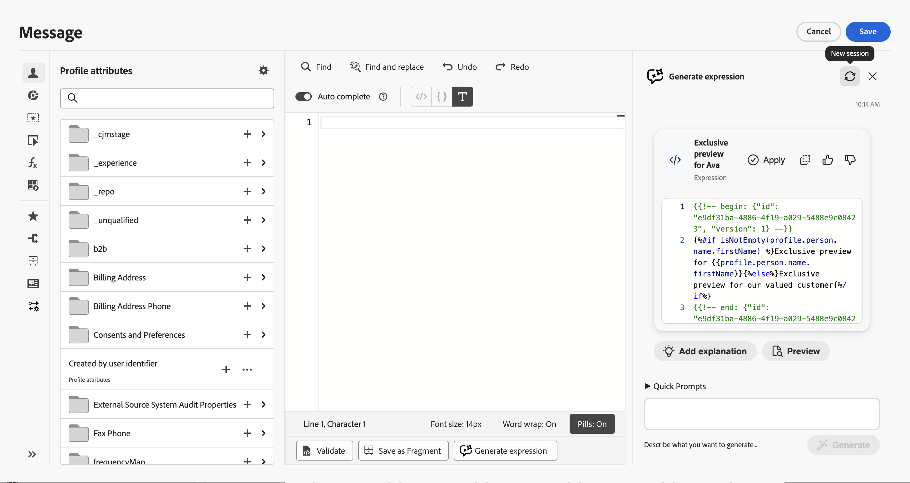
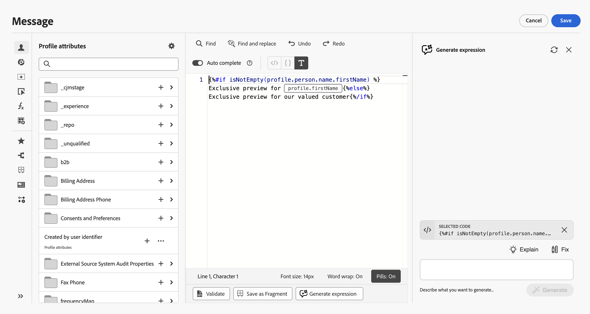
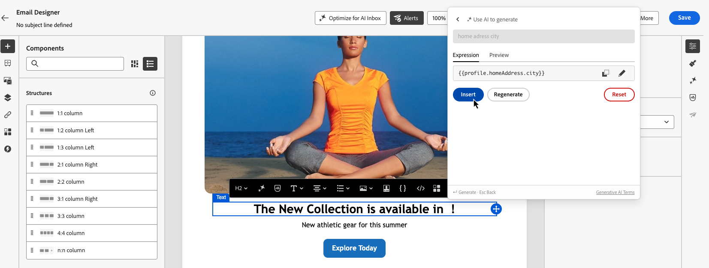

# 產生個人化運算式的內容{#generative-personalization-expressions}

>[!BEGINSHADEBOX]

**在此頁面上：**&#x200B;瞭解如何使用Adobe Journey Optimizer中的「產生內容」，在Personalization編輯器和電子郵件Designer中從自然語言產生、修正和說明個人化運算式。

>[!ENDSHADEBOX]

>[!IMPORTANT]
>
>開始使用此功能之前，請先閱讀相關的[護欄與限制](gs-generative.md#generative-guardrails)。
> 
>
>您必須同意[使用者合約](https://www.adobe.com/tw/legal/licenses-terms/adobe-dx-gen-ai-user-guidelines.html)，才能在Journey Optimizer中使用「產生內容」。 如需詳細資訊，請聯絡您的 Adobe 代表。

## 概觀 {#where-available}

[!UICONTROL 產生內容]可協助您從純文字產生新的個人化內容、說明現有運算式的功能，以及修正選取程式碼的問題，讓您在語法和手動欄位探索上花費的時間更少。 您也可以重複選取或要求對話中的其他變更。 它有兩種提供方式：

* **[!UICONTROL Personalization編輯器]** — 只要跨管道（主旨列、內文和開啟此編輯器的其他欄位）有編輯器，即可使用。 這是AI輔助個人化的一般路徑。 如需瞭解在何處以及如何開啟編輯器，請參閱[新增個人化](../personalization/personalization-build-expressions.md#where)。
* **電子郵件Designer工具列** — 當您在「電子郵件Designer」中編寫電子郵件時，請選取元件並在內容工具列中使用&#x200B;**[!UICONTROL 新增運算式]**，在工具箱中開啟運算式產生器，而不先開啟完整的編輯器。 此進入點在電子郵件製作外部無法使用。 請參閱[從電子郵件Designer](#generate-email-designer)產生。

如需更廣泛的產生內容設定和語言，請參閱[開始使用產生內容](gs-generative.md)。 如需個人化概念，請參閱[開始使用個人化](../personalization/personalize.md)。 若要寫入產生可用運算式的提示，請參閱[為個人化運算式寫入有效提示](#prompt-best-practices)。 如需產生內容的提示概念（色調、樣式、品牌），請參閱[產生內容提示最佳實務](ai-assistant-prompting-guide.md)。

根據您的行銷活動或歷程內容，[!UICONTROL 產生內容]可以使用資料並建構已公開的[!UICONTROL Personalization編輯器] — 例如設定檔屬性、區段成員資格、協助程式功能和相關個人化來源。

>[!NOTE]
>
>[!UICONTROL 產生內容]只會在內容在該工作階段中保持開啟時，才會讓內容保留在提示中。 關閉[!UICONTROL 產生內容]或編輯器清除交談；下次您開啟它時，就會開始新的交談。

## 產生個人化運算式 {#generate}

這些步驟涵蓋從頭開始產生個人化運算式。 若要使用編輯器中已存在的程式碼，請參閱[編輯、修正或說明現有的程式碼](#edit-existing)。

1. 在您的訊息或內容中，開啟&#x200B;**[!UICONTROL Personalization編輯器]**。

1. 將游標放在您要插入產生的個人化程式碼的編輯器中，然後按一下&#x200B;**[!UICONTROL 產生內容]**&#x200B;按鈕。

   

1. 在文字欄位中，以純文字描述您想要的個人化運算式 — 例如您需要的設定檔屬性、區段或邏輯，然後按一下[產生]。**&#x200B;**

   您也可以使用&#x200B;**[!UICONTROL 快速提示]**&#x200B;區段的現成提示，例如個人化問候語、促銷程式碼產生等等。

   

   >[!NOTE]
   >
   >任何不相關的提示或問題會傳回範圍外錯誤。 調整您的提示，並詢問有關您需要個人化的相關問題。

1. 您可以在多回合交談中繼續與[!UICONTROL 產生內容]討論：它可保留提示的內容，以便您可以逐步調整相同的運算式。 若要重新開始，請按一下&#x200B;**[!UICONTROL 新增工作階段]**&#x200B;按鈕。

   

1. 使用&#x200B;**[!UICONTROL 新增說明]**&#x200B;按鈕，新增說明運算式功能的內嵌檔案。

   

1. 按一下&#x200B;**[!UICONTROL 預覽]**&#x200B;按鈕，檢視運算式如何針對範例設定檔進行評估，並以JSON檢視關聯的裝載。

   

   此控制項用於在編輯器中快速檢查您的個人化程式碼，而不是內容的完整訊息預覽。 如需體驗的完整驗證，請使用您慣用的模擬流程。 [瞭解如何預覽和測試您的內容](../content-management/preview-test.md)

   如果您需要調整樣本（例如，強調不同的屬性），請使用[!UICONTROL 產生內容]說明討論中需要什麼，並在提示中包含關鍵字&#x200B;**預覽**。

   >[!NOTE]
   >
   >請勿在此預期多個預覽列或完整的情況。 控制項刻意限製為&#x200B;**一個**&#x200B;範例評估，以進行快速程式碼檢查，而非多個設定檔中的部分涵蓋範圍。 要求不切實際的大型預覽集可能會導致請求失敗。

1. 若要在您的個人化運算式中實作輸出，請按一下&#x200B;**[!UICONTROL 套用]**。 輸出會插入個人化編輯器的游標位置。 若要取代已經存在的程式碼，請先在編輯器中選取該程式碼，然後使用&#x200B;**[!UICONTROL 編輯產生內容]** （請參閱[編輯、修正或說明現有的程式碼](#edit-existing)）。

   您也可以使用圖示，將輸出複製並貼到需要的位置。

## 編輯、修正或說明現有程式碼 {#edit-existing}

您可以選取現有的個人化運算式，並使用「產生內容」來修正個人化問題、說明程式碼的用途，或要求其他變更。

1. 在編輯器中選取現有的個人化程式碼。

1. 以滑鼠右鍵按一下選取專案，然後選擇&#x200B;**[!UICONTROL 使用[產生內容]編輯]**，這樣[!UICONTROL 產生[內容]]就會使用您的選取專案做為內容。

   

1. **[!UICONTROL 產生內容]**&#x200B;開啟。 選取&#x200B;**[!UICONTROL 說明]**&#x200B;或&#x200B;**[!UICONTROL 修正]**&#x200B;按鈕，或使用文字欄位要求其他變更並開始交談。

   

1. 當您選取&#x200B;**[!UICONTROL 修正]**&#x200B;時，請按一下討論中的&#x200B;**[!UICONTROL 顯示修正詳細資料]**，以顯示修正的解釋，並在預覽前後逐行顯示。

   

1. 當您產生個人化運算式時，請按一下&#x200B;**[!UICONTROL 套用]**&#x200B;以實作產生的輸出。 它會取代您在個人化編輯器中選取的程式碼。 例如，如果您要求說明程式碼，套用將在描述其功能的運算式中新增註解。

## 從電子郵件Designer工具列產生 {#generate-email-designer}

>[!NOTE]
>
>此節僅適用於您在電子郵件Designer中編輯&#x200B;**電子郵件**&#x200B;內容時。 若是其他管道，請使用&#x200B;**[!UICONTROL Personalization編輯器]**。

在電子郵件Designer中，您可以從內容工具列使用[!UICONTROL 產生個人化運算式的內容]，而不需要先開啟完整的[!UICONTROL Personalization編輯器]。

1. 在電子郵件Designer中，選取您要個人化的元件，然後按一下您要插入運算式的位置。

1. 在內容工具列中按一下&#x200B;**[!UICONTROL 新增運算式]**。

   

1. 工具箱隨即開啟，您可以在其中提示「產生內容以進行個人化」。 以純文字輸入您需要的內容，[!UICONTROL 產生內容]會建議符合您提示的設定檔欄位和其他屬性，以便您更快建立運算式。

1. [!UICONTROL 產生內容]產生運算式。

   

   您可以：

   * 用一個範例值驗證運算式輸出 — 使用&#x200B;**[!UICONTROL 預覽]**&#x200B;標籤。
   * 從相同的提示產生另一個建議 — 使用&#x200B;**[!UICONTROL 重新產生]**。
   * 清除討論並重新開始 — 使用&#x200B;**[!UICONTROL 重設]**。
   * 在完整編輯器中調整運算式 — 按一下圖示以開啟&#x200B;**[!UICONTROL Personalization編輯器]**。

1. 當您對結果感到滿意時，請按一下&#x200B;**[!UICONTROL 插入]**，將運算式新增至您的內容。

## 撰寫個人化運算式的有效提示 {#prompt-best-practices}

個人化運算式的提示與內容產生提示不同，後者以色調、樣式和品牌為中心。 由於[!UICONTROL 產生內容]會建置範本邏輯，以針對設定檔與內容相關資料進行解析，因此您的提示應準確描述該邏輯。 從您要提供的客戶體驗開始，然後以[!UICONTROL 產生內容]可以翻譯成運算式的方式表示它。

有效的提示通常定義了四個元素：

* **資料來源** — 要評估的設定檔屬性、內容資料、區段、選件或其他資源。 當您知道欄位路徑時，請包含該確切的欄位路徑，例如`profile.person.name.firstName`。
* **條件** — 要套用的邏輯，例如值是否存在或符合特定條件。
* **輸出** — 符合條件時要顯示的內容，包括任何必要的格式。
* **遞補** — 資料遺失或不符合條件時，要顯示哪些專案。

例如，要求&#x200B;*取得客戶的續約日期、新增一年、將其格式化為MM/dd/yy，且在續約日期遺失時不會顯示任何內容*&#x200B;提供資料來源、轉換、輸出格式和遞補 — 所有[!UICONTROL 產生內容]都需要產生可用的運算式。

### 推薦 {#prompt-recommendations}

若要取得最相關的結果：

* 讓每個提示聚焦於單一個人化規則，而非將數個不相關的規則合併到一個請求中。
* 僅參考您環境中存在的欄位、片段、選件和資料集。 [!UICONTROL 產生內容]會使用編輯器公開的內容，不會為您建立資料來源。
* 說明選用或可能遺失資料的遞補行為，因此運算式會適當地解析每個設定檔。
* 在重要時明確指出預期的輸出結構，例如，選件裝載必須傳回JSON的金鑰。
* 當您編輯現有程式碼時，僅提供相關的運算式作為內容，而非整個訊息，並在套用&#x200B;**[!UICONTROL 修正]**&#x200B;或其他變更之前，使用&#x200B;**[!UICONTROL 說明]**&#x200B;來瞭解程式碼。

## 資料與設定需求 {#requirements}

[!UICONTROL 產生內容]會從[!UICONTROL Personalization編輯器]已公開的資源產生運算式，因此基礎資料必須設定並可供使用。 如果提示未傳回可用的運算式，請確認：

* 您參考的欄位屬於您環境中作用中的結構描述，
* 您要重複使用的任何片段都會發佈，
* 用於查詢的任何資料集都會啟用以供查詢，並且
* 您的請求與範本個人化相關，而不是其他任務。

設定正確時，請澄清資料來源、條件、輸出和遞補內容以縮小提示範圍，然後再次產生。
