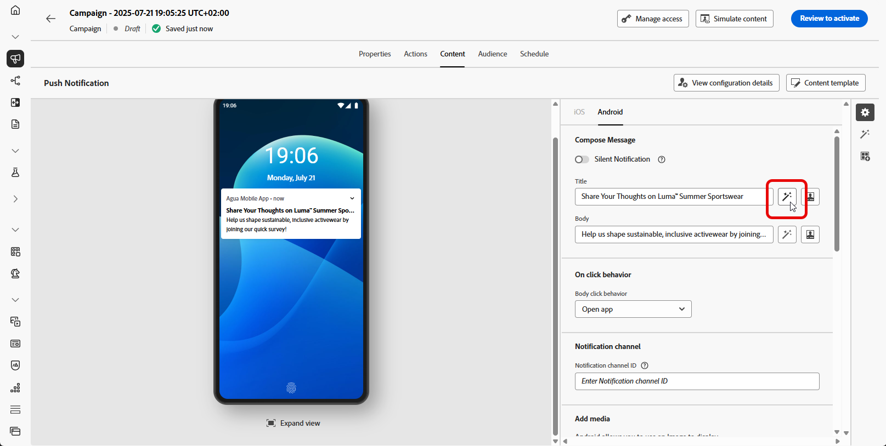
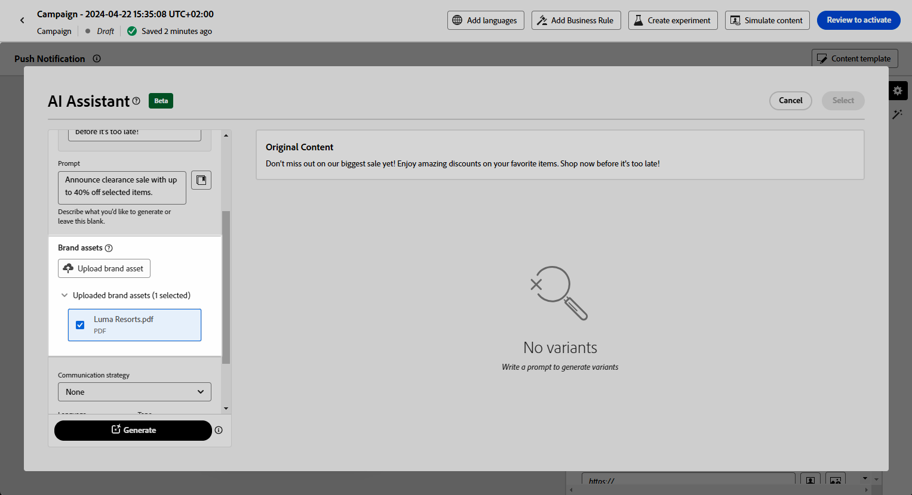

# 使用AI助理產生推播 {#generative-push}

>[!BEGINSHADEBOX]

**目錄**

* [開始使用 AI 助理](gs-generative.md)
* [使用 AI 助理產生電子郵件](generative-email.md)
* [使用 AI 助理產生簡訊](generative-sms.md)
* **[使用AI助理產生推播](generative-push.md)**
* [使用AI助理進行內容實驗](generative-experimentation.md)

>[!ENDSHADEBOX]

>[!NOTE]
>
>在開始使用此功能之前，請先閱讀相關的 [護欄和限制](gs-generative.md#generative-guardrails).

在您建立並個人化訊息後，請使用Journey Optimizer AI Assistant將推播通知內容提升到新的境界。

探索以下標籤，瞭解如何使用Journey Optimizer中的AI小幫手。

>[!BEGINTABS]

>[!TAB 完整推送產生]

在此特定範例中，瞭解如何使用AI助理傳送吸引人的推播通知。

請依照下列步驟操作：

1. 建立和設定推播通知行銷活動後，按一下 **[!UICONTROL 編輯內容]**.

   有關如何設定推播通知行銷活動的詳細資訊，請參閱 [此頁面](../push/create-push.md).

1. 填入 **[!UICONTROL 基本詳細資訊]** 用於您的行銷活動。 完成後，按一下 **[!UICONTROL 編輯內容]**.

1. 視需要個人化您的推播通知。 [了解更多](../push/design-push.md)

1. 存取 **[!UICONTROL 顯示AI助理]** 功能表。

   {zoomable=&quot;yes&quot;}

1. 啟用 **[!UICONTROL 使用原始內容]** 「AI助理」的選項，用來根據您的行銷活動內容、名稱和選取的對象來個人化新內容。

   您的提示必須一律繫結至特定內容。

1. 描述您要在中產生的內容，以微調內容。 **[!UICONTROL 提示]** 欄位。

   如果您在製作提示時尋求協助，請存取 **[!UICONTROL 提示程式庫]** 其中會提供各式各樣的提示概念，以改善您的行銷活動。

   {zoomable=&quot;yes&quot;}

1. 選取 **[!UICONTROL 上傳品牌資產]** 新增任何品牌資產，其中包含可為AI助理提供額外內容的內容。

1. 選擇要產生的欄位： **[!UICONTROL 標題]** 和/或 **[!UICONTROL 訊息]**.

1. 使用不同的選項量身打造您的提示：

   * **[!UICONTROL 溝通策略]**：為您的產生文字選擇最合適的通訊樣式。
   * **[!UICONTROL 語言]**：選取您要產生內容的語言。
   * **[!UICONTROL 色調]**：您電子郵件的語調應該會引起您的聽眾的共鳴。 無論您是要提供豐富資訊、好玩或有說服力， AI Assistant都能據以調整訊息。

   {zoomable=&quot;yes&quot;}

1. 提示就緒後，按一下 **[!UICONTROL 產生]**.

1. 瀏覽產生的專案 **[!UICONTROL 變數]** 並按一下 **[!UICONTROL 預覽]** 以檢視所選變數的全熒幕版本。

1. 導覽至 **[!UICONTROL 細化]** 中的選項 **[!UICONTROL 預覽]** 視窗以存取其他自訂功能：

   * **[!UICONTROL 用作參考內容]**：選擇的變體將作為參考內容，用於產生其他結果。

   * **[!UICONTROL 重新片語]**： AI Assistant可以不同方式重新表述您的訊息，讓您的新撰寫保持新穎，並吸引不同受眾。

   * **[!UICONTROL 使用簡單語言]**：運用AI Assistant簡化您的語言，確保更廣大的受眾擁有清晰度和可存取性。

   {zoomable=&quot;yes&quot;}

1. 按一下 **[!UICONTROL 選取]** 找到適當的內容之後。

   您也可以為內容啟用實驗。 [了解更多](generative-experimentation.md)

1. 插入個人化欄位，以根據設定檔資料自訂您的電子郵件內容。 然後，按一下 **[!UICONTROL 模擬內容]** 按鈕來控制呈現，並使用測試設定檔檢查個人化設定。 [了解更多](../personalization/personalize.md)

定義內容、對象和排程後，您就可以準備推播行銷活動。 [了解更多](../campaigns/review-activate-campaign.md)

>[!TAB 文字產生]

在此特定範例中，瞭解如何使用AI助理處理特定內容。 請依照下列步驟操作：

1. 建立和設定推播通知行銷活動後，按一下 **[!UICONTROL 編輯內容]**.

   有關如何設定推播行銷活動的詳細資訊，請參閱 [此頁面](../push/create-push.md).

1. 填入 **[!UICONTROL 基本詳細資訊]** 用於您的行銷活動。 完成後，按一下 **[!UICONTROL 編輯內容]**.

1. 視需要個人化您的推播通知。 [了解更多](../push/design-push.md)

1. 存取 **[!UICONTROL 顯示AI助理]** 選單旁的 **[!UICONTROL 標題]** 或 **[!UICONTROL 訊息]** 欄位。

   {zoomable=&quot;yes&quot;}

1. 啟用 **[!UICONTROL 使用參考內容]** 「AI助理」的選項，用來根據您的行銷活動內容、名稱和選取的對象來個人化新內容。

   您的提示必須一律繫結至特定內容。

1. 描述您要在中產生的內容，以微調內容。 **[!UICONTROL 提示]** 欄位。

   如果您在製作提示時尋求協助，請存取 **[!UICONTROL 提示程式庫]** 其中會提供各式各樣的提示概念，以改善您的行銷活動。

   {zoomable=&quot;yes&quot;}

1. 選取 **[!UICONTROL 上傳品牌資產]** 新增任何品牌資產，其中包含可為AI助理提供額外內容的內容。

   {zoomable=&quot;yes&quot;}

1. 使用不同的選項量身打造您的提示：

   * **[!UICONTROL 溝通策略]**：為您的產生文字選擇最合適的通訊樣式。
   * **[!UICONTROL 語言]**：選取您要產生內容的語言。
   * **[!UICONTROL 色調]**：您電子郵件的語調應該會引起您的聽眾的共鳴。 無論您是要提供豐富資訊、好玩或有說服力， AI Assistant都能據以調整訊息。
   * **[!UICONTROL 長度]**：使用範圍滑桿選取內容的長度。

   {zoomable=&quot;yes&quot;}

1. 提示就緒後，按一下 **[!UICONTROL 產生]**.

1. 瀏覽產生的專案 **[!UICONTROL 變數]** 並按一下 **[!UICONTROL 預覽]** 以檢視所選變數的全熒幕版本。

1. 導覽至 **[!UICONTROL 細化]** 中的選項 **[!UICONTROL 預覽]** 視窗以存取其他自訂功能：

   * **[!UICONTROL 用作參考內容]**：選擇的變體將作為參考內容，用於產生其他結果。

   * **[!UICONTROL 精緻]**： AI助理可以協助您展開特定主題，提供其他詳細資訊，以便更清楚瞭解並更能參與。

   * **[!UICONTROL 摘要]**：冗長的資訊可能會讓電子郵件收件者過載。 使用AI Assistant將要點濃縮為清晰、簡潔的摘要，以吸引注意並鼓勵他們進一步閱讀。

   * **[!UICONTROL 重新片語]**：AI Assistant可以不同方式重新表述您的訊息，讓您寫作保持新鮮，並吸引不同受眾。

   * **[!UICONTROL 使用更簡單的語言]**：運用AI Assistant簡化您的語言，確保更廣大的受眾擁有清晰度和可存取性。

   {zoomable=&quot;yes&quot;}

1. 按一下 **[!UICONTROL 選取]** 找到適當的內容之後。

   您也可以為內容啟用實驗。 [了解更多](generative-experimentation.md)

1. 插入個人化欄位，以根據設定檔資料自訂您的電子郵件內容。 然後，按一下 **[!UICONTROL 模擬內容]** 按鈕來控制呈現，並使用測試設定檔檢查個人化設定。 [了解更多](../personalization/personalize.md)

定義內容、對象和排程後，您就可以準備推播行銷活動。 [了解更多](../campaigns/review-activate-campaign.md)

>[!ENDTABS]
