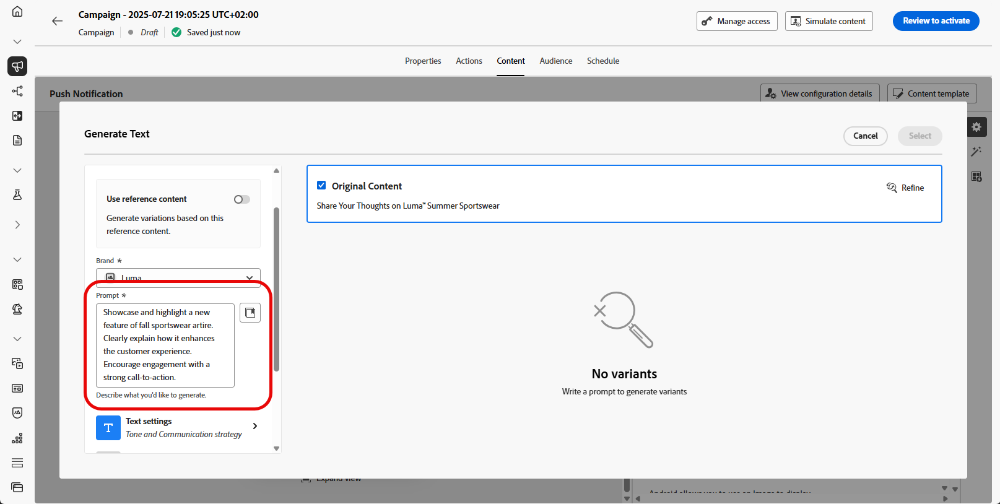

# 使用 AI 助理推播產生 {#generative-push}

>[!BEGINSHADEBOX]

**目錄**

* [開始使用 AI 助理](gs-generative.md)
* [使用 AI 助理產生電子郵件](generative-email.md)
* [使用 AI 助理產生簡訊](generative-sms.md)
* 使用 AI 助理推播產生
* [使用 AI 助理進行內容實驗](generative-experimentation.md)

>[!ENDSHADEBOX]

>[!NOTE]
>
>開始使用此功能之前，請先閱讀相關的[護欄和限制](gs-generative.md#generative-guardrails)。

在您建立並個人化訊息後，請使用Adobe Journey Optimizer中的AI助理將推播通知內容提升到新的境界。

探索以下標籤，瞭解如何使用Journey Optimizer中的AI小幫手。

>[!BEGINTABS]

>[!TAB 產生完整推送]

在此特定範例中，瞭解如何使用AI助理傳送吸引人的推播通知。

請依照下列步驟操作：

1. 建立並設定推播通知行銷活動後，請按一下&#x200B;**[!UICONTROL 編輯內容]**。

   有關如何設定推播通知行銷活動的詳細資訊，請參閱[此頁面](../push/create-push.md)。

1. 填寫行銷活動的&#x200B;**[!UICONTROL 基本詳細資料]**。 完成後，按一下&#x200B;**[!UICONTROL 編輯內容]**。

1. 視需要個人化您的推播通知。 [了解更多](../push/design-push.md)

1. 存取&#x200B;**[!UICONTROL 顯示AI助理]**&#x200B;功能表。

   {zoomable="yes"}

1. 啟用AI助理的&#x200B;**[!UICONTROL 使用原始內容]**&#x200B;選項，以根據您的行銷活動內容、名稱和選取的對象來個人化新內容。

   您的提示必須一律繫結至特定內容。

1. 說明您要在&#x200B;**[!UICONTROL 提示]**&#x200B;欄位中產生的內容，以微調內容。

   如果您正在尋求製作提示的協助，請存取&#x200B;**[!UICONTROL 提示資料庫]**，其中提供各種提示概念，以改進您的行銷活動。

   {zoomable="yes"}

1. 選取&#x200B;**[!UICONTROL 上傳品牌資產]**&#x200B;以新增任何包含可為AI助理提供額外內容的品牌資產。

1. 選擇要產生的欄位： **[!UICONTROL 標題]**&#x200B;和/或&#x200B;**[!UICONTROL 訊息]**。

1. 使用不同的選項量身打造您的提示：

   * **[!UICONTROL 通訊策略]**：選擇最適合您產生文字的通訊樣式。
   * **[!UICONTROL 語言]**：選取您要產生內容的語言。
   * **[!UICONTROL 音調]**：您的電子郵件音調應該會對您的對象產生共鳴。 無論您是要提供豐富資訊、好玩或有說服力， AI Assistant都能據以調整訊息。

   {zoomable="yes"}

1. 提示就緒後，請按一下[產生]。****

1. 瀏覽產生的&#x200B;**[!UICONTROL 變數]**，然後按一下&#x200B;**[!UICONTROL 預覽]**&#x200B;以檢視所選變數的全熒幕版本。

1. 導覽至&#x200B;**[!UICONTROL 預覽]**&#x200B;視窗中的&#x200B;**[!UICONTROL 調整]**&#x200B;選項，以存取其他自訂功能：

   * **[!UICONTROL 使用作為參考內容]**：選擇的變體將作為參考內容以產生其他結果。

   * **[!UICONTROL 重述]**： AI助理可以不同的方式重述您的訊息，讓您的寫作保持新鮮，並吸引不同受眾。

   * **[!UICONTROL 使用簡單語言]**：利用AI助理簡化您的語言，確保更廣大的受眾擁有清晰易懂的語言內容。

   {zoomable="yes"}

1. 找到適當的內容後，按一下&#x200B;**[!UICONTROL 選取]**。

   您也可以為內容啟用實驗。 [了解更多](generative-experimentation.md)

1. 插入個人化欄位，以根據設定檔資料自訂您的電子郵件內容。 然後，按一下&#x200B;**[!UICONTROL 模擬內容]**&#x200B;按鈕以控制呈現，並使用測試設定檔檢查個人化設定。 [了解更多](../personalization/personalize.md)

定義內容、對象和排程後，您就可以準備推播行銷活動。 [了解更多](../campaigns/review-activate-campaign.md)

>[!TAB 文字產生]

在此特定範例中，瞭解如何使用AI助理處理特定內容。 請依照下列步驟操作：

1. 建立並設定推播通知行銷活動後，請按一下&#x200B;**[!UICONTROL 編輯內容]**。

   有關如何設定推播行銷活動的詳細資訊，請參閱[此頁面](../push/create-push.md)。

1. 填寫行銷活動的&#x200B;**[!UICONTROL 基本詳細資料]**。 完成後，按一下&#x200B;**[!UICONTROL 編輯內容]**。

1. 視需要個人化您的推播通知。 [了解更多](../push/design-push.md)

1. 存取您&#x200B;**[!UICONTROL 標題]**&#x200B;或&#x200B;**[!UICONTROL 訊息]**&#x200B;欄位旁的&#x200B;**[!UICONTROL 顯示AI小幫手]**&#x200B;功能表。

   {zoomable="yes"}

1. 啟用AI助理的&#x200B;**[!UICONTROL 使用參考內容]**&#x200B;選項，以根據您的行銷活動內容、名稱和選取的對象來個人化新內容。

   您的提示必須一律繫結至特定內容。

1. 說明您要在&#x200B;**[!UICONTROL 提示]**&#x200B;欄位中產生的內容，以微調內容。

   如果您正在尋求製作提示的協助，請存取&#x200B;**[!UICONTROL 提示資料庫]**，其中提供各種提示概念，以改進您的行銷活動。

   {zoomable="yes"}

1. 選取&#x200B;**[!UICONTROL 上傳品牌資產]**&#x200B;以新增任何包含可為AI助理提供額外內容的品牌資產。

   {zoomable="yes"}

1. 使用不同的選項量身打造您的提示：

   * **[!UICONTROL 通訊策略]**：選擇最適合您產生文字的通訊樣式。
   * **[!UICONTROL 語言]**：選取您要產生內容的語言。
   * **[!UICONTROL 音調]**：您的電子郵件音調應該會對您的對象產生共鳴。 無論您是要提供豐富資訊、好玩或有說服力， AI Assistant都能據以調整訊息。
   * **[!UICONTROL 長度]**：使用範圍滑桿選取內容的長度。

   {zoomable="yes"}

1. 提示就緒後，請按一下[產生]。****

1. 瀏覽產生的&#x200B;**[!UICONTROL 變數]**，然後按一下&#x200B;**[!UICONTROL 預覽]**&#x200B;以檢視所選變數的全熒幕版本。

1. 導覽至&#x200B;**[!UICONTROL 預覽]**&#x200B;視窗中的&#x200B;**[!UICONTROL 調整]**&#x200B;選項，以存取其他自訂功能：

   * **[!UICONTROL 使用作為參考內容]**：選擇的變體將作為參考內容以產生其他結果。

   * **[!UICONTROL 精心設計]**： AI助理可以協助您展開特定主題，提供其他詳細資訊，以增進瞭解與參與。

   * **[!UICONTROL 摘要]**：冗長的資訊可能會使電子郵件收件者超載。 使用AI Assistant將要點濃縮為清晰、簡潔的摘要，以吸引注意並鼓勵他們進一步閱讀。

   * **[!UICONTROL 重述]**：AI Assistant可以不同的方式重述您的訊息，讓您的寫作保持新鮮，並吸引不同受眾。

   * **[!UICONTROL 使用較簡單的語言]**：利用AI助理簡化您的語言，確保更廣大的受眾擁有清晰度和可存取性。

   {zoomable="yes"}

1. 找到適當的內容後，按一下&#x200B;**[!UICONTROL 選取]**。

   您也可以為內容啟用實驗。 [了解更多](generative-experimentation.md)

1. 插入個人化欄位，以根據設定檔資料自訂您的電子郵件內容。 然後，按一下&#x200B;**[!UICONTROL 模擬內容]**&#x200B;按鈕以控制呈現，並使用測試設定檔檢查個人化設定。 [了解更多](../personalization/personalize.md)

定義內容、對象和排程後，您就可以準備推播行銷活動。 [了解更多](../campaigns/review-activate-campaign.md)

>[!ENDTABS]
