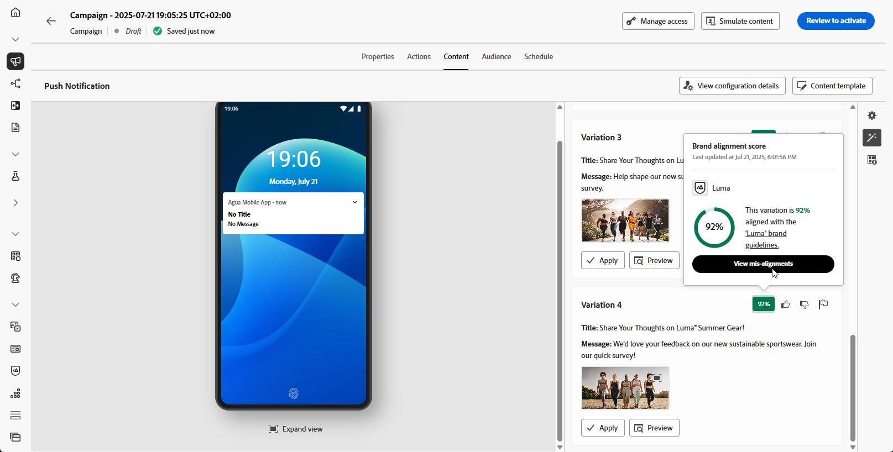

# 使用AI助理產生推播 {#generative-push}

>[!IMPORTANT]
>
>開始使用此功能之前，請先閱讀相關的[護欄與限制](gs-generative.md#generative-guardrails)。
> 
>
>您必須先同意[使用者合約](https://www.adobe.com/tw/legal/licenses-terms/adobe-dx-gen-ai-user-guidelines.html)，才能在Journey Optimizer中使用AI小幫手。 如需詳細資訊，請聯絡您的 Adobe 代表。

在您建立並個人化訊息後，請使用Journey Optimizer中的AI助理將推播通知內容提升到新的境界。

探索以下標籤，瞭解如何在Journey Optimizer中使用AI助理。

>[!BEGINTABS]

>[!TAB 產生完整推送]

在此特定範例中，瞭解如何使用Journey Optimizer中的AI助理傳送吸引人的推播通知。

請依照下列步驟操作：

1. 建立並設定推播通知行銷活動後，請按一下&#x200B;**[!UICONTROL 編輯內容]**。

   有關如何設定推播通知行銷活動的詳細資訊，請參閱[此頁面](../push/create-push.md)。

1. 填寫行銷活動的&#x200B;**[!UICONTROL 基本詳細資料]**。 完成後，按一下&#x200B;**[!UICONTROL 編輯內容]**。

1. 視需要個人化您的推播通知。 [了解更多](../push/design-push.md)

1. 存取&#x200B;**[!UICONTROL 顯示AI助理]**&#x200B;功能表。

   {zoomable="yes"}

1. 啟用AI助理的&#x200B;**[!UICONTROL 使用原始內容]**&#x200B;選項，以根據選取的內容個人化新內容選項。

1. 選取您的&#x200B;**[!UICONTROL 品牌]**，以確保AI產生的內容符合您的品牌規格。 [進一步瞭解](brands.md)品牌。

   請注意，品牌功能會以私人測試版發佈，未來發佈的版本將逐步提供給所有客戶。

1. 說明您要在&#x200B;**[!UICONTROL 提示]**&#x200B;欄位中產生的內容，以微調內容。

   如果您正在尋求製作提示的協助，請存取&#x200B;**[!UICONTROL 提示資料庫]**，其中提供各種提示概念，以改進您的行銷活動。

   {zoomable="yes"}

1. 選擇要產生的欄位： **[!UICONTROL 標題]**、**[!UICONTROL 訊息]**&#x200B;和/或&#x200B;**[!UICONTROL 影像]**。

1. 使用&#x200B;**[!UICONTROL 文字設定]**&#x200B;選項量身打造您的提示：

   * **[!UICONTROL 通訊策略]**：選擇最適合您產生文字的通訊樣式。
   * **[!UICONTROL 語言]**：選擇您產生內容的語言。
   * **[!UICONTROL 音調]**：您的推播通知音調應該會對您的對象產生共鳴。 無論您是要提供豐富資訊、好玩或有說服力，AI Assistant都能據以調整訊息。

   {zoomable="yes"}

1. 選擇您的&#x200B;**[!UICONTROL 影像設定]**：

   * **[!UICONTROL 內容型別]**：這會分類視覺元素的性質，區分不同的視覺呈現形式，例如像片、圖形或藝術品。
   * **[!UICONTROL 視覺強度]**：您可以調整影像的強度來控制影像的影響。 較低的設定(2)可建立更柔和、更克制的外觀，而較高的設定(10)則可讓影像更生動、視覺效果更強大。
   * **[!UICONTROL 色彩和色調]**：影像中顏色的整體外觀及其傳達的氣氛或氣氛。
   * **[!UICONTROL 照明]**：這指的是影像中的閃電，它會塑造大氣層，並反白標示特定的元素。
   * **[!UICONTROL 構成]**：這指的是影像框架中元素的排列

   {zoomable="yes"}

1. 從&#x200B;**[!UICONTROL 品牌資產]**&#x200B;功能表，按一下&#x200B;**[!UICONTROL 上傳品牌資產]**，新增任何包含可提供額外內容AI助理或選取先前上傳之內容的品牌資產。

   先前上傳的檔案可在&#x200B;**[!UICONTROL 已上傳的品牌資產]**&#x200B;下拉式清單中使用。 只需切換您要納入產生代的資產。

1. 提示就緒後，請按一下[產生]。****

1. 瀏覽產生的&#x200B;**[!UICONTROL 變數]**。

   按一下&#x200B;**[!UICONTROL 預覽]**&#x200B;以檢視所選變數的全熒幕版本，或按一下&#x200B;**[!UICONTROL 套用]**&#x200B;以取代您目前的內容。

1. 按一下百分比圖示可檢視您的&#x200B;**[!UICONTROL 品牌一致性分數]**，並識別與您的品牌之間的任何不一致性。

   深入瞭解[品牌一致性分數](brands-score.md)。

   {zoomable="yes"}

1. 導覽至&#x200B;**[!UICONTROL 預覽]**&#x200B;視窗中的&#x200B;**[!UICONTROL 調整]**&#x200B;選項，以存取其他自訂功能：

   * **[!UICONTROL 使用作為參考內容]**：選擇的變體將作為參考內容以產生其他結果。

   * **[!UICONTROL 重述]**： AI助理可以不同的方式重述您的訊息，讓您的寫作保持新鮮，並吸引不同受眾。

   * **[!UICONTROL 使用較簡單的語言]**：利用AI Assistant簡化您的語言，確保更廣大的受眾擁有清晰易懂的語言。

   您也可以變更文字的&#x200B;**[!UICONTROL 音調]**&#x200B;和&#x200B;**[!UICONTROL 通訊策略]**。

   {zoomable="yes"}

1. 開啟&#x200B;**[!UICONTROL 品牌一致性]**&#x200B;標籤，檢視您的內容如何與您的[品牌指南](brands.md)一致。

1. 找到適當的內容後，按一下&#x200B;**[!UICONTROL 選取]**。

   您也可以為內容啟用實驗。 [了解更多](generative-experimentation.md)

1. 插入個人化欄位，以根據設定檔資料自訂推播通知內容。 然後，按一下&#x200B;**[!UICONTROL 模擬內容]**&#x200B;按鈕以控制呈現，並使用測試設定檔檢查個人化設定。 [了解更多](../personalization/personalize.md)

定義內容、對象和排程後，您就可以準備推播行銷活動。 [了解更多](../campaigns/review-activate-campaign.md)

>[!TAB 只產生文字]

在此特定範例中，瞭解如何在Journey Optimizer中使用AI助理處理特定內容。 請依照下列步驟操作：

1. 建立並設定推播通知行銷活動後，請按一下&#x200B;**[!UICONTROL 編輯內容]**。

   有關如何設定推播行銷活動的詳細資訊，請參閱[此頁面](../push/create-push.md)。

1. 填寫行銷活動的&#x200B;**[!UICONTROL 基本詳細資料]**。 完成後，按一下&#x200B;**[!UICONTROL 編輯內容]**。

1. 視需要個人化您的推播通知。 [了解更多](../push/design-push.md)

1. 存取您&#x200B;**[!UICONTROL 標題]**&#x200B;或&#x200B;**[!UICONTROL 訊息]**&#x200B;欄位旁的&#x200B;**[!UICONTROL 使用AI助理編輯文字]**&#x200B;功能表。

   ![推播通知撰寫畫面的[標題]和[訊息]欄位旁有[使用AI助理編輯文字]按鈕](assets/push-genai-1.png){zoomable="yes"}

1. 啟用AI助理的&#x200B;**[!UICONTROL 使用參考內容]**&#x200B;選項，以根據選取的內容個人化新內容。

1. 選取您的&#x200B;**[!UICONTROL 品牌]**，以確保AI產生的內容符合您的品牌規格。 [進一步瞭解](brands.md)品牌。

   請注意，品牌功能會以私人測試版發佈，未來發佈的版本將逐步提供給所有客戶。

1. 說明您要在&#x200B;**[!UICONTROL 提示]**&#x200B;欄位中產生的內容，以微調內容。

   如果您正在尋求製作提示的協助，請存取&#x200B;**[!UICONTROL 提示資料庫]**，其中提供各種提示概念，以改進您的行銷活動。

   {zoomable="yes"}

1. 使用&#x200B;**[!UICONTROL 文字設定]**&#x200B;選項量身打造您的提示：

   * **[!UICONTROL 通訊策略]**：選擇最適合您產生文字的通訊樣式。
   * **[!UICONTROL 語言]**：選擇您產生內容的語言。
   * **[!UICONTROL 音調]**：推播通知的音調應該會與您的對象產生共鳴。 無論您是要提供豐富資訊、好玩或有說服力，AI Assistant都能據以調整訊息。
   * **[!UICONTROL 長度]**：使用範圍滑桿選取內容的長度。

   {zoomable="yes"}

1. 從&#x200B;**[!UICONTROL 品牌資產]**&#x200B;功能表，按一下&#x200B;**[!UICONTROL 上傳品牌資產]**，新增任何包含可提供額外內容AI助理或選取先前上傳之內容的品牌資產。

   先前上傳的檔案可在&#x200B;**[!UICONTROL 已上傳的品牌資產]**&#x200B;下拉式清單中使用。 只需切換您要納入產生代的資產。

1. 提示就緒後，請按一下[產生]。****

1. 瀏覽產生的&#x200B;**[!UICONTROL 變數]**。

1. 按一下百分比圖示可檢視您的&#x200B;**[!UICONTROL 品牌一致性分數]**，並識別與您的品牌之間的任何不一致性。

   深入瞭解[品牌一致性分數](brands-score.md)。

   {zoomable="yes"}

1. 導覽至&#x200B;**[!UICONTROL 預覽]**&#x200B;視窗中的&#x200B;**[!UICONTROL 調整]**&#x200B;選項，以存取其他自訂功能：

   * **[!UICONTROL 使用作為參考內容]**：選擇的變體將作為參考內容以產生其他結果。

   * **[!UICONTROL 精心設計]**： AI助理可以協助您展開特定主題，提供其他詳細資訊，以增進瞭解與參與。

   * **[!UICONTROL 摘要]**：冗長的資訊可能會讓收件者超載。 使用AI Assistant將要點濃縮為清晰、簡潔的摘要，以吸引注意並鼓勵他們進一步閱讀。

   * **[!UICONTROL 重述]**:The AI Assistant能以不同方式重述您的訊息，讓您撰寫內容保持新鮮，並吸引不同受眾。

   * **[!UICONTROL 使用較簡單的語言]**：利用AI Assistant簡化您的語言，確保更廣大的受眾擁有清晰易懂的語言。

   您也可以變更文字的&#x200B;**[!UICONTROL 音調]**&#x200B;和&#x200B;**[!UICONTROL 通訊策略]**。

   {zoomable="yes"}

1. 開啟&#x200B;**[!UICONTROL 品牌一致性]**&#x200B;標籤，檢視您的內容如何與您的[品牌指南](brands.md)一致。

1. 找到適當的內容後，按一下&#x200B;**[!UICONTROL 選取]**。

   您也可以為內容啟用實驗。 [了解更多](generative-experimentation.md)

1. 插入個人化欄位，以根據設定檔資料自訂推播通知內容。 然後，按一下&#x200B;**[!UICONTROL 模擬內容]**&#x200B;按鈕以控制呈現，並使用測試設定檔檢查個人化設定。 [了解更多](../personalization/personalize.md)

定義內容、對象和排程後，您就可以準備推播行銷活動。 [了解更多](../campaigns/review-activate-campaign.md)

>[!TAB 只產生影像]

1. 建立並設定推播通知行銷活動後，請按一下&#x200B;**[!UICONTROL 編輯內容]**。

   有關如何設定推播通知行銷活動的詳細資訊，請參閱[此頁面](../push/create-push.md)。

1. 填寫行銷活動的&#x200B;**[!UICONTROL 基本詳細資料]**。 完成後，按一下&#x200B;**[!UICONTROL 編輯內容]**。

1. 視需要個人化您的推播通知。 [了解更多](../push/design-push.md)

1. 存取&#x200B;**[!UICONTROL 新增媒體]**&#x200B;功能表。

   ![使用[新增媒體]按鈕的推播通知編輯器，以在通知中包含影像](assets/push-gen-img-1.png){zoomable="yes"}

1. 啟用AI助理的&#x200B;**[!UICONTROL 參考樣式]**&#x200B;選項，以根據參考內容個人化新內容。 您也可以上傳影像以將內容新增至您的變數。

1. 選取您的&#x200B;**[!UICONTROL 品牌]**，以確保AI產生的內容符合您的品牌規格。 [進一步瞭解](brands.md)品牌。

   請注意，品牌功能會以私人測試版發佈，未來發佈的版本將逐步提供給所有客戶。

1. 說明您要在&#x200B;**[!UICONTROL 提示]**&#x200B;欄位中產生的內容，以微調內容。

   如果您正在尋求製作提示的協助，請存取&#x200B;**[!UICONTROL 提示資料庫]**，其中提供各種提示概念，以改進您的行銷活動。

   {zoomable="yes"}

1. 選擇您的&#x200B;**[!UICONTROL 影像設定]**：

   * **[!UICONTROL 內容型別]**：這會分類視覺元素的性質，區分不同的視覺呈現形式，例如像片、圖形或藝術品。
   * **[!UICONTROL 視覺強度]**：您可以調整影像的強度來控制影像的影響。 較低的設定(2)可建立更柔和、更克制的外觀，而較高的設定(10)則可讓影像更生動、視覺效果更強大。
   * **[!UICONTROL 色彩和色調]**：影像中顏色的整體外觀及其傳達的氣氛或氣氛。
   * **[!UICONTROL 照明]**：這指的是影像中的閃電，它會塑造大氣層，並反白標示特定的元素。
   * **[!UICONTROL 構成]**：這指的是影像框架中元素的排列

1. 從&#x200B;**[!UICONTROL 品牌資產]**&#x200B;功能表，按一下&#x200B;**[!UICONTROL 上傳品牌資產]**，新增任何包含可提供額外內容AI助理或選取先前上傳之內容的品牌資產。

   先前上傳的檔案可在&#x200B;**[!UICONTROL 已上傳的品牌資產]**&#x200B;下拉式清單中使用。 只需切換您要納入產生代的資產。

1. 提示就緒後，請按一下[產生]。****

1. 瀏覽產生的&#x200B;**[!UICONTROL 變數]**。

1. 按一下百分比圖示可檢視您的&#x200B;**[!UICONTROL 品牌一致性分數]**，並識別與您的品牌之間的任何不一致性。

   深入瞭解[品牌一致性分數](brands-score.md)。

1. 導覽至&#x200B;**[!UICONTROL 預覽]**&#x200B;視窗中的&#x200B;**[!UICONTROL 調整]**&#x200B;選項，以存取其他自訂功能：

   * **[!UICONTROL 產生類似專案]**&#x200B;以檢視與此變體相關的影像。
   * **[!UICONTROL 在Adobe Express中編輯]**&#x200B;以進一步自訂您的資產。

[進一步瞭解Adobe Express整合](../integrations/express.md)

   * **[!UICONTROL 儲存]**&#x200B;以儲存資產以供稍後存取。

   {zoomable="yes"}

1. 開啟&#x200B;**[!UICONTROL 品牌一致性]**&#x200B;標籤，檢視您的內容如何與您的[品牌指南](brands.md)一致。

1. 找到適當的內容後，按一下&#x200B;**[!UICONTROL 選取]**。

   您也可以為內容啟用實驗。 [了解更多](generative-experimentation.md)

定義內容、對象和排程後，您就可以準備推播行銷活動。 [了解更多](../campaigns/review-activate-campaign.md)

>[!ENDTABS]
