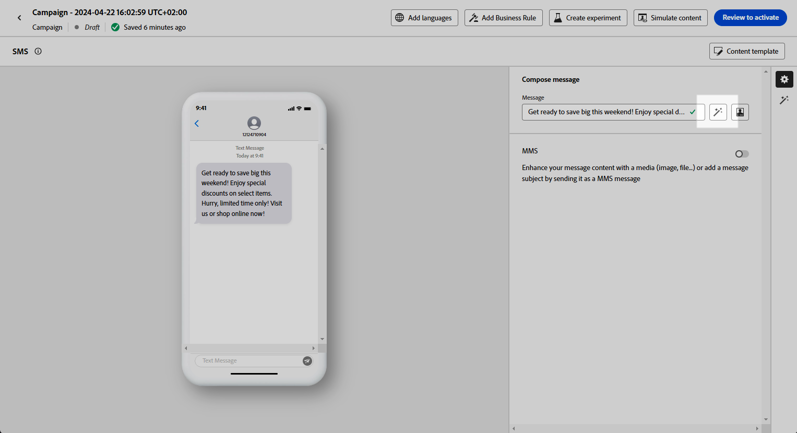
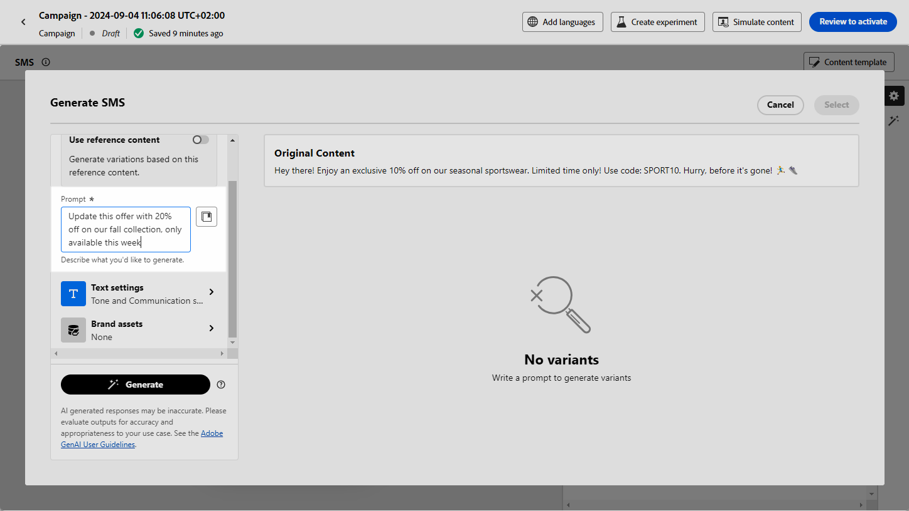
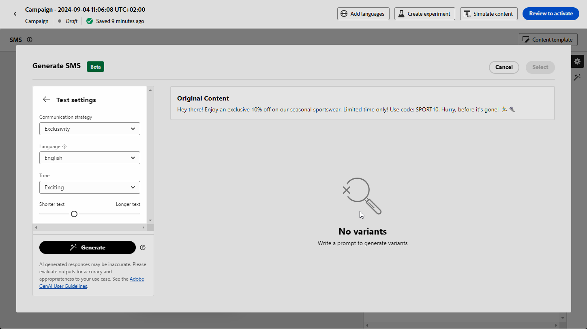
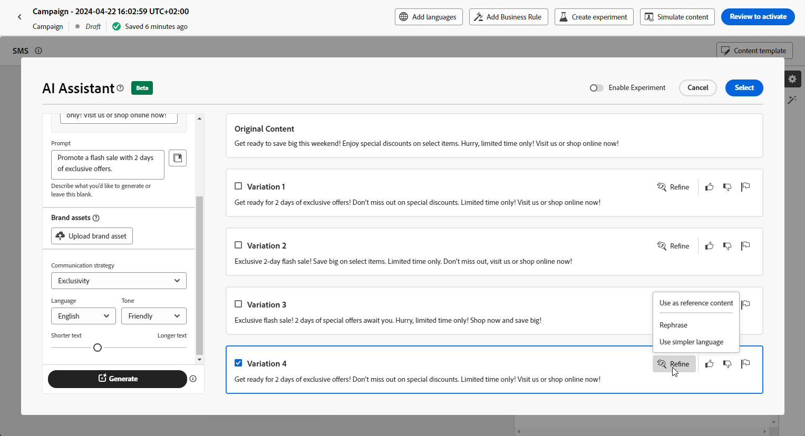

# 在Journey Optimizer中使用AI助理產生簡訊 — 內容加速器  {#generative-sms}

>[!IMPORTANT]
>
>開始使用此功能之前，請先閱讀相關的[護欄和限制](gs-generative.md#generative-guardrails)。
> 
>
>您必須先同意[使用者合約](https://www.adobe.com/legal/licenses-terms/adobe-dx-gen-ai-user-guidelines.html)，才能在Journey Optimizer中使用AI助理進行Content Acceleration。 如需詳細資訊，請聯絡您的 Adobe 代表。

精心打造和量身打造您的SMS訊息以符合對象的偏好設定後，請提升您與Journey Optimizer中用於Content Acceleration的AI助理的通訊。

此資源提供有見地的建議，讓您微調內容，協助訊息引起共鳴，並促進最大程度的參與。

探索以下標籤，瞭解如何使用Journey Optimizer中的AI助理加速內容。

>[!BEGINTABS]

>[!TAB 產生完整簡訊]

1. 建立並設定簡訊行銷活動後，按一下&#x200B;**[!UICONTROL 編輯內容]**。

   如需如何設定簡訊行銷活動的詳細資訊，請參閱[此頁面](../sms/create-sms.md)。

1. 填寫行銷活動的&#x200B;**[!UICONTROL 基本詳細資料]**。 完成後，按一下&#x200B;**[!UICONTROL 編輯內容]**。

1. 視需要個人化您的SMS訊息。 [了解更多](../sms/create-sms.md)

1. 存取&#x200B;**[!UICONTROL 顯示AI助理]**&#x200B;功能表。

   {zoomable="yes"}

1. 說明您要在&#x200B;**[!UICONTROL 提示]**&#x200B;欄位中產生的內容，以微調內容。

   如果您正在尋求製作提示的協助，請存取&#x200B;**[!UICONTROL 提示資料庫]**，其中提供各種提示概念，以改進您的行銷活動。

   {zoomable="yes"}

1. 使用&#x200B;**[!UICONTROL 文字設定]**&#x200B;選項量身打造您的提示：

   * **[!UICONTROL 通訊策略]**：針對產生的文字選取所要的通訊方式。
   * **[!UICONTROL 語言]**：選擇變體內容的語言。
   * **[!UICONTROL 音調]**：確定文字適合您的對象和目的。
   * **[!UICONTROL 長度]**：使用範圍滑桿選取內容的長度。

   {zoomable="yes"}

1. 從&#x200B;**[!UICONTROL 品牌資產]**&#x200B;功能表，按一下&#x200B;**[!UICONTROL 上傳品牌資產]**，新增任何包含可為AI助理提供額外內容或選取先前上傳內容的品牌資產。

   先前上傳的檔案可在&#x200B;**[!UICONTROL 已上傳的品牌資產]**&#x200B;下拉式清單中使用。 只需切換您要納入產生代的資產。

1. 提示就緒後，請按一下[產生]。****

1. 瀏覽產生的&#x200B;**[!UICONTROL 變數]**。

1. 瀏覽至&#x200B;**[!UICONTROL 預覽]**&#x200B;視窗中的&#x200B;**[!UICONTROL 調整]**&#x200B;選項，以存取其他自訂功能並微調您的偏好設定變化：

   * **[!UICONTROL 使用作為參考內容]**：選擇的變體將作為參考內容以產生其他結果。

   * **[!UICONTROL 重述]**：AI Assistant可以不同的方式重述您的訊息，讓您的寫作保持新鮮，並吸引不同受眾。

   * **[!UICONTROL 使用較簡單的語言]**：利用AI助理簡化您的語言，確保更廣大的受眾擁有清晰度和可存取性。

   您也可以變更文字的&#x200B;**[!UICONTROL 音調]**&#x200B;和&#x200B;**[!UICONTROL 通訊策略]**。

   {zoomable="yes"}

1. 找到適當的內容後，按一下&#x200B;**[!UICONTROL 選取]**。

   您也可以為內容啟用實驗。 [了解更多](generative-experimentation.md)

1. 插入個人化欄位，以根據設定檔資料自訂您的簡訊內容。 [進一步了解內容個人化](../personalization/personalize.md)

1. 定義訊息內容後，按一下&#x200B;**[!UICONTROL 模擬內容]**&#x200B;按鈕以控制呈現，並使用測試設定檔檢查個人化設定。 [了解更多](../personalization/personalize.md)

當您定義內容、對象和排程時，就能準備好SMS行銷活動。 [了解更多](../campaigns/review-activate-campaign.md)

>[!TAB 只產生文字]

1. 建立並設定簡訊行銷活動後，按一下&#x200B;**[!UICONTROL 編輯內容]**。

   如需如何設定簡訊行銷活動的詳細資訊，請參閱[此頁面](../sms/create-sms.md)。

1. 填寫行銷活動的&#x200B;**[!UICONTROL 基本詳細資料]**。 完成後，按一下&#x200B;**[!UICONTROL 編輯內容]**。

1. 視需要個人化您的SMS訊息。 [了解更多](../sms/create-sms.md)

1. 存取您&#x200B;**[!UICONTROL 訊息]**&#x200B;欄位旁的&#x200B;**[!UICONTROL 使用AI助理編輯文字]**&#x200B;功能表。

   {zoomable="yes"}

1. 啟用內容加速的AI助理的&#x200B;**[!UICONTROL 使用參考內容]**&#x200B;選項，以根據選取的內容個人化新內容。

1. 說明您要在&#x200B;**[!UICONTROL 提示]**&#x200B;欄位中產生的內容，以微調內容。

   如果您正在尋求製作提示的協助，請存取&#x200B;**[!UICONTROL 提示資料庫]**，其中提供各種提示概念，以改進您的行銷活動。

   {zoomable="yes"}

1. 使用&#x200B;**[!UICONTROL 文字設定]**&#x200B;選項量身打造您的提示：

   * **[!UICONTROL 通訊策略]**：針對產生的文字選取所要的通訊方式。
   * **[!UICONTROL 語言]**：選擇變體內容的語言。
   * **[!UICONTROL 音調]**：確定文字適合您的對象和目的。
   * **[!UICONTROL 長度]**：使用範圍滑桿選取內容的長度。

   {zoomable="yes"}

1. 從&#x200B;**[!UICONTROL 品牌資產]**&#x200B;功能表，按一下&#x200B;**[!UICONTROL 上傳品牌資產]**，新增任何包含可為AI助理提供額外內容或選取先前上傳內容的品牌資產。

   先前上傳的檔案可在&#x200B;**[!UICONTROL 已上傳的品牌資產]**&#x200B;下拉式清單中使用。 只需切換您要納入產生代的資產。

1. 提示就緒後，請按一下[產生]。****

1. 瀏覽產生的&#x200B;**[!UICONTROL 變數]**，然後按一下&#x200B;**[!UICONTROL 預覽]**&#x200B;以檢視所選變數的全熒幕版本。

1. 瀏覽至&#x200B;**[!UICONTROL 預覽]**&#x200B;視窗中的&#x200B;**[!UICONTROL 調整]**&#x200B;選項，以存取其他自訂功能並微調您的偏好設定變化：

   * **[!UICONTROL 使用作為參考內容]**：選擇的變體將作為參考內容以產生其他結果。

   * **[!UICONTROL 重述]**：AI Assistant可以不同的方式重述您的訊息，讓您的寫作保持新鮮，並吸引不同受眾。

   * **[!UICONTROL 使用較簡單的語言]**：利用AI助理簡化您的語言，確保更廣大的受眾擁有清晰度和可存取性。

   {zoomable="yes"}

1. 找到適當的內容後，按一下&#x200B;**[!UICONTROL 選取]**。

   您也可以為內容啟用實驗。 [了解更多](generative-experimentation.md)

1. 插入個人化欄位，以根據設定檔資料自訂您的簡訊內容。 [進一步了解內容個人化](../personalization/personalize.md)

1. 定義訊息內容後，按一下&#x200B;**[!UICONTROL 模擬內容]**&#x200B;按鈕以控制呈現，並使用測試設定檔檢查個人化設定。

當您定義內容、對象和排程時，就能準備好SMS行銷活動。 [了解更多](../campaigns/review-activate-campaign.md)

>[!ENDTABS]
