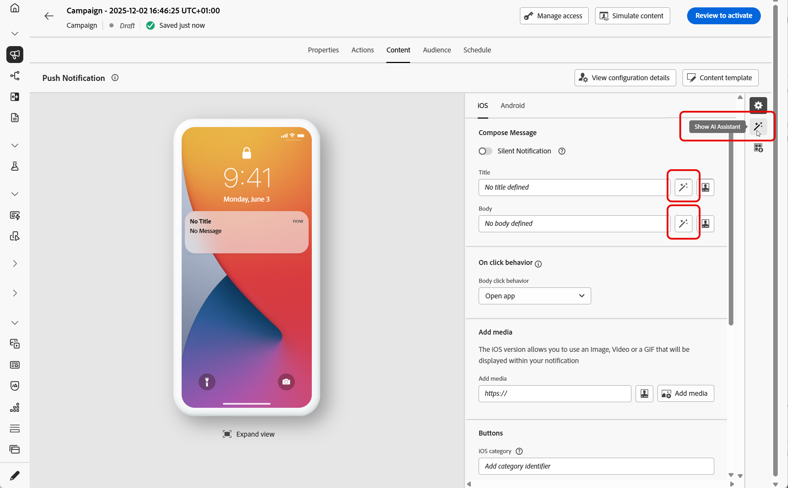
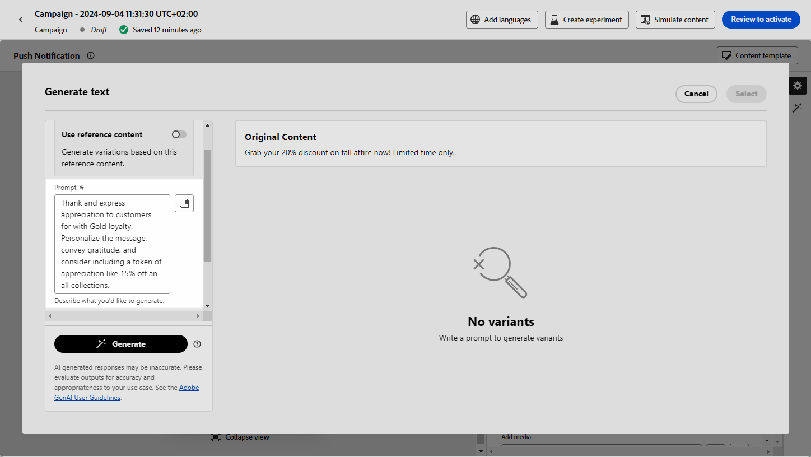
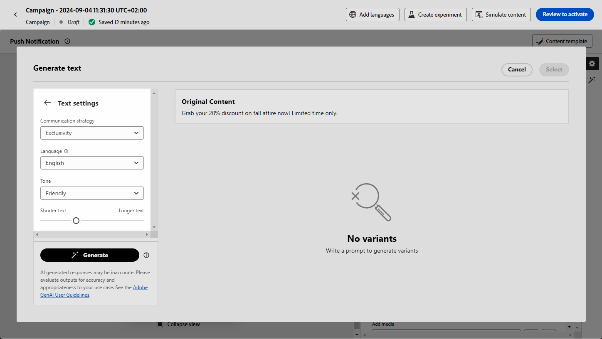
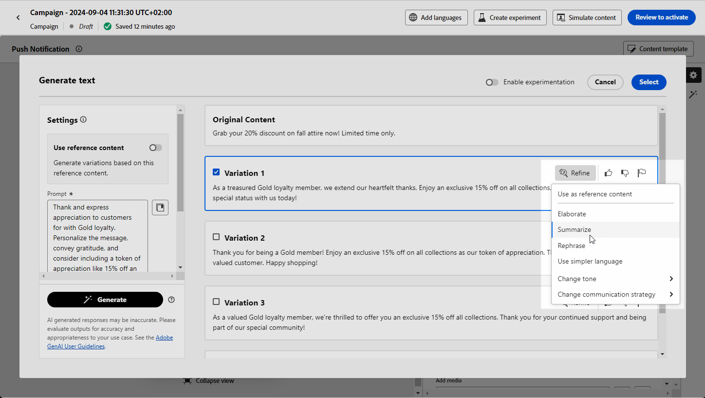
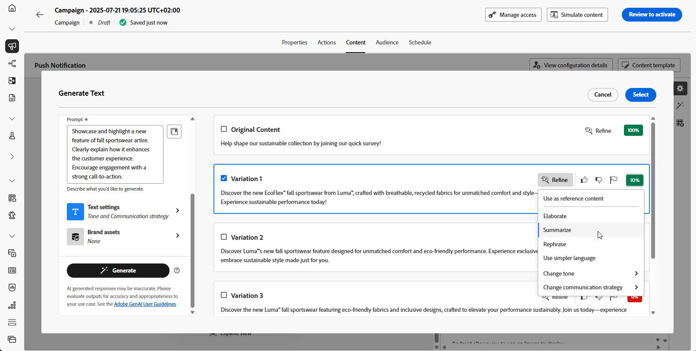

# 使用AI助理產生文字 {#generative-text}

>[!IMPORTANT]
>
>開始使用此功能之前，請先閱讀相關的[護欄與限制](gs-generative.md#generative-guardrails)。
> 
>
>您必須先同意[使用者合約](https://www.adobe.com/tw/legal/licenses-terms/adobe-dx-gen-ai-user-guidelines.html)，才能在Journey Optimizer中使用AI小幫手。 如需詳細資訊，請聯絡您的 Adobe 代表。

使用Journey Optimizer中的AI助理產生吸引人的文字內容，引起觀眾的共鳴。 無論您需要增強電子郵件復本、建立吸引人的網頁內容、製作有說服力的登陸頁面文字、撰寫推播通知訊息，或撰寫SMS訊息，AI助理都能協助您傳送具影響力的文字。

## 適用於電子郵件與網路頻道 {#email-web-channels}

AI助理可以為您的電子郵件行銷活動、網頁體驗和登入頁面產生高品質的文字內容。 此功能可讓您建立引人入勝的品牌內傳訊功能，透過數位接觸點與您的對象連結。

### 存取及設定 {#access-configure}

開始使用AI助理產生文字內容之前，您需要設定行銷活動或歷程並存取內容編輯器。 按照以下步驟準備您的工作區並開啟AI助理面板。

1. 建立及設定您的行銷活動或歷程：

   * **電子郵件**：建立並設定您的電子郵件行銷活動後，請按一下&#x200B;**[!UICONTROL 編輯內容]**。 [了解更多](../email/create-email.md)
   * **網頁**：建立並設定網頁之後，請按一下[編輯網頁]&#x200B;**&#x200B;**。 [了解更多](../web/create-web.md)
   * **登陸頁面**：建立並設定您的登陸頁面後，請按一下&#x200B;**[!UICONTROL 開啟設計工具]**。 [了解更多](../landing-pages/create-lp.md)

1. 選取&#x200B;**[!UICONTROL 文字元件]**&#x200B;以僅鎖定特定內容，並存取&#x200B;**[!UICONTROL AI小幫手]**&#x200B;功能表（或&#x200B;**[!UICONTROL 顯示網頁的AI小幫手]**）。

   {zoomable="yes"}

### 產生內容 {#generate-content}

瞭解如何使用AI Assistant製作清晰的提示、微調設定並產生量身打造的文字，以確保您的訊息符合您的品牌和溝通目標。

1. 啟用AI助理的&#x200B;**[!UICONTROL 使用原始內容]**&#x200B;選項，以根據選取的內容個人化新內容。

1. 選取您的&#x200B;**[!UICONTROL 品牌]**，以確保AI產生的內容符合您的品牌規格。 [進一步瞭解](brands.md)品牌。

1. 說明您要在&#x200B;**[!UICONTROL 提示]**&#x200B;欄位中產生的內容，以微調內容。

   如果您正在尋求製作提示的協助，請存取&#x200B;**[!UICONTROL 提示資料庫]**，其中提供各種提示概念，以改進您的行銷活動。

   {zoomable="yes"}

1. 使用&#x200B;**[!UICONTROL 文字設定]**&#x200B;選項量身打造您的提示：

   * **[!UICONTROL 通訊策略]**：選擇最適合您產生文字的通訊樣式。
   * **[!UICONTROL 語言]**：選擇您產生內容的語言。
   * **[!UICONTROL 音調]**：音調應該會與您的對象產生共鳴。 無論您是要提供豐富資訊、好玩或有說服力，AI Assistant都能據以調整訊息。
   * **文字長度**：使用滑桿來選取所要的文字長度。

   {zoomable="yes"}

1. 從&#x200B;**[!UICONTROL 品牌資產]**&#x200B;功能表，按一下&#x200B;**[!UICONTROL 上傳品牌資產]**，新增任何包含可提供額外內容AI助理或選取先前上傳之內容的品牌資產。

   先前上傳的檔案可在&#x200B;**[!UICONTROL 已上傳的品牌資產]**&#x200B;下拉式清單中使用。 只需切換您要納入產生代的資產。

   {zoomable="yes"}

1. 提示就緒後，請按一下[產生]。**&#x200B;**

### 精簡並完成 {#refine-finalize}

瞭解如何檢閱產生的文字、進行微調並套用個人化來最終確定您的內容、建立經過微調並準備傳送的互動訊息。

1. 瀏覽產生的&#x200B;**[!UICONTROL 變數]**。

   按一下&#x200B;**[!UICONTROL 預覽]**&#x200B;以檢視所選變數的全熒幕版本，或按一下&#x200B;**[!UICONTROL 套用]**&#x200B;以取代您目前的內容。

1. 按一下百分比圖示可檢視您的&#x200B;**[!UICONTROL 品牌一致性分數]**，並識別與您的品牌之間的任何不一致性。

   深入瞭解[品牌一致性分數](brands-score.md)。

   {zoomable="yes"}

1. 導覽至&#x200B;**[!UICONTROL 預覽]**&#x200B;視窗中的&#x200B;**[!UICONTROL 調整]**&#x200B;選項，以存取其他自訂功能：

   * **[!UICONTROL 使用作為參考內容]**：選擇的變體將作為參考內容以產生其他結果。

   * **[!UICONTROL 重新寫詞]**：重新寫入郵件，同時保留其意義。 此選項可協助您產生替代用語、改善流量或調整詞句，而不變更核心訊息。

   * **[!UICONTROL 使用較簡單的語言]**：利用AI Assistant簡化您的語言，確保更廣大的受眾擁有清晰易懂的語言。

   * **[!UICONTROL 變更語調]**：調整訊息的語調，以更符合您的通訊風格，例如，讓訊息更友好、更專業、更緊急，或更具啟發性。

   * **[!UICONTROL 變更通訊策略]**：根據您的目標修改傳訊方式，例如建立緊急狀態或強調令人興奮的吸引力。

   {zoomable="yes"}

1. 開啟&#x200B;**[!UICONTROL 品牌一致性]**&#x200B;標籤，檢視您的內容如何與您的[品牌指南](brands.md)一致。

1. 找到適當的內容後，按一下&#x200B;**[!UICONTROL 選取]**。

   您也可以為內容啟用實驗。 [了解更多](generative-experimentation.md)

1. 插入個人化欄位，以根據設定檔資料自訂您的內容。 然後，按一下&#x200B;**[!UICONTROL 模擬內容]**&#x200B;按鈕以控制呈現，並使用測試設定檔檢查個人化設定。 [了解更多](../personalization/personalize.md)

1. 檢閱並啟用您的內容：
   * **電子郵件**：當您定義內容、對象和排程時，就可以準備電子郵件行銷活動了。 [了解更多](../campaigns/review-activate-campaign.md)
   * **網頁**：一旦您定義您的網頁行銷活動設定，並視需要編輯您的內容，您就可以檢閱並啟動您的網頁行銷活動。 [了解更多](../web/create-web.md#activate-web-campaign)
   * **登陸頁面**：一旦您的登陸頁面準備就緒，您就可以發佈該頁面，以供訊息使用。 [了解更多](../landing-pages/create-lp.md#publish-landing-page)

## 適用於行動裝置頻道 {#mobile-channels}

AI Assistant可以為您的推播通知和SMS訊息產生引人入勝的文字內容，幫助您建立吸引人的行動通訊，在所有行動接觸點與您的對象產生共鳴。

### 存取及設定 {#mobile-access-configure}

開始使用AI助理為行動裝置頻道產生文字之前，您必須設定您的行銷活動並存取AI助理。 存取方法會因推播通知和SMS訊息而略有不同。

1. 建立及設定您的行動裝置行銷活動：
   * **推播通知**：建立並設定您的推播通知行銷活動後，請按一下&#x200B;**[!UICONTROL 編輯內容]**。 [了解更多](../push/create-push.md)
   * **簡訊**：建立並設定簡訊行銷活動後，請按一下&#x200B;**[!UICONTROL 編輯內容]**。 [了解更多](../sms/create-sms.md)

1. 填寫行銷活動的&#x200B;**[!UICONTROL 基本詳細資料]**。 完成後，按一下&#x200B;**[!UICONTROL 編輯內容]**。

1. 視需要個人化您的訊息：
   * **推播通知**： [深入瞭解](../push/design-push.md)
   * **簡訊**： [深入瞭解](../sms/create-sms.md)

1. 存取AI助理：
   * **推播通知**：按一下&#x200B;**[!UICONTROL 標題]**&#x200B;或&#x200B;**[!UICONTROL 訊息]**&#x200B;欄位旁的&#x200B;**[!UICONTROL 使用AI助理編輯文字]**&#x200B;功能表。 您也可以直接存取&#x200B;**AI助理**&#x200B;功能表。

     {zoomable="yes"}

   * **簡訊**：按一下&#x200B;**[!UICONTROL 訊息]**&#x200B;旁的&#x200B;**[!UICONTROL 使用AI助理編輯文字]**&#x200B;功能表或存取&#x200B;**[!UICONTROL 顯示AI助理]**&#x200B;功能表。

     {zoomable="yes"}

### 產生內容 {#mobile-generate-content}

存取AI Assistant後，您可以進行產生設定，以建立符合您品牌和促銷活動目標的行動內容。 自訂文字引數、新增品牌資產，並提供提示以引導AI產生相關變數。

1. 選取您的&#x200B;**[!UICONTROL 品牌]**，以確保AI產生的內容符合您的品牌規格。 [進一步瞭解](brands.md)品牌。

   請注意，品牌功能會以私人測試版發佈，未來發佈的版本將逐步提供給所有客戶。

1. 說明您要在&#x200B;**[!UICONTROL 提示]**&#x200B;欄位中產生的內容，以微調內容。

   如果您正在尋求製作提示的協助，請存取&#x200B;**[!UICONTROL 提示資料庫]**，其中提供各種提示概念，以改進您的行銷活動。 [進一步瞭解提示最佳實務](ai-assistant-prompting-guide.md)

   {zoomable="yes"}

1. **針對推播通知**，選擇要產生的欄位：標題和/或訊息。

1. 使用&#x200B;**[!UICONTROL 文字設定]**&#x200B;選項量身打造您的提示：

   * **[!UICONTROL 通訊策略]**：選擇最適合您產生文字的通訊樣式。
   * **[!UICONTROL 語言]**：選擇您產生內容的語言。
   * **[!UICONTROL 音調]**：音調應該會與您的對象產生共鳴。 無論您是要提供豐富資訊、好玩或有說服力，AI Assistant都能據以調整訊息。

     {zoomable="yes"}

1. 從&#x200B;**[!UICONTROL 參考內容]**&#x200B;功能表，按一下&#x200B;**[!UICONTROL 上傳檔案]**&#x200B;以新增任何品牌資產，該資產包含可提供額外內容AI助理的內容或選取先前上傳的內容。

   先前上傳的檔案可在&#x200B;**[!UICONTROL 已上傳的參考內容]**&#x200B;下拉式清單中使用。 只需切換您要納入產生代的資產。

1. 提示就緒後，請按一下[產生]。**&#x200B;**

### 精簡並完成 {#mobile-refine-finalize}

產生行動訊息的文字變化後，您可以微調結果以確保其符合您的確切要求。 檢閱品牌一致性、調整語調和語言，並準備內容以進行啟用。

1. 產生之後，瀏覽&#x200B;**[!UICONTROL 變數]**。

1. 按一下百分比圖示可檢視您的&#x200B;**[!UICONTROL 品牌一致性分數]**，並識別與您的品牌之間的任何不一致性。

   深入瞭解[品牌一致性分數](brands-score.md)。

   {zoomable="yes"}

1. 按一下&#x200B;**[!UICONTROL 預覽]**&#x200B;以檢視所選變數的全熒幕版本，或按一下&#x200B;**[!UICONTROL 套用]**&#x200B;以取代您目前的內容。

1. 導覽至&#x200B;**[!UICONTROL 預覽]**&#x200B;視窗中的&#x200B;**[!UICONTROL 調整]**&#x200B;選項，以存取其他自訂功能：

   * **[!UICONTROL 使用作為參考內容]**：選擇的變體將作為參考內容以產生其他結果。

   * **[!UICONTROL 重新寫詞]**：重新寫入郵件，同時保留其意義。 此選項可協助您產生替代用語、改善流量或調整詞句，而不變更核心訊息。

   * **[!UICONTROL 使用較簡單的語言]**：利用AI Assistant簡化您的語言，確保更廣大的受眾擁有清晰易懂的語言。

   * **[!UICONTROL 翻譯]**：簡化您的語言，確保更廣大的受眾能清楚無誤地瞭解。

   * **[!UICONTROL 變更語調]**：調整訊息的語調，以更符合您的通訊風格，例如，讓訊息更友好、更專業、更緊急，或更具啟發性。

   * **[!UICONTROL 變更通訊策略]**：根據您的目標修改傳訊方式，例如建立緊急狀態或強調令人興奮的吸引力。

     {zoomable="yes"}

1. 開啟&#x200B;**[!UICONTROL 品牌一致性]**&#x200B;標籤，檢視您的內容如何與您的[品牌指南](brands.md)一致。

1. 找到適當的內容後，按一下&#x200B;**[!UICONTROL 選取]**。

   您也可以為內容啟用實驗。 [了解更多](generative-experimentation.md)

1. 插入個人化欄位，以根據設定檔資料自訂您的內容。 然後，按一下&#x200B;**[!UICONTROL 模擬內容]**&#x200B;按鈕以控制呈現，並使用測試設定檔檢查個人化設定。 [了解更多](../personalization/personalize.md)

當您定義內容、對象和排程時，就能準備好準備行動裝置行銷活動。 [了解更多](../campaigns/review-activate-campaign.md)

