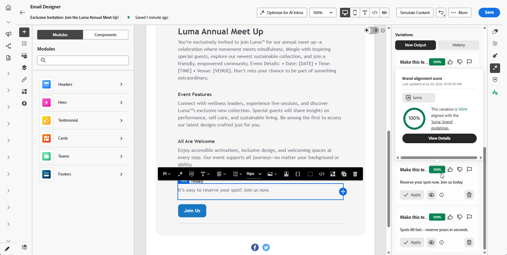
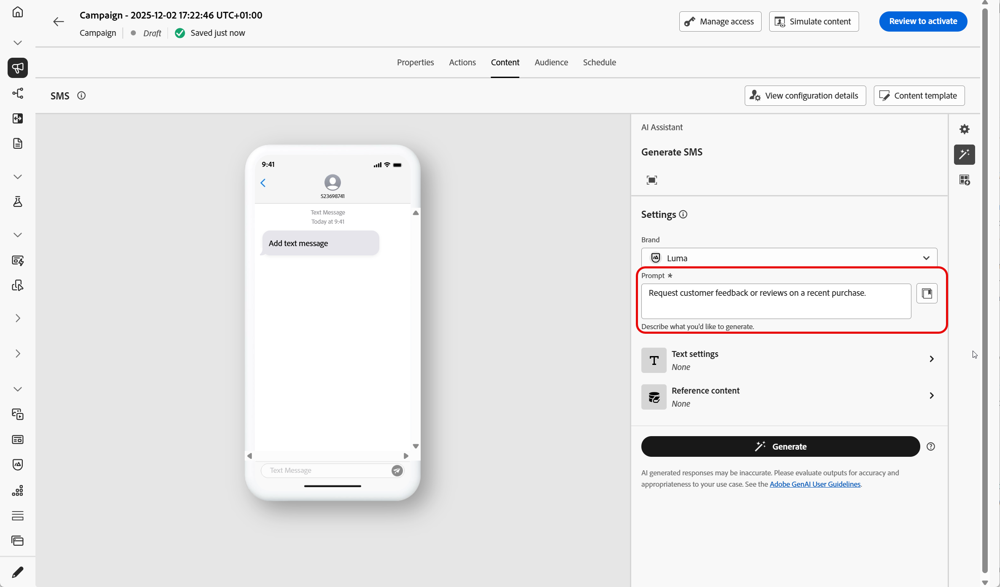
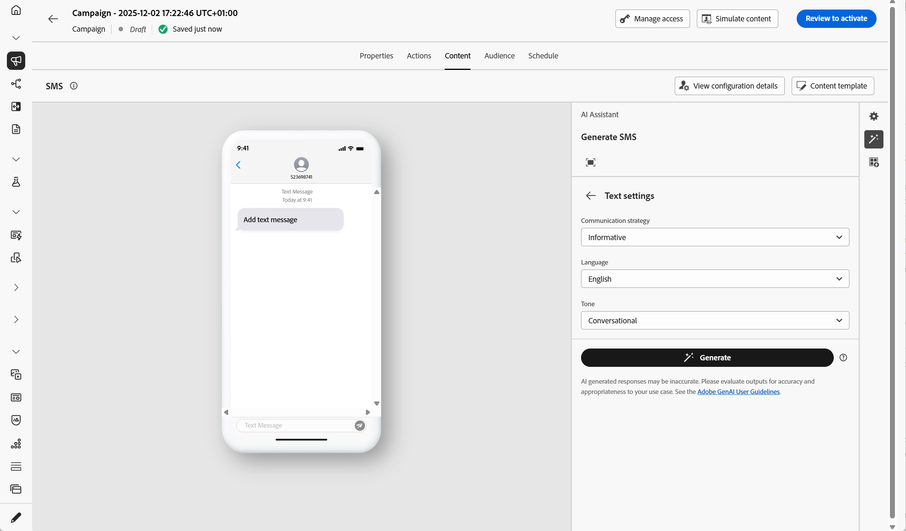

# 使用 AI 產生文字 {#generative-text}

>[!BEGINSHADEBOX]

**在此頁面上：**&#x200B;瞭解如何使用「產生電子郵件、網頁、登陸頁面、推播通知和Adobe Journey Optimizer簡訊通道的內容」來產生、調整及完成品牌內文字內容。

>[!ENDSHADEBOX]

>[!IMPORTANT]
>
>開始使用此功能之前，請先閱讀相關的[護欄和限制](gs-generative.md#generative-guardrails)。
> 
>
>您必須同意[使用者合約](https://www.adobe.com/tw/legal/licenses-terms/adobe-dx-gen-ai-user-guidelines.html)，才能在Journey Optimizer中使用「產生內容」。 如需詳細資訊，請聯絡您的 Adobe 代表。

使用AI產生吸引人的文字內容，引起觀眾的共鳴。 無論您是需要增強電子郵件復本、建立吸引人的網頁內容、製作有說服力的登陸頁面文字、撰寫推播通知訊息，或撰寫SMS訊息，產生內容都可以協助您傳送具影響力的文字。

## 適用於電子郵件與網路頻道 {#email-web-channels}

「產生內容」可以為您的電子郵件行銷活動、網頁體驗和登入頁面產生高品質的文字內容。 此功能可讓您建立引人入勝的品牌內傳訊功能，透過數位接觸點與您的對象連結。

### 存取及設定 {#access-configure}

開始使用「產生內容」產生文字內容之前，您需要設定行銷活動或歷程並存取內容編輯器。 請依照下列步驟準備您的工作區，並開啟「產生內容」面板。

1. 建立及設定您的行銷活動或歷程：

   * **電子郵件**：建立並設定您的電子郵件行銷活動後，請按一下&#x200B;**[!UICONTROL 編輯內容]**。 [了解更多](../email/create-email.md)
   * **網頁**：建立並設定網頁之後，請按一下[編輯網頁]&#x200B;**&#x200B;**。 [了解更多](../web/create-web.md)
   * **登陸頁面**：建立並設定您的登陸頁面後，請按一下&#x200B;**[!UICONTROL 開啟設計工具]**。 [了解更多](../landing-pages/create-lp.md)

1. 選取&#x200B;**[!UICONTROL 文字元件]**&#x200B;以僅鎖定特定內容，並存取&#x200B;**[!UICONTROL 產生內容]**&#x200B;功能表（或&#x200B;**[!UICONTROL 顯示產生網頁內容]**）。

   ![選取的文字元件已開啟[產生內容]功能表](assets/text-genai-1.png){zoomable="yes"}

### 產生文字 {#generate-content}

瞭解如何使用「產生內容」製作清晰的提示、微調設定，以及產生量身打造的文字，確保您的訊息符合您的品牌和溝通目標。

1. 啟用[產生內容]的&#x200B;**[!UICONTROL 使用原始內容]**&#x200B;選項，以根據選取的內容個人化新內容。

1. 選取您的&#x200B;**[!UICONTROL 品牌]**，以確保AI產生的內容符合您的品牌規格。 [進一步瞭解](brands.md)品牌。

1. 說明您要在&#x200B;**[!UICONTROL 提示]**&#x200B;欄位中產生的內容，以微調內容。

   如果您正在尋求製作提示的協助，請存取&#x200B;**[!UICONTROL 提示資料庫]**，其中提供各種提示概念，以改進您的行銷活動。

   ![使用[提示]欄位和[品牌選取器]產生[內容]文字產生面板](assets/text-genai-2.png){zoomable="yes"}

1. 使用&#x200B;**[!UICONTROL 文字設定]**&#x200B;選項量身打造您的提示：

   * **[!UICONTROL 通訊策略]**：選擇最適合您產生文字的通訊樣式。
   * **[!UICONTROL 語言]**：選擇您產生內容的語言。
   * **[!UICONTROL 音調]**：音調應該會與您的對象產生共鳴。 無論您是要提供豐富資訊、好玩或有說服力，「產生內容」都能據以調整訊息。

   {zoomable="yes"}

1. 從&#x200B;**[!UICONTROL 品牌資產]**&#x200B;功能表，按一下&#x200B;**[!UICONTROL 上傳品牌資產]**&#x200B;以新增任何品牌資產，該品牌資產包含可提供額外內容以產生內容或選取先前上傳內容的內容。

   先前上傳的檔案可在&#x200B;**[!UICONTROL 已上傳的品牌資產]**&#x200B;下拉式清單中使用。 只需切換您要納入產生代的資產。

   {zoomable="yes"}

1. 提示就緒後，請按一下[產生]。**&#x200B;**

### 精簡並完成 {#refine-finalize}

瞭解如何檢閱產生的文字、進行微調並套用個人化來最終確定您的內容、建立經過微調並準備傳送的互動訊息。

1. 瀏覽產生的&#x200B;**[!UICONTROL 變數]**。

   按一下&#x200B;**[!UICONTROL 預覽]**&#x200B;以檢視所選變數的全熒幕版本，或按一下&#x200B;**[!UICONTROL 套用]**&#x200B;以取代您目前的內容。

1. 按一下百分比圖示可檢視您的&#x200B;**[!UICONTROL 品牌一致性分數]**，並識別與您的品牌之間的任何不一致性。

   深入瞭解[品牌一致性分數](brands-score.md)。

   {zoomable="yes"}

1. 導覽至&#x200B;**[!UICONTROL 預覽]**&#x200B;視窗中的&#x200B;**[!UICONTROL 調整]**&#x200B;選項，以存取其他自訂功能：

   * **[!UICONTROL 使用作為參考內容]**：選擇的變體將作為參考內容以產生其他結果。

   * **[!UICONTROL 重新寫詞]**：重新寫入郵件，同時保留其意義。 此選項可協助您產生替代用語、改善流量或調整詞句，而不變更核心訊息。

   * **[!UICONTROL 使用較簡單的語言]**：使用AI簡化您的語言，確保更廣大的受眾擁有清晰度和可存取性。

   * **[!UICONTROL 變更語調]**：調整訊息的語調，以更符合您的通訊風格，例如，讓訊息更友好、更專業、更緊急，或更具啟發性。

   * **[!UICONTROL 變更通訊策略]**：根據您的目標修改傳訊方式，例如建立緊急狀態或強調令人興奮的吸引力。

   {zoomable="yes"}

1. 開啟&#x200B;**[!UICONTROL 品牌一致性]**&#x200B;標籤，檢視您的內容如何與您的[品牌指南](brands.md)一致。

1. 找到適當的內容後，按一下&#x200B;**[!UICONTROL 選取]**。

1. 插入個人化欄位，以根據設定檔資料自訂您的內容。 然後，使用模擬方法控制呈現並檢查個人化設定：按一下「模擬內容」**&#x200B;**，以使用範例輸入資料或AI自動產生來測試內容變異，或按一下「模擬內容」**，然後從下拉式清單中選取「模擬內容（AEP設定檔）」**，以使用測試設定檔預覽。 **&#x200B;**&#x200B;[了解更多](../content-management/preview-test.md)

1. 檢閱並啟用您的內容：
   * **電子郵件**：當您定義內容、對象和排程時，就可以準備電子郵件行銷活動了。 [了解更多](../campaigns/review-activate-campaign.md)
   * **網頁**：一旦您定義您的網頁行銷活動設定，並視需要編輯您的內容，您就可以檢閱並啟動您的網頁行銷活動。 [了解更多](../web/create-web.md#activate-web-campaign)
   * **登陸頁面**：一旦您的登陸頁面準備就緒，您就可以發佈該頁面，以供訊息使用。 [了解更多](../landing-pages/create-lp.md#publish-landing-page)

## 適用於行動裝置頻道 {#mobile-channels}

產生內容可為您的推播通知和SMS訊息產生吸引人的文字內容，協助您建立吸引人的行動通訊，在所有行動接觸點與受眾產生共鳴。

### 存取及設定 {#mobile-access-configure}

開始使用「產生行動裝置內容」產生文字之前，您必須設定行銷活動並存取「產生內容」。 存取方法會因推播通知和SMS訊息而略有不同。

1. 建立及設定您的行動裝置行銷活動：
   * **推播通知**：建立並設定您的推播通知行銷活動後，請按一下&#x200B;**[!UICONTROL 編輯內容]**。 [了解更多](../push/create-push.md)
   * **簡訊**：建立並設定簡訊行銷活動後，請按一下&#x200B;**[!UICONTROL 編輯內容]**。 [了解更多](../mobile/create-mobile-message.md)

1. 填寫行銷活動的&#x200B;**[!UICONTROL 基本詳細資料]**。 完成後，按一下&#x200B;**[!UICONTROL 編輯內容]**。

1. 視需要個人化您的訊息：
   * **推播通知**： [深入瞭解](../push/design-push.md)
   * **簡訊**： [深入瞭解](../mobile/create-mobile-message.md)

1. 存取&#x200B;**[!UICONTROL 顯示產生內容]**&#x200B;功能表。

   ![已開啟[產生內容]面板的推播通知編輯器](assets/push-genai-full-1.png){zoomable="yes"}

### 產生文字 {#mobile-generate-content}

存取「產生內容」後，您可以進行產生設定，以建立符合您品牌和促銷活動目標的行動內容。 自訂文字引數、新增品牌資產，並提供提示以引導AI產生相關變數。

1. 選取您的&#x200B;**[!UICONTROL 品牌]**，以確保AI產生的內容符合您的品牌規格。 [進一步瞭解](brands.md)品牌。

1. 說明您要在&#x200B;**[!UICONTROL 提示]**&#x200B;欄位中產生的內容，以微調內容。

   如果您正在尋求製作提示的協助，請存取&#x200B;**[!UICONTROL 提示資料庫]**，其中提供各種提示概念，以改進您的行銷活動。 [進一步瞭解提示最佳實務](ai-assistant-prompting-guide.md)

   {zoomable="yes"}

1. **針對推播通知**，選擇要產生的欄位：標題和/或訊息。

1. 使用&#x200B;**[!UICONTROL 文字設定]**&#x200B;選項量身打造您的提示：

   * **[!UICONTROL 通訊策略]**：選擇最適合您產生文字的通訊樣式。
   * **[!UICONTROL 語言]**：選擇您產生內容的語言。
   * **[!UICONTROL 音調]**：音調應該會與您的對象產生共鳴。 無論您是要提供豐富資訊、好玩或有說服力，「產生內容」都能據以調整訊息。

     {zoomable="yes"}

1. 從&#x200B;**[!UICONTROL 參考內容]**&#x200B;功能表，按一下&#x200B;**[!UICONTROL 上傳檔案]**&#x200B;以新增任何品牌資產，該資產包含可提供額外內容以產生內容或選取先前上傳內容的內容。

   先前上傳的檔案可在&#x200B;**[!UICONTROL 已上傳的參考內容]**&#x200B;下拉式清單中使用。 只需切換您要納入產生代的資產。

1. 提示就緒後，請按一下[產生]。**&#x200B;**

### 精簡並完成 {#mobile-refine-finalize}

產生行動訊息的文字變化後，您可以微調結果以確保其符合您的確切要求。 檢閱品牌一致性、調整語調和語言，並準備內容以進行啟用。

1. 產生之後，瀏覽&#x200B;**[!UICONTROL 變數]**。

1. 按一下百分比圖示可檢視您的&#x200B;**[!UICONTROL 品牌一致性分數]**，並識別與您的品牌之間的任何不一致性。

   深入瞭解[品牌一致性分數](brands-score.md)。

   {zoomable="yes"}

1. 按一下&#x200B;**[!UICONTROL 預覽]**&#x200B;以檢視所選變數的全熒幕版本，或按一下&#x200B;**[!UICONTROL 套用]**&#x200B;以取代您目前的內容。

1. 導覽至&#x200B;**[!UICONTROL 預覽]**&#x200B;視窗中的&#x200B;**[!UICONTROL 調整]**&#x200B;選項，以存取其他自訂功能：

   * **[!UICONTROL 使用作為參考內容]**：選擇的變體將作為參考內容以產生其他結果。

   * **[!UICONTROL 重新寫詞]**：重新寫入郵件，同時保留其意義。 此選項可協助您產生替代用語、改善流量或調整詞句，而不變更核心訊息。

   * **[!UICONTROL 使用較簡單的語言]**：使用AI簡化您的語言，確保更廣大的受眾擁有清晰度和可存取性。

   * **[!UICONTROL 翻譯]**：簡化您的語言，確保更廣大的受眾能清楚無誤地瞭解。

   * **[!UICONTROL 變更語調]**：調整訊息的語調，以更符合您的通訊風格，例如，讓訊息更友好、更專業、更緊急，或更具啟發性。

   * **[!UICONTROL 變更通訊策略]**：根據您的目標修改傳訊方式，例如建立緊急狀態或強調令人興奮的吸引力。

     {zoomable="yes"}

1. 開啟&#x200B;**[!UICONTROL 品牌一致性]**&#x200B;標籤，檢視您的內容如何與您的[品牌指南](brands.md)一致。

1. 找到適當的內容後，按一下&#x200B;**[!UICONTROL 選取]**。

1. 插入個人化欄位，以根據設定檔資料自訂您的內容。 然後，使用模擬方法控制呈現並檢查個人化設定：按一下「模擬內容」**&#x200B;**，以使用範例輸入資料或AI自動產生來測試內容變異，或按一下「模擬內容」**，然後從下拉式清單中選取「模擬內容（AEP設定檔）」**，以使用測試設定檔預覽。 **&#x200B;**&#x200B;[了解更多](../content-management/preview-test.md)

當您定義內容、對象和排程時，就能準備好準備行動裝置行銷活動。 [了解更多](../campaigns/review-activate-campaign.md)
