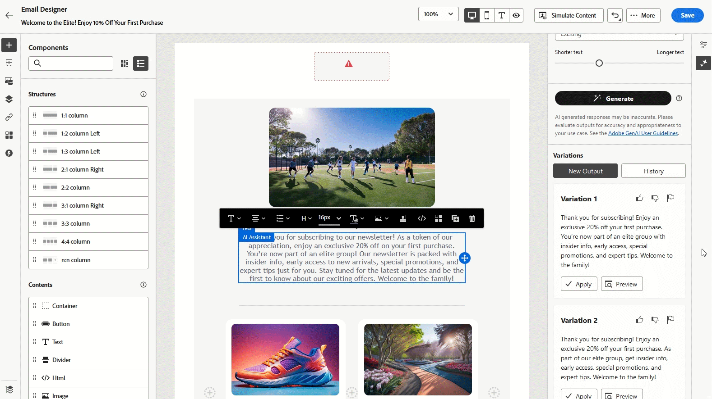

# AI 助理使用案例 {#generative-uc}

>[!NOTE]
>
>開始使用此功能之前，請先閱讀相關的[護欄與限制](gs-generative.md#generative-guardrails)。

## 使用現有內容

1. 設定行銷活動後，選取&#x200B;**[!UICONTROL 編輯內容]**。

1. 開啟&#x200B;**[!UICONTROL AI助理]**&#x200B;區段。

1. 開啟AI助理中的&#x200B;**[!UICONTROL 使用原始內容]**&#x200B;功能，根據您的行銷活動詳細資料（包括行銷活動名稱和目標對象）量身打造新內容。

1. 在&#x200B;**[!UICONTROL 提示]**&#x200B;方塊中指定您的要求來調整內容，並視需要自訂設定。

1. 當您對提示感到滿意時，請按一下[產生]。****

1. 探索可用的&#x200B;**[!UICONTROL 變數]**&#x200B;並按一下&#x200B;**[!UICONTROL 預覽]**&#x200B;以全熒幕檢視選取的變數。

當您定義內容、對象和排程時，就能準備好準備電子郵件行銷活動。 [了解更多](../campaigns/review-activate-campaign.md)

## 調整變數

1. 設定並設定行銷活動後，請按一下&#x200B;**[!UICONTROL 編輯內容]**。

1. 開啟&#x200B;**[!UICONTROL AI助理]**&#x200B;功能表。

1. 在&#x200B;**[!UICONTROL 提示]**&#x200B;方塊中輸入您想要的請求，並視需要修改設定，以調整內容。

1. 準備就緒後，按一下[產生]。****

1. 檢閱產生的&#x200B;**[!UICONTROL 變數]**&#x200B;並選取&#x200B;**[!UICONTROL 預覽]**&#x200B;以檢視所選選項的全熒幕檢視。

1. 在&#x200B;**[!UICONTROL 預覽]**&#x200B;視窗中，移至&#x200B;**[!UICONTROL 調整]**&#x200B;選項以進行進一步自訂，包括：

   * **[!UICONTROL 使用作為參考內容]**：選取的變數將作為參考，以產生更多內容。

   * **[!UICONTROL 精心設計]**：讓AI助理在特定點上擴展，提供更深入和細節的資訊，以提升參與度。

   * **[!UICONTROL 摘要]**：如需冗長的資訊，請使用AI助理建立簡短的摘要，讓電子郵件收件者更容易理解。

   * **[!UICONTROL 重述]**： AI助理可以不同的方式呈現您的訊息，協助讓各種對象保持內容新鮮。

   * **[!UICONTROL 使用較簡單的語言]**：使用AI Assistant簡化語言，以確保訊息清晰且所有讀者都能存取。

   此外，您可以調整內容的&#x200B;**[!UICONTROL 音調]**&#x200B;和&#x200B;**[!UICONTROL 通訊策略]**。

1. 找到正確的內容後，按一下&#x200B;**[!UICONTROL 選取]**。

## 產生類似影像

1. 設定行銷活動後，選取&#x200B;**[!UICONTROL 編輯內容]**。

1. 開啟&#x200B;**[!UICONTROL AI助理]**&#x200B;區段。

1. 在&#x200B;**[!UICONTROL 提示]**&#x200B;方塊中指定您的要求來調整內容，並視需要自訂設定。

1. 當您對提示感到滿意時，請按一下[產生]。****

1. 瀏覽&#x200B;**[!UICONTROL 變數建議]**&#x200B;以尋找所需的資產。

   按一下&#x200B;**[!UICONTROL 預覽]**&#x200B;以檢視所選變數的全熒幕版本。

1. 選擇&#x200B;**[!UICONTROL 產生類似專案]**，探索與目前選項非常相似的影像變化，提供具有類似主題的替代設計。

1. 找到適當的內容後，按一下&#x200B;**[!UICONTROL 選取]**。

## 上傳樣式參考

1. 設定並設定電子郵件行銷活動後，按一下&#x200B;**[!UICONTROL 編輯內容]**。

1. 選擇您要使用AI助理修改的資產。

1. 從右窗格功能表中選擇&#x200B;**[!UICONTROL AI小幫手]**。

1. 開啟&#x200B;**[!UICONTROL 參考樣式]**&#x200B;選項，讓AI助理可以使用參考資料產生新內容。

1. 按一下&#x200B;**[!UICONTROL 上傳影像]**&#x200B;以包含將內容新增至變數的影像。

1. 指定要在&#x200B;**[!UICONTROL 提示]**&#x200B;方塊中產生的內容，並視需要調整設定，以精簡內容。

1. 當您對提示感到滿意時，請按一下[產生]。****

1. 檢閱&#x200B;**[!UICONTROL 變數建議]**，以找出您偏好的資產。

1. 選取&#x200B;**[!UICONTROL 預覽]**&#x200B;以全熒幕檢視選取的變數。

1. 找到適合的內容後，按一下&#x200B;**[!UICONTROL 選取]**。

## 產生支援語言的內容 {#languageS}

1. 設定並設定行銷活動後，請按一下&#x200B;**[!UICONTROL 編輯內容]**。

1. 開啟&#x200B;**[!UICONTROL AI助理]**&#x200B;功能表。

1. 在法文、西班牙文、德文、義大利文、日文、瑞典文、荷蘭文或挪威文的&#x200B;**[!UICONTROL 提示]**&#x200B;方塊中輸入您想要的請求，以調整內容。

1. 使用&#x200B;**[!UICONTROL 文字設定]**&#x200B;選項量身打造您的提示，並為您產生的內容選取所需的&#x200B;**[!UICONTROL 語言]**。

1. 視需要進一步個人化您的提示，然後按一下[產生]。****

1. 以您選取的語言檢閱&#x200B;**[!UICONTROL 變數建議]**。

1. 找到適合的內容後，按一下&#x200B;**[!UICONTROL 選取]**。

