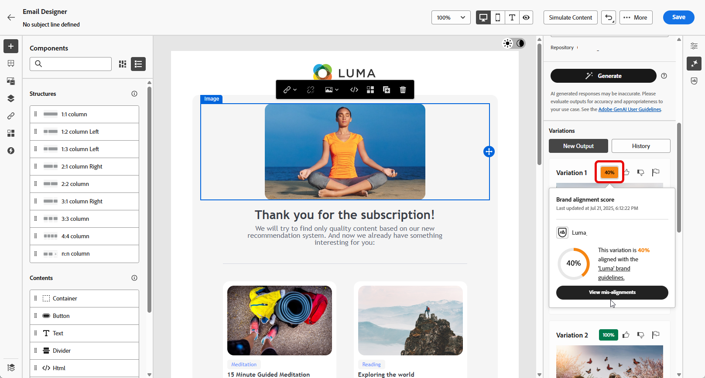

# 使用AI助理產生網頁 {#generative-web}

>[!BEGINSHADEBOX]

**目錄**

* [開始使用 AI 助理](gs-generative.md)
* [使用 AI 助理產生電子郵件](generative-email.md)
* [使用 AI 助理產生簡訊](generative-SMS.md)
* [使用AI助理產生推播](generative-push.md)
* **[使用AI助理產生網頁](generative-web.md)**
* [使用AI助理進行內容實驗](generative-experimentation.md)

>[!ENDSHADEBOX]

在您建立並個人化電子郵件後，請使用Adobe Journey Optimizer中由創作AI提供支援的AI助理，將您的內容提升到新的境界。

AI Assistant可以建議更可能引起觀眾共鳴的不同內容，協助您最佳化傳送的影響。

>[!NOTE]
>
>在開始使用此功能之前，請先閱讀相關的 [護欄和限制](generative-gs.md#guardrails-and-limitations).

>[!BEGINTABS]

>[!TAB 網頁完整產生]

在以下範例中，我們將利用AI助理來調整現有電子郵件，針對特殊事件自訂它。

1. 建立及設定電子郵件傳遞後，請按一下 **[!UICONTROL 編輯內容]**.

   有關如何設定電子郵件傳送的詳細資訊，請參閱 [此頁面](../email/create-email-content.md).

1. 視需要個人化您的電子郵件，並存取 **[!UICONTROL AI助理]** 功能表。

   {zoomable=&quot;yes&quot;}

1. 啟用 **[!UICONTROL 使用原始內容]** AI助理的選項，用來根據您的傳遞、傳遞名稱和選取的對象來個人化新內容。

   您的提示必須一律繫結至特定內容。

1. 描述您要在中產生的內容，以微調內容。 **[!UICONTROL 提示]** 欄位。

   如果您在製作提示時尋求協助，請存取 **[!UICONTROL 提示程式庫]** 其中會提供各式各樣的提示概念，以改善您的傳送作業。

   {zoomable=&quot;yes&quot;}

1. 您可以切換 **[!UICONTROL 主旨列]** 或 **[!UICONTROL 預覽文字]** 以將它們包含在變體生成中。

1. 按一下 **[!UICONTROL 上傳品牌資產]** 若要新增任何品牌資產，其內容可為AI助理提供額外內容，或選取先前上傳的內容。

   {zoomable=&quot;yes&quot;}

1. 使用不同的選項量身打造您的提示：

   * **[!UICONTROL 溝通策略]**：為您的產生文字選擇最合適的通訊樣式。
   * **[!UICONTROL 語言]**：選取您要產生內容的語言。
   * **[!UICONTROL 色調]**：您電子郵件的語調應該會引起您的聽眾的共鳴。 無論您是要提供豐富資訊、好玩或有說服力， AI Assistant都能據以調整訊息。
   * **[!UICONTROL 長度]**：使用範圍滑桿選擇內容的所需長度。

   {zoomable=&quot;yes&quot;}

1. 提示就緒後，按一下 **[!UICONTROL 產生]**.

1. 瀏覽產生的專案 **[!UICONTROL 變數]** 並按一下 **[!UICONTROL 預覽]** 以檢視所選變數的全熒幕版本。

1. 導覽至 **[!UICONTROL 細化]** 中的選項 **[!UICONTROL 預覽]** 視窗以存取其他自訂功能：

   * **[!UICONTROL 重新片語]**： AI Assistant可以不同方式重新表述您的訊息，讓您的新撰寫保持新穎，並吸引不同受眾。

   * **[!UICONTROL 使用簡單語言]**：運用AI Assistant簡化您的語言，確保更廣大的受眾擁有清晰度和可存取性。

   {zoomable=&quot;yes&quot;}

1. 按一下 **[!UICONTROL 選取]** 找到適當的內容之後。

1. 插入個人化欄位，以根據設定檔資料自訂您的電子郵件內容。 然後，按一下 **[!UICONTROL 模擬內容]** 按鈕來控制呈現，並使用測試設定檔檢查個人化設定。 [了解更多](../preview-test/preview-content.md)

   {zoomable=&quot;yes&quot;}

當您定義內容、對象和排程時，就能準備電子郵件傳送。 [了解更多](../monitor/prepare-send.md)

>[!TAB 網頁文字產生]

在下列範例中，我們將利用AI助理增強即將舉辦之活動的電子郵件邀請內容。

1. 建立及設定電子郵件傳遞後，請按一下 **[!UICONTROL 編輯內容]**.

   有關如何設定電子郵件傳送的詳細資訊，請參閱 [此頁面](../email/create-email-content.md).

1. 選取 **[!UICONTROL 文字元件]** 以僅鎖定特定內容。 並存取 **[!UICONTROL AI助理]** 功能表。

   {zoomable=&quot;yes&quot;}

1. 啟用 **[!UICONTROL 使用原始內容]** AI助理的選項，用來根據您的傳遞、傳遞名稱和選取的對象來個人化新內容。

   您的提示必須一律繫結至特定內容。

1. 描述您要在中產生的內容，以微調內容。 **[!UICONTROL 提示]** 欄位。

   如果您在製作提示時尋求協助，請存取 **[!UICONTROL 提示程式庫]** 其中會提供各式各樣的提示概念，以改善您的傳送作業。

   {zoomable=&quot;yes&quot;}

1. 按一下 **[!UICONTROL 上傳品牌資產]** 新增任何品牌資產，其中包含可為AI助理提供額外內容的內容。

   {zoomable=&quot;yes&quot;}

1. 使用不同的選項量身打造您的提示：

   * **[!UICONTROL 溝通策略]**：針對產生的文字選取所需的通訊方式。
   * **[!UICONTROL 語言]**：選擇變體內容的語言。
   * **[!UICONTROL 色調]**：確保文字適合您的對象和用途。
   * **[!UICONTROL 長度]**：使用範圍滑桿選取內容的長度。

   {zoomable=&quot;yes&quot;}

1. 提示就緒後，按一下 **[!UICONTROL 產生]**.

1. 瀏覽產生的專案 **[!UICONTROL 變數]** 並按一下 **[!UICONTROL 預覽]** 以檢視所選變數的全熒幕版本。

1. 導覽至 **[!UICONTROL 細化]** 中的選項 **[!UICONTROL 預覽]** 視窗以存取其他自訂功能：

   * **用作參考內容**：選擇的變體將作為參考內容，用於產生其他結果。

   * **精緻**： AI助理可以協助您展開特定主題，提供其他詳細資訊，以便更清楚瞭解並更能參與。

   * **摘要**：冗長的資訊可能會讓電子郵件收件者過載。 使用AI Assistant將要點濃縮為清晰、簡潔的摘要，以吸引注意並鼓勵他們進一步閱讀。

   * **重新片語**：AI Assistant可以不同方式重新表述您的訊息，讓您寫作保持新鮮，並吸引不同受眾。

   * **使用簡單語言**：運用AI Assistant簡化您的語言，確保更廣大的受眾擁有清晰度和可存取性。

   {zoomable=&quot;yes&quot;}

1. 按一下 **[!UICONTROL 選取]** 找到適當的內容之後。

1. 插入個人化欄位，以根據設定檔資料自訂您的電子郵件內容。 然後，按一下 **[!UICONTROL 模擬內容]** 按鈕來控制呈現，並使用測試設定檔檢查個人化設定。 [了解更多](../preview-test/preview-content.md)

   {zoomable=&quot;yes&quot;}

當您定義內容、對象和排程時，就能準備電子郵件傳送。 [了解更多](../monitor/prepare-send.md)

>[!TAB 網頁影像產生]

在以下範例中，瞭解如何運用AI Assistant來最佳化和改善您的資產，確保更方便使用者的體驗。

1. 建立及設定電子郵件傳遞後，請按一下 **[!UICONTROL 編輯內容]**.

   有關如何設定電子郵件傳送的詳細資訊，請參閱 [此頁面](../email/create-email-content.md).

1. 填入 **[!UICONTROL 基本詳細資訊]** 您的傳遞內容。 完成後，按一下 **[!UICONTROL 編輯電子郵件內容]**.

1. 選取您要使用AI助理變更的資產。

1. 從右側功能表中選取 **[!UICONTROL AI助理]**.

   {zoomable=&quot;yes&quot;}

1. 描述您要在中產生的內容，以微調內容。 **[!UICONTROL 提示]** 欄位。

   如果您在製作提示時尋求協助，請存取 **[!UICONTROL 提示程式庫]** 其中會提供各式各樣的提示概念，以改善您的傳送作業。

   {zoomable=&quot;yes&quot;}

1. 按一下 **[!UICONTROL 上傳品牌資產]** 新增任何品牌資產，其中包含可為AI助理提供額外內容的內容。

   您的提示必須一律繫結至特定內容。

1. 使用不同的選項量身打造您的提示：

   * **[!UICONTROL 外觀比例]**：這會決定資產的寬度和高度。 您可以選擇一般比例，例如16:9、4:3、3:2或1:1，或者輸入自訂大小。
   * **[!UICONTROL 色彩和色調]**：影像中顏色的整體外觀及其傳達的氣氛或氣氛。
   * **[!UICONTROL 內容型別]**：這會分類視覺化元素的性質，區分像片、圖形或藝術等不同形式的視覺呈現。
   * **[!UICONTROL 照明]**：這指的是影像中的閃電，它會塑造大氣層，並反白標示特定元素。
   * **[!UICONTROL 組合]**：這指的是影像框架中元素的排列

   {zoomable=&quot;yes&quot;}

1. 在您滿意提示設定後，請按一下 **[!UICONTROL 產生]**.

1. 瀏覽 **[!UICONTROL 變數建議]** 以尋找所需的資產。

   按一下 **[!UICONTROL 預覽]** 以檢視所選變數的全熒幕版本。

   {zoomable=&quot;yes&quot;}

1. 選擇 **[!UICONTROL 顯示類似專案]** 如果您想要檢視與此變體相關的影像。

1. 按一下 **[!UICONTROL 選取]** 找到適當的內容之後。

   {zoomable=&quot;yes&quot;}

1. 定義訊息內容後，按一下 **[!UICONTROL 模擬內容]** 按鈕來控制呈現，並使用測試設定檔檢查個人化設定。  [了解更多](../preview-test/preview-content.md)

   {zoomable=&quot;yes&quot;}

1. 當您定義內容、對象和排程時，就能準備電子郵件傳送。 [了解更多](../monitor/prepare-send.md)

>[!ENDTABS]

