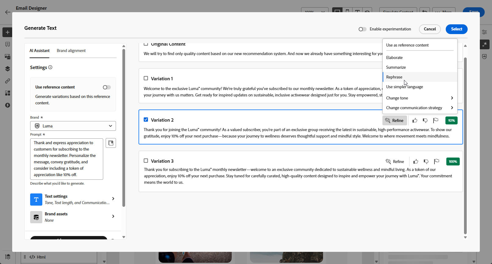

# 使用AI助理產生網頁 {#generative-web}

>[!BEGINSHADEBOX]

**目錄**

* [開始使用 AI 助理](gs-generative.md)
* [使用 AI 助理產生電子郵件](generative-email.md)
* [使用 AI 助理產生簡訊](generative-SMS.md)
* [使用 AI 助理推播產生](generative-push.md)
* 使用AI助理產生網頁
* [使用 AI 助理進行內容實驗](generative-experimentation.md)

>[!ENDSHADEBOX]

在您建立並個人化電子郵件後，請使用Adobe Journey Optimizer中由創作AI提供支援的AI助理，將您的內容提升到新的境界。

AI Assistant可以建議更可能引起觀眾共鳴的不同內容，協助您最佳化傳送的影響。

>[!NOTE]
>
>開始使用此功能之前，請先閱讀相關的[護欄和限制](generative-gs.md#guardrails-and-limitations)。

>[!BEGINTABS]

>[!TAB 網頁完整產生]

在以下範例中，我們將利用AI助理來調整現有電子郵件，針對特殊事件自訂它。

1. 建立並設定您的電子郵件傳遞後，請按一下[編輯內容]。****

   有關如何設定電子郵件傳遞的詳細資訊，請參閱[此頁面](../email/create-email-content.md)。

1. 視需要個人化您的電子郵件，並存取&#x200B;**[!UICONTROL AI助理]**&#x200B;功能表。

   {zoomable="yes"}

1. 啟用AI助理的&#x200B;**[!UICONTROL 使用原始內容]**&#x200B;選項，以根據您的傳遞、傳遞名稱和選取的對象來個人化新內容。

   您的提示必須一律繫結至特定內容。

1. 說明您要在&#x200B;**[!UICONTROL 提示]**&#x200B;欄位中產生的內容，以微調內容。

   如果您正在尋求製作提示的協助，請存取&#x200B;**[!UICONTROL 提示程式庫]**，它提供各種提示概念，以改進傳送內容。

   {zoomable="yes"}

1. 您可以切換&#x200B;**[!UICONTROL 主旨列]**&#x200B;或&#x200B;**[!UICONTROL Preheader]**&#x200B;以將其包含在變體產生中。

1. 按一下&#x200B;**[!UICONTROL 上傳品牌資產]**，新增任何包含可為AI助理提供額外內容或選取先前上傳內容的品牌資產。

   {zoomable="yes"}

1. 使用不同的選項量身打造您的提示：

   * **[!UICONTROL 通訊策略]**：選擇最適合您產生文字的通訊樣式。
   * **[!UICONTROL 語言]**：選取您要產生內容的語言。
   * **[!UICONTROL 音調]**：您的電子郵件音調應該會對您的對象產生共鳴。 無論您是要提供豐富資訊、好玩或有說服力， AI Assistant都能據以調整訊息。
   * **[!UICONTROL 長度]**：使用範圍滑桿選擇您想要的內容長度。

   {zoomable="yes"}

1. 提示就緒後，請按一下[產生]。****

1. 瀏覽產生的&#x200B;**[!UICONTROL 變數]**，然後按一下&#x200B;**[!UICONTROL 預覽]**&#x200B;以檢視所選變數的全熒幕版本。

1. 導覽至&#x200B;**[!UICONTROL 預覽]**&#x200B;視窗中的&#x200B;**[!UICONTROL 調整]**&#x200B;選項，以存取其他自訂功能：

   * **[!UICONTROL 重述]**： AI助理可以不同的方式重述您的訊息，讓您的寫作保持新鮮，並吸引不同受眾。

   * **[!UICONTROL 使用簡單語言]**：利用AI助理簡化您的語言，確保更廣大的受眾擁有清晰易懂的語言內容。

   {zoomable="yes"}

1. 找到適當的內容後，按一下&#x200B;**[!UICONTROL 選取]**。

1. 插入個人化欄位，以根據設定檔資料自訂您的電子郵件內容。 然後，按一下&#x200B;**[!UICONTROL 模擬內容]**&#x200B;按鈕以控制呈現，並使用測試設定檔檢查個人化設定。 [了解更多](../preview-test/preview-content.md)

   {zoomable="yes"}

當您定義內容、對象和排程時，就能準備電子郵件傳送。 [了解更多](../monitor/prepare-send.md)

>[!TAB 網頁文字產生]

在下列範例中，我們將利用AI助理增強即將舉辦之活動的電子郵件邀請內容。

1. 建立並設定您的電子郵件傳遞後，請按一下[編輯內容]。****

   有關如何設定電子郵件傳遞的詳細資訊，請參閱[此頁面](../email/create-email-content.md)。

1. 選取&#x200B;**[!UICONTROL 文字元件]**&#x200B;以僅鎖定特定內容。 並存取&#x200B;**[!UICONTROL AI助理]**&#x200B;功能表。

   {zoomable="yes"}

1. 啟用AI助理的&#x200B;**[!UICONTROL 使用原始內容]**&#x200B;選項，以根據您的傳遞、傳遞名稱和選取的對象來個人化新內容。

   您的提示必須一律繫結至特定內容。

1. 說明您要在&#x200B;**[!UICONTROL 提示]**&#x200B;欄位中產生的內容，以微調內容。

   如果您正在尋求製作提示的協助，請存取&#x200B;**[!UICONTROL 提示程式庫]**，它提供各種提示概念，以改進傳送內容。

   {zoomable="yes"}

1. 按一下&#x200B;**[!UICONTROL 上傳品牌資產]**，新增任何包含可為AI助理提供額外內容的品牌資產。

   {zoomable="yes"}

1. 使用不同的選項量身打造您的提示：

   * **[!UICONTROL 通訊策略]**：針對產生的文字選取所要的通訊方式。
   * **[!UICONTROL 語言]**：選擇變體內容的語言。
   * **[!UICONTROL 音調]**：確定文字適合您的對象和目的。
   * **[!UICONTROL 長度]**：使用範圍滑桿選取內容的長度。

   {zoomable="yes"}

1. 提示就緒後，請按一下[產生]。****

1. 瀏覽產生的&#x200B;**[!UICONTROL 變數]**，然後按一下&#x200B;**[!UICONTROL 預覽]**&#x200B;以檢視所選變數的全熒幕版本。

1. 導覽至&#x200B;**[!UICONTROL 預覽]**&#x200B;視窗中的&#x200B;**[!UICONTROL 調整]**&#x200B;選項，以存取其他自訂功能：

   * **使用作為參考內容**：選擇的變體將作為參考內容以產生其他結果。

   * **精心設計**： AI助理可以協助您展開特定主題，提供其他詳細資訊，以增進瞭解與參與。

   * **摘要**：冗長的資訊可能會使電子郵件收件者超載。 使用AI Assistant將要點濃縮為清晰、簡潔的摘要，以吸引注意並鼓勵他們進一步閱讀。

   * **重述**：AI Assistant可以不同的方式重述您的訊息，讓您的寫作保持新鮮，並吸引不同受眾。

   * **使用簡單語言**：利用AI助理簡化您的語言，確保更廣大的受眾擁有清晰易懂的語言內容。

   {zoomable="yes"}

1. 找到適當的內容後，按一下&#x200B;**[!UICONTROL 選取]**。

1. 插入個人化欄位，以根據設定檔資料自訂您的電子郵件內容。 然後，按一下&#x200B;**[!UICONTROL 模擬內容]**&#x200B;按鈕以控制呈現，並使用測試設定檔檢查個人化設定。 [了解更多](../preview-test/preview-content.md)

   {zoomable="yes"}

當您定義內容、對象和排程時，就能準備電子郵件傳送。 [了解更多](../monitor/prepare-send.md)

>[!TAB 網頁影像產生]

在以下範例中，瞭解如何運用AI Assistant來最佳化和改善您的資產，確保更方便使用者的體驗。

1. 建立並設定您的電子郵件傳遞後，請按一下[編輯內容]。****

   有關如何設定電子郵件傳遞的詳細資訊，請參閱[此頁面](../email/create-email-content.md)。

1. 填寫傳遞的&#x200B;**[!UICONTROL 基本詳細資料]**。 完成後，按一下&#x200B;**[!UICONTROL 編輯電子郵件內容]**。

1. 選取您要使用AI助理變更的資產。

1. 從右側功能表選取&#x200B;**[!UICONTROL AI小幫手]**。

   {zoomable="yes"}

1. 說明您要在&#x200B;**[!UICONTROL 提示]**&#x200B;欄位中產生的內容，以微調內容。

   如果您正在尋求製作提示的協助，請存取&#x200B;**[!UICONTROL 提示程式庫]**，它提供各種提示概念，以改進傳送內容。

   {zoomable="yes"}

1. 按一下&#x200B;**[!UICONTROL 上傳品牌資產]**，新增任何包含可為AI助理提供額外內容的品牌資產。

   您的提示必須一律繫結至特定內容。

1. 使用不同的選項量身打造您的提示：

   * **[!UICONTROL 外觀比例]**：這會決定資產的寬度和高度。 您可以選擇一般比例，例如16:9、4:3、3:2或1:1，或者輸入自訂大小。
   * **[!UICONTROL 色彩和色調]**：影像中顏色的整體外觀及其傳達的氣氛或氣氛。
   * **[!UICONTROL 內容型別]**：這會分類視覺元素的性質，區分不同的視覺呈現形式，例如像片、圖形或藝術品。
   * **[!UICONTROL 照明]**：這指的是影像中的閃電，它會塑造大氣層，並反白標示特定的元素。
   * **[!UICONTROL 構成]**：這指的是影像框架中元素的排列

   {zoomable="yes"}

1. 在您滿意提示組態之後，請按一下[產生]。****

1. 瀏覽&#x200B;**[!UICONTROL 變數建議]**&#x200B;以尋找所需的資產。

   按一下&#x200B;**[!UICONTROL 預覽]**&#x200B;以檢視所選變數的全熒幕版本。

   {zoomable="yes"}

1. 如果要檢視此變體的相關影像，請選擇&#x200B;**[!UICONTROL 顯示類似專案]**。

1. 找到適當的內容後，按一下&#x200B;**[!UICONTROL 選取]**。

   {zoomable="yes"}

1. 定義訊息內容後，按一下&#x200B;**[!UICONTROL 模擬內容]**&#x200B;按鈕以控制呈現，並使用測試設定檔檢查個人化設定。  [了解更多](../preview-test/preview-content.md)

   {zoomable="yes"}

1. 當您定義內容、對象和排程時，就能準備電子郵件傳送。 [了解更多](../monitor/prepare-send.md)

>[!ENDTABS]

