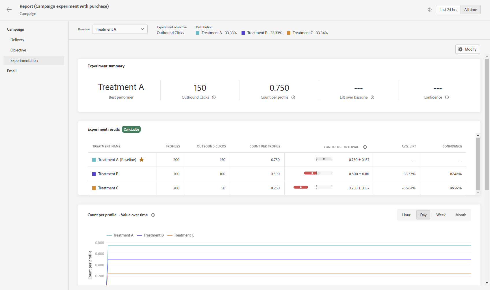

# 開始使用內容實驗 {#get-started-experiment}

## 什麼是內容實驗？

內容實驗可讓您最佳化行銷活動中的動作內容。

實驗是在線上測試的情境下進行的一組隨機試驗，意即某些隨機選取的使用者會接觸到訊息的指定變化，而另一組隨機選取的使用者則會接觸到其他處理方式。 傳送訊息後，您就可以測量您感興趣的結果量度，例如電子郵件開啟數或點擊數。

➡️[本章節](../experience-decisioning/experience-decisioning-uc.md)呈現了一個端到端使用案例，說明如何使用內容實驗來比較決策與程式碼型體驗管道。

## 為什麼要進行實驗？

實驗可讓您分離實現量度改善的變更。 如上圖所示：某些隨機選取的使用者會接觸到每個處理方式群組，意即平均而言群組會有相同的特性。 因此，結果中的任何差異都可以解釋為由於所接受處理方式的差異，即，您能夠在所做的變更和您感興趣的結果之間建立因果關係。

這可讓您在最佳化業務目標時，做出以資料為導向的決策。

針對 Adobe Journey Optimizer 中的內容實驗，您可以測試以下想法：

* **主旨列**：語調或主旨列個人化程度的變更會有何影響？
* **訊息內容**：變更電子郵件的視覺版面是否會造成電子郵件的點擊數增加？

## 內容實驗如何運作？ {#content-experiment-work}

### 隨機指派

Adobe Journey Optimizer 中的內容實驗使用訪客身分識別的偽隨機雜湊，對目標客群中的使用者執行您所定義的其中一種處理方式的隨機指派。雜湊機制可確保在訪客多次進入行銷活動的情況下，他們會決定性地接受相同的處理方式。

詳細而言，MumurHash3 32 位元演算法可用來將使用者身分識別字串雜湊至 10,000 個貯體中的一個。 在將 50% 的流量指派給每個處理方式的內容實驗中，落在貯體 1-5,000 中的使用者會接受第一個處理方式，而貯體 5,001-10,000 中的使用者會接受第二個處理方式。由於使用偽隨機雜湊，因此您觀察到的訪客分割可能不會完全是 50-50；不過，該區分在統計上將等同於您的目標分割百分比。

請注意，在透過內容實驗設定每個行銷活動時，您必須選擇身分識別命名空間，從中為隨機演算法選取 userId。 這與[執行地址](../configuration/primary-email-addresses.md)獨立開來。

### 資料彙集與分析

在指派時，即：當訊息用對外管道傳送，或當使用者在對外管道進入行銷活動時，會將「指派記錄」記錄到適當的系統資料集。 這會記錄指派給使用者的處理方式，以及實驗和行銷活動識別碼。

目標量度可分為兩個主要類別：

* 直接量度，使用者會直接回應處理方式，例如：開啟電子郵件或按一下連結。
* 間接或「漏斗底部」量度，這會在使用者接觸到處理後發生。

對於 Adobe Journey Optimizer 追蹤訊息的直接目標量度，一般使用者的回應事件會自動以行銷活動和處理識別碼加上標籤，使回應量度和處理能直接關聯。 [進一步瞭解追蹤](../email/message-tracking.md)。

對於間接或「漏斗底部」目標 (如購買)，最終使用者的反應事件沒有用行銷活動和處理識別碼標記，即，在接觸處理方式之後發生的購買事件，該購買與先前的處理方式指派沒有直接關聯。 對於這些量度，如果發生下列情況，Adobe 會建立與處理和漏斗轉換事件底部的關聯：

* 指派和轉換事件時間的使用者身分識別相同。
* 轉換會在處理方式指派後的七天內進行。

Adobe Journey Optimizer 接著會使用進階的「隨時有效」統計方法來解譯這些原始報告資料，讓您詮釋您的實驗報表。 如需詳細資訊，請參閱[此頁面](../content-management/experiment-calculations.md)。

## 執行實驗的秘訣

執行實驗時，請務必遵循特定最佳實務。 以下是執行這些實驗的秘訣：

+++隔離您嘗試測試的變數

構想您要測試的假設，並將此假設限制為盡可能少的變更，以判斷對傳遞造成影響的因素。

例如，不妨假設電子郵件主旨列中的個人化是否會促進較佳的開啟率。 不過，在訊息內容或影像中新增變更，可能會導致結論混淆。
+++

+++確定您使用正確的量度

確定您的目標量度，以及您所做的變更是否會對此量度產生某些直接影響。

例如，變更訊息內文的內容不太可能影響電子郵件開啟率。
+++

+++在適當的對象人數上執行測試，或夠長的時間

如果您執行測試的時間更長，將能夠偵測不同處理方式之間目標量度的較小差異。不過，如果目標量度的基線值較小，則需要較大的樣本量。
實驗必須包含的使用者數量取決於您要偵測的效果大小、目標量度的變數或分佈，以及您對誤報的容忍度。在傳統實驗中，您可以使用[樣本大小電腦](https://experienceleague.adobe.com/tools/calculator/testcalculator.html?lang=zh-Hant){_blank}來決定測試必須執行多久。
+++ 

+++瞭解統計上的不確定性

如果您正在執行的實驗有 1000 位使用者看到了一種處理方式，並且轉換率設為 5%。如果您的所有使用者都包含在內，這是否為實際轉換率？ 真正的轉換率是多少？
統計方法為我們提供了一種將不確定性正規化的方法。 執行線上實驗時需要了解的最重要概念之一，就是觀察到的轉換率與一系列潛在的真正轉換率一致，這表示您必須等到這些估計值足夠精確才能嘗試得出結論。信賴區間及信賴度有助於量化這種不確定性。
+++

+++建立新的假設，並持續測試

若要獲得真正的商業見解，您應該堅持只進行一項實驗。相反的，後續追蹤實驗的方式是，透過提出新的假設，針對不同客群執行不同變化的新測試，以及透過檢查對不同量度的影響。
+++

## 解譯您的實驗結果 {#interpret-results}

>[!CONTEXTUALHELP]
>id="ajo_campaigns_content_experiment_summary"
>title="摘要小工具"
>abstract="摘要小工具提供實驗結果的概觀，包括實驗有無結論。它提供一個快捷又容易的方式理解您的實驗結果。"

本節說明實驗報告，以及如何了解呈現的各種統計量。

以下是解譯內容實驗結果的一些指南。

請注意，對結果的完整描述應考慮所有可用的證據 (即樣本量、轉換率、信賴區間等)，而不僅僅是宣告是否具有結論性。+即使結果尚未確定，仍有令人信服的證據表明一種處理與另一種處理不同。

若要了解統計計算，請參閱此[頁面](../content-management/experiment-calculations.md)。

### &#x200B;1. 比較標準化量度 {#normalized-metrics}

當比較兩種處理方式的效果時，應始終比較標準化量度，以說明每個處理方式所公開的輪廓數量的所有差異。

例如，如果實驗目標設為&#x200B;**[!UICONTROL 唯一的開啟次數]**，且指定的處理方式顯示給 10,000 個輪廓，並已記錄 200 個唯一的開啟次數，則代表&#x200B;**[!UICONTROL 轉換率]** 為 2%。對於非唯一的量度 (例如開啟次數量度)，標準化量度會顯示為 **[!UICONTROL Count per Profile]**，而對於像價格總計的連續量度，標準化量度會顯示為 **[!UICONTROL Total per Profile]**。 

### &#x200B;2. 著重於信賴區間 {#confidence-intervals}

當您對輪廓樣本進行實驗時，針對指定處理方式觀察到的轉換率，表示對真實潛在轉換率的估計。

例如，如果處理方式 A 的&#x200B;**[!UICONTROL 轉換率]**&#x200B;為 3%，處理方式 B 觀察到的&#x200B;**[!UICONTROL 轉換率]**&#x200B;為 2%，那麼處理方式 A 是否比處理方式 B 更好？若要回答這個問題，我們首先必須量化這些觀察到的轉換率的不確定性。

信賴區間有助於量化估計轉換率的不確定性量，但較大的信賴區間則代表更多的不確定性。隨著更多輪廓加入實驗，間隔將變得更小，表示更精確的估計。信賴區間代表與觀察資料相容的轉換率範圍。

如果兩種處理方式的信賴區間幾乎沒有重疊，這表示兩種處理方式具有不同的轉換率。但是，如果兩個處理方式的信賴區間之間有許多重疊，則兩種處理方式更有可能具有相同的轉換率。

Adobe 使用 95% 的「任何時間有效信賴區間」或「信賴序列」，這表示在實驗期間可隨時安全地檢視結果。

### &#x200B;3. 了解提升度 {#understand-lift}

實驗報告摘要顯示&#x200B;**[!UICONTROL 提升度超過基線]**，這是衡量了指定處理方式的轉換率相對於基線的增進百分比。準確地定義，它是指定處理方式與基線之間的效能差異除以基線的效能 (以百分比表示)。

### &#x200B;3. 了解信賴度 {#understand-confidence}

雖然您應主要專注每種處理效能的&#x200B;**[!UICONTROL 信賴區間]**，但 Adobe 也會顯示信賴度，這是一種概率性測量，用於衡量有多少證據表明特定的處理方式與基線處理相同。信賴度越高表示基線與非基線處理方式具有相同效能假設的證據越少。更準確地說，如果實際上真實的潛在轉換率沒有差異，顯示的信賴度是我們觀察到指定處理方式和基線之間轉換率差異較小的機率 (以百分比表示)。 就 p 值而言，顯示的信賴度為 1 - p 值。

Adobe 使用與上述信賴序列一致的「任何時間有效」信賴度與「任何時間有效」p 值。

### &#x200B;4. 統計顯著性

當執行實驗時，如果假設給定的處理方式和基線具有相同的真實潛在轉換率/效能觀察到結果的可能性極低，則該結果會被視為具有統計顯著性。

當信賴度高於 95% 時，Adobe 會宣告實驗結論。

## 執行實驗後該做什麼

執行實驗後，有幾種可能的後續動作：

* **部署成功的想法**

  有了明確的結果，您就可以部署這個成功的想法，方法是將效果最好的處理方法推廣給所有客戶，或者建立新的行銷活動來複製效果最好的處理方法的結構。
   請注意，在動態環境中，某次效果很好的項目之後效果不一定一樣好。

* **執行後續測試**

  有時，您的實驗結果可能沒有定論，這可能是因為沒有足夠的輪廓來檢測處理方式中的任何差異，或者是因為您定義的處理方式差異不夠大。

  如果您正在測試的假設仍然相關，請對較大或不同的客群執行後續測試，或修改您的處理方式，以便有更明顯的差異可能是最佳的後續動作。

* **進行更深入的深入分析**

  對某個客群有效的處理方式有時對另一個客群來說不一定是最好的處理方式。對不同客群的處理方式進行更深入的分析，有助於產生新測試的構想。

  同樣，研究具有不同量度的每種處理方式的效果也可以更全面了解您的實驗。

  >[!CAUTION]
  >
  >更多分析代表偵測到虛假效應或誤報的機率更高。

## 其他資源

* **[建立內容實驗](content-experiment.md)** — 瞭解如何設計和設定A/B測試以最佳化您的訊息效能。
* **[實驗計算](experiment-calculations.md)** — 瞭解實驗分析中使用的統計方法和量度。
* **[多臂吃角子老虎機與A/B測試](mab-vs-ab.md)** — 比較不同的實驗方法以及何時使用每種方法。
* **[實驗加速器](experiment-accelerator-gs.md)** — 探索如何加速由AI支援的最佳化實驗。
* **[實驗報告計算](experiment-report-calculations.md)** — 瞭解如何解釋實驗結果和統計顯著性。
* **[實驗教學課程](https://experienceleague.adobe.com/zh-hant/docs/journey-optimizer-learn/tutorials/content-management/experimentation-overview){target="_blank"}** — 探索有關內容實驗與最佳實務的逐步教學課程影片。
