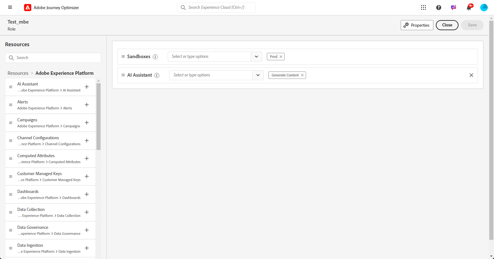

# 開始使用 AI 助理 {#gs-content-assistant}

>[!CONTEXTUALHELP]
>id="ajo_ai_generation_settings"
>title="Journey Optimizer 的 AI 助理"
>abstract="精心打造並個人化您要傳遞的內容之後，便可以使用 Journey Optimizer 的 AI 助理來加強內容。此功能可讓您透過描述想要產生的內容來微調內容，進而簡化個人化和內容改善的過程。"

>[!CONTEXTUALHELP]
>id="ajo_ai_generation_context"
>title="上傳品牌資產"
>abstract="您可以使用「上傳品牌資產」選單新增任何品牌資產而且其中包含可為 Journey Optimizer 的 AI 助理提供更多背景資訊的內容，或者選取先前上傳的資產。此選項可確保 AI 助理能夠存取所有必要的資料，以增強其功能與相關性。"

>[!CONTEXTUALHELP]
>id="ajo_ai_generation_start"
>title="Adobe 生成式 AI 條款"
>abstract="要存取此功能，您必須同意 Adobe Experience Cloud 生成式 AI 使用者準則。請檢查此功能之任何輸出的準確性，並確保它適合您的使用案例。"
>additional-url="https://www.adobe.com/tw/legal/licenses-terms/adobe-dx-gen-ai-user-guidelines.html" text="Adobe 生成式 AI 使用者準則"

>[!INFO]
>
>透過[即時功能預覽](https://experienceleague.adobe.com/zh-hant/apps/journey-optimizer/ai-assistant-content-accelerator){target="_blank"}，讓您親身體驗實作，直接探索並全面了解各項功能。

在 Adobe Journey Optimizer 中，Azure OpenAI 與 Azure Firefly 所支援的 AI 助理，可為文字和影像提供主動式內容變化版本建議。這項新功能提供&#x200B;**提示型文字與影像產生功能**。透過 Adobe Firefly 管理影像產生功能。

AI 助理支援&#x200B;**使用多種語言**&#x200B;產生內容，讓您能夠觸及並吸引不同的全球客群。AI 助理提供下列語言版本：

<table style="table-layout:fixed; margin-top: 0px; margin-bottom: 0px;">
  <tbody>
    <tr style="border: 0;background-color: #FFFFFF;">
      <td>
        <ul>
          <li>法文</li>
          <li>西班牙文</li>
          <li>德文</li>
          <li>義大利文</li>
        </ul>
      </td>
      <td>
        <ul>
          <li>日文</li>
          <li>瑞典文</li>
          <li>荷蘭文</li>
          <li>挪威文</li>
        </ul>
      </td>
      <td>
      </td>
    </tr>
  </tbody>
</table>

使用 Adobe Journey Optimizer 的 AI 助理，利用不同的主要標題和影像進行實驗，讓訊息的影響達到最佳成效。 產生多個變體並建置實驗加以比較。 運用 **Journey Optimizer 內容實驗**，您可以定義多種訊息處理，以測量對目標客群執行哪種處理的效果最佳。您可以選擇變更傳遞內容或主旨。 訊息客群會隨機分配給每種處理，以就指定的量度而言，判斷哪種處理的效果最佳。 若要了解內容實驗的詳細資訊，請參閱[本章節](../content-management/content-experiment.md)。

>[!IMPORTANT]
>
>* 開始使用此功能之前，請先閱讀相關的[護欄與限制](#generative-guardrails)。
>
>
>* 您必須先同意[使用者合約](https://www.adobe.com/tw/legal/licenses-terms/adobe-dx-gen-ai-user-guidelines.html){target="_blank"}後，才能使用 Adobe Journey Optimizer 的 AI 助理。如需詳細資訊，請聯絡您的 Adobe 代表。

## 存取 AI 助理 {#generative-access}

若要存取 Adobe Journey Optimizer 的 AI 助理，使用者必須擁有&#x200B;**產生內容**&#x200B;的權限。[了解更多](../administration/permissions.md)

+++  了解如何指派內容產生相關權限

1. 在&#x200B;**權限**&#x200B;產品中，前往&#x200B;**角色**&#x200B;標籤，然後選取所需的&#x200B;**角色**。

1. 按一下&#x200B;**編輯**&#x200B;以修改權限。

1. 新增 **AI 助理**&#x200B;資源，然後從下拉式選單中，選取&#x200B;**產生內容**。

   {zoomable="yes"}

1. 按一下&#x200B;**儲存**，以套用所做的變更。

   任何已指派給此角色的使用者都會自動更新其權限。

1. 若要將此角色指派給新使用者，請瀏覽至&#x200B;**角色**&#x200B;儀表板中的&#x200B;**使用者**&#x200B;標籤，然後按一下&#x200B;**新增使用者**。

1. 輸入使用者的名稱、電子郵件地址，或從清單當中選擇，然後按一下&#x200B;**儲存**。

1. 如果之前未建立使用者，請參閱[此文件](https://experienceleague.adobe.com/zh-hant/docs/experience-platform/access-control/abac/permissions-ui/users)。

使用者將會收到一封電子郵件，提供存取執行個體的指示。

+++

## 護欄與限制 {#generative-guardrails}

以下列出使用 Adobe Journey Optimizer 的 AI 助手產生電子郵件的一般準則：

* 產生內容的品質很大程度上受到您定義的行銷目標/提示的影響。使用定義明確的提示讓 GenAI 模型準確解釋。  
* 上傳品牌資產以獲得準確的品牌內容。 另外，內容以公開資訊為依據。上傳的內容可以採用以下格式：PDF、JPEG、PNG 或 ZIP 檔案 (支援的檔案格式)。
* 上傳的品牌資產最大為 50MB。較大的檔案或大量影像可以處理，但處理時間會增加。
* 使用品牌特定範本，或是自訂範本，就能使用 Adobe Journey Optimizer 的 AI 助理，建立電子郵件內容。建議電子郵件範本最多包含 8-10 張影像。
* 選擇變體時，請確保使用向上、向下或標記圖示報告任何有問題的輸出。
* 您對 AI 助理的使用必須遵守 Adobe Experience Cloud Generative AI 使用者指南。 [了解更多](https://www.adobe.com/tw/legal/licenses-terms/adobe-dx-gen-ai-user-guidelines.html)
* Adobe 承諾提升在媒體創作中使用生成式 AI 工具的透明度，Adobe 將在下載或匯出的內容或專案包含 Firefly 產生的資產時，套用 Content Credentials。[了解更多](https://helpx.adobe.com/tw/firefly/using/content-credentials.html)

以下限制適用於 Adobe Journey Optimizer 的 AI 助理：

* 僅適用於電子郵件、推播、網頁及簡訊管道。
* GenAI 內容可能不完全準確：請分享您的回饋，以便我們的工程師可以改進模型。
* 您可以上傳多個品牌資產，但對於特定產生內容只能利用一個。

## AI 助理內容產生功能 {#generative-features}

<table style="table-layout:fixed"><tr style="border: 0;">
<td>

<a href="generative-full-content.md"><strong>產生完整內容</strong></a>

</td>
<td>

<a href="generative-text.md"><strong>產生文字</strong>

</td>
<td>

<a href="generative-image.md"><strong>產生影像</strong></a>

</td>
</tr></table>

## 其他資源

* **[生成式實驗](generative-experimentation.md)** - 了解如何結合 AI 產生的內容與實驗。
* **[AI 助理使用案例](generative-uc.md)** - 透過使用案例了解如何使用 AI 助理
* **[AI 助理教學課程](https://experienceleague.adobe.com/zh-hant/docs/journey-optimizer-learn/tutorials/introduction-to-journey-optimizer/ai-assistant){target="_blank"}** - 探索有關 AI 助理功能和最佳做法的逐步教學課程影片。
