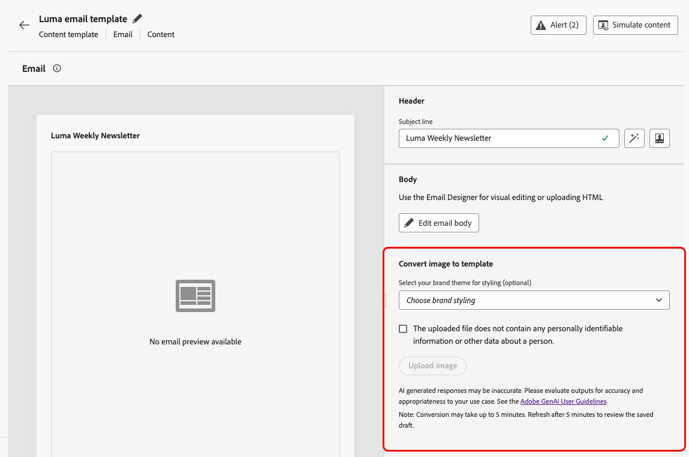
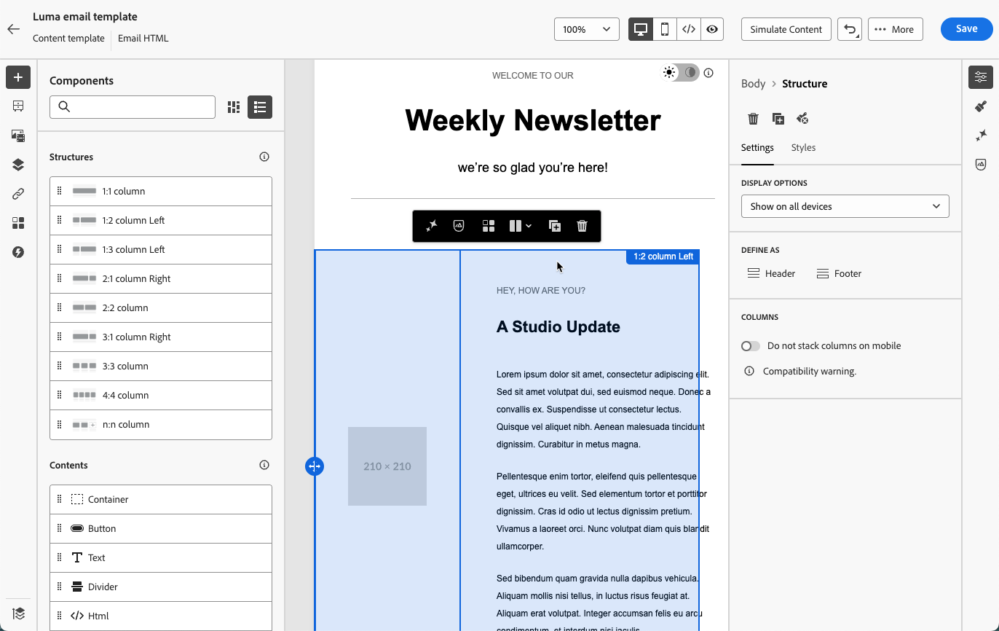

# 將影像轉換為 HTML 範本 {#image-to-html}

>[!AVAILABILITY]
>
>此功能為有限可用性。請聯絡您的 Adobe 代表以取得存取權。

[!DNL Journey Optimizer]將靜態影像設計轉換為完全可自訂、模組化的HTML電子郵件內容範本，協助您大幅加快電子郵件建立速度。

運用創作AI技術，整合式工具可分析影像中的版面、印刷樣式、色彩和視覺元素，並產生簡潔的模組化HTML程式碼，以維持設計的精確度，同時確保可透過[電子郵件Designer](../email/get-started-email-design.md)完全編輯。

這種無程式碼功能可讓行銷人員將圖形設計工具或設計工具的視覺資產轉換為可回應、可編輯的電子郵件範本，這些範本可在多個歷程及行銷活動中儲存及重複使用，而不需要技術專業知識。

主要優點如下：

* **比手動編碼更快** — 轉換器可在幾分鐘內將影像轉換為可編輯的HTML，因此您可以略過手動耗時的模擬HTML工作流程。
* **不需要任何技術技能** — 行銷人員不需要設計或開發支援即可製作及調整範本。
* **可跨行銷活動重複使用** — 將範本儲存至您的資料庫，並用於任何歷程或行銷活動。
* **對設計保持為True** — 輸出符合您的版面配置和樣式，同時與電子郵件Designer完全相容。

<!--* **Design fidelity**: Maintain visual consistency with your original design while creating fully editable content
* **Email compatibility**: Generate HTML that works seamlessly with the Email Designer and across email clients-->

+++ 常見使用實例

影像至HTML轉換器非常適合：

* **平台移轉**：要從其他電子郵件行銷平台移轉嗎？ 將您現有的電子郵件設計轉換為可使用[!DNL Journey Optimizer]的HTML範本，而不需從頭重建。
* **設計模型轉換**：將設計模型從Photoshop、Figma或其他設計軟體等工具轉換為功能性電子郵件範本。
* **快速範本建立**：快速產生電子郵件範本以用於時間敏感的行銷活動，而不需要等候開發人員資源。
* **建置範本資料庫**：建立完整的品牌一致性範本資料庫，非技術團隊成員可以自訂和部署。
* **減少技術相依性**：讓行銷人員能夠獨立建立及反複處理電子郵件範本，加速行銷活動的執行。

+++

## 將影像轉換為HTML範本 {#convert-image}

若要將影像設計轉換為完全可自訂的HTML電子郵件範本，請遵循下列步驟。

1. 確保您有JPEG或PNG格式的影像檔案，其中包含您的電子郵件設計。

   >[!NOTE]
   >
   >為達到最佳效果，請使用具有清晰視覺元素和可讀文字的高品質影像。 影像的寬度最好介於600到800畫素之間，以符合標準的電子郵件尺寸。

1. 從左側功能表選取&#x200B;**[!UICONTROL 內容管理]** > **[!UICONTROL 內容範本]**，以存取內容範本清單。

1. 按一下&#x200B;**[!UICONTROL 建立範本]**。

1. 填寫範本詳細資料並選取&#x200B;**[!UICONTROL 電子郵件]**&#x200B;作為頻道，然後按一下&#x200B;**[!UICONTROL 建立]**。

1. 在&#x200B;**[!UICONTROL 將影像轉換為範本]**&#x200B;區段中，執行下列步驟：

   * （選用）如果貴組織在Journey Optimizer中定義品牌主題，您可以選取主題作為輸入，以便產生的HTML會根據您的品牌主題引數而設定樣式。 [進一步瞭解主題](../email/apply-email-themes.md)

     背景顏色、按鈕顏色、字型、行距、邊界和邊框間距等樣式會套用到產生的範本，減少額外的設計工作，並產生能以最少編輯次數使用的範本。

   * 若要上傳影像，請確定影像未包含任何個人識別資訊(PII)或其他敏感資料，並核取對應的選項以確認您已檢閱檔案。

   * 按一下&#x200B;**[!UICONTROL 上傳影像]**&#x200B;按鈕以選取您的影像檔案。

     

     >[!CAUTION]
     >
     >上傳影像進行轉換時，目前新增至電子郵件中的所有內容都會被刪除，並取代為產生的範本。

1. 選取影像後，按一下&#x200B;**[!UICONTROL 開啟]**&#x200B;以開始AI支援的轉換程式。

   >[!NOTE]
   >
   >根據影像設計的複雜性和大小，產生程式最多可能需要5分鐘。 轉換過程中，您可以離開此畫面並處理其他任務。

1. 轉換完成後，您的內容範本會自動儲存為草稿。

   

1. 按一下&#x200B;**[!UICONTROL 編輯電子郵件內文]**。 轉換後的範本會在[電子郵件Designer](../email/get-started-email-design.md)中開啟，並具備完整的編輯功能。 您現在可以：

   * 檢閱、編輯文字內容並套用個人化
   * 修改影像並新增連結
   * 調整顏色、字型和樣式
   * 新增、移除或重新排列內容元件
   * 和任何其他範本一樣，善用所有電子郵件Designer功能

   

1. 進行任何必要的調整以調整範本並符合您的品牌方針。

1. 在滿意您的範本後，請按一下[儲存]。**&#x200B;**

您的範本現在可在內容範本資料庫中使用，並可在歷程或行銷活動中建立電子郵件時使用。 [瞭解如何使用內容範本](../email/use-email-templates.md)

## 最佳做法 {#best-practices}

若要在將影像轉換為HTML內容範本時獲得最佳結果，請遵循這些建議。

**開始之前**

* **儲存現有內容**：將影像轉換為HTML將會取代您電子郵件中的所有現有內容。 使用此功能前，請務必儲存您目前的工作。
* **規劃工作流程**：在電子郵件建立程式開始時使用影像至HTML轉換工具，或確定您已準備好取代所有目前的內容。

**影像準備**

* **解析度**：使用高解析度影像（至少1200px寬），以取得更好的文字辨識和元素偵測
* **清晰度**：確保文字清晰易讀，且視覺元素定義清楚
* **寬度**：以標準電子郵件寬度(600-800px)設計影像，以符合一般電子郵件使用者端需求
* **檔案格式**：使用JPEG或PNG格式 — 避免壓縮或低品質的影像
* **完整設計**：將完整的電子郵件設計包括在單一影像中（從頁首到頁尾）

**設計考量**

* **簡單版面**：較簡單、結構良好的版面轉換比高度複雜的設計更準確
* **標準元素**：使用常見的電子郵件設計模式（頁首、本文區段、CTA、頁尾）
* **文字清晰度**：確保文字與背景有足夠的對比
* **網頁安全字型**：使用一般網頁安全字型的設計將擁有更理想的逼真度
* **避免重疊的元素**：請保持設計元素間的明確分隔，以更清楚辨識結構

**轉換之後**

* **檢閱您的草稿**：轉換完成後，您的範本會自動儲存為草稿。 請花點時間仔細檢閱產生的HTML的準確性
* **徹底測試**：跨不同的電子郵件使用者端與裝置測試電子郵件
* **手動調整**：使用電子郵件Designer的完整編輯功能，視需要進行調整
* **品牌一致性**：確認色彩、字型和樣式符合您的品牌准則
* **Personalization**：視需要新增動態內容和個人化權杖
* **協助工具**：視需要檢閱和增強協助工具功能

## 護欄和推薦 {#limitations}

將影像轉換為HTML內容範本時，請注意下列限制。

* **AI解譯**： AI會根據影像的視覺解譯產生HTML。 複雜或不尋常的設計在轉換後可能需要手動調整。

* **文字準確性**：當AI嘗試正確識別和重製文字時，請一律驗證文字內容並根據需要進行更正。

* **動態內容**：轉換程式會根據您的影像建立靜態HTML。 轉換後，您需要手動新增個人化、動態內容和追蹤。

* **複雜版面**：包含複雜分層、不尋常形狀或非標準元素的高度複雜設計，可能無法完全轉換。 較簡單的設計通常會產生更好的結果。

* **處理時間**：視影像的複雜性和大小而定，轉換過程最多可能需要5分鐘。 AI處理作業會在背景進行，讓您在不開啟熒幕的情況下處理其他工作。 轉換完成後，範本會自動儲存為草稿。

* **可用性限制**：由於可用性限制功能，HTML轉換器的影像正在持續改善。 功能和正確性可能會有所不同，您的意見回饋有助於增強功能。

>[!NOTE]
>
>影像至HTML轉換工具的設計，是要為建立電子郵件提供堅實的起點。 您應使用電子郵件Designer來檢閱及調整產生的HTML，以確保其符合您的確切需求。

## 常見問題 {#faq}

+++使用影像至HTML轉換器時，現有的電子郵件內容會有什麼改變？

上傳影像進行轉換時，電子郵件中的所有現有內容將會刪除並取代為新產生的範本。 使用此功能之前，請務必儲存任何重要內容。 您最好在電子郵件建立程式的開頭使用影像到HTML的轉換工具。

+++

+++支援哪些檔案格式？

影像至HTML轉換器支援JPEG (.jpg、.jpeg)和PNG (.png)影像格式。

+++

+++轉換程式需要多久的時間？

轉換最多可能需要5分鐘，視影像設計的複雜性和大小而定。 AI處理作業會在背景進行，因此您可以離開並處理其他工作，而不需要讓熒幕一直保持開啟狀態。 轉換完成後，您的檔案會自動儲存為草稿，供您檢閱和編輯。

+++

+++是否可以編輯產生的範本？

是！產生的HTML範本會在具有完整編輯功能的電子郵件Designer中開啟。 您可以修改範本的所有方面，包括文字、影像、樣式、版面配置及結構。

+++

+++如果轉換與我的設計不完全相符，會發生什麼情況？

AI會盡最大努力準確地詮釋您的設計，但可能需要一些手動細分。 使用電子郵件Designer來調整任何需要微調的元素。

+++

+++我是否可以將此功能用於登陸頁面或其他內容型別？

影像至HTML轉換器目前是專為電子郵件範本所設計。 對於其他內容型別，請使用電子郵件Designer中可用的標準設計和匯入選項。

+++

+++我需要特殊許可權才能使用此功能嗎？

影像到HTML轉換器在「有限可用性」中提供。 您需要有限可用性存取權(若要取得存取權，請聯絡您的Adobe代表)和標準電子郵件Designer許可權，才能使用此功能。

+++

+++我可以在多個行銷活動中重複使用轉換的範本嗎？

是！使用影像轉換為HTML轉換器建立的範本會自動儲存至內容範本程式庫。 您可以在歷程及行銷活動中的任何電子郵件中存取及重複使用它們。 [了解更多](content-templates.md)

+++

+++我可以將此用於平台移轉嗎？

是！影像到HTML轉換器非常適合從其他電子郵件行銷平台移轉。 您只需從先前的平台匯出或擷取您現有的電子郵件設計，然後將其轉換為可在AJO中使用的HTML範本，而不需要從頭開始重新建置。

+++

## 相關主題 {#related-topics}

* [開始使用內容範本](content-templates.md)
* [建立內容範本](create-content-templates.md)
* [使用電子郵件範本](../email/use-email-templates.md)
* [善用電子郵件主題](../email/apply-email-themes.md)
* [開始使用電子郵件設計](../email/get-started-email-design.md)
* [匯入電子郵件內容](../email/existing-content.md)
* [從頭開始設計內容](../email/content-from-scratch.md)
