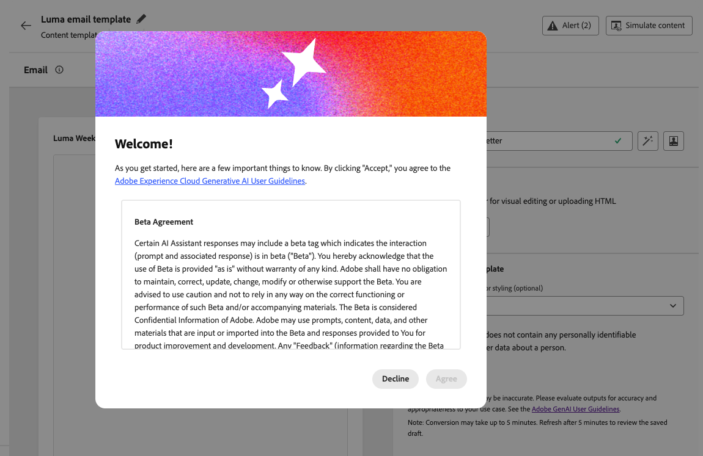

# 將影像轉換為電子郵件內容範本 {#image-to-html}

[!DNL Journey Optimizer]將靜態影像設計轉換為完全可自訂、模組化的電子郵件內容範本，協助您大幅加快電子郵件建立速度。

>[!AVAILABILITY]
>
>若要使用此功能，貴組織必須已透過Adobe簽署[!DNL Generative AI]增補。 如果您不確定，請聯絡您的Adobe代表。
>
>此功能僅適用於電子郵件頻道。

運用創作AI技術，整合式工具可分析影像中的版面、印刷樣式、色彩和視覺元素，並產生簡潔的模組化HTML內容，既可維持設計精確度，又可透過[電子郵件Designer](../email/get-started-email-design.md)確保完全可編輯。

這種無程式碼功能可讓行銷人員將圖形設計工具或設計工具的視覺資產轉換為可回應、可編輯的電子郵件範本，這些範本可在多個歷程及行銷活動中儲存及重複使用，而不需要技術專業知識。

>[!IMPORTANT]
>
>開始使用此功能之前，請先閱讀相關的[護欄和建議](#limitations)。

主要優點如下：

* **比手動編碼更快** — 轉換器可在幾分鐘內將影像轉換為可編輯的內容，因此您可以略過手動耗時的模擬HTML工作流程。
* **不需要任何技術技能** — 行銷人員不需要設計或開發支援即可製作及調整範本。
* **可跨行銷活動重複使用** — 將範本儲存至您的資料庫，並用於任何歷程或行銷活動。
* **對設計保持為True** — 輸出符合您的版面配置和樣式，同時與電子郵件Designer完全相容。

<!--* **Design fidelity**: Maintain visual consistency with your original design while creating fully editable content
* **Email compatibility**: Generate HTML that works seamlessly with the Email Designer and across email clients-->

+++ 常見使用實例

影像至HTML轉換器非常適合：

* **平台移轉**：要從其他電子郵件行銷平台移轉嗎？ 將您現有的電子郵件設計轉換為可使用[!DNL Journey Optimizer]的HTML範本，而不需從頭重建。
* **設計模型轉換**：將設計模型從Photoshop、Figma或其他設計軟體等工具轉換為功能性電子郵件範本。
* **快速範本建立**：快速產生電子郵件範本以用於時間敏感的行銷活動，而不需要等候開發人員資源。
* **建置範本資料庫**：建立完整的品牌一致性範本資料庫，非技術團隊成員可以自訂和部署。
* **減少技術相依性**：讓行銷人員能夠獨立建立及反複處理電子郵件範本，加速行銷活動的執行。

+++

## 將影像存取HTML轉換器 {#access-image-to-html}

使用Adobe的&#x200B;**增補**

若要存取此功能，貴組織必須已透過Adobe簽署[!DNL Generative AI]增補。 如果您不確定，請聯絡您的Adobe代表。

**權限**

* 若要存取及建立範本，您的角色必須包含&#x200B;**[!UICONTROL 管理內容範本]**&#x200B;許可權（在&#x200B;**內容管理**&#x200B;資源下）。 [進一步瞭解許可權](../administration/permissions.md)

* 若要使用影像到HTML轉換器，您必須被授予&#x200B;**產生內容**&#x200B;許可權。 瞭解如何在[本節](../content-management/gs-generative.md#generative-access)中指派內容產生相關許可權。

**合約**

在您可以善用此功能之前，您必須同意使用者協定，該協定會顯示您在[!DNL Journey Optimizer]中第一次使用Generative AI時的情形。 如需詳細資訊，請閱讀[Adobe Experience Cloud Generative AI使用者指南](https://www.adobe.com/tw/legal/licenses-terms/adobe-gen-ai-user-guidelines.html){target="_blank"}。

## 護欄和推薦 {#limitations}

將影像轉換為電子郵件內容範本時，請注意下列限制和建議。

**適當性**

* **AI解譯**： AI會根據影像的視覺解譯產生靜態HTML內容。 它為建立電子郵件提供了一個強有力的起點，但應使用電子郵件Designer進行審查和細化，以確保它符合您的確切要求。 如有需要，您必須在轉換後手動新增個人化、動態內容和追蹤。

* **文字準確性**：當AI嘗試正確識別和重製文字時，請一律驗證文字內容並根據需要進行更正。 請檢視[Adobe Generative AI使用者指南](https://www.adobe.com/tw/legal/licenses-terms/adobe-gen-ai-user-guidelines.html){target="_blank"}。

**影像選取範圍**

* **PII和敏感資料**：請確定選取的影像不含任何個人識別資訊(PII)或其他敏感資料。

* **影像大小**：您無法上傳大於10MB的影像。

* **高品質影像**：為達到最佳效果，請使用清晰、高品質的影像：銳利的視覺效果、可讀的文字，以及定義清晰的版面元素。 模糊、深色或雜亂的影像會降低轉換品質。 影像的寬度最好介於600到800畫素之間，以符合標準的電子郵件尺寸。

* **簡單版面配置**：包含複雜分層、不尋常形狀或非標準元素的高度複雜設計，可能無法完全轉換。 較簡單的設計通常會產生更好的結果。

**正在處理**

* **重新整理頁面**：在您重新整理之前，不會自動顯示結果。

* **處理時間**：視複雜性和影像大小而定，轉換通常在&#x200B;**約5分鐘內完成**。 非常大型或複雜的影像有時可能需要10分鐘的時間；請適度等待，然後重新整理以檢視結果。

<!--
* **Background processing**: The AI processing happens in the background, so you can work on other tasks without keeping the screen open. The template is automatically saved as a draft once the conversion is complete.

**Feedback is welcome!** Use the dedicated section to share your thoughts and suggestions with Adobe to help us improve the feature.-->

## 將影像轉換為HTML範本 {#convert-image}

若要將影像設計轉換為完全可自訂的電子郵件內容範本，請遵循下列步驟。

1. 確保您有JPEG或PNG格式的影像檔案，其中包含您的電子郵件設計。

   >[!IMPORTANT]
   >
   >影像大小不能超過&#x200B;**10MB**。 為達到最佳效果，請使用&#x200B;**清晰、高品質的影像**，其中包含銳利的視覺效果、可讀的文字以及定義清晰的版面配置元素。

1. 從左側功能表選取&#x200B;**[!UICONTROL 內容管理]** > **[!UICONTROL 內容範本]**，以存取內容範本清單。

1. 按一下&#x200B;**[!UICONTROL 建立範本]**。

1. 填寫範本詳細資料並選取&#x200B;**[!UICONTROL 電子郵件]**&#x200B;作為頻道，然後按一下&#x200B;**[!UICONTROL 建立]**。

1. 在&#x200B;**[!UICONTROL 將影像轉換為範本]**&#x200B;區段中，執行下列步驟：

   * （選用）如果貴組織在Journey Optimizer中定義品牌主題，您可以選取主題作為輸入，以便產生的HTML會根據您的品牌主題引數而設定樣式。 [進一步瞭解主題](../email/apply-email-themes.md)

     背景顏色、按鈕顏色、字型、行距、邊界和邊框間距等樣式會套用到產生的範本，減少額外的設計工作，並產生能以最少編輯次數使用的範本。

   * 為了能夠上傳影像，請確定影像未包含任何個人識別資訊(PII)或其他敏感資料。 核取對應的選項，確認您已檢閱檔案。

   * 按一下&#x200B;**[!UICONTROL 上傳影像]**&#x200B;按鈕以選取您的影像檔案。

     {width=80%}

     >[!CAUTION]
     >
     >上傳影像進行轉換時，目前新增至電子郵件中的所有內容都會被刪除，並取代為產生的範本。

1. 如果這是您第一次在[!DNL Journey Optimizer]中使用Generative AI，將會要求您同意使用者合約。 若要深入瞭解，請參閱[Adobe Generative AI使用者指南](https://www.adobe.com/tw/legal/licenses-terms/adobe-gen-ai-user-guidelines.html){target="_blank"}。

   {width=50%}

   按一下&#x200B;**[!UICONTROL 同意]**&#x200B;以繼續。

1. 選取影像後，按一下「**[!UICONTROL 開啟]**」以開始AI支援的轉換程式，此程式通常會在&#x200B;**約5分鐘**&#x200B;內完成（視影像設計的複雜度和大小而定）。

   >[!NOTE]
   >
   >某些情況下，非常大的影像可能需要長達10分鐘。 轉換過程中，您可以離開此畫面並處理其他任務。

1. **重新整理頁面**&#x200B;以檢視輸出。 轉換完成後，產生的內容會顯示並自動儲存為草稿。

   >[!IMPORTANT]
   >
   >在您重新整理之前，結果不會自動顯示。

   {width=90%}

1. 使用&#x200B;**[!UICONTROL Image to template converter feedback]**&#x200B;區段，與Adobe分享您的想法與建議，以協助我們改善功能。
   {width=70%}

1. 按一下&#x200B;**[!UICONTROL 編輯電子郵件內文]**。 轉換後的範本會在[電子郵件Designer](../email/get-started-email-design.md)中開啟，並具備完整的編輯功能。 您現在可以：

   * 檢閱、編輯文字內容並套用個人化
   * 修改影像並新增連結
   * 調整顏色、字型和樣式
   * 新增、移除或重新排列內容元件
   * 和任何其他範本一樣，善用所有電子郵件Designer功能

   

   進行任何必要的調整以調整範本並符合您的品牌方針。

1. 在滿意您的範本後，請按一下[儲存]。**&#x200B;**

您的範本現在可在內容範本資料庫中使用，並可在歷程或行銷活動中建立電子郵件時使用。 [瞭解如何使用內容範本](../email/use-email-templates.md)

## 最佳做法 {#best-practices}

若要在將影像轉換為電子郵件內容範本時取得最佳結果，請遵循這些建議。

+++開始之前

* **儲存現有內容**：轉換影像會取代電子郵件範本中的所有現有內容。 使用此功能前，請務必儲存您目前的工作。
* **規劃您的工作流程**：在電子郵件建立程式開始時使用此功能，或確定您已準備好取代所有目前的內容。

+++

+++影像準備

* **解析度**：使用高解析度影像，以便更佳的文字辨識和元素偵測。
* **清晰度**：使用清晰的影像 — 文字必須容易閱讀，且視覺元素定義清楚；避免模糊、低對比或雜訊來源檔案。
* **寬度**：以標準電子郵件寬度(600-800px)設計影像，以符合一般電子郵件使用者端需求。
* **檔案格式**：使用JPEG或PNG格式 — 避免壓縮或低品質的影像。
* **完整設計**：將完整的電子郵件設計包括在單一影像中，從頁首到頁尾。

+++

+++設計考量事項

* **簡單版面**：較簡單、結構良好的版面轉換比高度複雜的設計更準確。
* **標準元素**：使用常見的電子郵件設計模式（頁首、本文區段、CTA、頁尾）。
* **文字清晰度**：確保文字與背景之間有足夠的對比。
* **網頁安全字型**：使用一般網頁安全字型的設計會更逼真。
* **避免重疊的元素**：請保持設計元素間的明確分隔，以辨識結構。

+++

+++轉換後

* **重新整理以檢視結果**：在大約5分鐘後（如果是非常大的影像，則最多10分鐘），重新整理頁面以顯示完成的轉換。
* **檢閱您的草稿**：轉換完成後，您的範本會自動儲存為草稿。 請花點時間仔細檢閱產生的內容是否準確。
* **徹底測試**：跨不同的電子郵件使用者端與裝置測試電子郵件。 [瞭解如何預覽和測試內容](preview-test.md)。
* **手動調整**：使用[電子郵件Designer](../email/get-started-email-design.md)的完整編輯功能，視需要進行調整。
* **品牌一致性**：使用主題（如果有的話），驗證顏色、字型和樣式是否符合品牌方針。 [進一步瞭解電子郵件主題](../email/apply-email-themes.md)。
* **Personalization**：視需要新增動態內容和個人化權杖。 [進一步瞭解個人化](../personalization/personalize.md)。
* **協助工具**：視需要檢閱並增強協助工具功能。 [進一步瞭解可存取的電子郵件內容](../email/accessible-content.md)。

+++

+++歡迎提供意見回饋！

使用專屬區段與Adobe分享您的想法與建議，以協助我們改善功能。

+++

## 常見問題 {#faq}

+++將影像轉換為內容範本時，現有的電子郵件內容會發生什麼事？

上傳影像進行轉換時，電子郵件中的所有現有內容將會刪除並取代為新產生的範本。 使用此功能之前，請務必儲存任何重要內容。 此功能最好在電子郵件建立流程的開頭進行。

+++

+++支援哪些檔案格式？

轉換器支援JPEG (.jpg、.jpeg)和PNG (.png)影像格式。

+++

+++轉換程式需要多久的時間？

轉換通常在5分鐘內完成，視影像設計的複雜性和大小而定。 非常大型的影像有時可能需要10分鐘；請留出額外的時間，然後重新整理。 AI處理作業會在背景進行，因此您可以離開並處理其他工作，而不需要讓熒幕一直保持開啟狀態。 轉換完成後，您的檔案會自動儲存為草稿，供您檢閱和編輯。

+++

+++是否可以編輯產生的範本？

是！產生的內容範本會在具有完整編輯功能的電子郵件Designer中開啟。 您可以修改範本的所有方面，包括文字、影像、樣式、版面配置及結構。

+++

+++如果轉換與我的設計不完全相符，會發生什麼情況？

AI會盡最大努力準確地詮釋您的設計，但可能需要一些手動細分。 使用電子郵件Designer來調整任何需要微調的元素。

+++

+++我是否可以將此功能用於登陸頁面或其他內容型別？

影像至HTML轉換器目前是專為電子郵件內容範本所設計。 對於其他內容型別，請使用電子郵件Designer中可用的標準設計和匯入選項。

+++

+++我需要特殊許可權才能使用此功能嗎？

此功能適用於已透過Adobe簽署[!DNL Gen AI]增補的所有客戶。 如果您不確定貴組織是否已簽署增編，請聯絡您的Adobe代表。

+++

+++我可以在多個行銷活動中重複使用轉換的範本嗎？

是！使用影像轉換為HTML轉換器建立的範本會自動儲存至內容範本程式庫。 您可以在歷程及行銷活動中的任何電子郵件中存取及重複使用它們。 [了解更多](content-templates.md)

+++

+++我可以將此用於平台移轉嗎？

是！影像到HTML轉換器非常適合從其他電子郵件行銷平台移轉。 您只需從先前的平台匯出或擷取您現有的電子郵件設計，然後將其轉換為可在AJO中使用的HTML範本，而不需要從頭開始重新建置。

+++

## 相關主題 {#related-topics}

* [開始使用內容範本](content-templates.md)
* [建立內容範本](create-content-templates.md)
* [使用電子郵件範本](../email/use-email-templates.md)
* [善用電子郵件主題](../email/apply-email-themes.md)
* [開始使用電子郵件設計](../email/get-started-email-design.md)
