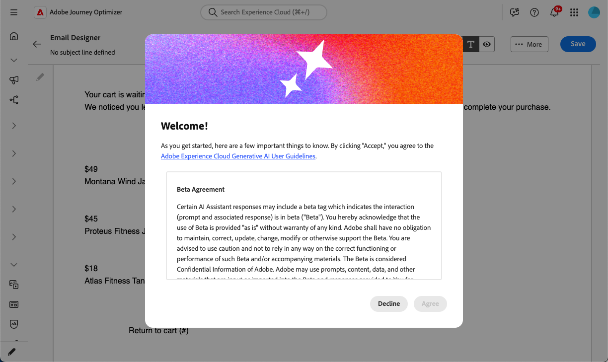
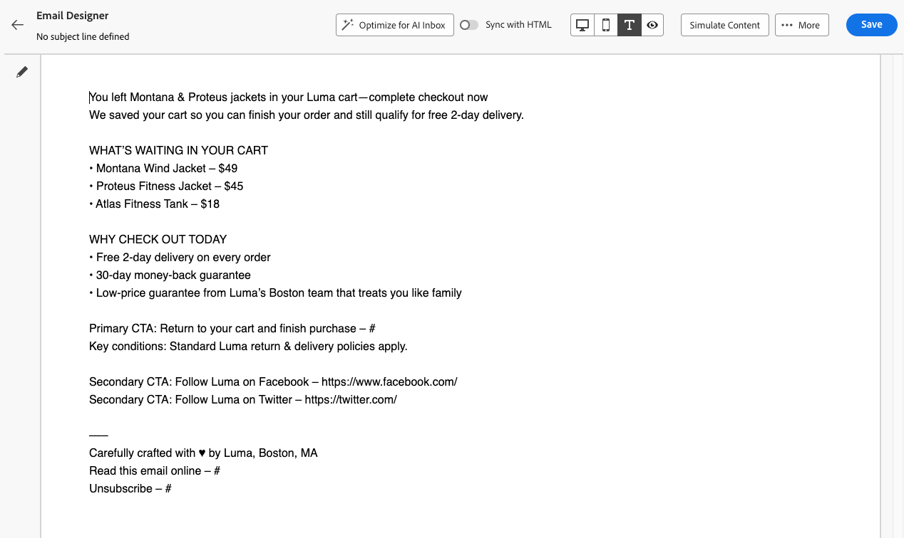

# 最佳化AI收件匣的電子郵件文字 {#email-text-optimizer}

[!DNL Adobe Journey Optimizer]隨附電子郵件通道功能，可協助您建構訊息的[文字版本](../email/text-version-email.md)以改善AI輔助收件匣體驗，例如[!DNL Apple Intelligence]中的[!DNL Google Gemini]和[!DNL Gmail]，讓他們能更準確地回答問題，並根據您的內容摘要郵件，獲得更好的結果。

>[!NOTE]
>
>此功能只會變更純文字，不會變更電子郵件內容的HTML版本。

透過此電子郵件文字最佳化工具，您可以確保電子郵件內容的純文字版本已針對AI輔助收件匣體驗而增強，因此您提供給這些電子郵件收件匣提供者之AI功能的資訊與您要提供的資訊完全相同。

## 運作方式 {#how-it-works}

收件者在AI輔助收件匣體驗中可能會詢問的常見問題是&#x200B;*此電子郵件是關於什麼的？*&#x200B;或&#x200B;*這些選件是什麼？*。

* 這些AI助理提供的答案可能是簡短摘要（例如，訊息為促銷、提及VIP早期存取和銷售，並包括產品類別的連結），但仍會省略行銷人員關心的目標，因為助理從他們有效看到的任何文字中推斷出來 — 不一定是您打算的完整故事。

* 此外，助理可能會主動搜尋與品牌相關的折扣或優惠券，並將這些內容摺疊成答案，因此使用者不再只檢視您實際承諾的訊息。 此行為對一般使用者很有用，但若行銷人員需要回答來追蹤傳送中的真實辭彙，此行為會稀釋他們的控制權。

為避免這些問題，[!DNL Journey Optimizer]重寫純文字，好讓優惠券、折扣範圍、行動號召和其他優先順序以清晰的線性副本顯示在最前面。 目標是讓收件匣AI將您定義的優惠方案和動作中的摘要和問答置於基礎位置，而非依賴較薄的預設文字部分或不相關的網頁結果。

>[!IMPORTANT]
>
>確切的AI助理行為取決於收件匣提供者和模型版本。 傳送電子郵件後，外部AI使用者端提供的回答和摘要可能會不正確、不完整或混淆網頁結果。
>
>「為AI收件匣最佳化電子郵件文字」功能只會改善您在Journey Optimizer中撰寫的純文字，無法保證第三方助理將如何解譯或顯示訊息。 深入瞭解第三方收件匣AI[的](#inbox-ai-risks)限制和風險。

## 建議的使用案例 {#use-cases}

<!--
* **Critical details only in images** — Offers, promo codes, or deadlines shown in banners or graphics are invisible in plain text. Use the optimizer (and manual edits) so the same facts appear as text, improving extraction by AI summaries and text-only clients.
-->

* **密集或零碎的自動產生文字** — 當預設純文字很難掃描時，最佳化可以透過明確的選件和連結產生更清晰的線性敘述。

* **控制收件匣問答** — 當您預期收件者會詢問助理時&#x200B;*電子郵件內容為何*&#x200B;或&#x200B;*選件為何*，強式純文字版本可減少部分摘要，並減少對未與已核准副本繫結的網頁補充答案的依賴。

## 針對AI收件匣體驗最佳化 {#optimize-with-ai}

>[!IMPORTANT]
>
>開始使用此功能之前，請先閱讀相關的[風險和限制](#inbox-ai-risks)。
>
>若要存取此功能，您必須同意使用者合約，該合約會在您第一次在[!DNL Journey Optimizer]中使用Generative AI時顯示。 如需詳細資訊，請閱讀[Adobe Experience Cloud Generative AI使用者指南](https://www.adobe.com/tw/legal/licenses-terms/adobe-gen-ai-user-guidelines.html){target="_blank"}。

若要最佳化含有[!DNL Journey Optimizer]之AI收件匣的電子郵件純文字版本，請遵循下列步驟。

1. 在[電子郵件Designer](../email/content-from-scratch.md)中開啟您的電子郵件（來自行銷活動、歷程或範本，視您的工作流程而定）。

1. 選取&#x200B;**[!UICONTROL 純文字]**&#x200B;圖示以開啟電子郵件的文字版本。 [了解更多](../email/text-version-email.md)

   ![選取[純文字]圖示以開啟電子郵件的文字版本](assets/text-optimizer-text-icon.png){zoomable="yes"}

1. 此時會顯示電子郵件的文字版本。 按一下&#x200B;**[!UICONTROL 「針對AI收件匣最佳化」]**&#x200B;按鈕，以產生改良的純文字版本，其中強調重要資訊，以供AI輔助閱讀和摘要之用。

   ![文字版本檢視中的[針對AI收件匣最佳化]按鈕](assets/text-optimizer-for-ai-button.png){zoomable="yes" width="80%"}

   >[!NOTE]
   >
   >按一下&#x200B;**[!UICONTROL 針對AI收件匣最佳化]**&#x200B;按鈕後，**[!UICONTROL 與HTML同步]**&#x200B;選項會自動停用。 [了解更多](../email/text-version-email.md#plain-text-custom)

1. 如果這是您第一次在[!DNL Journey Optimizer]中使用Generative AI，將會要求您同意使用者合約。 若要深入瞭解，請參閱[Adobe Generative AI使用者指南](https://www.adobe.com/tw/legal/licenses-terms/adobe-gen-ai-user-guidelines.html){target="_blank"}。

   {width=50%}

   按一下&#x200B;**[!UICONTROL 同意]**&#x200B;以繼續。

1. 隨即顯示產生的文字。 檢閱變更，視需要編輯，然後如常儲存電子郵件。

   {zoomable="yes" width="80%"}

   >[!NOTE]
   >
   >電子郵件文字最佳化工具只會更新純文字內文。 這不會變更您的HTML設計、版面或影像。

1. 您可以隨時按一下&#x200B;**[!UICONTROL 切換至案頭檢視]**&#x200B;圖示，切換回電子郵件的HTML版本。 文字版本中的變更會保留。

   >[!CAUTION]
   >
   >如果您再次啟用「與HTML同步&#x200B;**[!UICONTROL 」]**&#x200B;選項，您的變更將會遺失，並以HTML版本產生的文字內容取代。

## 第三方收件匣AI的風險和限制 {#inbox-ai-risks}

AI收件匣最佳化電子郵件文字功能可協助您準備純文字，以利信箱提供者處理您[!DNL Journey Optimizer]傳送的方式。 它不會控制這些提供者的產品。 一旦傳遞郵件，[!DNL Gmail]、[!DNL Apple]郵件、[!DNL Outlook]或其他使用者端的任何AI功能都會根據其條款、模型和原則運作，而不是Adobe的。

* **無法預測的簡報** — 摘要、通知模糊和對話式回答可能會省略優惠、錯誤陳述價格或日期、將內容與不相關的網頁結果合併，或是以不再符合您核准副本的方式轉述。 當供應商更新模型或UI而不另行通知時，行為會改變。

* **無法保證與HTML的同等性** — 依賴預覽或助理答案的收件者，可能永遠無法看到完整的HTML設計、影像或法律頁尾。 他們認為，訊息「說」的內容可能只來自AI產生的簡短摘要。

* **隱私權、法規遵循及資料使用** — 收件匣AI可能會根據提供者基礎建設的隱私權政策、保留及地區規則，處理該提供者基礎建設的郵件內容。 受規管行業的組織應評估收件者使用這類功能是否會影響其義務，而不論電子郵件在[!DNL Journey Optimizer]中的撰寫方式為何。

* **品牌與法律曝光度** — 不正確或不完整的AI摘要仍可能會導致客戶對促銷活動、條款或選擇退出語言產生混淆或爭議。 最佳化工具會改善您提供的文字圖層，但無法確保協力廠商的模型會忠實地重現。

* **[!UICONTROL 針對]**&#x200B;中的AI收件匣最佳化[!DNL Journey Optimizer] — 電子郵件Designer中的製作時間動作是與一般使用者收件匣助理不同的系統。 傳送前，請務必檢閱產生的純文字。

## 相關主題 {#related-topics}

* [管理電子郵件的文字版本](../email/text-version-email.md)
* [開始使用電子郵件設計](../email/get-started-email-design.md)
* 如需更廣泛的Adobe產生功能，請參閱[開始使用AI助理來建立內容](gs-generative.md)。
