# 管理片段 {#manage-fragments}

## 存取片段 {#access-fragments}

若要管理您的片段，請從&#x200B;**[!UICONTROL 內容管理]** > **[!UICONTROL 片段]**&#x200B;左側功能表存取片段清單。

目前沙箱上建立的所有片段 — 使用[另存為片段&#x200B;**[!UICONTROL 選項從]**&#x200B;片段](#create-fragments)功能表[中的](#save-as-fragment) — 都會顯示。

左側的窗格可讓您將片段整理到資料夾中。 依預設，會顯示所有片段。 選取資料夾時，只會顯示所選資料夾中包含的片段和資料夾。 [了解更多](#folders)

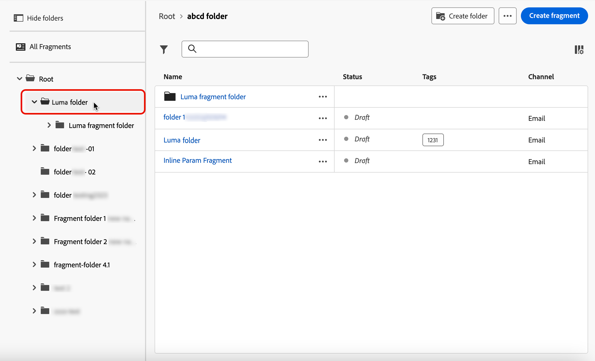

若要尋找特定專案，請在搜尋欄位中開始輸入名稱。 選取[資料夾](#folders)時，搜尋將套用到該資料夾<!--(not nested items)-->的第一個階層中的所有片段或資料夾。

您可以在其上篩選片段：

* 狀態（草稿或即時）
* 型別（視覺效果或運算式）
* 建立或修改日期
* 狀態（是否封存）
* 標記

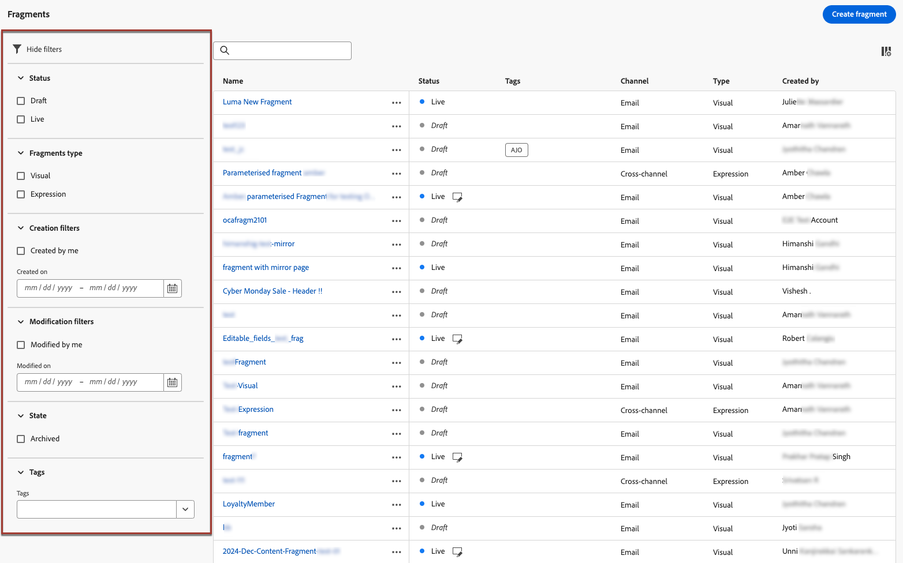{width="90%" align="left"}

您也可以選擇顯示所有片段，或僅顯示目前使用者建立或修改的專案。

從每個片段旁邊的&#x200B;**[!UICONTROL 更多動作]**&#x200B;按鈕可以：

* 將其新增至套件以供匯出。 [了解更多](#export)
* 如果正在編輯即時片段，請開啟此片段的草稿版本。 [了解更多](#edit-fragments)
* 復製片段。
* 使用&#x200B;**[!UICONTROL 探索參考]**&#x200B;選項可檢視使用它的歷程、行銷活動或範本。 [了解更多](#explore-references)
* 封存片段。 [了解更多](#archive-fragments)
* 編輯片段的標籤。 [瞭解如何使用統一標籤](../start/search-filter-categorize.md#tags)
* 將片段移至資料夾。 [了解更多](#folders)

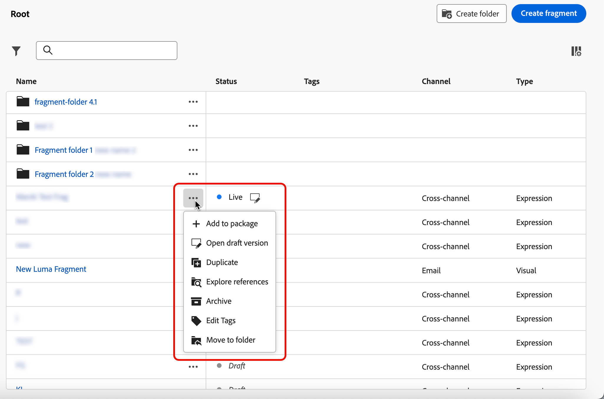

## 使用資料夾管理片段 {#folders}

>[!CONTEXTUALHELP]
>id="ajo_fragments_folders"
>title="將片段整理成為多個資料夾"
>abstract="根據組織的需求，使用資料夾對片段進行分類和管理。"

若要輕鬆導覽您的片段，您可以使用資料夾以更有效地將其組織到結構化階層中。 這可讓您根據組織需求將專案分類和管理。

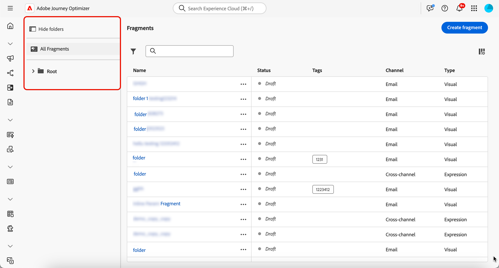

1. 按一下「**[!UICONTROL 所有片段]**」按鈕，以顯示先前建立的所有專案，而不使用資料夾分組。

1. 按一下&#x200B;**[!UICONTROL Root]**&#x200B;資料夾以顯示所有已建立的資料夾。

   >[!NOTE]
   >
   >如果您尚未建立資料夾，則會顯示所有片段。

1. 按一下&#x200B;**[!UICONTROL 根]**&#x200B;資料夾內的任何資料夾以顯示其內容。

1. 按一下&#x200B;**[!UICONTROL 根]**&#x200B;資料夾或任何其他資料夾後，**[!DNL Create folder]**&#x200B;按鈕就會顯示。 選取它。

   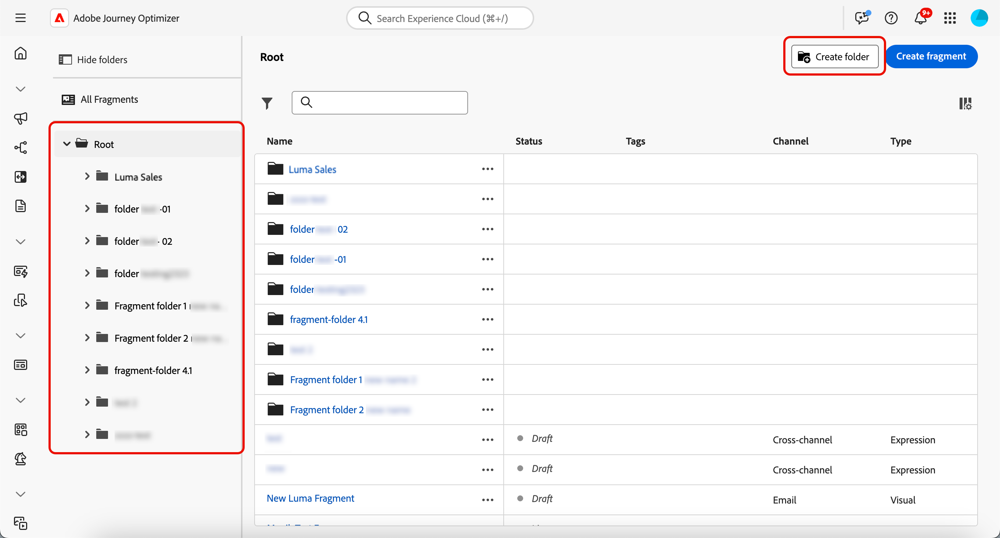

1. 輸入新資料夾的名稱，然後按一下[儲存]。**** 新資料夾會顯示在&#x200B;**[!UICONTROL Root]**&#x200B;資料夾內的片段清單上方，或顯示在目前選取的資料夾內。

1. 您可以按一下&#x200B;**[!UICONTROL 其他動作]**&#x200B;按鈕，重新命名或刪除資料夾。

   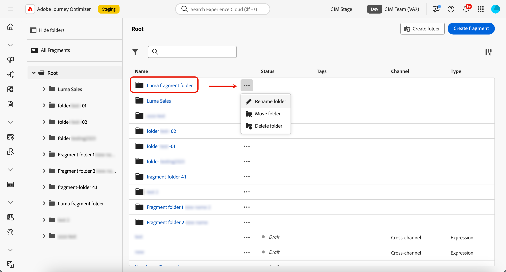

1. 使用&#x200B;**[!UICONTROL 更多動作]**&#x200B;按鈕，您也可以將片段移動到另一個現有的資料夾。

   <!---->

1. 現在您可以導覽至您剛建立的資料夾。 您[從此處](create-fragments.md)建立的每個新片段都會儲存到目前的資料夾中。

   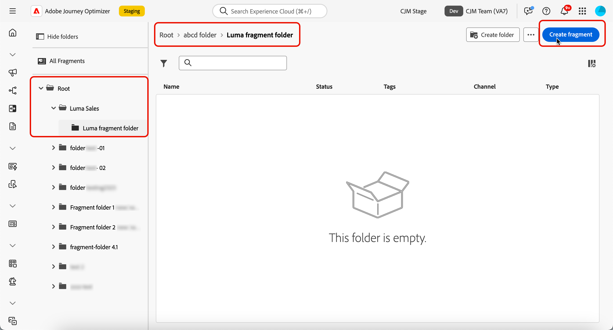

## 片段的狀態 {#fragments-statuses}

>[!CONTEXTUALHELP]
>id="ajo_fragment_statuses"
>title="新的片段狀態"
>abstract="由於 Journey Optimizer 6 月版本推出「**草稿**」和「**即時**」狀態，因此在此版本之前建立的所有片段均具有「**草稿**」狀態，即使這些片段用於歷程或活動中亦然。如果您對這些片段進行任何變更，則需要將其發佈，使其進入「**即時**」狀態，並將變更內容傳遞至相關的行銷活動和歷程。您還需要建立一個新的歷程/行銷活動版本，然後進行發佈。 發佈需要<a href="https://experienceleague.adobe.com/zh-hant/docs/journey-optimizer/using/access-control/ootb-product-profiles#content-library-manage">發佈片段</a>使用者權限。"
>additional-url="https://experienceleague.adobe.com/zh-hant/docs/journey-optimizer/using/access-control/ootb-product-profiles#content-library-manager" text="了解更多關於內容片段權限的資訊"

片段可以有多個狀態：

* **[!UICONTROL 草稿]**：片段正在編輯中，尚未核准。

* **[!UICONTROL 即時]**：片段已核准且即時。 [瞭解如何發佈片段](../content-management/create-fragments.md#publish)

  編輯即時片段時，其狀態旁邊會顯示特定圖示。 按一下此圖示以開啟片段的草稿版本。

* **[!UICONTROL 發佈]**：片段已核准且正在發佈。
* **[!UICONTROL 已封存]**：片段已封存。 [瞭解如何封存片段](#archive-fragments)

>[!CAUTION]
>
>由於Journey Optimizer 2024年6月發行版本已引入&#x200B;**草稿**&#x200B;和&#x200B;**即時**&#x200B;狀態，在此發行版本之前建立的所有片段都會具有&#x200B;**草稿**&#x200B;狀態，即使它們用於歷程或行銷活動亦然。 如果您對這些片段進行任何變更，則需要將其發佈，使其進入「**即時**」狀態，並將變更內容傳遞至相關的行銷活動和歷程。您還需要建立一個新的歷程/行銷活動版本，然後進行發佈。發佈需要[發佈片段](../administration/ootb-product-profiles.md#content-library-manager)使用者許可權。

## 編輯片段 {#edit-fragments}

>[!CONTEXTUALHELP]
>id="ajo_fragments_update_campaigns"
>title="行銷活動中的片段更新"
>abstract="如果您對片段發佈變更，則將不會更新此行銷活動。需要發佈新版本才能支援片段更新功能。"

>[!CONTEXTUALHELP]
>id="ajo_fragments_update_journeys"
>title="歷程中的片段更新"
>abstract="如果您對片段發佈變更，則將不會更新此歷程。需要發佈新版本才能支援片段更新功能。"

若要編輯片段，請遵循以下步驟。

1. 從&#x200B;**[!UICONTROL 片段]**&#x200B;清單中按一下所需的片段。 片段屬性畫面會開啟，並預覽其內容。

1. 您可以檢查目前使用片段之歷程、行銷活動和內容範本的清單。 若要這麼做，請從[更多]動作按鈕中選取&#x200B;**[!UICONTROL 瀏覽參考]**&#x200B;選項。 [了解更多](#explore-references)

1. 如果正在編輯的片段具有&#x200B;**[!UICONTROL 即時]**&#x200B;狀態，請按一下&#x200B;**[!UICONTROL 修改]**&#x200B;按鈕以建立片段的草稿版本。 按一下「**[!UICONTROL 確認]**」。

   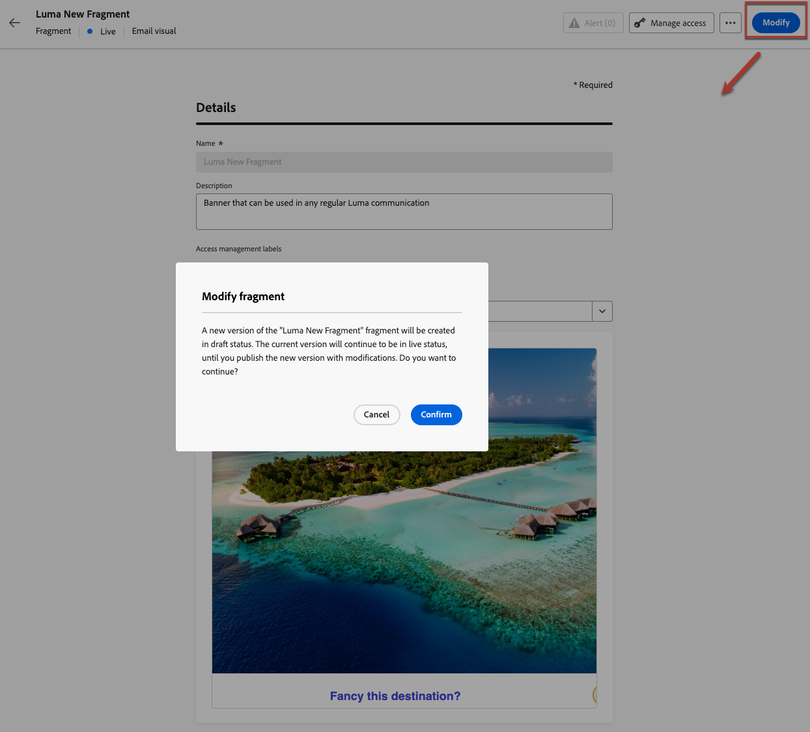{width="70%" align="left"}

   >[!NOTE]
   >
   >片段的目前版本將繼續上線，直到您發佈新的更新版本為止。

1. 視需要對片段詳細資料進行所需的變更。

1. 若要修改片段的內容，請按一下&#x200B;**[!UICONTROL 編輯]**&#x200B;按鈕，然後更新您的內容，就像從頭開始建立片段時所做的一樣。 [瞭解如何建立片段](create-fragments.md#content)

   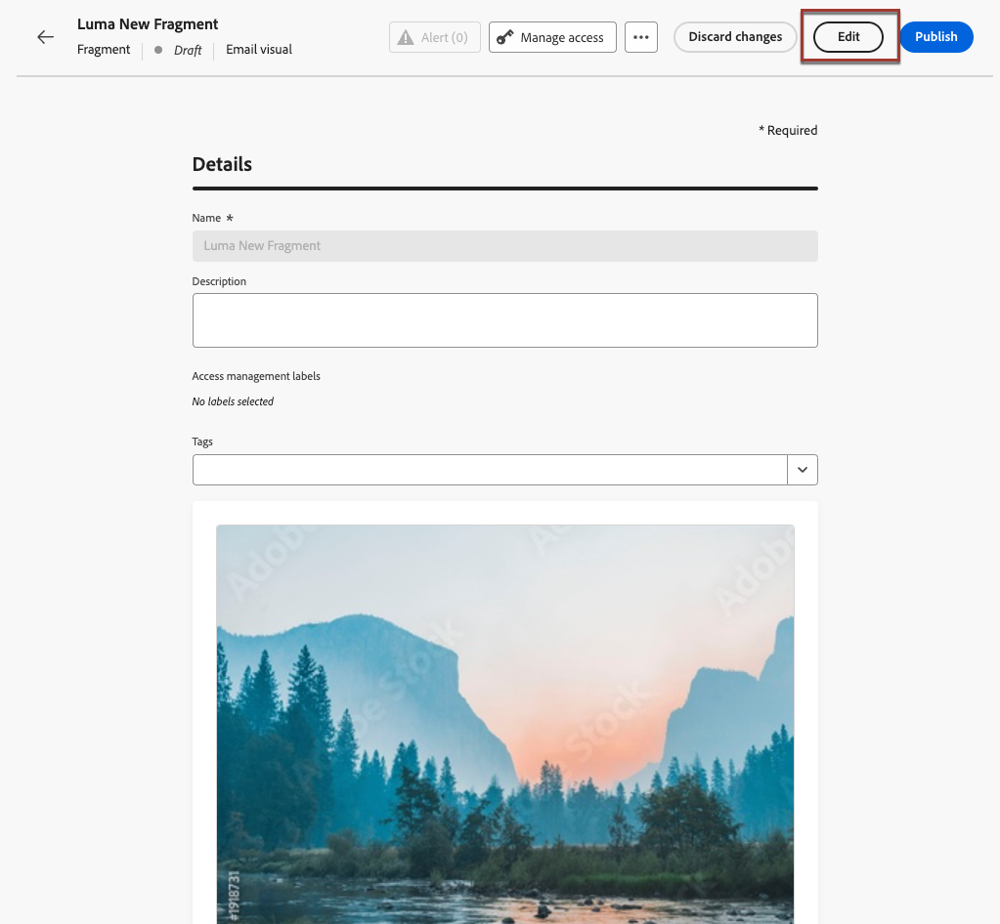{width="70%" align="left"}

   >[!NOTE]
   >
   >編輯已發佈的片段時，您可以移除任何個人化欄位，但無法將新欄位新增至片段內容。 如果您想要新增個人化屬性，您必須復製片段。 [了解更多](#adding-new-attributes)

1. 一旦您的變更準備就緒後，請儲存變更並按一下&#x200B;**[!UICONTROL 發佈]**&#x200B;按鈕讓您的修改上線。 [了解更多](create-fragments.md#publish)

當您編輯片段時，變更會自動傳播至使用該片段的所有內容，包括即時歷程和行銷活動，但您中斷原始片段繼承的內容除外。

>[!NOTE]
>
>瞭解如何中斷[新增視覺化片段至您的電子郵件](../email/use-visual-fragments.md#break-inheritance)和[運用運算式片段](../personalization/use-expression-fragments.md#break-inheritance)區段中的繼承。

### 將新屬性新增到即時片段 {#adding-new-attributes}

>[!WARNING]
>
>不支援將新的[個人化屬性](../personalization/personalization-build-expressions.md)新增到即時片段。

片段發佈後，系統會針對參考該片段的所有行銷活動和歷程，鎖定其個人化或內容屬性集。

若要將其他屬性合併到即時片段，請遵循以下步驟。

1. 使用&#x200B;**[!UICONTROL 更多動作]**&#x200B;按鈕複製現有片段。

   {width="70%" align="left"}

1. 選取要開啟的重複片段，然後按一下&#x200B;**[!UICONTROL 編輯]**&#x200B;按鈕。

1. [將想要的新屬性](../personalization/personalization-build-expressions.md#add)新增到重複的片段，例如個人化欄位。

   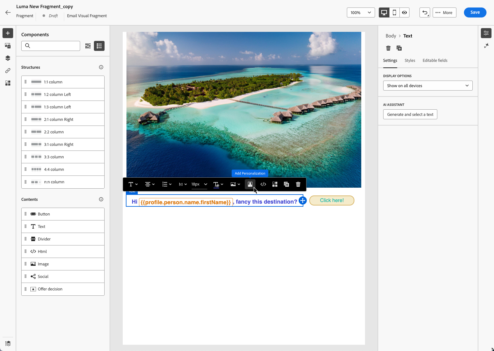{width="70%" align="left"}

1. 儲存變更並發佈新片段。 [了解作法](create-fragments.md#publish)

1. 更新任何行銷活動或歷程，以參考已新增屬性的更新片段。

   * [瞭解如何使用視覺化片段](../email/use-visual-fragments.md)
   * [瞭解如何使用運算式片段](../personalization/use-expression-fragments.md)

## 探索參考 {#explore-references}

您可以顯示目前使用片段的歷程、行銷活動和內容範本清單。 若要這麼做，請在片段清單或片段屬性畫面中，從&#x200B;**[!UICONTROL 更多動作]**&#x200B;選單中選取&#x200B;**[!UICONTROL 探索參考]**。

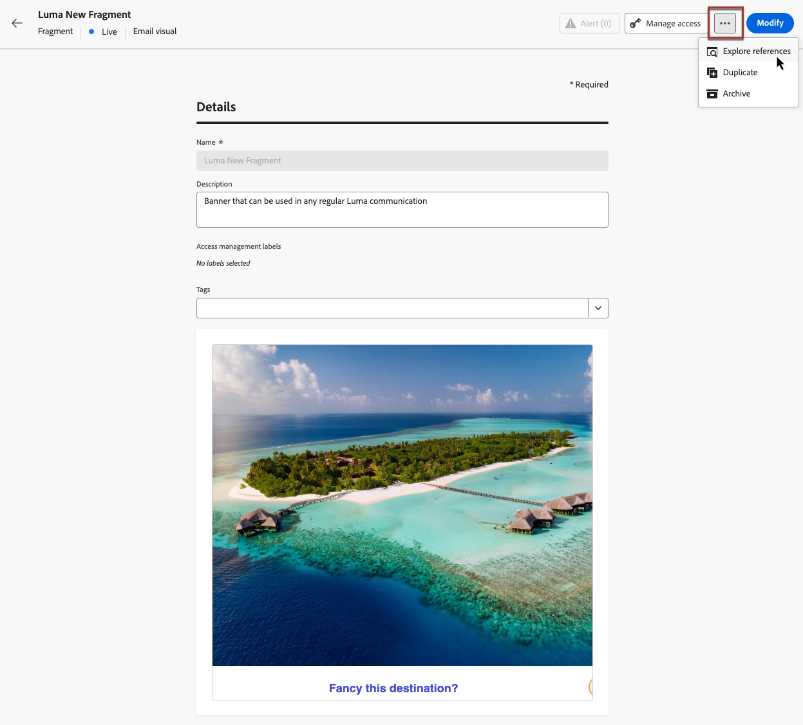{width="70%" align="left"}

選取索引標籤以在歷程、行銷活動、範本和片段之間切換。 您可以檢視其狀態，然後按一下名稱，重新導向至已引用片段的對應專案。

{width="70%" align="left"}

>[!NOTE]
>
>如果片段用於歷程、行銷活動或範本中，且標籤阻止您存取該片段，您會在選取的標籤上方看到警告訊息。 [進一步瞭解物件層級存取控制(OLAC)](../administration/object-based-access.md)

## 封存片段 {#archive-fragments}

您可以從不再與您的品牌相關的專案清除片段清單。

若要這麼做，請按一下所需片段旁的&#x200B;**[!UICONTROL 更多動作]**&#x200B;按鈕，然後選取&#x200B;**[!UICONTROL 封存]**。 它會從片段清單中消失，從而防止使用者在未來的電子郵件或範本中使用它。

{width="70%" align="left"}

>[!NOTE]
>
>如果您封存內容中使用的片段，<!--it will remain in the email or template, but you won't be able to select it from the fragment list to edit it-->該內容將不會受到影響。

若要取消封存片段，請篩選&#x200B;**[!UICONTROL 已封存]**&#x200B;專案，然後從&#x200B;**[!UICONTROL 更多動作]**&#x200B;功能表中選取&#x200B;**[!UICONTROL 取消封存]**。 現在仍可從片段清單存取，並可用於任何電子郵件或範本。

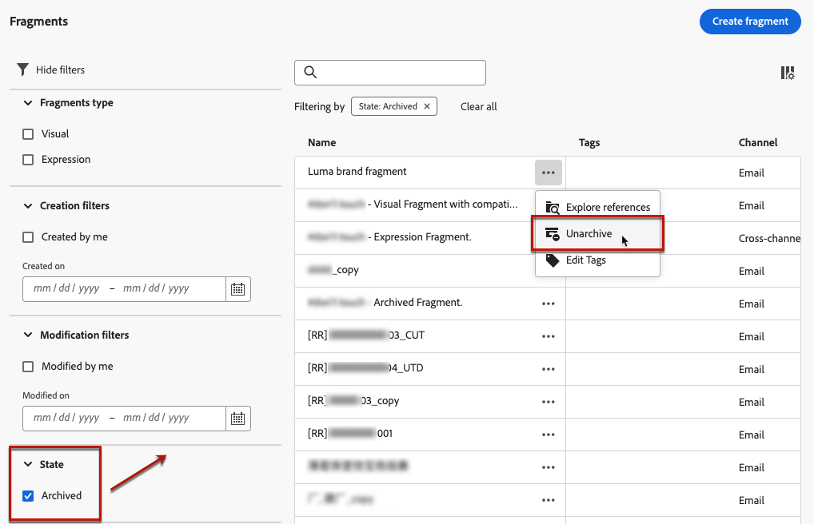{width="70%" align="left"}

## 將片段匯出至另一個沙箱 {#export}

Journey Optimizer可讓您將片段從一個沙箱複製到另一個沙箱。 例如，您可以將片段從中繼沙箱環境複製到生產沙箱。

復製程式是透過來源與目標沙箱之間的&#x200B;**封裝匯出和匯入**&#x200B;進行。 本節提供如何匯出物件並將其匯入目標沙箱的詳細資訊： [將物件複製到另一個沙箱](../configuration/copy-objects-to-sandbox.md)。
