# 使用自動化翻譯建立多語言內容 {#multilingual-automated}

>[!CONTEXTUALHELP]
>id="ajo_multi_add_provider"
>title="新增提供者"
>abstract="根據需要新增翻譯提供者和語系設定。您可以藉此管理專案目前可用的提供者和語系設定，並根據目前的需求和專案範圍彈性調整資源和目標對象。"

>[!CONTEXTUALHELP]
>id="ajo_multi_edit_provider"
>title="編輯提供者"
>abstract="修改現有翻譯提供者並視需要新增語系設定。您可以利用此功能控制專案目前可用的提供者和語系設定，使您能夠根據目前的需求和專案目標彈性調整資源並鎖定特定對象。"

>[!IMPORTANT]
>
>針對自動化流程，使用者需要與&#x200B;**[!UICONTROL 翻譯服務]**&#x200B;功能相關的許可權。 [進一步瞭解許可權](../administration/permissions.md)

使用自動化流程，您只需選取目標語言和語言提供者即可。 然後您的內容會直接傳送到翻譯，準備在完成後進行最終審查。

請依照下列步驟，使用自動翻譯建立多語言內容：

1. [新增您的提供者](multilingual-provider.md)

1. [新增地區（選擇性）](multilingual-locale.md)

1. [建立語言專案](#create-translation-project)

1. [建立語言設定](#create-language-settings)

1. [建立多語言內容](#create-a-multilingual-campaign)

1. [檢閱您的翻譯任務（選擇性）](#review-translation-project)

## 建立翻譯專案 {#translation-project}

>[!CONTEXTUALHELP]
>id="ajo_multi_create_project"
>title="建立專案"
>abstract="若要開始建立多語言內容，請確認目標地區設定，為您的對象選取適當的語言或當地方言來啟動翻譯專案。之後，選擇符合您專案需求的翻譯提供者。"

>[!CONTEXTUALHELP]
>id="ajo_multi_edit_project"
>title="編輯專案"
>abstract="更新您的翻譯專案以加入其他地區設定，使您能夠擴展內容以接觸更廣大的對象。"

透過指定Target地區設定來開始您的翻譯專案，指示內容的特定語言或地區。 之後，您可以選擇您的翻譯提供者。

1. 從&#x200B;**[!UICONTROL 內容管理]**&#x200B;下的&#x200B;**[!UICONTROL 翻譯]**&#x200B;功能表，按一下&#x200B;**[!UICONTROL 專案]**&#x200B;索引標籤中的&#x200B;**[!UICONTROL 建立專案]**。

   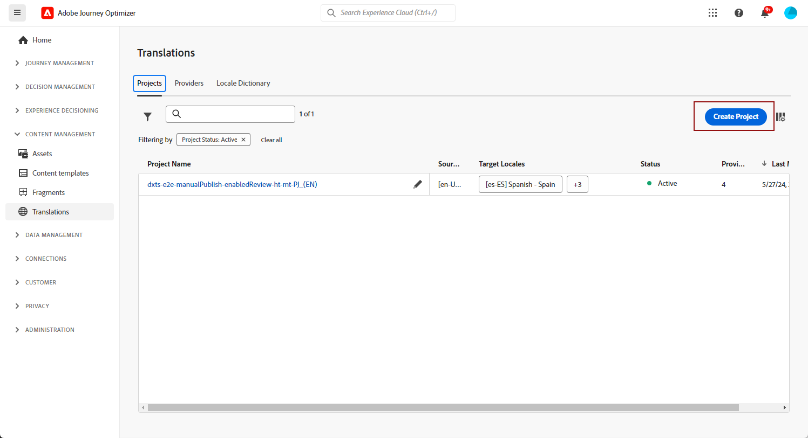

1. 輸入&#x200B;**[!UICONTROL 名稱]**&#x200B;和&#x200B;**[!UICONTROL 描述]**。

1. 選取&#x200B;**[!UICONTROL Source地區設定]**。

   

1. 選擇是否要啟用下列選項：

   * **[!UICONTROL 自動發佈核准的翻譯]**：一旦核准翻譯，這些翻譯就會自動整合到行銷活動中，不需要手動介入。
   * **[!UICONTROL 啟用檢閱工作流程]**：僅適用於人工翻譯的語言環境。 這可讓內部檢閱者有效率地評估及核准或拒絕翻譯的內容。 [了解更多](#review-translation-project)

1. 按一下&#x200B;**[!UICONTROL 新增地區設定]**&#x200B;以存取功能表並定義翻譯專案的語言。

   如果&#x200B;**[!UICONTROL 地區設定]**&#x200B;遺失，您可以預先從&#x200B;**[!UICONTROL 翻譯]**&#x200B;功能表或透過API手動建立。 請參閱[建立新的地區設定](#create-locale)。

   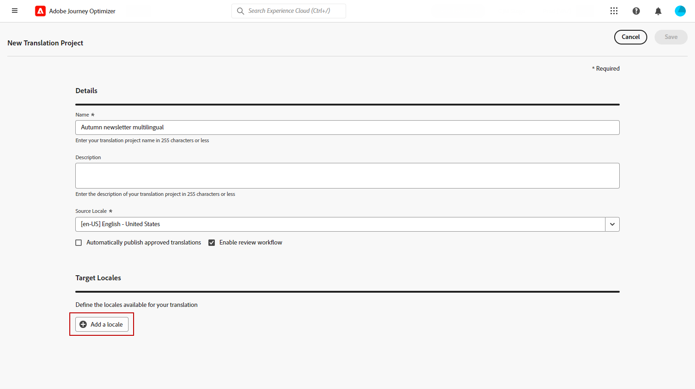

1. 從清單中選取您的&#x200B;**[!UICONTROL Target地區設定]**，然後選擇要用於每個地區設定的&#x200B;**[!UICONTROL 翻譯提供者]**。

   可以從&#x200B;**[!UICONTROL 管理]**&#x200B;功能表區段的&#x200B;**[!UICONTROL 翻譯]**&#x200B;功能表存取&#x200B;**[!UICONTROL 翻譯提供者]**&#x200B;設定。

   >[!NOTE]
   >
   >與翻譯提供者的合約管理不在此功能的範圍內。 請確定您與指定的翻譯合作夥伴訂有有效且有效的合約。
   >
   ></br>翻譯提供者擁有翻譯內容品質的所有權。

1. 當您完成將Target地區設定連結到正確的翻譯提供者時，請按一下&#x200B;**[!UICONTROL 新增地區設定]**。 然後，按一下&#x200B;**[!UICONTROL 儲存]**。

   請注意，如果提供者對於目標地區設定顯示為灰色，表示提供者不支援該特定地區設定。

   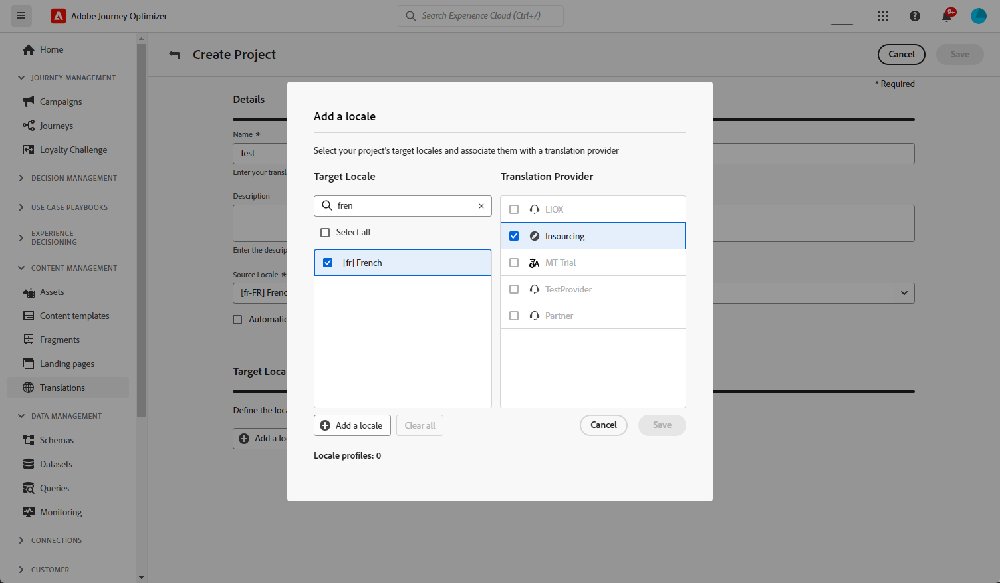

1. 設定您的翻譯專案時，按一下&#x200B;**[!UICONTROL 儲存]**。

您的翻譯專案現已建立，並可用於多語言行銷活動。

## 建立語言設定 {#language-settings}

>[!CONTEXTUALHELP]
>id="ajo_multi_custom_conditional"
>title="自訂條件設定"
>abstract="自訂條件式設定是根據特定條件決定您的內容將在哪個區域顯示的規則集。這些設定可讓您根據使用者位置、語言偏好設定或其他情境元素等因素控制內容顯示。"

>[!CONTEXTUALHELP]
>id="ajo_multi_fallback"
>title="遞補偏好"
>abstract="選擇備援偏好設定對於改善使用者體驗至關重要。如果未選取備援且客戶設定檔不符合必要的需求，將不會傳送內容。透過選取適當的備援，即使客戶設定檔與初始條件不相符，您也可以確保內容傳送一致。"

在本節中，您可以設定管理多語言內容的不同地區設定。 您也可以選擇要用來查閱與設定檔語言相關資訊的屬性。

1. 從&#x200B;**[!UICONTROL 管理]**&#x200B;功能表，存取&#x200B;**[!UICONTROL 管道]** > **[!UICONTROL 一般設定]**。

1. 在&#x200B;**[!UICONTROL 語言設定]**&#x200B;功能表中，按一下&#x200B;**[!UICONTROL 建立語言設定]**。

   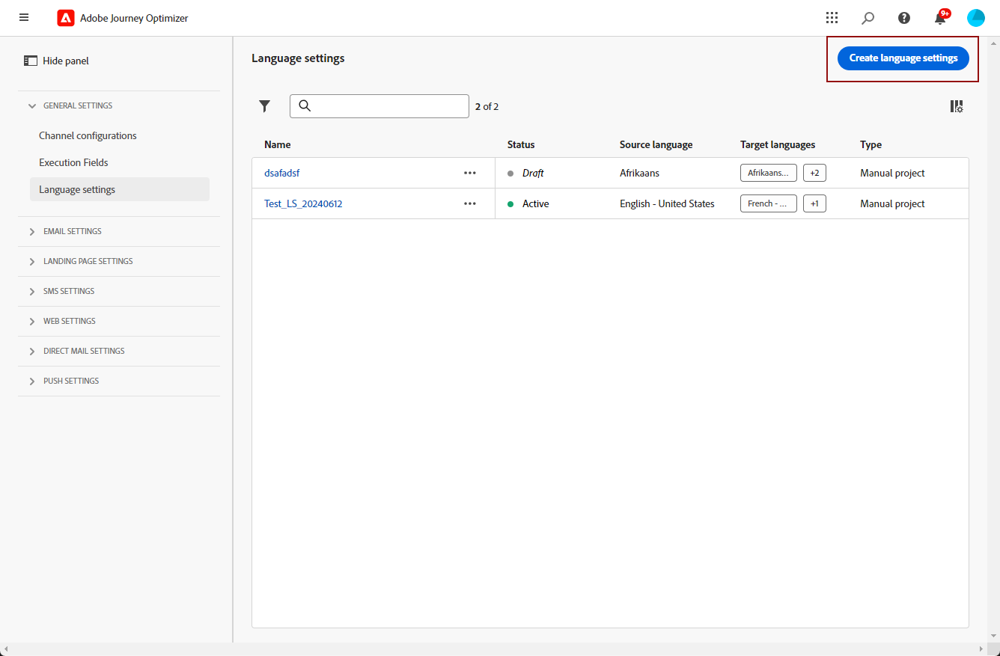

1. 輸入&#x200B;**[!UICONTROL 語言設定]**&#x200B;的名稱，然後選擇&#x200B;**[!UICONTROL 翻譯專案]**。

1. 在&#x200B;**[!UICONTROL 翻譯專案]**&#x200B;欄位中，按一下&#x200B;**[!UICONTROL 編輯]**，然後選擇您先前建立的&#x200B;**[!UICONTROL 翻譯專案]**。

   您先前設定的&#x200B;**[!UICONTROL 地區]**&#x200B;會自動匯入。

1. 選取&#x200B;**[!UICONTROL 遞補偏好設定]**，以定義當設定檔不符合內容傳遞必要條件時的備份選項。

   請注意，如果未選取遞補選項，則不會傳送行銷活動或歷程。

   

1. 從下列選項中選擇您的傳送偏好設定：

   * **[!UICONTROL 選取設定檔語言偏好設定屬性]**
   * **[!UICONTROL 建立自訂條件規則]**

1. 如果您選取&#x200B;**[!UICONTROL 選取設定檔語言喜好設定屬性]**，請從&#x200B;**[!UICONTROL 設定檔語言喜好設定屬性]**&#x200B;功能表選擇相關屬性，以查詢設定檔語言資訊。

   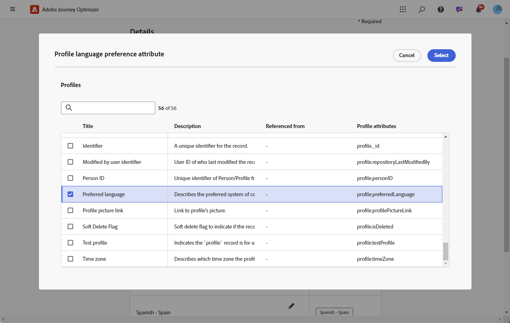

1. 如果您選取&#x200B;**[!UICONTROL 建立自訂條件規則]**，請選取您要建立條件的地區設定。 接著，根據使用者位置、語言偏好設定或其他內容元素等因素建立規則。

   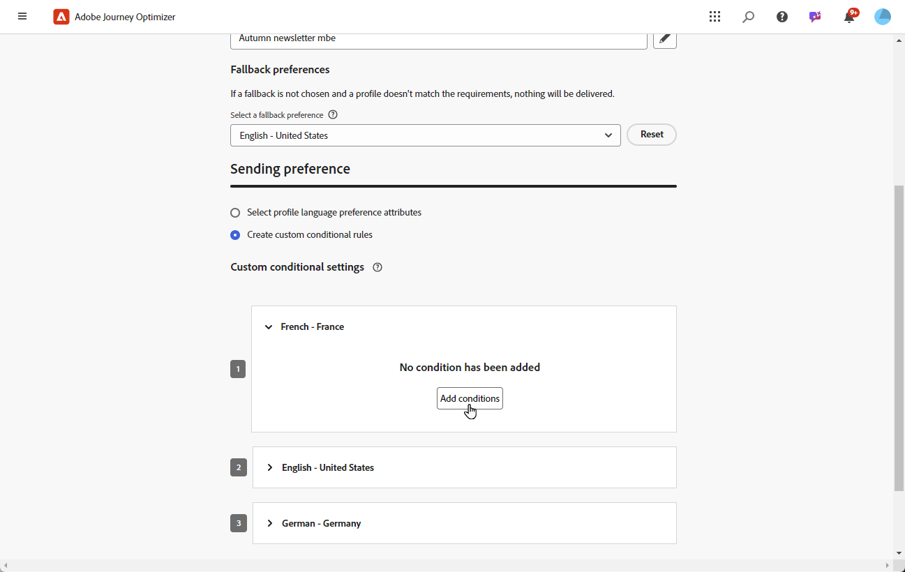

1. 新增屬性、事件或對象來定義目標群組，以開始建立條件。

   >[!IMPORTANT]
   >
   >內容資料僅適用於Web、應用程式內、程式碼型體驗和內容卡頻道。 如果用於電子郵件、SMS、推播通知或直接郵件頻道，在沒有其他屬性的情況下，將使用清單上第一個選項的語言傳送行銷活動或歷程。

   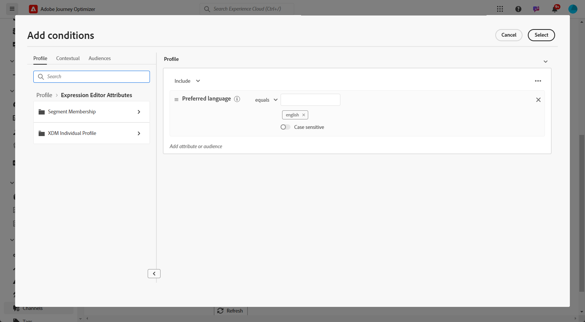

   +++在條件中使用內容事件的先決條件

   當使用者顯示您的內容時，個人化請求會與體驗事件一併傳送。 若要在條件中運用內容資料，您必須將其他資料附加至個人化請求裝載。 若要這麼做，您需要在Adobe Experience Platform資料收集中建立規則以指定：如果傳送了個人化請求，則附加額外資料至請求，定義屬性以符合結構描述中的語言欄位。

   >[!NOTE]
   >
   >這些先決條件僅是應用程式內和內容卡管道的必要條件。

   1. 在Adobe Experience Platform資料收集中，存取您的標籤屬性。

   1. 存取&#x200B;**[!UICONTROL 規則]**&#x200B;功能表並建立新規則。 有關如何建立規則的詳細資訊，請參閱[!DNL Adobe Experience Platform] [資料收集檔案](https://experienceleague.adobe.com/en/docs/experience-platform/collection/e2e#create-a-rule){target="_blank"}

   1. 在規則的&#x200B;**[!UICONTROL IF]**&#x200B;區段中，新增設定如下的事件：

      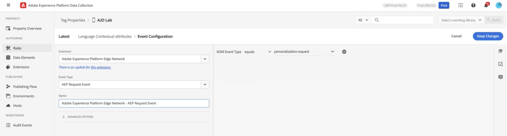

      * 選擇您正在使用的&#x200B;**[!UICONTROL 擴充功能]**。
      * 在&#x200B;**[!UICONTROL 事件型別]**&#x200B;欄位中，選取「AEP要求事件」。
      * 在右窗格中，選取「XDM事件型別等於personalization.request」
      * 按一下&#x200B;**[!UICONTROL 保留變更]**&#x200B;按鈕以確認。

   1. 在規則的&#x200B;**[!UICONTROL THEN]**&#x200B;區段中，新增設定如下的動作：

      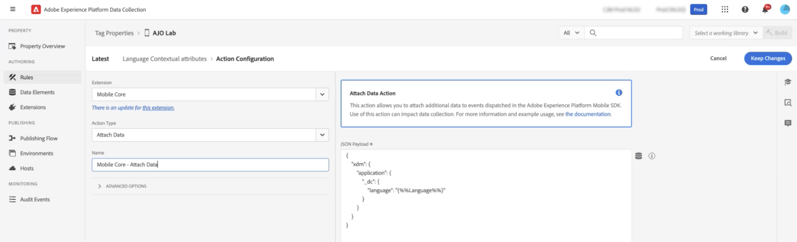

      * 選擇您正在使用的&#x200B;**[!UICONTROL 擴充功能]**。
      * 在&#x200B;**[!UICONTROL 動作型別]**&#x200B;欄位中，選取[附加資料]。
      * 在JSON裝載區段中，確認用於擷取所使用語言的屬性（在以下範例中為「語言」）符合資料收集資料流流入之結構描述中指定的屬性名稱。

        ```JSON
        {
            "xdm":{
                "application":{
                    "_dc":{
                        "language":"{%%Language%%}"
                    }
                }
            }
        }
        ```

      * 按一下「**[!UICONTROL 保留變更]**」按鈕以確認並儲存您的規則。

   +++

1. 拖放地區設定以重新排序，並在清單中管理其優先順序。

1. 按一下&#x200B;**[!UICONTROL 提交]**&#x200B;以建立您的&#x200B;**[!UICONTROL 語言設定]**。

請注意，設定您的語言偏好設定後，您將無法再選擇編輯它們。

<!--
1. Access the **[!UICONTROL channel configurations]** menu and create a new channel configuration or select an existing one.

1. In the **[!UICONTROL Header parameters]** section, select the **[!UICONTROL Enable multilingual]** option.


1. Select your **[!UICONTROL Locales dictionary]** and add as many as needed.
-->

## 建立多語言內容 {#create-multilingual-campaign}

>[!AVAILABILITY]
>
> 程式碼型體驗和內容卡內容的預覽目前無法用於自動化流程。

設定好翻譯專案和語言設定後，您就可以著手建立行銷活動或歷程，並針對不同的地區設定自訂內容。

1. 首先，根據您的需求，建立並設定您的電子郵件、簡訊或推播通知[行銷活動](../campaigns/create-campaign.md)或[歷程](../building-journeys/journeys-message.md)。

1. 建立主要內容後，按一下&#x200B;**[!UICONTROL 儲存]**，然後返回行銷活動設定畫面。

1. 按一下&#x200B;**[!UICONTROL 新增語言]**。  [了解更多](#create-language-settings)

   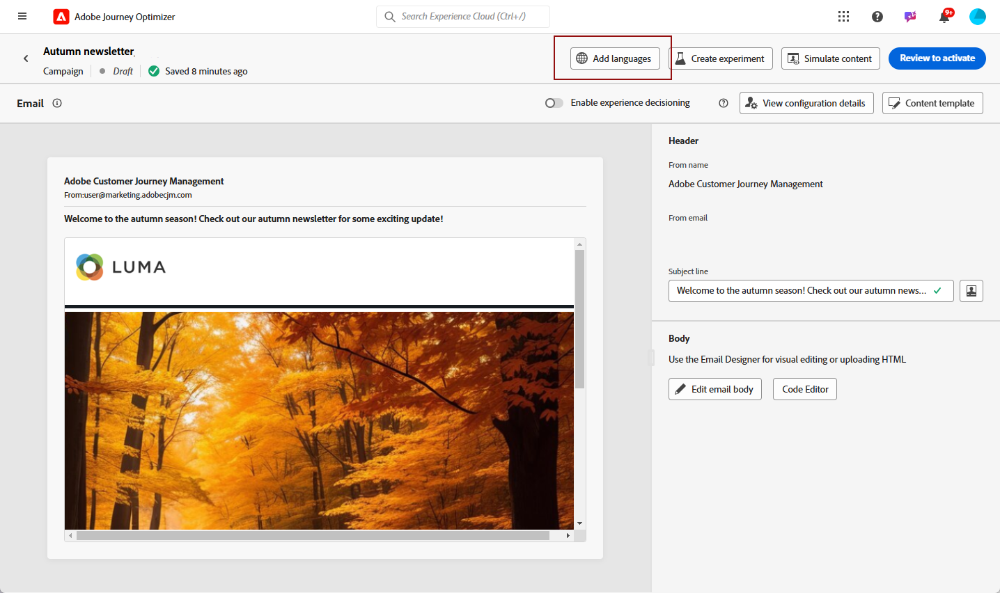

1. 選取您先前建立的&#x200B;**[!UICONTROL 語言設定]**。

   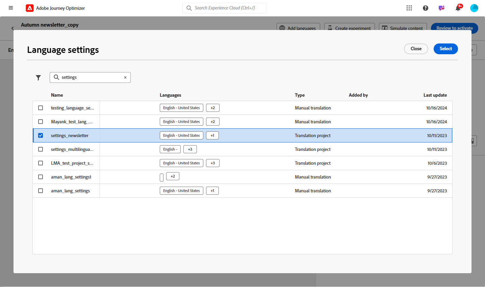

1. 現在您的地區設定已匯入，請按一下&#x200B;**[!UICONTROL 傳送以進行翻譯]**，將您的內容轉送給先前選取的翻譯提供者。

   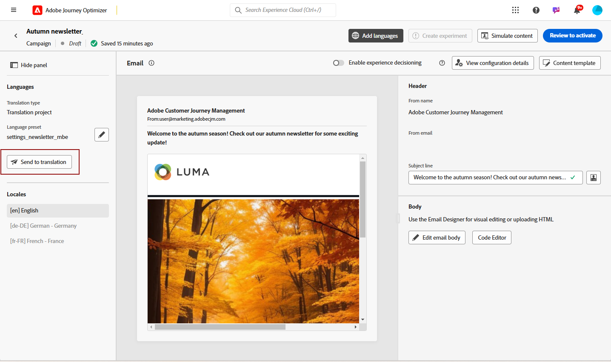

1. 傳送內容以供翻譯後，將無法再編輯內容。 若要變更原始內容，請按一下鎖定圖示。

   請注意，如果您想要對此內容進行任何變更，您將需要建立新的翻譯專案並重新傳送以進行翻譯。

   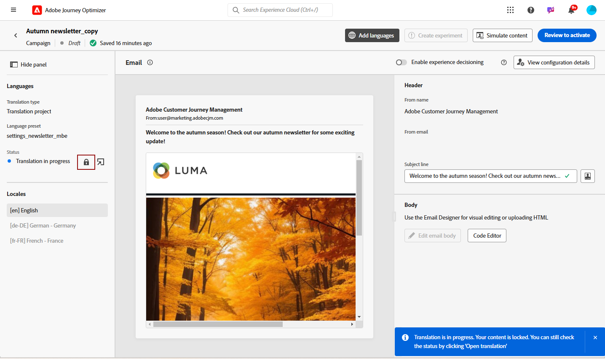

1. 按一下&#x200B;**[!UICONTROL 開啟翻譯]**&#x200B;以存取您的翻譯專案並加以檢閱。

   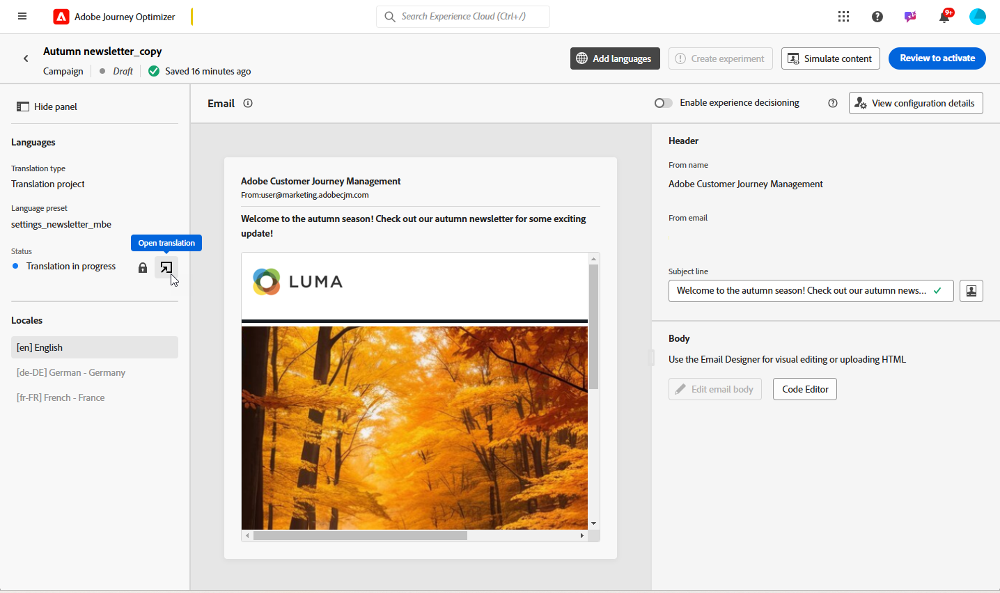

1. 在此頁面中，依照翻譯專案狀態進行：

   * **[!UICONTROL 正在進行翻譯]**：您的服務供應商正在處理翻譯。

     如果您在設定&#x200B;**語言設定**&#x200B;時選取&#x200B;**Insourcing**，則可直接在翻譯專案中翻譯內容。 [了解更多](#manage-ht-project)

   * **[!UICONTROL 已準備好檢閱]**：檢閱程式已準備就緒，可讓您存取翻譯並拒絕或核准它。

     如果您在您的&#x200B;**[!UICONTROL 翻譯專案]**&#x200B;中選取&#x200B;**[!UICONTROL 啟用檢閱工作流程]**，則您可在所選翻譯提供者完成之後，直接在Journey Optimizer中檢閱翻譯。 [了解更多](#review-translation-project)

   * **[!UICONTROL 已檢閱]**：已核准翻譯，且已準備好發佈並傳送至行銷活動。

   * **[!UICONTROL 準備發佈]**：機器翻譯已完成，現在可以傳送給您的行銷活動。

   * **[!UICONTROL 已完成]**：您的行銷活動現在提供翻譯。

   

1. 翻譯完成後，您的多語言內容就可以傳送了。

   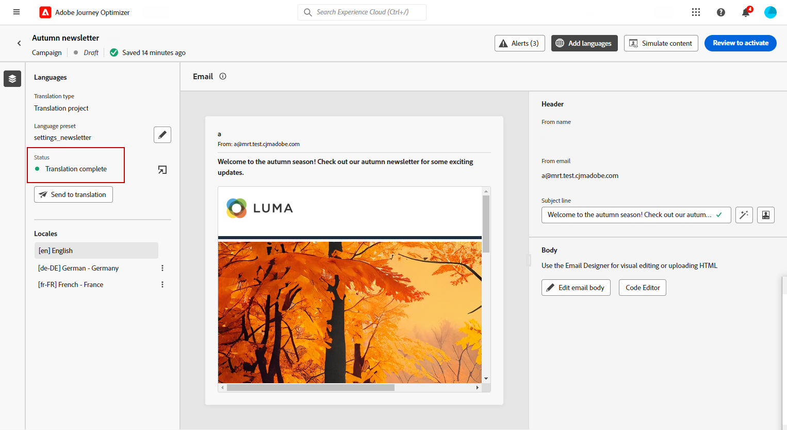

1. 按一下&#x200B;**[!UICONTROL 檢閱以啟動]**&#x200B;以顯示行銷活動的摘要。

   摘要可讓您視需要修改行銷活動，以及檢查是否有任何引數不正確或遺失。

1. 瀏覽您的多語言內容，檢視每種語言的轉譯。

   

1. 檢查您的行銷活動是否已正確設定，然後按一下[啟動]。****

   >[!IMPORTANT]
   >
   > 如果您的行銷活動受核准政策的約束，您將需要請求核准才能傳送您的多語言行銷活動。 [了解更多](../test-approve/gs-approval.md)

您現在可以啟動行銷活動或歷程。 傳送後，您可以在報表中測量多語言歷程或行銷活動的影響。

## 管理委內處理的翻譯專案 {#manage-ht-project}

>[!CONTEXTUALHELP]
>id="ajo_multi_insourcing_project"
>title="委內處理的翻譯專案"
>abstract="委內處理的翻譯專案讓您直接在翻譯專案中管理和執行翻譯，簡化流程並加強控管翻譯品質和一致性。"

如果您在設定語言設定時選取Insourcing，則可以直接在翻譯專案中翻譯內容。

1. 從您的&#x200B;**[!UICONTROL 翻譯專案]**，存取&#x200B;**[!UICONTROL 更多動作]**&#x200B;功能表並選取&#x200B;**[!UICONTROL Insourcing]**。

   

1. 您可以使用外部翻譯軟體匯出CSV檔案以進行翻譯。 或者，您可以按一下&#x200B;**[!UICONTROL 匯入CSV]**&#x200B;按鈕，將CSV檔案匯入回您的翻譯專案。

   

1. 按一下&#x200B;**[!UICONTROL 編輯]**&#x200B;以新增您的翻譯內容。

   

1. 如果您已準備好發佈翻譯的文字，請按一下&#x200B;**[!UICONTROL 完成]**。

## 檢閱您的翻譯專案 {#review-translation-project}

>[!CONTEXTUALHELP]
>id="ajo_multi_review_project"
>title="檢閱您的翻譯專案"
>abstract="您選擇的翻譯提供者完成翻譯後，您可以直接在 Journey Optimizer 中檢閱結果。您可以藉此評估翻譯的準確性和品質，在最終確定之前須確保其符合您的期望和專案需求。"

>[!CONTEXTUALHELP]
>id="ajo_multi_preview_project"
>title="預覽您的翻譯專案"
>abstract="您可以利用預覽視窗檢視以每一種語言顯示的翻譯內容。此功能可協助您檢查翻譯結果並確保選取的所有語言均能正確且有效地顯示內容。"

如果您在您的&#x200B;**[!UICONTROL 翻譯專案]**&#x200B;中選取&#x200B;**[!UICONTROL 啟用檢閱工作流程]**，則您可在所選翻譯提供者完成之後，直接在Journey Optimizer中檢閱翻譯。

請注意，如果停用此選項，當您的提供者完成翻譯後，翻譯工作狀態會自動設定為&#x200B;**[!UICONTROL 已檢閱]**，允許您按一下&#x200B;**[!UICONTROL 發佈]**&#x200B;來快速繼續。

1. 一旦您的翻譯從服務供應商處完成，您就可以從&#x200B;**[!UICONTROL 翻譯專案]**&#x200B;或直接從&#x200B;**[!UICONTROL 行銷活動]**&#x200B;存取翻譯以供檢閱。

   從&#x200B;**[!UICONTROL 其他動作]**&#x200B;功能表，按一下&#x200B;**[!UICONTROL 檢閱]**。

   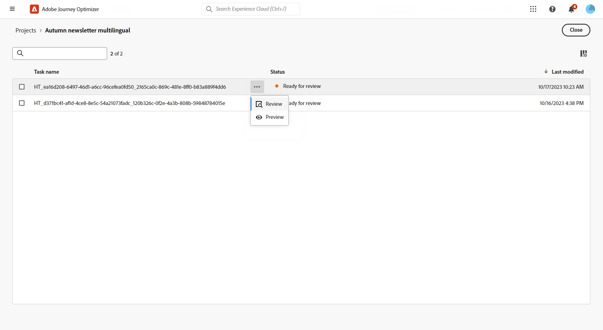

1. 從「稽核」視窗瀏覽翻譯的內容，並接受或拒絕每個翻譯字串。

   

1. 按一下&#x200B;**[!UICONTROL 編輯]**&#x200B;以變更翻譯字串的內容。

   

1. 輸入您更新的翻譯，然後在完成時按一下&#x200B;**[!UICONTROL 確認]**。

   

1. 您也可以選擇直接&#x200B;**[!UICONTROL 全部拒絕]**&#x200B;或&#x200B;**[!UICONTROL 全部核准]**。

   選取&#x200B;**[!UICONTROL 全部拒絕]**&#x200B;時，新增註解並按一下&#x200B;**[!UICONTROL 拒絕]**。

1. 按一下&#x200B;**[!UICONTROL 預覽]**&#x200B;以檢查您翻譯的內容以每種語言的轉譯。

1. 如果您已準備好發佈翻譯的文字，請按一下&#x200B;**[!UICONTROL 完成]**。

   

1. 從您的&#x200B;**[!UICONTROL 翻譯專案]**，選取其中一個專案以存取更多詳細資料。 如果您拒絕翻譯，則可以選擇將其傳送回翻譯。

   

1. 一旦您的&#x200B;**[!UICONTROL 翻譯專案]**&#x200B;狀態設定為「已檢閱」，您就可以將其傳送至您的行銷活動。

   從&#x200B;**[!UICONTROL 其他動作]**&#x200B;功能表，按一下&#x200B;**[!UICONTROL 發佈]**。

   

1. 在您的行銷活動中，檢查您的翻譯狀態是否已變更為&#x200B;**[!UICONTROL 翻譯完成]**。 您現在可以傳送您的多語言內容，請參閱[本節](#create-multilingual-campaign)中的步驟10。

   

<!--
# Create a multilingual journey {#create-multilingual-journey}

1. Create your journey with a Delivery and personalize your content as needed.
1. From your delivery action, click Edit content.
1. Click Add languages.


-->
