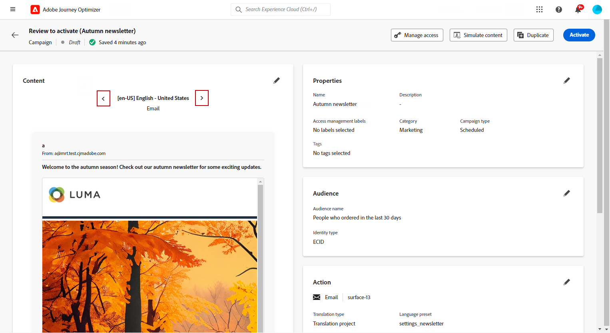

# 使用自動化翻譯建立多語言內容 {#multilingual-automated}

>[!BEGINSHADEBOX]

**目錄**

* [開始使用多語言內容](multilingual-gs.md)
* [使用手動翻譯建立多語言內容](multilingual-manual.md)
* **[使用自動化翻譯建立多語言內容](multilingual-automated.md)**
* [多語言行銷活動報告](multilingual-report.md)

>[!ENDSHADEBOX]

使用自動化流程，您只需選取目標語言和語言提供者即可。 然後您的內容會直接傳送到翻譯，準備在完成後進行最終審查。

請依照下列步驟，使用自動翻譯建立多語言內容：

1. [建立您的地區設定](#create-locale).

1. [建立語言專案](#create-translation-project).

1. [建立語言設定](#create-language-settings).

1. [建立多語言行銷活動](#create-a-multilingual-campaign).

1. [檢閱您的翻譯任務（選擇性）](#review-translation-project).

## 建立地區設定 {#create-locale}

設定語言設定時，如 [建立您的語言設定](#language-settings) 區段，如果特定地區設定無法供多語言內容使用，您就可以彈性地使用 **[!UICONTROL 翻譯]** 功能表。

1. 從 **[!UICONTROL 管理]** 功能表，存取 **[!UICONTROL 頻道]**.

   翻譯功能表可讓您存取已啟動地區設定的清單。

1. 從 **[!UICONTROL 地區設定字典]** 標籤，按一下 **[!UICONTROL 新增地區設定]**.

   

1. 從中選擇您的地區設定代碼 **[!UICONTROL 語言]** 清單和相關聯的 **[!UICONTROL 地區]**.

1. 按一下 **[!UICONTROL 儲存]** 以建立您的地區設定。

   

## 建立翻譯專案 {#translation-project}

透過指定Target地區設定來開始您的翻譯專案，指示內容的特定語言或地區。 之後，您可以選擇您的翻譯提供者。

1. 從 **[!UICONTROL 翻譯專案]** 下的選單 **[!UICONTROL 內容管理]**，按一下 **[!UICONTROL 建立專案]**.

   

1. 輸入a **[!UICONTROL 名稱]** 和 **[!UICONTROL 說明]**.

1. 選取 **[!UICONTROL 來源地區設定]**.

   

1. 選擇是否要啟用下列選項：

   * **[!UICONTROL 自動發佈已核准的翻譯]**：在核准翻譯後，這些翻譯會自動整合至行銷活動，無需手動干預。
   * **[!UICONTROL 啟用稽核工作流程]**：僅適用於人工翻譯的語言環境。 這可讓內部檢閱者有效率地評估及核准或拒絕翻譯的內容。 [了解更多](#review-translation-project)

1. 按一下 **[!UICONTROL 新增地區設定]** 以存取功能表並定義翻譯專案的語言。

   如果 **[!UICONTROL 地區設定]** 遺失，您可以預先從 **[!UICONTROL 翻譯]** 功能表或API。 請參閱 [建立新的地區設定](#create-locale).

   

1. 從清單中選取 **[!UICONTROL 目標地區設定]** 並選擇哪個 **[!UICONTROL 翻譯提供者]** 要用於每個地區設定。

1. 按一下 **[!UICONTROL 新增地區]** 當您完成將Target地區設定連結到正確的翻譯提供者時。 然後，按一下 **[!UICONTROL 儲存]**.

   請注意，如果提供者對於目標地區設定顯示為灰色，表示提供者不支援該特定地區設定。

   

1. 按一下 **[!UICONTROL 儲存]** 設定您的翻譯專案時。

您的翻譯專案現已建立，並可用於多語言行銷活動。

## 建立語言設定 {#language-settings}

您可以在此段落中設定主要語言及其相關語言環境，以管理多語言內容。 您也可以選擇要用來查閱與設定檔語言相關資訊的屬性。

1. 從 **[!UICONTROL 管理]** 功能表，存取 **[!UICONTROL 頻道]**.

1. 在 **[!UICONTROL 語言設定]** 功能表，按一下 **[!UICONTROL 建立語言設定]**.

   

1. 輸入您的名稱 **[!UICONTROL 語言設定]**.

1. 選擇 **[!UICONTROL 翻譯專案]** 選項。

1. 從 **[!UICONTROL 翻譯專案]** 欄位，按一下 **[!UICONTROL 編輯]** 並選擇您先前建立的 **[!UICONTROL 翻譯專案]**.

   您先前設定的地區設定會自動匯入。

   

1. 從 **[!UICONTROL 傳送偏好設定]** 功能表，選取您要查詢以尋找設定檔語言資訊的屬性。

1. 按一下 **[!UICONTROL 編輯]** 位於您的 **[!UICONTROL 地區設定]** 以進一步個人化並新增 **[!UICONTROL 設定檔偏好設定]**.

   

1. 若您的 **[!UICONTROL 翻譯專案]** 已更新，請按一下 **[!UICONTROL 重新整理]** 以反映這些變更 **[!UICONTROL 語言設定]**.

   

1. 按一下 **[!UICONTROL 提交]** 建立您的 **[!UICONTROL 語言設定]**.

<!--
1. Access the **[!UICONTROL Channel surfaces]** menu and create a new channel surface or select an existing one.

1. In the **[!UICONTROL Header parameters]** section, select the **[!UICONTROL Enable multilingual]** option.

1. Select your **[!UICONTROL Locales dictionary]** and add as many as needed.
-->

## 建立多語言行銷活動 {#create-multilingual-campaign}

設定好翻譯專案和語言設定後，您就可以開始建立行銷活動，並針對不同的地區設定自訂內容。

1. 首先，根據您的要求建立和設定您的電子郵件、簡訊或推播通知行銷活動。 [了解更多](../campaigns/create-campaign.md)

1. 建立主要內容後，按一下 **[!UICONTROL 儲存]** 並返回campaign設定畫面。

1. 按一下 **[!UICONTROL 新增語言]**.  [了解更多](#create-language-settings)

   

1. 選取您先前建立的 **[!UICONTROL 語言設定]**.

   

1. 現在您的地區設定已匯入，請按一下 **[!UICONTROL 傳送以翻譯]** 將您的內容轉寄給先前選取的翻譯提供者。

   

1. 傳送內容以供翻譯後，將無法再編輯內容。 若要變更原始內容，請按一下鎖定圖示。

   請注意，如果您想要對此內容進行任何變更，您將需要建立新的翻譯專案並重新傳送以進行翻譯。

   

1. 按一下 **[!UICONTROL 開啟翻譯]** 以存取並檢閱您的翻譯專案。

   

1. 在此頁面中，依照翻譯專案狀態進行：

   * **[!UICONTROL 翻譯進行中]**：您的服務供應商正在積極處理翻譯工作。
   * **[!UICONTROL 準備好審查]**：評論程式已準備就緒，可讓您存取翻譯，並拒絕或核准翻譯。
   * **[!UICONTROL 已檢閱]**：翻譯已獲核准，可傳送至行銷活動。
   * **[!UICONTROL 準備發佈]**：機器翻譯已完成，現在可傳送至您的行銷活動。
   * **[!UICONTROL 已完成]**：您的行銷活動現在提供翻譯。

   

1. 翻譯完成後，您的多語言內容就可以傳送了。

   

1. 按一下 **[!UICONTROL 檢閱以啟動]** 以顯示行銷活動的摘要。

   摘要可讓您視需要修改行銷活動，以及檢查是否有任何引數不正確或遺失。

1. 瀏覽您的多語言內容，檢視每種語言的轉譯。

   

1. 檢查您的行銷活動是否已正確設定，然後按一下 **[!UICONTROL 啟動]**.

您的行銷活動現在已啟用。 行銷活動中設定的訊息會立即傳送，或於指定日期傳送。 請注意，您的行銷活動一旦上線，就無法修改。 若要重複使用內容，您可以複製Campaign。

傳送後，您可以在行銷活動報表中測量行銷活動的影響。

## 管理內部翻譯專案 {#manage-ht-project}

如果您在設定語言設定時選取了內部翻譯，則可直接在翻譯專案中翻譯內容。

1. 從您的 **[!UICONTROL 翻譯專案]**，存取 **[!UICONTROL 更多動作]** 功能表並選取 **[!UICONTROL 內部翻譯]**.

   

1. 您可以使用外部翻譯軟體匯出CSV檔案以進行翻譯。 或者，您可以按一下「 」，將CSV檔案匯入回翻譯專案 **[!UICONTROL 匯入CSV]** 按鈕。

   

1. 按一下 **[!UICONTROL 編輯]** 以新增您的翻譯內容。

   

1. 如果您已準備好發佈翻譯的文字，請按一下 **[!UICONTROL 完成]**.

## 檢閱您的翻譯專案 {#review-translation-project}

如果您已選取 **[!UICONTROL 啟用稽核工作流程]** 在您的 **[!UICONTROL 翻譯專案]**，您可在選取的翻譯提供者完成翻譯後，直接在Journey Optimizer中檢閱翻譯。

請注意，如果停用此選項，當您的提供者完成翻譯後，翻譯任務狀態會自動設為 **[!UICONTROL 已檢閱]**，按一下「 」即可快速繼續 **[!UICONTROL 發佈]**.

1. 服務供應商提供的翻譯完成後，您即可存取翻譯，以供稽核。 **[!UICONTROL 翻譯專案]** 或直接從您的 **[!UICONTROL Campaign]**.

   從 **[!UICONTROL 更多動作]** 功能表，按一下 **[!UICONTROL 檢閱]**.

   

1. 從「稽核」視窗瀏覽翻譯的內容，並接受或拒絕每個翻譯字串。

   

1. 按一下 **[!UICONTROL 編輯]** 以變更翻譯字串的內容。

   

1. 輸入更新後的翻譯，然後按一下 **[!UICONTROL 確認]** 完成後。

   

1. 您也可以選擇 **[!UICONTROL 全部拒絕]** 或 **[!UICONTROL 全部核准]** 直接。

   當選取 **[!UICONTROL 全部拒絕]**，新增註解並按一下 **[!UICONTROL 拒絕]**.

1. 按一下 **[!UICONTROL 預覽]** 檢查每種語言翻譯內容的轉譯。

1. 如果您已準備好發佈翻譯的文字，請按一下 **[!UICONTROL 完成]**.

   

1. 從您的 **[!UICONTROL 翻譯專案]**，選取其中一個專案以存取更多詳細資料。 如果您拒絕翻譯，則可以選擇將其傳送回翻譯。

   

1. 一旦您的 **[!UICONTROL 翻譯專案]** 狀態已設為「已檢閱」，您可以將其傳送至您的Campaign。

   從 **[!UICONTROL 更多動作]** 功能表，按一下 **[!UICONTROL 發佈]**.

   

1. 在您的Campaign中，檢查您的翻譯狀態是否已變更為 **[!UICONTROL 翻譯完成]**. 您現在可以傳送多語言內容，請參閱中的步驟10 [本節](#create-multilingual-campaign).

   

<!--
# Create a multilingual journey {#create-multilingual-journey}

1. Create your journey with a Delivery and personalize your content as needed.
1. From your delivery action, click Edit content.
1. Click Add languages.

-->
