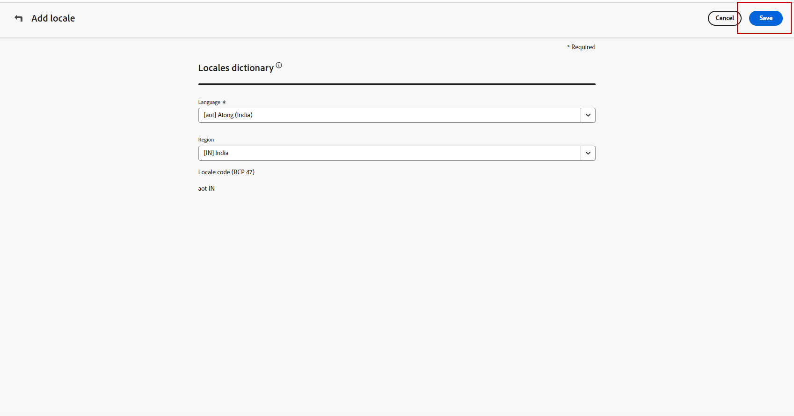
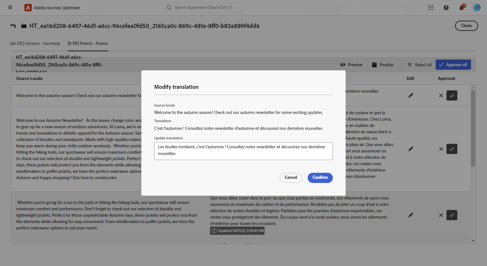

# 使用自動化翻譯建立多語言內容 {#multilingual-automated}

>[!AVAILABILITY]
>
>多種語言內容目前僅適用於一組組織 (可用性限制)。若要取得存取權，請和您的 Adobe 代表聯絡。

使用自動化流程，您只需選取目標語言和語言提供者即可。 然後您的內容會直接傳送到翻譯，準備在完成後進行最終審查。

請依照下列步驟，使用自動翻譯建立多語言內容：

1. [建立您的地區設定](#create-locale)。

1. [建立語言專案](#create-translation-project)。

1. [建立語言設定](#create-language-settings)。

1. [建立多語言內容](#create-a-multilingual-campaign)。

1. [檢閱您的翻譯工作（選擇性）](#review-translation-project)。

## 建立地區設定 {#create-locale}

如[建立您的語言設定](#language-settings)一節中所述，設定您的語言設定時，如果多語言內容沒有特定的地區設定，您可以使用&#x200B;**[!UICONTROL 翻譯]**&#x200B;功能表彈性地建立所需數量的新地區設定。

1. 從&#x200B;**[!UICONTROL 內容管理]**&#x200B;功能表，存取&#x200B;**[!UICONTROL 翻譯]**。

1. 從&#x200B;**[!UICONTROL 地區設定字典]**&#x200B;索引標籤，按一下&#x200B;**[!UICONTROL 新增地區設定]**。

   

1. 從&#x200B;**[!UICONTROL 語言]**&#x200B;清單和相關的&#x200B;**[!UICONTROL 地區]**&#x200B;選取您的地區設定代碼。

1. 按一下&#x200B;**[!UICONTROL 儲存]**&#x200B;以建立您的地區設定。

   

## 建立翻譯專案 {#translation-project}

透過指定Target地區設定來開始您的翻譯專案，指示內容的特定語言或地區。 之後，您可以選擇您的翻譯提供者。

1. 從&#x200B;**[!UICONTROL 內容管理]**&#x200B;下的&#x200B;**[!UICONTROL 翻譯]**&#x200B;功能表，按一下&#x200B;**[!UICONTROL 專案]**&#x200B;索引標籤中的&#x200B;**[!UICONTROL 建立專案]**。

   

1. 輸入&#x200B;**[!UICONTROL 名稱]**&#x200B;和&#x200B;**[!UICONTROL 描述]**。

1. 選取&#x200B;**[!UICONTROL Source地區設定]**。

   

1. 選擇是否要啟用下列選項：

   * **[!UICONTROL 自動發佈核准的翻譯]**：一旦核准翻譯，這些翻譯就會自動整合到行銷活動中，不需要手動介入。
   * **[!UICONTROL 啟用檢閱工作流程]**：僅適用於人工翻譯的語言環境。 這可讓內部檢閱者有效率地評估及核准或拒絕翻譯的內容。 [了解更多](#review-translation-project)

1. 按一下&#x200B;**[!UICONTROL 新增地區設定]**&#x200B;以存取功能表並定義翻譯專案的語言。

   如果&#x200B;**[!UICONTROL 地區設定]**&#x200B;遺失，您可以預先從&#x200B;**[!UICONTROL 翻譯]**&#x200B;功能表或透過API手動建立。 請參閱[建立新的地區設定](#create-locale)。

   

1. 從清單中選取您的&#x200B;**[!UICONTROL Target地區設定]**，然後選擇要用於每個地區設定的&#x200B;**[!UICONTROL 翻譯提供者]**。

   可以從&#x200B;**[!UICONTROL 管理]**&#x200B;功能表區段的&#x200B;**[!UICONTROL 翻譯]**&#x200B;功能表存取&#x200B;**[!UICONTROL 翻譯提供者]**&#x200B;設定。

   >[!NOTE]
   >
   >與翻譯提供者的合約管理不在此功能的範圍內。 請確定您與指定的翻譯合作夥伴訂有有效且有效的合約。
   >
   > 翻譯提供者擁有翻譯內容品質的所有權。

1. 當您完成將Target地區設定連結到正確的翻譯提供者時，請按一下&#x200B;**[!UICONTROL 新增地區設定]**。 然後，按一下&#x200B;**[!UICONTROL 儲存]**。

   請注意，如果提供者對於目標地區設定顯示為灰色，表示提供者不支援該特定地區設定。

   

1. 設定您的翻譯專案時，按一下&#x200B;**[!UICONTROL 儲存]**。

您的翻譯專案現已建立，並可用於多語言行銷活動。

## 建立語言設定 {#language-settings}

您可以在此段落中設定主要語言及其相關語言環境，以管理多語言內容。 您也可以選擇要用來查閱與設定檔語言相關資訊的屬性。

1. 從&#x200B;**[!UICONTROL 管理]**&#x200B;功能表，存取&#x200B;**[!UICONTROL 管道]** > **[!UICONTROL 一般設定]**。

1. 在&#x200B;**[!UICONTROL 語言設定]**&#x200B;功能表中，按一下&#x200B;**[!UICONTROL 建立語言設定]**。

   

1. 輸入您&#x200B;**[!UICONTROL 語言設定]**&#x200B;的名稱。

1. 選擇&#x200B;**[!UICONTROL 翻譯專案]**&#x200B;選項。

1. 在&#x200B;**[!UICONTROL 翻譯專案]**&#x200B;欄位中，按一下&#x200B;**[!UICONTROL 編輯]**，然後選擇您先前建立的&#x200B;**[!UICONTROL 翻譯專案]**。

   您先前設定的地區設定會自動匯入。

   

1. 從&#x200B;**[!UICONTROL 傳送喜好設定]**&#x200B;功能表，選取您要查詢以尋找設定檔語言資訊的屬性。

1. 按一下&#x200B;**[!UICONTROL 地區設定]**&#x200B;旁的&#x200B;**[!UICONTROL 編輯]**，進一步個人化設定檔並新增&#x200B;**[!UICONTROL 設定檔偏好設定]**。

   

1. 如果您的&#x200B;**[!UICONTROL 翻譯專案]**&#x200B;已更新，請按一下&#x200B;**[!UICONTROL 重新整理]**，以便在您的&#x200B;**[!UICONTROL 語言設定]**&#x200B;中反映這些變更。

   

1. 按一下&#x200B;**[!UICONTROL 提交]**&#x200B;以建立您的&#x200B;**[!UICONTROL 語言設定]**。

<!--
1. Access the **[!UICONTROL channel configurations]** menu and create a new channel configuration or select an existing one.

1. In the **[!UICONTROL Header parameters]** section, select the **[!UICONTROL Enable multilingual]** option.

1. Select your **[!UICONTROL Locales dictionary]** and add as many as needed.
-->

## 建立多語言內容 {#create-multilingual-campaign}

設定好翻譯專案和語言設定後，您就可以著手建立行銷活動或歷程，並針對不同的地區設定自訂內容。

1. 首先，根據您的需求，建立並設定您的電子郵件、簡訊或推播通知[行銷活動](../campaigns/create-campaign.md)或[歷程](../building-journeys/journeys-message.md)。

1. 建立主要內容後，按一下&#x200B;**[!UICONTROL 儲存]**，然後返回行銷活動設定畫面。

1. 按一下&#x200B;**[!UICONTROL 新增語言]**。  [了解更多](#create-language-settings)

   

1. 選取您先前建立的&#x200B;**[!UICONTROL 語言設定]**。

   

1. 現在您的地區設定已匯入，請按一下&#x200B;**[!UICONTROL 傳送以進行翻譯]**，將您的內容轉送給先前選取的翻譯提供者。

   

1. 傳送內容以供翻譯後，將無法再編輯內容。 若要變更原始內容，請按一下鎖定圖示。

   請注意，如果您想要對此內容進行任何變更，您將需要建立新的翻譯專案並重新傳送以進行翻譯。

   

1. 按一下&#x200B;**[!UICONTROL 開啟翻譯]**&#x200B;以存取您的翻譯專案並加以檢閱。

   

1. 在此頁面中，依照翻譯專案狀態進行：

   * **[!UICONTROL 正在進行翻譯]**：您的服務供應商正在處理翻譯。

     如果您在設定&#x200B;**語言設定**&#x200B;時選取&#x200B;**內包**，則可直接在翻譯專案中翻譯您的內容。 [了解更多](#manage-ht-project)

   * **[!UICONTROL 已準備好檢閱]**：檢閱程式已準備就緒，可讓您存取翻譯並拒絕或核准它。

     如果您在您的&#x200B;**[!UICONTROL 翻譯專案]**&#x200B;中選取&#x200B;**[!UICONTROL 啟用檢閱工作流程]**，則您可在所選翻譯提供者完成之後，直接在Journey Optimizer中檢閱翻譯。 [了解更多](#review-translation-project)

   * **[!UICONTROL 已檢閱]**：已核准翻譯，且已準備好發佈並傳送至行銷活動。

   * **[!UICONTROL 準備發佈]**：機器翻譯已完成，現在可以傳送給您的行銷活動。

   * **[!UICONTROL 已完成]**：您的行銷活動現在提供翻譯。

   

1. 翻譯完成後，您的多語言內容就可以傳送了。

   

1. 按一下&#x200B;**[!UICONTROL 檢閱以啟動]**&#x200B;以顯示行銷活動的摘要。

   摘要可讓您視需要修改行銷活動，以及檢查是否有任何引數不正確或遺失。

1. 瀏覽您的多語言內容，檢視每種語言的轉譯。

   

1. 檢查您的行銷活動是否已正確設定，然後按一下[啟動]。****

您現在可以啟動行銷活動或歷程。 傳送後，您可以在報表中測量多語言歷程或行銷活動的影響。

## 管理內部來源翻譯專案 {#manage-ht-project}

如果您在設定語言設定時選取「內包」，則可直接在翻譯專案中翻譯內容。

1. 從您的&#x200B;**[!UICONTROL 翻譯專案]**，存取&#x200B;**[!UICONTROL 更多動作]**&#x200B;功能表，並選取&#x200B;**[!UICONTROL 內包]**。

   

1. 您可以使用外部翻譯軟體匯出CSV檔案以進行翻譯。 或者，您可以按一下&#x200B;**[!UICONTROL 匯入CSV]**&#x200B;按鈕，將CSV檔案匯入回您的翻譯專案。

   

1. 按一下&#x200B;**[!UICONTROL 編輯]**&#x200B;以新增您的翻譯內容。

   

1. 如果您已準備好發佈翻譯的文字，請按一下&#x200B;**[!UICONTROL 完成]**。

## 檢閱您的翻譯專案 {#review-translation-project}

如果您在您的&#x200B;**[!UICONTROL 翻譯專案]**&#x200B;中選取&#x200B;**[!UICONTROL 啟用檢閱工作流程]**，則您可在所選翻譯提供者完成之後，直接在Journey Optimizer中檢閱翻譯。

請注意，如果停用此選項，當您的提供者完成翻譯後，翻譯工作狀態會自動設定為&#x200B;**[!UICONTROL 已檢閱]**，允許您按一下&#x200B;**[!UICONTROL Publish]**&#x200B;來快速繼續。

1. 一旦您的翻譯從服務供應商處完成，您就可以從&#x200B;**[!UICONTROL 翻譯專案]**&#x200B;或直接從&#x200B;**[!UICONTROL 行銷活動]**&#x200B;存取翻譯以供檢閱。

   從&#x200B;**[!UICONTROL 其他動作]**&#x200B;功能表，按一下&#x200B;**[!UICONTROL 檢閱]**。

   

1. 從「稽核」視窗瀏覽翻譯的內容，並接受或拒絕每個翻譯字串。

   

1. 按一下&#x200B;**[!UICONTROL 編輯]**&#x200B;以變更翻譯字串的內容。

   

1. 輸入您更新的翻譯，然後在完成時按一下&#x200B;**[!UICONTROL 確認]**。

   

1. 您也可以選擇直接&#x200B;**[!UICONTROL 全部拒絕]**&#x200B;或&#x200B;**[!UICONTROL 全部核准]**。

   選取&#x200B;**[!UICONTROL 全部拒絕]**&#x200B;時，新增註解並按一下&#x200B;**[!UICONTROL 拒絕]**。

1. 按一下&#x200B;**[!UICONTROL 預覽]**&#x200B;以檢查您翻譯的內容以每種語言的轉譯。

1. 如果您已準備好發佈翻譯的文字，請按一下&#x200B;**[!UICONTROL 完成]**。

   

1. 從您的&#x200B;**[!UICONTROL 翻譯專案]**，選取其中一個專案以存取更多詳細資料。 如果您拒絕翻譯，則可以選擇將其傳送回翻譯。

   

1. 一旦您的&#x200B;**[!UICONTROL 翻譯專案]**&#x200B;狀態設定為「已檢閱」，您就可以將其傳送至您的行銷活動。

   從&#x200B;**[!UICONTROL 其他動作]**&#x200B;功能表，按一下&#x200B;**[!UICONTROL Publish]**。

   

1. 在您的行銷活動中，檢查您的翻譯狀態是否已變更為&#x200B;**[!UICONTROL 翻譯完成]**。 您現在可以傳送您的多語言內容，請參閱[本節](#create-multilingual-campaign)中的步驟10。

   

<!--
# Create a multilingual journey {#create-multilingual-journey}

1. Create your journey with a Delivery and personalize your content as needed.
1. From your delivery action, click Edit content.
1. Click Add languages.

-->
