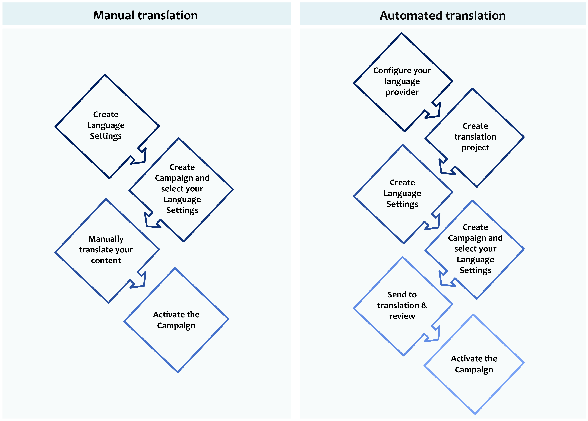
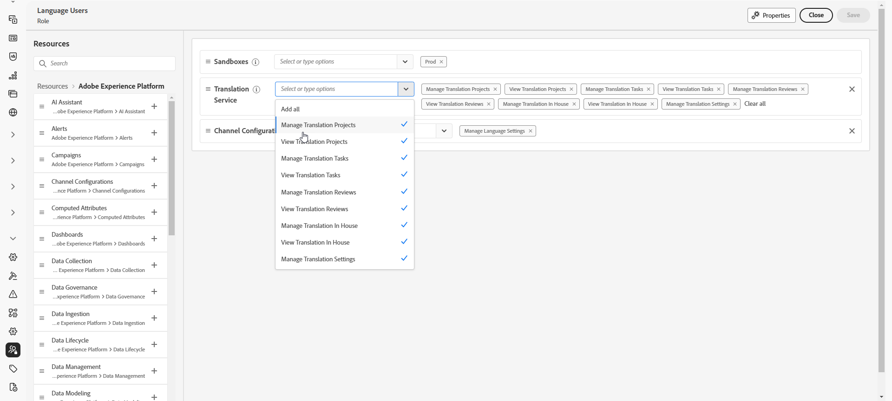
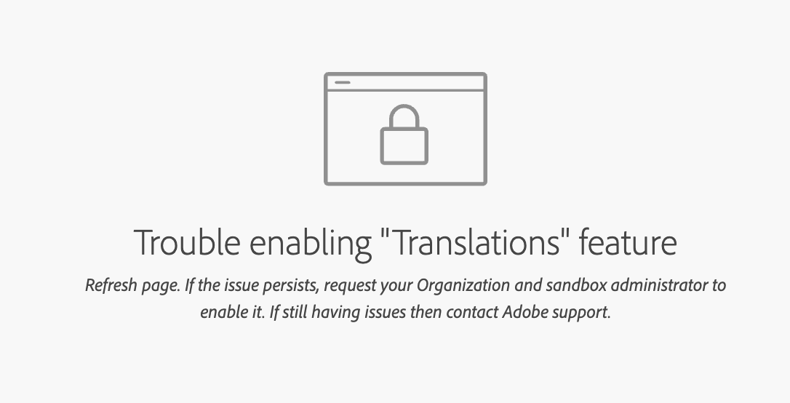

# 開始使用多語言內容 {#multilingual-gs}

>[!CONTEXTUALHELP]
>id="ajo_multi_translation_homepage"
>title="翻譯"
>abstract="多語言功能讓您可以透過單一行銷活動或歷程輕鬆建立多語言內容。透過「翻譯」頁面，您可以設定專案、選擇翻譯提供者或管理特定語系設定字典"

多語言功能可讓您在單一行銷活動或歷程中，輕鬆建立多種語言的內容。 透過此功能，您可以在編輯行銷活動時切換語言、簡化整個編輯流程，並提高有效管理多語言內容的能力。

透過Journey Optimizer，您可以透過兩種方法建立多語言內容：

* **手動翻譯**：直接在電子郵件Designer中翻譯您的內容或匯入現有的多語言內容。 [了解更多](multilingual-manual.md)

* **自動翻譯**：傳送內容給您偏好的語言提供者，以進行自動翻譯。 [了解更多](multilingual-automated.md)

 

## 先決條件 {#prerequisites}

>[!CONTEXTUALHELP]
>id="ajo_multi_translation_error"
>title="翻譯錯誤"
>abstract="如果您無法存取翻譯頁面，這可能是由於未啟用翻譯功能。若要解決此問題，您需確保組織和沙箱管理員已啟用翻譯功能。"

Adobe Journey Optimizer目前與翻譯提供者整合，這些翻譯提供者獨立於Adobe Journey Optimizer，提供協力廠商翻譯服務（機器翻譯或人力翻譯）。

在新增您選取的翻譯提供者之前，您必須與該適用提供者建立帳戶。

您使用翻譯提供者的翻譯服務，須受該適用提供者的其他條款與條件所限制。  身為協力廠商解決方案，Adobe Journey Optimizer使用者可透過整合使用翻譯服務。  Adobe無法控制且對協力廠商產品不負任何責任。

如需任何與翻譯相關的問題或協助請求，請聯絡適用的翻譯提供者。

針對多語言內容，必須定義下列設定：

* 若要在Journey Optimizer中使用翻譯功能，您需要將API指派給對應的角色。 [了解更多](https://experienceleague.adobe.com/zh-hant/docs/experience-platform/landing/platform-apis/api-authentication#assign-api-to-a-role)

* 若要開始建立多語言內容，使用者必須被授予&#x200B;**[!UICONTROL 管理語言設定]**&#x200B;許可權。 針對自動化流程，使用者還需要與&#x200B;**[!UICONTROL 翻譯服務]**&#x200B;功能相關的許可權。 [進一步瞭解許可權](../administration/permissions.md)

  +++ 瞭解如何指派多語言相關許可權

   1. 在&#x200B;**權限**&#x200B;產品中，前往&#x200B;**角色**&#x200B;標籤，然後選取所需的&#x200B;**角色**。

   1. 按一下&#x200B;**編輯**&#x200B;以修改權限。

   1. 新增&#x200B;**翻譯服務**&#x200B;資源，然後從下拉式功能表中選取適當的多語言許可權。

      {zoomable="yes"}

   1. 按一下&#x200B;**儲存**，以套用所做的變更。

      任何已指派給此角色的使用者都會自動更新其權限。

   1. 若要將此角色指派給新使用者，請瀏覽至&#x200B;**角色**&#x200B;儀表板中的&#x200B;**使用者**&#x200B;標籤，然後按一下&#x200B;**新增使用者**。

   1. 輸入使用者的名稱、電子郵件地址，或從清單當中選擇，然後按一下&#x200B;**儲存**。

   1. 如果之前未建立使用者，請參閱[此文件](https://experienceleague.adobe.com/zh-hant/docs/experience-platform/access-control/abac/permissions-ui/users)。

  +++

* 如果您無法存取翻譯頁面，您必須啟用翻譯功能，並取得與&#x200B;**[!UICONTROL 翻譯服務]**&#x200B;相關的許可權。 [了解更多](../administration/ootb-permissions.md)

  +++ 瞭解如何啟用翻譯功能

   1. 如果您看到下列錯誤頁面，表示尚未啟用&#x200B;**[!UICONTROL 翻譯]**&#x200B;功能。 請聯絡您的組織和沙箱管理員以請求存取權。

  

   1. 您的管理員需要導覽至左側邊欄中的&#x200B;**[!UICONTROL 翻譯]**&#x200B;功能表。

      系統將自動啟用翻譯功能。

   1. 一旦功能成功啟用，您就可以存取&#x200B;**[!UICONTROL 翻譯]**&#x200B;頁面，以及&#x200B;**[!UICONTROL 專案]**、**[!UICONTROL 提供者]**&#x200B;和&#x200B;**[!UICONTROL 地區設定]**&#x200B;標籤。

   1. 如果此程式失敗，您仍會看到相同的錯誤頁面。 在這種情況下，請聯絡您的Adobe代表以取得進一步協助。

  +++

## 作法影片 {#video}

瞭解如何在單一行銷活動或歷程中以多種語言建立內容。

>[!VIDEO](https://video.tv.adobe.com/v/3452125?captions=chi_hant)
