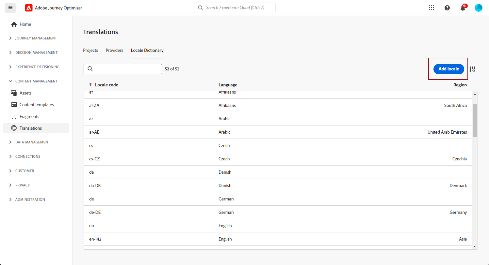

# 建立地區設定 {#multilingual-locale}

>[!CONTEXTUALHELP]
>id="ajo_multi_add_locale"
>title="新增地區設定"
>abstract="設定語言偏好設定時，如果您的多語言內容並未提供所需的地區設定，您可以選擇建立其他地區設定。"

如[建立您的語言設定](multilingual-manual.md#language-settings)一節中所述，設定您的語言設定時，如果多語言內容沒有特定的地區設定，您可以使用&#x200B;**[!UICONTROL 翻譯]**&#x200B;功能表彈性地建立所需數量的新地區設定。

1. 從&#x200B;**[!UICONTROL 內容管理]**&#x200B;功能表，存取&#x200B;**[!UICONTROL 翻譯]**。

1. 從&#x200B;**[!UICONTROL 地區設定字典]**&#x200B;索引標籤，按一下&#x200B;**[!UICONTROL 新增地區設定]**。

   

1. 從&#x200B;**[!UICONTROL 語言]**&#x200B;清單和相關的&#x200B;**[!UICONTROL 地區]**&#x200B;選取您的地區設定代碼。

1. 按一下&#x200B;**[!UICONTROL 儲存]**&#x200B;以建立您的地區設定。

   
