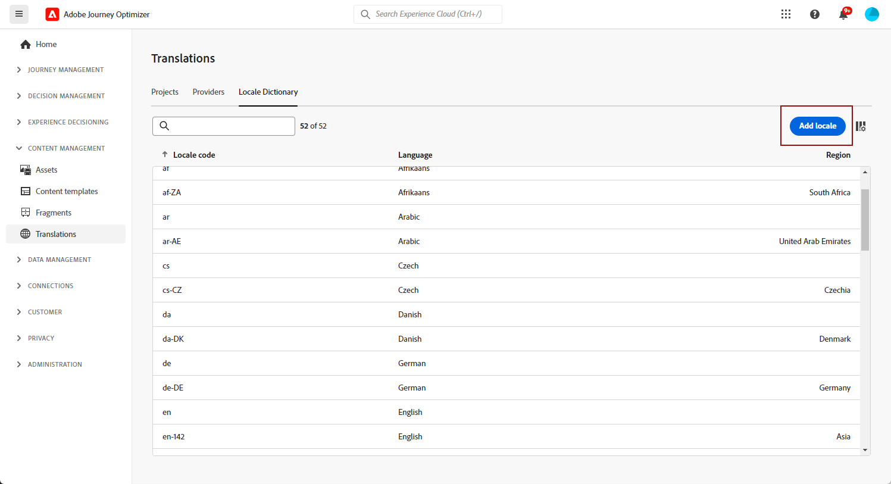

# 使用手動翻譯建立多語言內容 {#multilingual-manual}

>[!AVAILABILITY]
>
>多種語言內容目前僅適用於一組組織 (可用性限制)。若要取得存取權，請和您的 Adobe 代表聯絡。

使用手動流程，您可以輕鬆地直接在電子郵件、推播通知或簡訊行銷活動和歷程中翻譯您的內容，為您提供多語言訊息的精確控制和自訂選項。 此外，您可以使用「匯入HTML」選項輕鬆匯入預先存在的多語言內容。

請依照下列步驟，使用手動翻譯建立多語言內容：

1. [建立您的地區設定](#create-locale)。

1. [建立語言設定](#create-language-settings)。

1. [建立多語言內容](#create-a-multilingual-campaign)。

## 建立地區設定 {#create-locale}

如[建立您的語言設定](#language-settings)一節中所述，設定您的語言設定時，如果多語言內容沒有特定的地區設定，您可以使用&#x200B;**[!UICONTROL 翻譯]**&#x200B;功能表彈性地建立所需數量的新地區設定。

1. 從&#x200B;**[!UICONTROL 內容管理]**&#x200B;功能表，存取&#x200B;**[!UICONTROL 翻譯]**。

1. 從&#x200B;**[!UICONTROL 地區設定字典]**&#x200B;索引標籤，按一下&#x200B;**[!UICONTROL 新增地區設定]**。

   

1. 從&#x200B;**[!UICONTROL 語言]**&#x200B;清單和相關的&#x200B;**[!UICONTROL 地區]**&#x200B;選取您的地區設定代碼。

1. 按一下&#x200B;**[!UICONTROL 儲存]**&#x200B;以建立您的地區設定。

   

## 建立語言設定 {#language-settings}

您可以在此段落中設定主要語言及其相關語言環境，以管理多語言內容。 您也可以選擇您要用來查閱與設定檔語言相關資訊的屬性

1. 從&#x200B;**[!UICONTROL 管理]**&#x200B;功能表，存取&#x200B;**[!UICONTROL 管道]** > **[!UICONTROL 一般設定]**。

1. 在&#x200B;**[!UICONTROL 語言設定]**&#x200B;功能表中，按一下&#x200B;**[!UICONTROL 建立語言設定]**。

   

1. 輸入您&#x200B;**[!UICONTROL 語言設定]**&#x200B;的名稱。

1. 選取與此設定相關聯的&#x200B;**[!UICONTROL 地區]**。 您最多可以新增50個地區設定。

   如果&#x200B;**[!UICONTROL 地區設定]**&#x200B;遺失，您可以預先從&#x200B;**[!UICONTROL 翻譯]**&#x200B;功能表或透過API手動建立。 請參閱[建立新的地區設定](#create-locale)。

   

1. 從&#x200B;**[!UICONTROL 傳送喜好設定]**&#x200B;功能表，選取您要查詢以尋找設定檔語言資訊的屬性。

   

1. 按一下&#x200B;**[!UICONTROL 地區設定]**&#x200B;旁的&#x200B;**[!UICONTROL 編輯]**，進一步個人化設定檔並新增&#x200B;**[!UICONTROL 設定檔偏好設定]**。

   

1. 從[設定檔偏好設定]下拉式清單中選取其他&#x200B;**[!UICONTROL 地區]**，然後按一下[新增設定檔&#x200B;]**]。**[!UICONTROL 

1. 存取&#x200B;**[!UICONTROL 地區設定]**&#x200B;的進階功能表以定義您的&#x200B;**[!UICONTROL 主要地區設定]**，亦即，如果未指定設定檔屬性，則使用預設語言。

   您也可以從此進階功能表刪除您的地區設定。

   

1. 按一下&#x200B;**[!UICONTROL 提交]**&#x200B;以建立您的&#x200B;**[!UICONTROL 語言設定]**。

<!--
1. Access the **[!UICONTROL channel configurations]** menu and create a new channel configuration or select an existing one.

1. In the **[!UICONTROL Header parameters]** section, select the **[!UICONTROL Enable multilingual]** option.

1. Select your **[!UICONTROL Locales dictionary]** and add as many as needed.
-->

## 建立多語言內容 {#create-multilingual-campaign}

設定好多語言內容後，您就可以著手製作行銷活動或歷程，並針對每個選取的地區設定自訂內容。

1. 首先，根據您的需求，建立並設定您的電子郵件、簡訊或推播通知[行銷活動](../campaigns/create-campaign.md)或[歷程](../building-journeys/journeys-message.md)。

   >[!AVAILABILITY]
   >
   >我們建議每個歷程僅包含一個翻譯專案。

1. 建立或匯入原始內容，並視需要加以個人化。

1. 建立主要內容後，按一下&#x200B;**[!UICONTROL 儲存]**，然後返回行銷活動設定畫面。

   

1. 按一下&#x200B;**[!UICONTROL 新增語言]**，然後選取您先前建立的&#x200B;**[!UICONTROL 語言設定]**。 [了解更多](#create-language-settings)

   

1. 存取&#x200B;**[!UICONTROL 地區]**&#x200B;功能表的進階設定，並選取&#x200B;**[!UICONTROL 將主要複製到所有地區]**。

   

1. 現在您的主要內容已在您選取的&#x200B;**[!UICONTROL 地區設定]**&#x200B;中重複，請存取每個地區設定，然後按一下&#x200B;**[!UICONTROL 編輯電子郵件內文]**&#x200B;來翻譯您的內容。

   

1. 您可以選擇停用或啟用您所選取地區設定的&#x200B;**[!UICONTROL 更多動作]**&#x200B;功能表。

   

1. 若要停用您的多語言組態，請按一下[新增語言] ****，然後選取要保留為當地語言的語言。

   

1. 按一下&#x200B;**[!UICONTROL 檢閱以啟動]**&#x200B;以顯示行銷活動的摘要。

   摘要可讓您視需要修改行銷活動，以及檢查是否有任何引數不正確或遺失。

1. 瀏覽您的多語言內容，檢視每種語言的轉譯。

   

您現在可以啟動行銷活動或歷程。 傳送後，您可以在報表中測量多語言歷程或行銷活動的影響。

<!--
# Create a multilingual journey {#create-multilingual-journey}

1. Create your journey with a Delivery and personalize your content as needed.
1. From your delivery action, click Edit content.
1. Click Add languages.

-->
