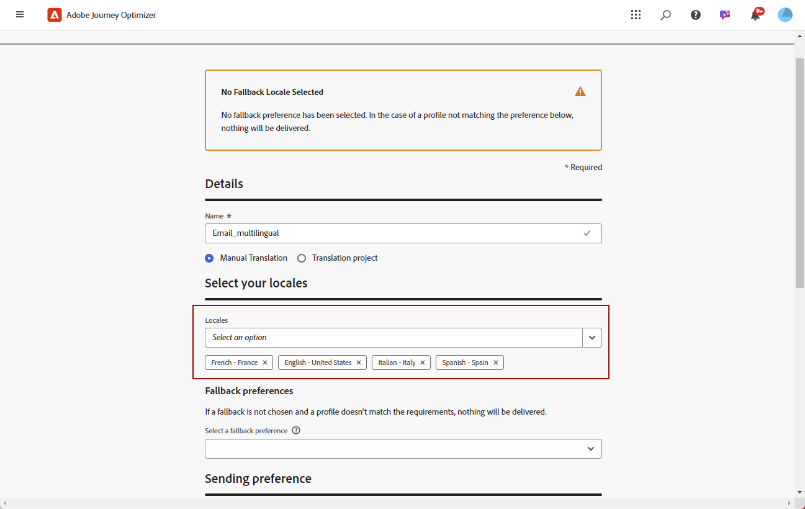
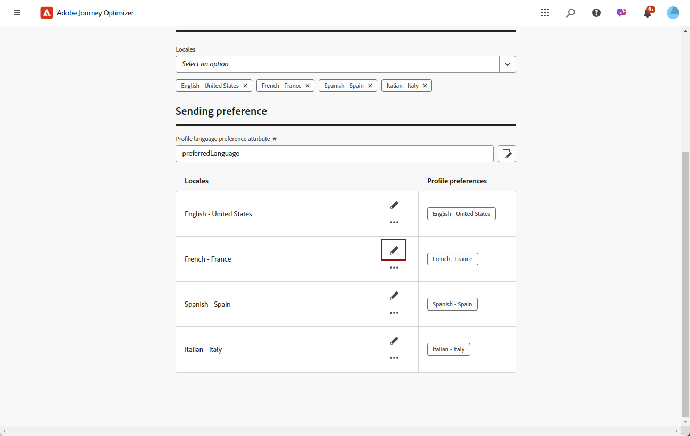
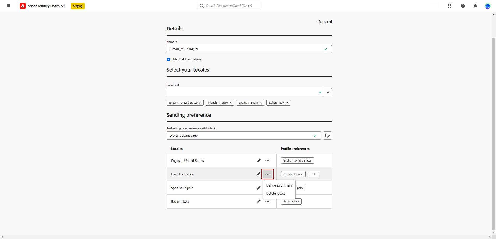
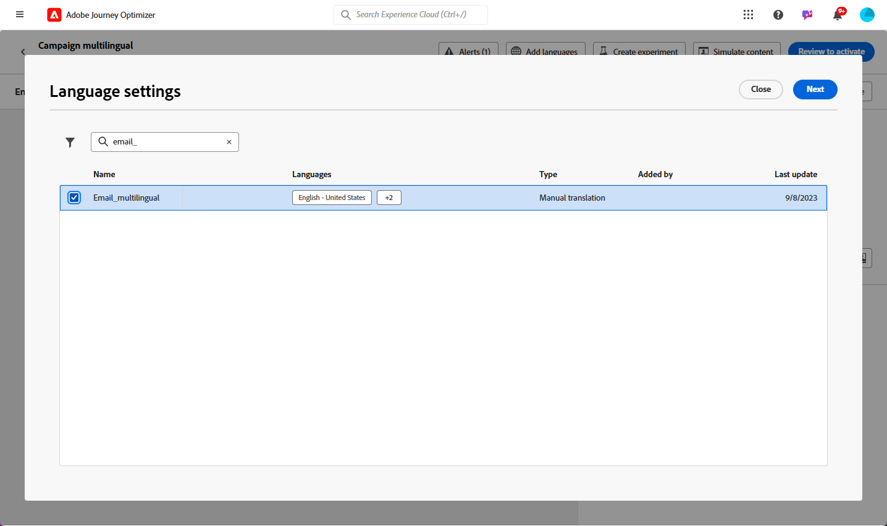
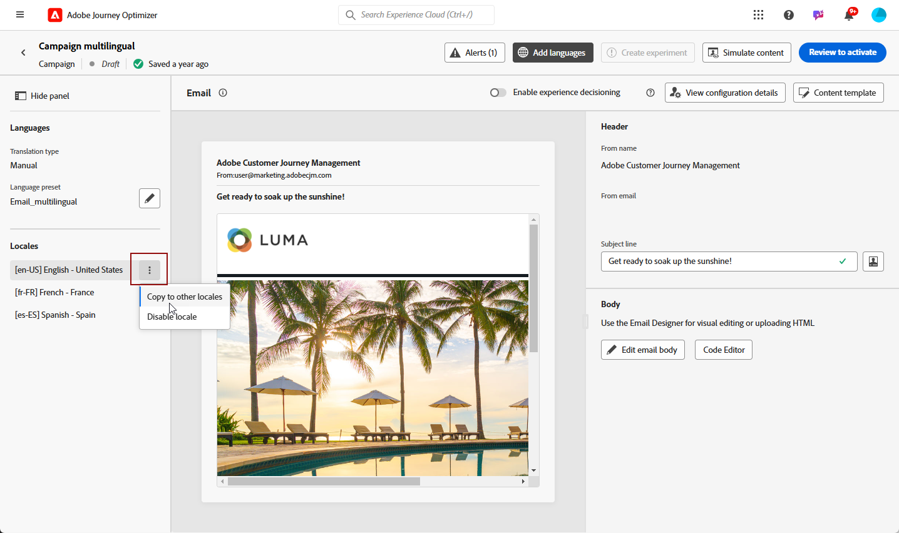
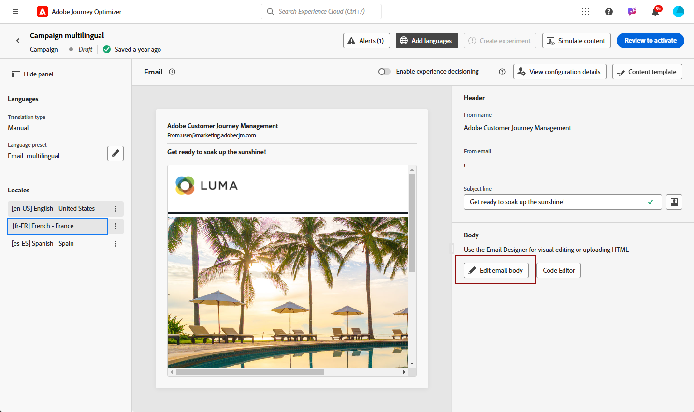
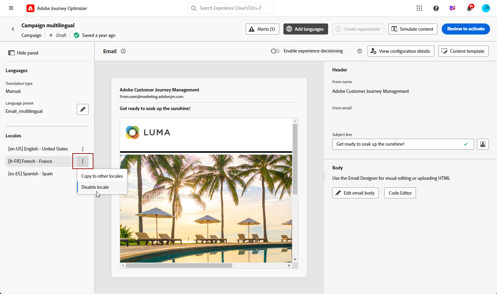
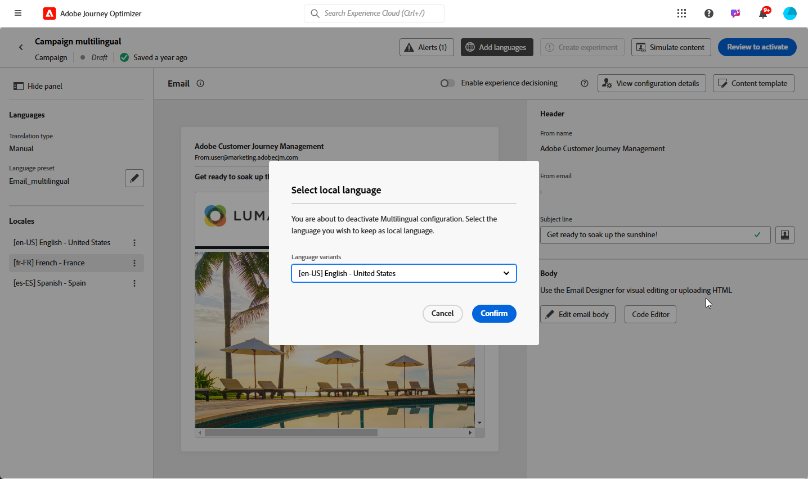

# 使用手動翻譯建立多語言內容 {#multilingual-manual}

>[!IMPORTANT]
>
>若是手動流程，使用者必須被授予&#x200B;**[!UICONTROL 管理語言設定]**&#x200B;許可權。

使用手動流程，您可以輕鬆地直接在行銷活動和歷程中翻譯您的內容，為您提供多語言訊息的精確控制和自訂選項。 此外，您也可以使用「匯入HTML」選項，輕鬆匯入既存的多語言內容。

請依照下列步驟，使用手動翻譯建立多語言內容：

1. [新增您的提供者（選擇性）](multilingual-provider.md)

1. [新增地區（選擇性）](multilingual-locale.md)

1. [建立語言設定](#language-settings)

1. [建立多語言內容](#create-multilingual-campaign)

## 建立語言設定 {#language-settings}

在本節中，您可以設定管理多語言內容的不同地區設定。 您也可以選擇您要用來查閱與設定檔語言相關資訊的屬性

1. 從&#x200B;**[!UICONTROL 管理]**&#x200B;功能表，存取&#x200B;**[!UICONTROL 管道]** > **[!UICONTROL 一般設定]**。

1. 在&#x200B;**[!UICONTROL 語言設定]**&#x200B;功能表中，按一下&#x200B;**[!UICONTROL 建立語言設定]**。

   

1. 輸入&#x200B;**[!UICONTROL 語言設定]**&#x200B;的名稱，然後選擇&#x200B;**[!UICONTROL 手動翻譯]**。

1. 選取與此設定相關聯的&#x200B;**[!UICONTROL 地區]**。 您最多可以新增50個地區設定。

   如果&#x200B;**[!UICONTROL 地區設定]**&#x200B;遺失，您可以預先從&#x200B;**[!UICONTROL 翻譯]**&#x200B;功能表或透過API手動建立。 請參閱[建立新的地區設定](multilingual-locale.md)。

   

1. 選取&#x200B;**[!UICONTROL 遞補偏好設定]**，以定義當設定檔不符合內容傳遞必要條件時的備份選項。

   請注意，如果未選取遞補選項，則不會傳送行銷活動或歷程。

1. 從下列選項中選擇您的傳送偏好設定：

   * **[!UICONTROL 選取設定檔語言偏好設定屬性]**
   * **[!UICONTROL 建立自訂條件規則]**

1. 如果您選取&#x200B;**[!UICONTROL 選取設定檔語言喜好設定屬性]**，請從&#x200B;**[!UICONTROL 設定檔語言喜好設定屬性]**&#x200B;功能表選擇相關屬性，以查詢設定檔語言資訊。

   

1. 如果您選取&#x200B;**[!UICONTROL 建立自訂條件規則]**，請選取您要建立條件的地區設定。 接著，根據使用者位置、語言偏好設定或其他內容元素等因素建立規則。

   

1. 新增屬性、事件或對象來定義目標群組，以開始建立條件。

   >[!IMPORTANT]
   >
   >內容資料僅適用於Web、應用程式內、程式碼型體驗和內容卡頻道。 如果用於電子郵件、SMS、推播通知或直接郵件頻道，在沒有其他屬性的情況下，將使用清單上第一個選項的語言傳送行銷活動或歷程。

   

   +++在條件中使用內容事件的先決條件

   當使用者顯示您的內容時，個人化請求會與體驗事件一併傳送。 若要在條件中運用內容資料，您必須將其他資料附加至個人化請求裝載。 若要這麼做，您需要在Adobe Experience Platform資料收集中建立規則以指定：如果傳送了個人化請求，則附加額外資料至請求，定義屬性以符合結構描述中的語言欄位。

   >[!NOTE]
   >
   >這些先決條件僅是應用程式內和內容卡管道的必要條件。

   1. 在Adobe Experience Platform資料彙集中存取&#x200B;**[!UICONTROL 規則]**&#x200B;功能表並建立新規則。 有關如何建立規則的詳細資訊，請參閱[!DNL Adobe Experience Platform] [資料收集檔案](https://experienceleague.adobe.com/en/docs/experience-platform/collection/e2e#create-a-rule){target="_blank"}

   2. 在規則的&#x200B;**[!UICONTROL IF]**&#x200B;區段中，新增設定如下的事件：

      

      * 選擇您正在使用的&#x200B;**[!UICONTROL 擴充功能]**。
      * 在&#x200B;**[!UICONTROL 事件型別]**&#x200B;欄位中，選取「AEP要求事件」。
      * 在右窗格中，選取「XDM事件型別等於personalization.request」
      * 按一下&#x200B;**[!UICONTROL 保留變更]**&#x200B;按鈕以確認。

   3. 在規則的&#x200B;**[!UICONTROL THEN]**&#x200B;區段中，新增設定如下的動作：

      

      * 選擇您正在使用的&#x200B;**[!UICONTROL 擴充功能]**。
      * 在&#x200B;**[!UICONTROL 動作型別]**&#x200B;欄位中，選取[附加資料]。
      * 在JSON裝載區段中，確認用於擷取所使用語言的屬性（在以下範例中為「語言」）符合資料收集資料流流入之結構描述中指定的屬性名稱。

        ```JSON
        {
            "xdm":{
                "application":{
                    "_dc":{
                        "language":"{%%Language%%}"
                    }
                }
            }
        }
        ```

      * 按一下「**[!UICONTROL 保留變更]**」按鈕以確認並儲存您的規則。

   +++

1. 拖放地區設定以重新排序，並在清單中管理其優先順序。

1. 若要刪除地區設定，請按一下bin圖示。

   

1. 按一下&#x200B;**[!UICONTROL 提交]**&#x200B;以建立您的&#x200B;**[!UICONTROL 語言設定]**。

請注意，設定您的語言偏好設定後，您將無法再選擇編輯它們。

<!--
1. Access the **[!UICONTROL channel configurations]** menu and create a new channel configuration or select an existing one.


1. In the **[!UICONTROL Header parameters]** section, select the **[!UICONTROL Enable multilingual]** option.

1. Select your **[!UICONTROL Locales dictionary]** and add as many as needed.
-->

## 建立多語言內容 {#create-multilingual-campaign}

設定好多語言內容後，您就可以著手製作行銷活動或歷程，並針對每個選取的地區設定自訂內容。

1. 首先，根據您的需求，建立並設定您的電子郵件、簡訊或推播通知[行銷活動](../campaigns/create-campaign.md)或[歷程](../building-journeys/journeys-message.md)。

   >[!IMPORTANT]
   >
   >我們建議每個歷程僅包含一個翻譯專案。

1. 建立或匯入原始內容，並視需要加以個人化。

1. 建立內容後，按一下&#x200B;**[!UICONTROL 儲存]**，然後返回行銷活動設定畫面。

   

1. 按一下&#x200B;**[!UICONTROL 新增語言]**，然後選取您先前建立的&#x200B;**[!UICONTROL 語言設定]**。 [了解更多](#language-settings)

   

1. 從下拉式選單中選擇所需的地區設定，以套用至現有的編寫內容。

1. 存取&#x200B;**[!UICONTROL 地區]**&#x200B;功能表的進階設定，並選取&#x200B;**[!UICONTROL 複製到所有地區]**。

   

1. 現在您的內容已在您選取的&#x200B;**[!UICONTROL 地區設定]**&#x200B;中重複，請存取每個地區設定，然後按一下&#x200B;**[!UICONTROL 編輯電子郵件內文]**&#x200B;來翻譯您的內容。

   

1. 您可以選擇停用或啟用您所選取地區設定的&#x200B;**[!UICONTROL 更多動作]**&#x200B;功能表。

   

1. 若要停用您的多語言組態，請按一下[新增語言] **&#x200B;**，然後選取要保留為當地語言的語言。

   

1. 按一下&#x200B;**[!UICONTROL 檢閱以啟動]**&#x200B;以顯示行銷活動的摘要。

   摘要可讓您視需要修改行銷活動，以及檢查是否有任何引數不正確或遺失。

1. 瀏覽您的多語言內容，檢視每種語言的轉譯。

   

您現在可以啟動行銷活動或歷程。 傳送後，您可以在報表中測量多語言歷程或行銷活動的影響。

>[!IMPORTANT]
>
> 如果您的行銷活動受核准政策的約束，您將需要請求核准才能傳送您的多語言行銷活動或歷程。 [了解更多](../test-approve/gs-approval.md)

<!--
# Create a multilingual journey {#create-multilingual-journey}

1. Create your journey with a Delivery and personalize your content as needed.
1. From your delivery action, click Edit content.
1. Click Add languages.

-->
