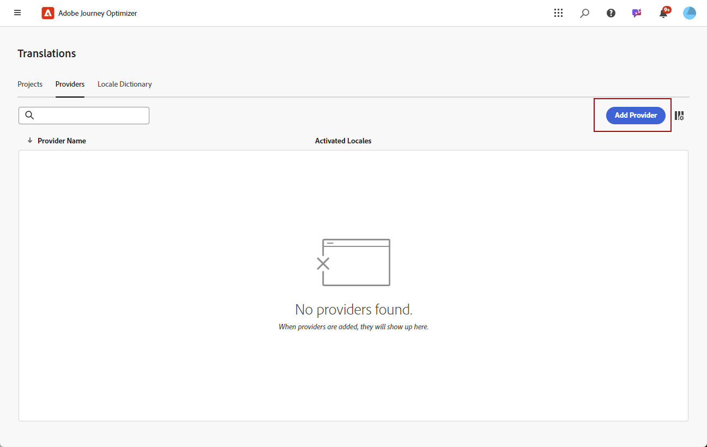
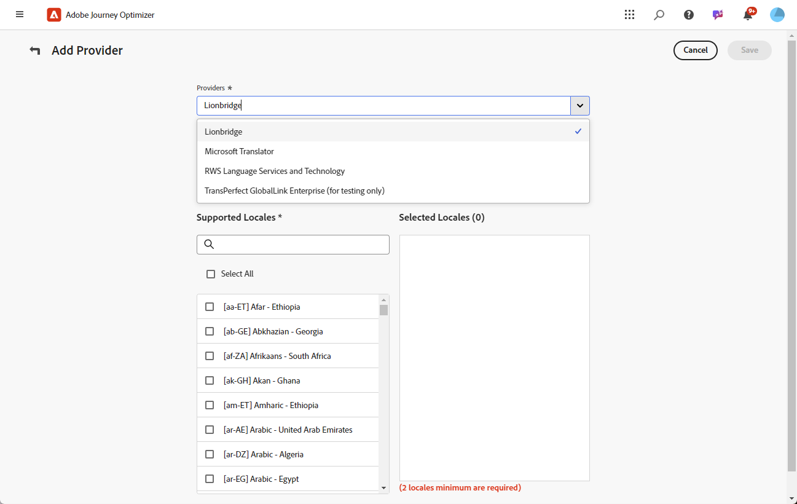
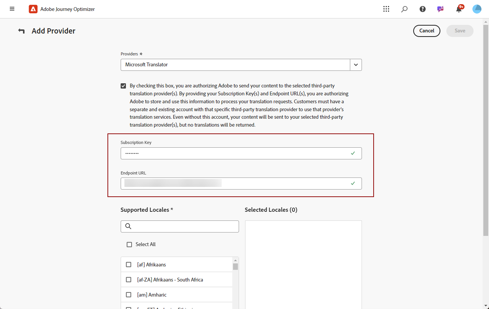
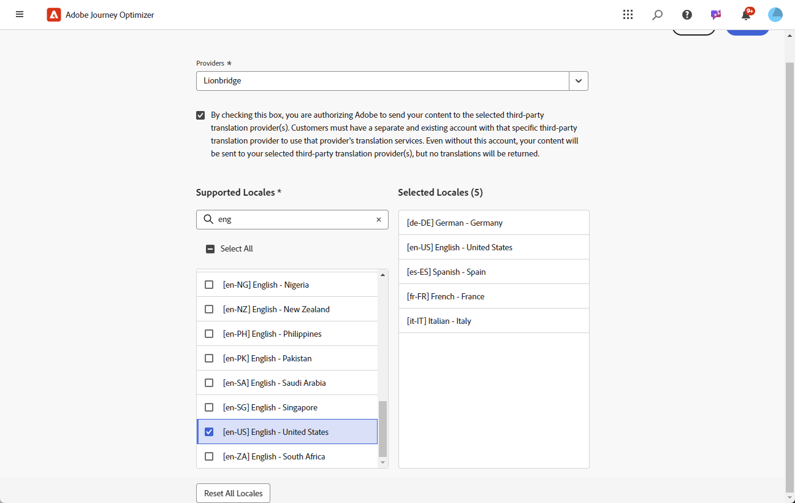

# 新增語言提供者 {#multilingual-provider}

>[!IMPORTANT]
>
> 您使用翻譯提供者的翻譯服務，須受該適用提供者的其他條款與條件所限制。 身為協力廠商解決方案，Adobe Journey Optimizer使用者可透過整合使用翻譯服務。 Adobe無法控制且對協力廠商產品不負任何責任。

Adobe Journey Optimizer與提供機器及人力翻譯服務的第三方翻譯提供者整合，獨立於Adobe Journey Optimizer。

在新增您選擇的翻譯提供者之前，請確定您已與各自的提供者建立帳戶。

1. 在&#x200B;**[!UICONTROL 內容管理]**&#x200B;功能表中，導覽至&#x200B;**[!UICONTROL 翻譯]**。

1. 存取&#x200B;**[!UICONTROL 提供者]**&#x200B;索引標籤，然後按一下&#x200B;**[!UICONTROL 新增提供者]**。

   

1. 從&#x200B;**[!UICONTROL 提供者]**&#x200B;下拉式清單中，選擇所需的提供者。

   >[!NOTE]
   >
   >若要新增新的&#x200B;**提供者**&#x200B;至清單，您可以要求您的&#x200B;**提供者**&#x200B;遵循[此檔案](https://developer.adobe.com/gcs/partner/)中詳述的指示，以完成上線程式。

   

1. 如果使用Microsoft Translator做為提供者，請輸入您的&#x200B;**[!UICONTROL 訂閱金鑰]**&#x200B;和&#x200B;**[!UICONTROL 端點URL]**。

   按一下&#x200B;**[!UICONTROL 驗證認證]**&#x200B;以測試您的連線。

   

1. 選取適用的&#x200B;**支援地區**。

   

1. 完成設定後，按一下[儲存]，完成設定。**&#x200B;**
