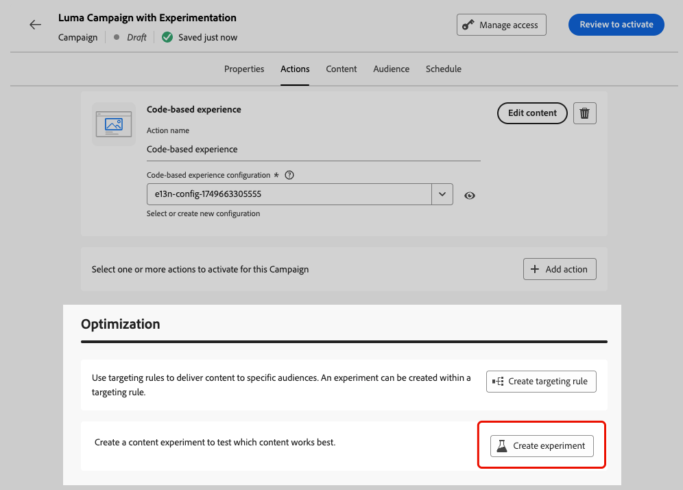
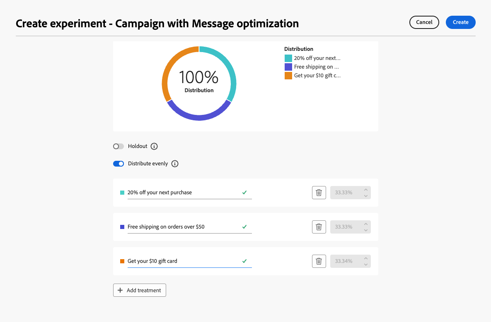

# 使用實驗 {#experimentation}

>[!NOTE]
>
>此頁面提供如何在內容最佳化中使用實驗的總覽。 如需內容實驗的詳細資訊，包括組態選項、度量和分析，請參閱[內容實驗檔案](../content-management/get-started-experiment.md)。

實驗可讓您測試多個內容版本，以根據預先定義的成功量度判斷哪些版本的執行效果最佳。

若要設定實驗，請遵循下列步驟。

假設您想在行銷活動中測試下列促銷訊息：

* **處理A**：「下次購買可享受20%的優惠」
* **處理B**：「超過$50美元訂單的免運費」
* **處理C**：「取得您的$10禮品卡」

若要設定實驗並確定哪些訊息促成了最多購買，請遵循以下步驟。

1. 建立[歷程](../building-journeys/journey-gs.md#jo-build)或[行銷活動](../campaigns/create-campaign.md)。

   >[!NOTE]
   >
   >如果您在歷程中，請新增&#x200B;**[!UICONTROL 動作]**&#x200B;活動、選擇頻道活動並選取&#x200B;**[!UICONTROL 設定動作]**。 [了解更多](../building-journeys/journey-action.md#add-action)

1. 從&#x200B;**[!UICONTROL 動作]**&#x200B;索引標籤中，選取兩個輸入動作，例如[程式碼型體驗](../code-based/get-started-code-based.md)和[應用程式內](../../rp_landing_pages/in-app-landing-page.md)。

1. 在&#x200B;**[!UICONTROL 最佳化]**&#x200B;區段中，選取&#x200B;**[!UICONTROL 建立實驗]**。

   {width=85%}

1. 視需要設計和設定您的內容實驗。 [了解作法](../content-management/content-experiment.md)

   {width=85%}

   定義實驗後，實驗將套用至在該行銷活動中或透過歷程&#x200B;**[!UICONTROL 動作]**&#x200B;活動插入的所有動作，這表示相同的客戶會在所有介面上看到相同的選件。

   >[!NOTE]
   >
   >您可以選取其他動作：實驗適用於新增至行銷活動或歷程[動作活動](../building-journeys/journey-action.md)的所有動作。

1. [啟動](../campaigns/review-activate-campaign.md)您的歷程或行銷活動。

歷程/行銷活動上線後，使用者會被隨機指派不同的內容變數。 [!DNL Journey Optimizer]會追蹤哪些變數可推動更多購買，並提供可操作的深入分析。

使用[歷程](../reports/journey-global-report-cja.md)和[行銷活動](../reports/campaign-global-report-cja-experimentation.md)報告追蹤行銷活動是否成功。<!--Link to Experimentation journey reportis missing-->
