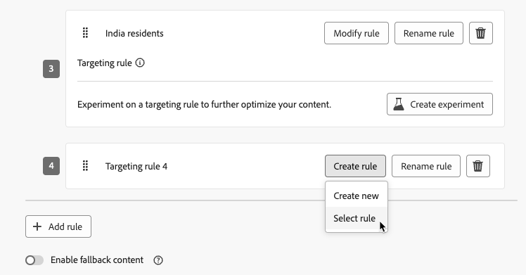
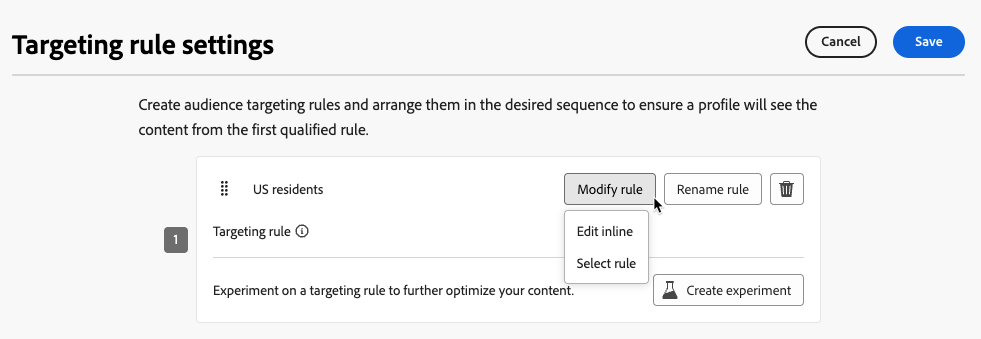

# 使用目標定位 {#targeting}

>[!CONTEXTUALHELP]
>id="ajo_content_targeting_fallback"
>title="什麼是後備內容？"
>abstract="沒有符合目標選擇規則時，後備內容可讓您的客群收到預設內容。 如果您不選取此選項，任何不符合上述目標選擇規則的客群都不會收到內容。"

目標定位會根據使用者設定檔屬性或內容屬性，將個人化內容提供給特定對象區段。

實驗是隨機指派訊息內容，而目標定位則是將內容提供給正確受眾的確定性方式，與此不同。

透過鎖定目標，可根據下列專案定義特定規則：

* **使用者設定檔屬性**，例如位置(例如 地理定位)、年齡或偏好設定。 例如，美國的使用者會看到「Golden Gate」促銷活動，而法國的使用者會看到「Eiffel Tower」促銷活動。

* **內容資料**，例如裝置型別(例如 裝置定位)、一天中的時間或工作階段詳細資訊。 例如，案頭使用者會收到案頭最佳化內容，而行動使用者則會收到行動最佳化內容。

* **對象**，可用來包含或排除具有特定對象成員資格的設定檔。

若要設定鎖定目標，請遵循下列步驟。

1. 建立[歷程](../building-journeys/journey-gs.md#jo-build)或[行銷活動](../campaigns/create-campaign.md)。

   >[!NOTE]
   >
   >如果您在歷程中，請新增&#x200B;**[!UICONTROL 動作]**&#x200B;活動、選擇頻道活動並選取&#x200B;**[!UICONTROL 設定動作]**。 [了解更多](../building-journeys/journey-action.md#add-action)

1. 從&#x200B;**[!UICONTROL 動作]**&#x200B;索引標籤中，選取至少一個動作。

1. 在&#x200B;**[!UICONTROL 最佳化]**&#x200B;區段中，選取&#x200B;**[!UICONTROL 建立目標規則]**。

   {width=85%}

1. 按一下「**[!UICONTROL 建立規則]**」>「**[!UICONTROL 建立新的]**」，然後使用規則產生器來定義您的行動條件。

   {width=100%}

   例如，定義美國居民的規則、法國居民的規則以及印度居民的規則。

   {width=85%}

1. 您也可以按一下「建立規則&#x200B;**[!UICONTROL >]**&#x200B;選取規則&#x200B;**[!UICONTROL 」，選取從]**&#x200B;規則&#x200B;**[!UICONTROL 功能表建立的現有目標規則。]**&#x200B;[了解更多](../experience-decisioning/rules.md)

   {width=70%}

   在此情況下，組成規則的公式只會複製到歷程或行銷活動中。 從&#x200B;**[!UICONTROL 規則]**&#x200B;選單對該規則所做的任何後續變更將不會影響歷程或行銷活動的副本。

   >[!AVAILABILITY]
   >
   >[使用專用的](../experience-decisioning/rules.md#create)功能表建立鎖定目標規則[!DNL Journey Optimizer]，目前可供已購買決策附加元件產品的組織使用，其他組織也可依需求使用（可用性限制）。
   >
   >此容量將逐步向所有客戶推出。 與此同時，請聯絡您的Adobe代表以取得存取權。

1. 新增規則後，您仍可加以修改。 選擇&#x200B;**[!UICONTROL 編輯內嵌]**，以使用規則產生器即時更新它，或選擇&#x200B;**[!UICONTROL 選取規則]**&#x200B;以挑選另一個現有的規則。

   {width=100%}

   >[!NOTE]
   >
   >編輯規則內嵌不會影響其源自的現有規則。

1. 視需要選取&#x200B;**[!UICONTROL 啟用遞補內容]**&#x200B;選項。 後援內容可讓您的對象在沒有符合目標規則時接收預設內容。

   >[!NOTE]
   >
   >如果您未選取此選項，則不符合上述定位規則的任何對象都不會收到內容。

1. 儲存您的目標規則設定。

1. 返回&#x200B;**[!UICONTROL 動作]**&#x200B;索引標籤，選取&#x200B;**[!UICONTROL 編輯內容]**。

1. 為您目標規則設定所定義的每個群組設計適當的內容。

   {width=85%}

   在此範例中，請為美國居民設計特定內容、為法國居民設計不同內容，並為印度居民設計其他內容。

1. [啟動](review-activate-campaign.md)您的歷程或行銷活動。

一旦歷程/行銷活動上線，就會傳送為每個目標量身打造的內容，好讓美國居民收到特定訊息、法國居民收到不同訊息等。

<!--Default content:

* If no targeting rules match, default content can be delivered.

* If default content is not enabled, passthrough behavior ensures lower-priority campaigns are evaluated.-->

