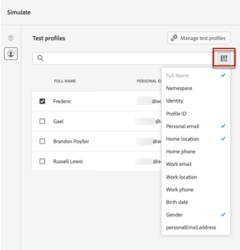
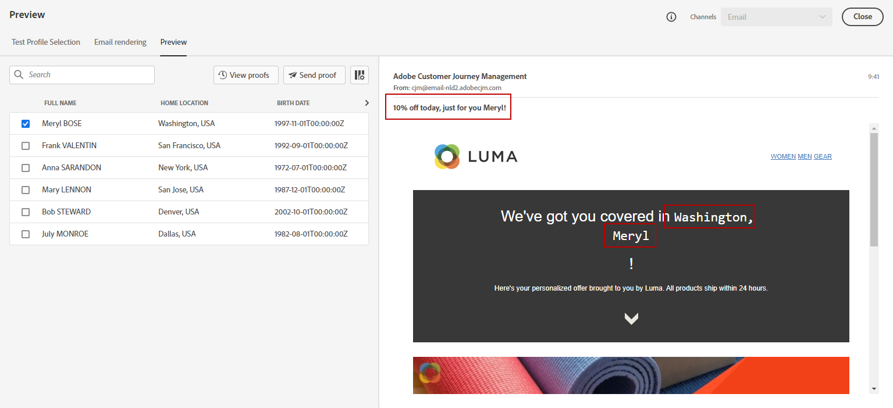

# 使用測試設定檔預覽您的內容 {#preview}

>[!BEGINSHADEBOX]

**在此頁面上：**&#x200B;瞭解如何根據選取的測試設定檔預覽您的訊息內容，以檢查每個變體的個人化欄位顯示方式。

>[!ENDSHADEBOX]

選取[測試設定檔](test-profiles.md)後，您可以使用其資料預覽您的內容。 您可以使用下列任一種模擬方法：

1. 從訊息的編輯內容畫面或電子郵件Designer中，按一下&#x200B;**[!UICONTROL 模擬內容]**，然後從下拉式清單中選取&#x200B;**[!UICONTROL 模擬內容（AEP設定檔）]**。

1. 選取測試設定檔。 您可以檢查欄中可用的值。 使用右/左箭頭來瀏覽資料。

   

   >[!NOTE]
   >
   >若要新增更多測試設定檔，請選取&#x200B;**[!UICONTROL 管理測試設定檔]**。 [了解更多](test-profiles.md)

1. 按一下清單上方的&#x200B;**[!UICONTROL 選取資料]**&#x200B;圖示以新增或移除欄。

   您可以在清單結尾看到目前訊息專屬的個人化欄位。 在此範例中，為描述檔城市、名字和姓氏。 選取這些欄位，並確認這些值已填入測試設定檔中。

   

1. 在訊息預覽中，個人化元素會由選取的測試設定檔資料取代。 例如，對於此郵件，電子郵件內容和電子郵件主旨都會進行個人化：

   

1. 選取其他測試設定檔，以針對訊息的每個變體預覽您的電子郵件。

   >[!NOTE]
   >
   >若在組態詳細資料中發現錯誤，請按一下&#x200B;**[!UICONTROL 檢視組態詳細資料]**&#x200B;按鈕。 [了解更多](../email/surface-personalization.md#check-configuration)

建立程式碼型體驗時，您可以直接在瀏覽器或行動裝置上預覽個人化內容，以進行真實生活的模擬。 [了解更多](../code-based/test-code-based.md#preview-on-device)
