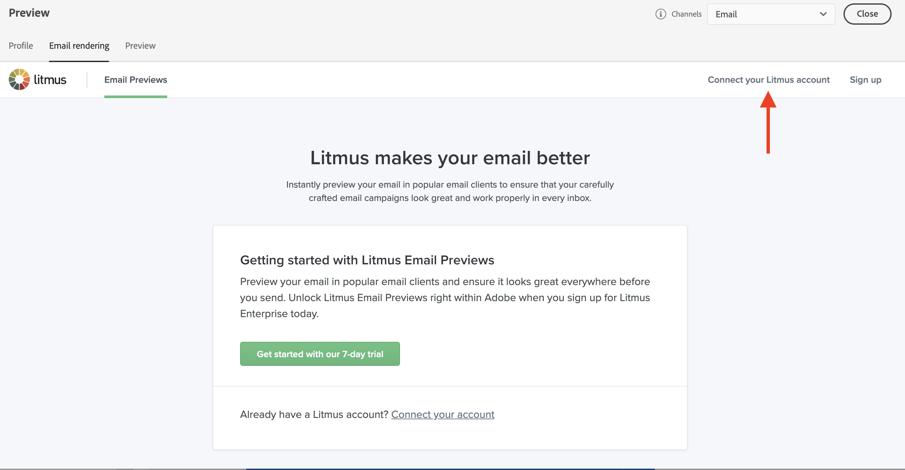

# 測試電子郵件轉譯 {#email-rendering}

>[!BEGINSHADEBOX]

**在此頁面上：**&#x200B;瞭解如何將您的Litmus帳戶連線至Adobe Journey Optimizer，以測試熱門案頭、行動裝置和網頁型使用者端的電子郵件轉譯。

>[!ENDSHADEBOX]

您可以利用您的&#x200B;**Litmus**&#x200B;帳戶登入[!DNL Journey Optimizer]，在常見電子郵件使用者端立即預覽您的&#x200B;**電子郵件呈現**。 接著，您就可以確保電子郵件內容看起來不錯，並且在每個收件匣中都能正常運作。

若要檢查電子郵件呈現，請遵循下列步驟：

1. 從訊息的編輯內容畫面或電子郵件Designer中，按一下&#x200B;**[!UICONTROL 模擬內容]**，然後從下拉式清單中選取&#x200B;**[!UICONTROL 模擬內容（AEP設定檔）]**。

1. 選取&#x200B;**[!UICONTROL 轉譯電子郵件]**&#x200B;按鈕。

   

1. 按一下右上角的&#x200B;**連線您的Litmus帳戶**。

   

1. 輸入您的認證並登入。

   

1. 按一下&#x200B;**執行測試**&#x200B;按鈕以產生電子郵件預覽。

1. 在熱門的桌上型電腦、行動裝置和網頁型使用者端中檢查您的電子郵件內容。

   

>[!CAUTION]
>
>當您連線您的&#x200B;**Litmus**&#x200B;帳戶與[!DNL Journey Optimizer]時，您同意傳送測試訊息給Litmus：一旦傳送，這些電子郵件將不再由Adobe管理。 因此，Litmus資料保留電子郵件原則適用於這些電子郵件，包括可能包含在這些測試訊息中的個人化資料。
