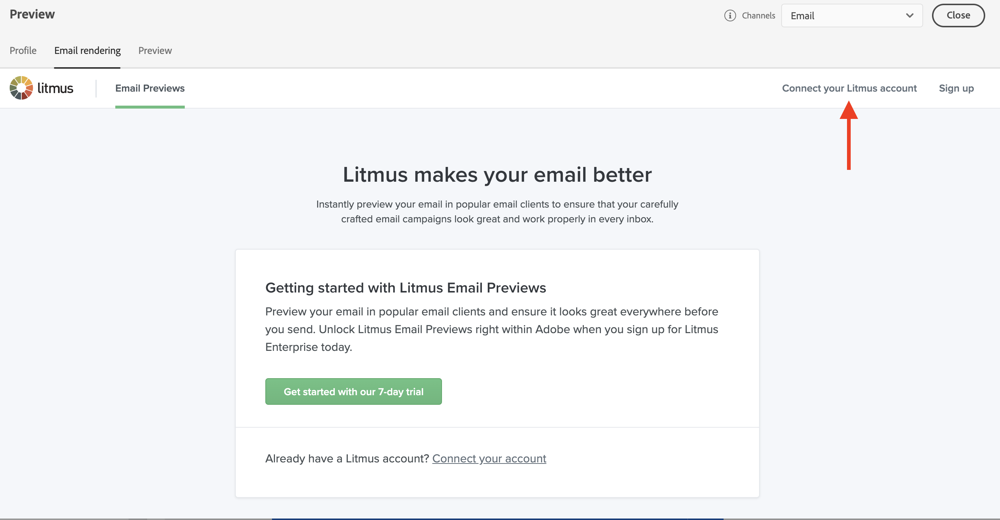
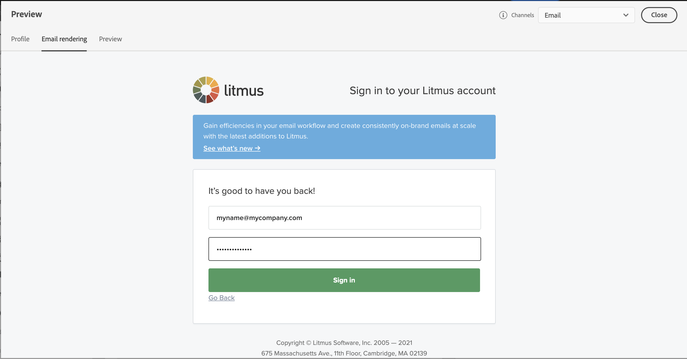

# 測試電子郵件轉譯 {#email-rendering}

>[!BEGINSHADEBOX]

**在此頁面上：**&#x200B;瞭解如何將您的Litmus帳戶連線至Adobe Journey Optimizer，以測試常見電子郵件使用者端間的電子郵件轉譯，並瞭解已知的轉譯限制，包括行動網頁瀏覽器環境。

>[!ENDSHADEBOX]

您可以利用您的&#x200B;**Litmus**&#x200B;帳戶登入[!DNL Journey Optimizer]，在常見電子郵件使用者端立即預覽您的&#x200B;**電子郵件呈現**。 接著，您就可以確保電子郵件內容看起來不錯，並且在每個收件匣中都能正常運作。

若要檢查電子郵件呈現，請遵循下列步驟：

1. 從訊息的編輯內容畫面或電子郵件Designer中，按一下&#x200B;**[!UICONTROL 模擬內容]**，然後從下拉式清單中選取&#x200B;**[!UICONTROL 模擬內容（AEP設定檔）]**。

1. 選取&#x200B;**[!UICONTROL 轉譯電子郵件]**&#x200B;按鈕。

   

1. 按一下右上角的&#x200B;**連線您的Litmus帳戶**。

   

1. 輸入您的認證並登入。

   

1. 按一下&#x200B;**執行測試**&#x200B;按鈕以產生電子郵件預覽。

1. 在熱門的桌上型電腦、行動裝置和網頁型使用者端中檢查您的電子郵件內容。

   

>[!CAUTION]
>
>當您連線您的&#x200B;**Litmus**&#x200B;帳戶與[!DNL Journey Optimizer]時，您同意傳送測試訊息給Litmus：一旦傳送，這些電子郵件將不再由Adobe管理。 因此，Litmus資料保留電子郵件原則適用於這些電子郵件，包括可能包含在這些測試訊息中的個人化資料。

## 行動網站瀏覽器限制 {#rendering-limitations}

當收件者透過行動裝置網頁瀏覽器&#x200B;**（例如手機上的Chrome）開啟Gmail或Outlook**&#x200B;時，電子郵件呈現可能會有所不同，而不是使用原生行動應用程式或案頭使用者端。 這是行動網站郵件環境的已知限制，並非特定於Journey Optimizer。

這種轉譯差異來自於網頁郵件使用者端在行動瀏覽器中的行為。 瀏覽器會先轉譯完整的案頭網頁郵件UI，將電子郵件置於兩層深，超出任何回應式CSS或媒體查詢的觸及。 Gmail Web另外會移除CSS `<style>`區塊，並將電子郵件內容包裝在自己的`
`中，這樣可能會覆寫您的樣式並建立對齊衝突。

典型的症狀包括文字對齊位移（顯示置中的左對齊文字）、內容區段之間的額外白色分隔線，以及與範本設計不同的整體版面。

這些問題僅發生在透過行動瀏覽器存取的Gmail Web和Outlook Web中。 Outlook和Gmail原生行動應用程式，以及所有案頭使用者端不受影響。

>[!TIP]
>
>若要將影響降至最低：
>
>* 使用具有完整內嵌CSS的簡單表格式版面。
>
>* 避免依賴媒體查詢或`<style>`區塊來取得關鍵版面配置屬性，例如文字對齊。
