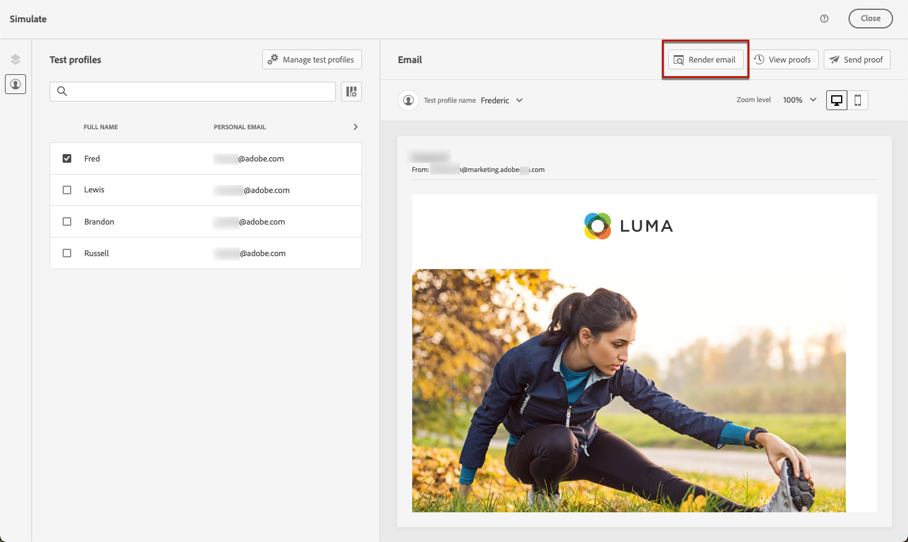
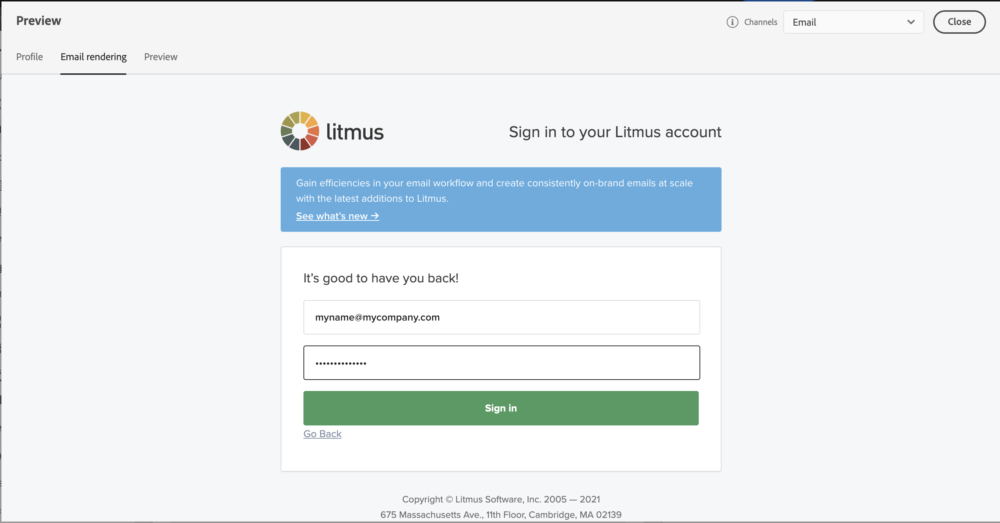

# 測試電子郵件轉譯 {#email-rendering}

您可以善用您的 **利特木斯** 帳戶至 [!DNL Journey Optimizer] 立即預覽 **電子郵件呈現** 在常用的電子郵件使用者端中。 接著，您就可以確保電子郵件內容看起來不錯，並且在每個收件匣中都能正常運作。

若要檢查電子郵件呈現，請遵循下列步驟：

1. 從訊息的編輯內容畫面或電子郵件設計工具中，按一下 **[!UICONTROL 模擬內容]** 按鈕。

1. 選取 **[!UICONTROL 轉譯電子郵件]** 按鈕。

   

1. 按一下 **連線您的Litmus帳戶** 在右上角。

   

1. 輸入您的認證並登入。

   

1. 按一下 **執行測試** 按鈕以產生電子郵件預覽。

1. 在熱門的桌上型電腦、行動裝置和網頁型使用者端中檢查您的電子郵件內容。

   

>[!CAUTION]
>
>當連線您的 **利特木斯** 帳戶與 [!DNL Journey Optimizer]，您同意將測試訊息傳送至Litmus：傳送後，Adobe將不再管理這些電子郵件。 因此，Litmus資料保留電子郵件原則適用於這些電子郵件，包括可能包含在這些測試訊息中的個人化資料。
