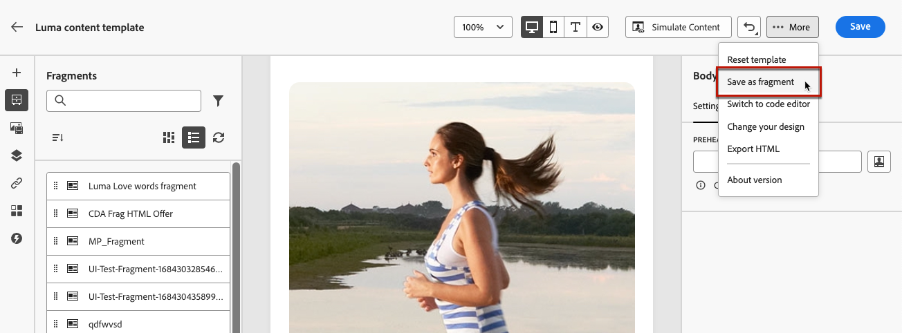

# 將內容另存為片段 {#save-as-fragment}

在[!DNL Journey Optimizer]中編輯內容時，您可以將全部或部分內容儲存為片段，以供日後重複使用。 您可以從電子郵件Designer[儲存內容為片段](#save-as-visual-fragment)，或從運算式編輯器[儲存內容](#save-as-expression-fragment)。

>[!NOTE]
>
>片段中不支援[內容屬性](../personalization/personalization-build-expressions.md)。
>
>在歷程或行銷活動中啟用追蹤時，如果連結存在於儲存的片段中，且如果此片段用於訊息中，則會追蹤這些連結，例如訊息中包含的所有其他連結。 [進一步瞭解連結和追蹤](../email/message-tracking.md)

## 另存為視覺片段 {#save-as-visual-fragment}

若要將電子郵件Designer的內容儲存為片段，請遵循下列步驟：

1. 在[電子郵件Designer](../email/get-started-email-design.md)中，按一下熒幕右上方的省略符號。

1. 從下拉式選單中選取&#x200B;**[!UICONTROL 另存為片段]**。

   

   >[!NOTE]
   >
   >視覺化片段不能超過100KB。

1. **[!UICONTROL 另存為片段]**&#x200B;畫面隨即顯示。 在該處選取您要納入片段中的元素，包括個人化欄位和動態內容。

   

   >[!CAUTION]
   >
   >您只能選取彼此相鄰的區段。您無法選取空的結構或其他片段。

1. 按一下「**[!UICONTROL 建立]**」並填入片段名稱和說明（如有需要）。

1. 若要指派自訂或核心資料使用標籤給片段，請按一下畫面上方的&#x200B;**[!UICONTROL 管理存取權]**&#x200B;按鈕。 [進一步瞭解物件層級存取控制(OLAC)](../administration/object-based-access.md)。

1. 從&#x200B;**標籤**&#x200B;欄位選取或建立Adobe Experience Platform標籤，將範本分類以改善搜尋。 [了解更多](../start/search-filter-categorize.md#tags)

1. 按一下 **[!UICONTROL 建立]**。片段已新增至[片段清單](#access-manage-fragments)，且狀態為&#x200B;**草稿**。 它會變成獨立的片段，可當作該清單中的任何其他視覺片段使用。

   >[!NOTE]
   >
   >對該新片段所做的任何變更都不會傳播到該新片段來自的電子郵件或範本。 同樣地，在該電子郵件或範本中編輯原始內容時，不會修改新片段。

1. 為了能夠在您的歷程和行銷活動中使用片段，您需要讓它上線。 [瞭解如何預覽和發佈片段](../content-management/create-fragments.md#publish)

## 另存為運算式片段 {#save-as-expression-fragment}

>[!CONTEXTUALHELP]
>id="ajo_perso_library"
>title="另存為運算式片段"
>abstract="[!DNL Journey Optimizer] 個人化編輯器可讓您將內容另存為運算式片段。然後這些運算式可用於建置個人化內容。"

[!DNL Journey Optimizer] 個人化編輯器可讓您將內容另存為運算式片段。然後這些運算式可用於建置個人化內容。

若要將內容另存為運算式片段，請遵循下列步驟。

1. 在[個人化編輯器](../personalization/personalization-build-expressions.md)介面中，建置運算式，然後按一下&#x200B;**[!UICONTROL 另存為片段]**。

   >[!NOTE]
   >
   >運算式不能超過200KB。

1. 在右窗格中，輸入運算式的名稱和說明，以協助使用者更輕鬆地找到它。

   

1. 按一下&#x200B;**[!UICONTROL 儲存片段]**。

   <!--An expression fragment cannot be nested inside another fragment.-->

1. 片段已新增至[片段清單](#access-manage-fragments)，且狀態為&#x200B;**草稿**。 它會變成獨立的片段，可當作該清單中的任何其他運算式片段使用。

1. 為了能夠在您的歷程和行銷活動中使用片段，您需要讓它上線。 [瞭解如何預覽和發佈片段](../content-management/create-fragments.md#publish)
