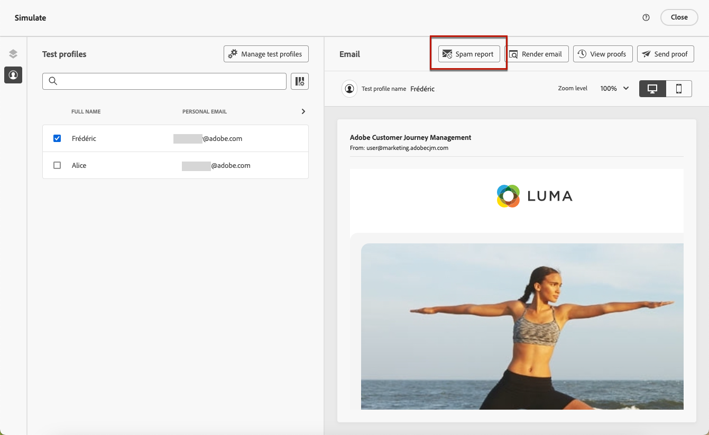
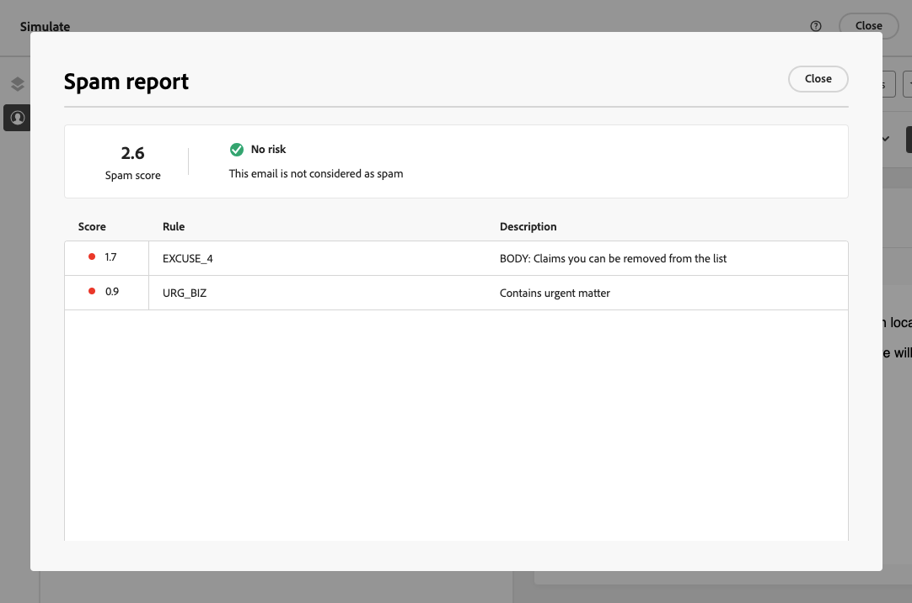

# 電子郵件垃圾郵件報告 {#spam-report}

>[!CONTEXTUALHELP]
>id="ajo_simulate_spam_report"
>title="電子郵件垃圾郵件報告"
>abstract="垃圾郵件報告可讓您檢查您的電子郵件內容垃圾郵件評分。 此分數表示ISP或信箱提供者是否會將您的郵件視為垃圾訊息。 分數越低越好。 如果您的電子郵件內容分數高於2，您應考慮修正導致測試失敗的問題。"

您可以在專用的垃圾郵件報告中檢查您的電子郵件內容垃圾郵件評分。 使用 [SpamAssassin](https://spamassassin.apache.org/){target="_blank"}，Adobe Journey Optimizer可測試您的電子郵件內容，並為內容評分，指出ISP或信箱提供者是否將其視為垃圾郵件。

>[!AVAILABILITY]
>
>此功能目前為測試版本，僅供測試版客戶使用。 若要加入 Beta 版計畫，請連絡 Adobe 客戶服務。

編輯或預覽電子郵件內容時， **[!UICONTROL 垃圾郵件報告]** 按鈕提供評分和建議，以改善所列每個個別專案的分數。

此功能可讓您判斷郵件在接收時是否會被反垃圾郵件工具視為垃圾郵件，並據此採取行動。 許多電子郵件收件匣提供者使用工具作為其垃圾郵件篩選流程的一部分。 傳送分數不佳的電子郵件可能會嚴重影響您的傳遞能力。

若要存取 **[!UICONTROL 垃圾郵件報告]**，請遵循下列步驟。

1. 從 **[!UICONTROL 模擬]** 熒幕，按一下 **[!UICONTROL 垃圾郵件報告]** 按鈕。

   

<!--
    You can also open the [Email Designer](../email/content-from-scratch.md), click the **[!UICONTROL More]** button and select **[!UICONTROL Check spam score]** from the menu.

    
-->

1. 系統會自動執行反垃圾郵件檢查，並且 **[!UICONTROL 垃圾郵件報告]** 視窗會顯示結果。 它會顯示您的內容在正文版面配置、結構、影像大小、垃圾郵件觸發字詞（如果有的話）等方面的表現。

   

1. 檢查每個專案的分數和說明。

   分數越低越好。 如果分數高於5，則會顯示警告：指出某些訊息在收到時可能會遭到封鎖或標籤為垃圾訊息。 最佳實務是讓分數低於2。

1. 根據該得分，如果您認為某些元素可以改善，請在中編輯您的內容 [電子郵件設計工具](../email/content-from-scratch.md) 並進行必要的更新。

1. 完成變更後，瀏覽回 **[!UICONTROL 垃圾郵件報告]** 畫面以確保您的分數已改善。

   

<!--You can also check the message's alerts for warnings on potential risk of spam detection. Follow the steps below.

1. Click the **[!UICONTROL Alerts]** button on top right of the screen. [Learn more on email alerts](../email/create-email.md#check-email-alerts)

1. If **[!UICONTROL Spam checker alert]** is displayed, you should check your content for a potential risk of spam using the **[!UICONTROL Spam report]** feature as detailed above.

    
-->
