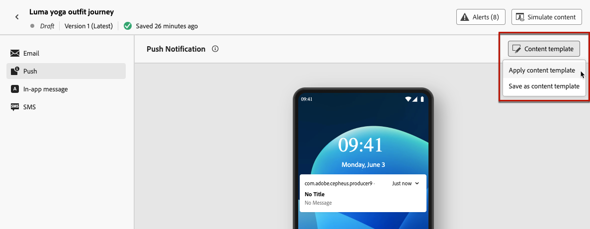
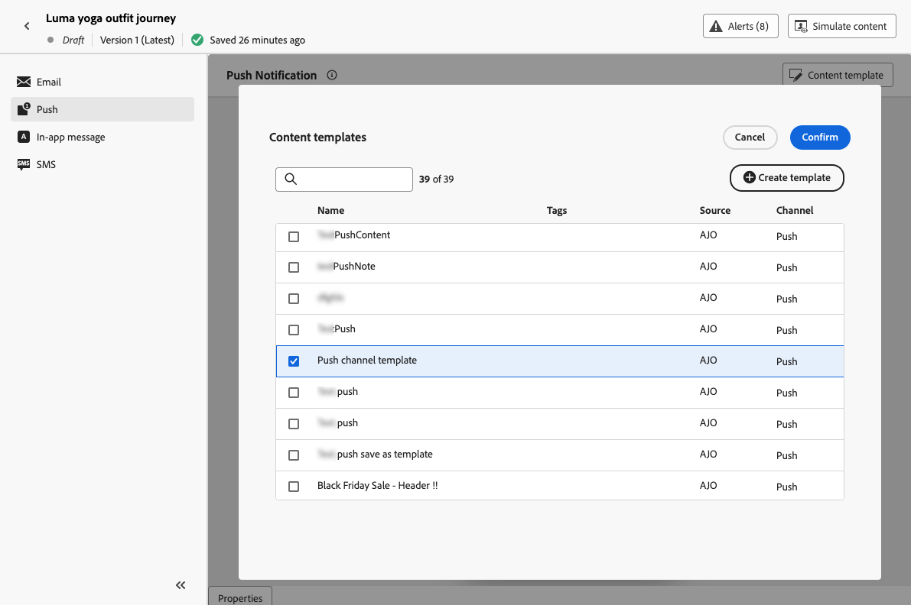

# 使用內容範本 {#use-content-templates}

在中建立任何管道的內容（網頁除外）時 [!DNL Journey Optimizer]，您可以使用自訂範本，並執行以下其中一項作業：

* 使用從頭開始建立 **[!UICONTROL 內容範本]** 功能表。 [了解更多](#create-template-from-scratch)

* 使用從歷程或行銷活動中的現有內容儲存 **[!UICONTROL 另存為內容範本]** 選項。 [了解更多](#save-as-template)

若要使用其中一個範本開始建立您的內容，請遵循下列步驟。

1. 無論是在行銷活動或歷程中，在選取後 **[!UICONTROL 編輯內容]**，按一下 **[!UICONTROL 內容範本]** 按鈕。

1. 選取 **[!UICONTROL 套用內容範本]**.

   

1. 從清單中選取您選擇的範本。 僅顯示與所選管道和/或型別相容的範本。

   

   >[!NOTE]
   >
   >在此畫面中，您也可以使用專用按鈕建立新範本，以開啟新標籤。

1. 按一下 **[!UICONTROL 確認]**. 範本會套用至您的內容。

1. 視需要繼續編輯您的內容。

>[!NOTE]
>
>若要開始從內容範本設計電子郵件，請使用 [傳送Designer電子郵件](../email/get-started-email-design.md)，請依照中所述的步驟操作 [本節](../email/use-email-templates.md).
