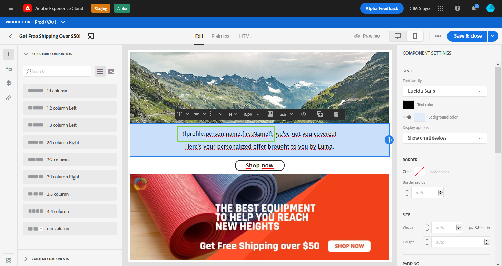
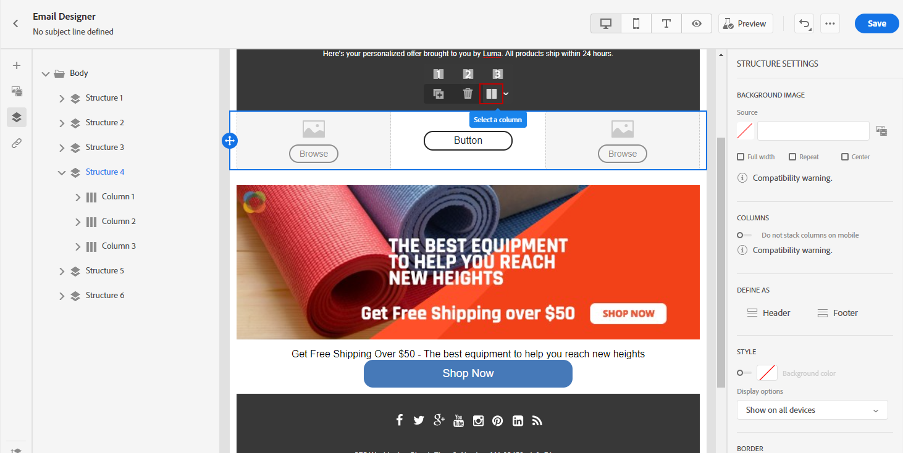
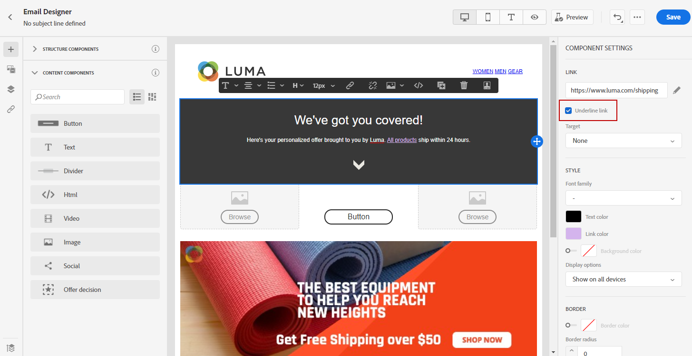

# 在使用者介面中設計您的電子郵件內容 {#create-email-content}

一旦您 [已建立訊息](create-message.md)，您可以開始建立電子郵件內容。

1. 從新建立的訊息中，選取 **[!UICONTROL Email designer]** 在 **[!UICONTROL Body]** 區段。

   

1. 在電子郵件設計工具首頁中，從以下選項選擇您要如何設計電子郵件：

   * 選擇 **[!UICONTROL Design from scratch]** 使用電子郵件設計工具功能建立電子郵件內容。 [了解更多](#design-scratch)

   * 選擇 **[!UICONTROL Start from template]** 從內建的範本清單建立電子郵件。 請注意，您無法建立其他範本。

   * 選擇 **[!UICONTROL Code your own]** 輸入或貼上HTML原始程式碼。 [了解更多](existing-content.md#import-raw-html-code)。

   * 選擇 **[!UICONTROL Import HTML]** 匯入HTML檔案或.zip資料夾。 [了解更多](existing-content.md#import-html-content-from-file)。

   

## 從頭設計 {#design-scratch}

>[!CONTEXTUALHELP]
>id="ac_structure_components"
>title="關於結構元件"
>abstract="結構元件可定義電子郵件的版面。"

>[!CONTEXTUALHELP]
>id="ac_edition_columns"
>title="定義電子郵件欄"
>abstract="電子郵件設計工具可讓您透過定義欄結構來輕鬆定義電子郵件的版面。"

電子郵件設計工具可讓您輕鬆定義電子郵件的結構。 透過新增和移動結構元素並執行簡單的拖放動作，您可以在數秒內設計電子郵件的形狀。

若要開始使用電子郵件設計工具建立電子郵件內容，請遵循下列步驟：

1. 選取 **[!UICONTROL Design from scratch]** 選項，通過拖放來開始設計電子郵件內容 **[!UICONTROL Structure components]** 來定義電子郵件的版面。

   >[!NOTE]
   >
   >請注意，列堆疊與所有電子郵件程式不相容。 不支援時，不會堆疊欄。
   >
   >放入電子郵件後，您必須先放入內容元件或片段，才能移動或移除元件。

   

1. 新增最多 **[!UICONTROL Structure components]** 視需要。

   選取 **[!UICONTROL n:n column]** 元件，定義您選取的欄數（介於3和10之間）。 您也可以移動每欄底部的箭頭，以定義每欄的寬度。

   >[!NOTE]
   >
   >每個列大小不能低於結構元件總寬度的10%。 無法刪除非空的列。

1. 從 **[!UICONTROL Content components]** 下拉式清單中，您可以新增 **[!UICONTROL Content components]** 視您的結構元件需求而定。 [深入了解內容元件](content-components.md).

   

1. 每個元件可進一步自訂為 **[!UICONTROL Component settings]** 區段。 例如，您可以變更文字樣式、元件的邊框間距或邊界。 [進一步了解對齊方式和邊框間距](#adjusting-vertical-alignment-and-padding).

   

1. 從 **[!UICONTROL Assets picker]**，您可以直接新增儲存在 **[!UICONTROL Assets library]** 到您的電子郵件。 [深入了解資產管理](assets-essentials.md).

   連按兩下包含資產的資料夾，然後拖放您要新增至電子郵件的資產。

   

1. 新增個人化欄位，以自訂來自您設定檔資料的內容。 [深入了解內容個人化](personalization/personalize.md).

   

1. 在 **[!UICONTROL Links]** 頁簽，檢查要追蹤的內容的所有URL清單。 您可以修改其 **[!UICONTROL Tracking Type]**, **[!UICONTROL Label]** 和 **[!UICONTROL Tags]** 如有需要。

   

   >[!NOTE]
   >
   >進一步了解中的連結和訊息追蹤 [本頁](message-tracking.md).

1. 如有需要，您可以切換至程式碼編輯器，按一下 **[!UICONTROL Switch to code editor]** 的上界。 如需程式碼編輯器的詳細資訊，請參閱 [頁面](existing-content.md#import-raw-html-code).

   >[!NOTE]
   >
   >切換至程式碼編輯器後，您將無法使用此電子郵件的可視化設計工具。

   

1. 按一下 **[!UICONTROL Show preview]** 檢查電子郵件呈現。 您可以選擇案頭或行動檢視。

   如需如何預覽電子郵件的詳細資訊，請參閱 [預覽和測試您的訊息](preview.md).

   

1. 當您的電子郵件準備就緒時，按一下 **[!UICONTROL Save & Close]**.

您的電子郵件內容現在可用於訊息中。 [了解如何傳送訊息](publish-manage-message.md).

## 建立電子郵件的文字版本 {#generate-text-version}

建議您建立電子郵件內文的文字版本，以用於無法顯示HTML內容時。

依預設，電子郵件設計工具會建立 **[!UICONTROL Plain text]** 電子郵件的版本，包括個人化欄位。 此版本會自動產生，並與您的內容的HTML版本同步。

如果您偏好對純文字版本使用不同內容，請遵循下列步驟：

1. 從您的電子郵件中，選取 **[!UICONTROL Plain text]** 標籤。

   

1. 使用 **[!UICONTROL Sync with HTML]** 切換為禁用同步。

   

1. 按一下核取記號以確認您的選擇。

   

1. 然後，您可以視需要編輯純文字版本。

>[!CAUTION]
>
>* 中所做的變更 **[!UICONTROL Plain text]** 檢視不會反映在HTML檢視中。
>
>* 如果您重新啟用 **[!UICONTROL Sync with HTML]** 選項，您的變更將會遺失，並取代為從HTML版本產生的文字內容。

## 使用前置詞 {#preheader}

>[!CONTEXTUALHELP]
>id="ac_edition_preheader"
>title="使用前置詞"
>abstract="前置詞可讓您設定簡短的摘要文字，以協助您更好地追蹤及自訂您的電子郵件。"

>[!NOTE]
>
>請注意，預先標題與所有電子郵件用戶端不相容。 若不支援，則不會顯示預先標題。

前置詞是摘要文字，在從電子郵件用戶端檢視電子郵件時，會遵循主旨行。 前置標題可協助您更妥善地追蹤及自訂電子郵件。

1. 從電子郵件設計工具中，新增 **[!UICONTROL Structure components]** 開始設計電子郵件。

   

1. 從 **[!UICONTROL Body settings]** 右窗格，按一下 **編輯** 旁邊 **[!UICONTROL Preheader]** 欄位來新增內容。

   

1. 新增您的標題。 您可以按一下 **[!UICONTROL Add personalization]** 表徵圖。

   

1. 從 **[!UICONTROL Edit Personalization]** 視窗中，您可以新增 **[!UICONTROL Content block]**, **[!UICONTROL Dynamic content]** 或 **[!UICONTROL Personalization fields]**.

1. 按一下 **[!UICONTROL Validate]** 以檢查個人化語法。

   

1. 按一下「**[!UICONTROL Save]**」。

您的電子郵件現在已設定前置標題。

## 背景設定 {#about-backgrounds}

>[!CONTEXTUALHELP]
>id="ac_edition_backgroundimage"
>title="背景設定"
>abstract="電子郵件設計工具可讓您個人化內容的背景顏色或背景影像。請注意，並非所有電子郵件用戶端都支援背景影像。"
>additional-url="https://docs.google.com/spreadsheets/d/1TLo62YKm3tThUWDOIliCQFWs3dpNjpDfw6DdTr1oGOw/edit#gid=0" text="其他資訊"

若是使用電子郵件設計工具來設定背景，Adobe建議使用下列項目：

1. 如果設計需要，請將背景顏色套用至電子郵件的正文。
1. 在大多數情況下，在列級別設定背景顏色。
1. 請盡量不要在影像或文字元件上使用背景顏色，因為這些顏色難以管理。

以下是您可使用的可用背景設定。

* 設定 **[!UICONTROL Background color]** 整封電子郵件。 請務必在導覽樹狀結構中選取可從左側浮動視窗存取的內文設定。

* 通過選擇 **[!UICONTROL Viewport background color]**. 此選項可讓您從背景顏色中選取不同的設定。

* 為每個結構元件設定不同的背景顏色。 在導航樹中選擇一個結構，可從左側調色板訪問，以僅將特定背景顏色應用於該結構。

   請確定您未設定檢視區背景顏色，因為它可能會隱藏結構背景顏色。

* 設定 **[!UICONTROL Background image]** （對於結構元件的內容）。

   >[!NOTE]
   >
   >有些電子郵件程式不支援背景影像。 若不支援，則會改用列背景顏色。 請務必選取適當的後援背景顏色，以備影像無法顯示時使用。

* 在列級別設定背景顏色。

   >[!NOTE]
   >
   >這是最常見的使用案例。 Adobe建議在欄層級設定背景顏色，因為這樣在編輯整個電子郵件內容時可提供更大的彈性。

   您也可以在欄層級設定背景影像，但此功能很少使用。

## 調整垂直對齊和邊框間距 {#adjusting-vertical-alignment-and-padding}

在此示例中，我們將調整由三列組成的結構元件內的邊框間距和垂直對齊方式。

1. 直接在電子郵件中選取結構元件，或使用 **[!UICONTROL Navigation tree]** 左側功能表。

   

1. 在工具列中，按一下 **[!UICONTROL Select a column]** 並選擇要編輯的。 您也可以從結構樹中選取它。

   該列的可編輯參數顯示在 **[!UICONTROL Column settings]** 功能表。

   

1. 在 **[!UICONTROL Vertical alignment]**，選取 **[!UICONTROL Bottom]**.

   內容元件會移至欄底部。

   

1. 在 **[!UICONTROL Padding]**，定義欄內的上邊框間距。 按一下鎖定圖示以中斷與底部邊框間距的同步。

   定義該欄的左邊框和右邊框間距。

   

1. 以類似方式繼續調整其他列的對齊方式和邊框間距。

1. 儲存您的變更。

## 定義連結的樣式 {#about-styling-links}

您可以在電子郵件設計工具中為連結加底線，並選取其顏色和目標。

1. 文字 **[!UICONTROL Content component]** 插入連結時，請選取您的連結。

1. 在 **[!UICONTROL Component settings]** 菜單，檢查 **[!UICONTROL Underline link]** 將連結的標籤文字加上底線。

   

1. 選擇將對象重新導向至 **[!UICONTROL Target]** 下拉式清單：

   * **[!UICONTROL None]**:在與點按連結相同的時間格中開啟連結（預設）。
   * **[!UICONTROL Blank]**:在新視窗或索引標籤中開啟連結。
   * **[!UICONTROL Self]**:在按一下連結時的同一幀中開啟連結。
   * **[!UICONTROL Parent]**:開啟父框架中的連結。
   * **[!UICONTROL Top]**:在窗口的正文中開啟連結。

   

1. 若要變更連結的顏色，請按一下 **[!UICONTROL Link color]**.

   

1. 選擇所需的顏色。

1. 儲存您的變更。

## 新增內嵌樣式屬性 {#adding-inline-styling-attributes}

在「電子郵件設計工具」介面中，當您選取元素並在側面板顯示其設定時，可以自訂該特定元素的內嵌屬性及其值。

1. 在內容中選取元素。
1. 在側面板上，查找 **[!UICONTROL Styles Inline]** 設定。

1. 修改現有屬性的值，或使用 **+** 按鈕。 您可以新增任何與CSS相容的屬性和值。

樣式隨後會套用至選取的元素。 如果子元素未定義特定樣式屬性，則會繼承父元素的樣式。
