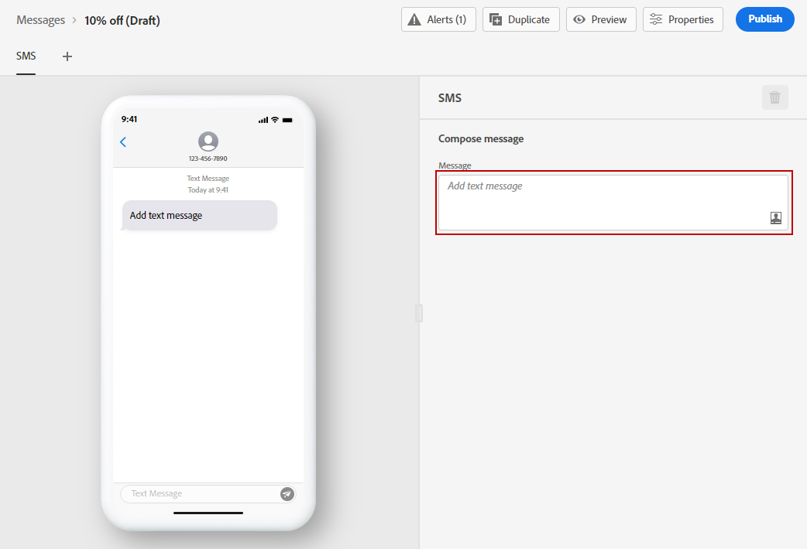

# 建立SMS訊息 {#create-sms}

>[!CAUTION]
>
> 目前，僅特定使用者可提早存取SMS通道。 如果您想要運用此功能，請連絡您的Adobe客戶主管。

一旦您 [建立訊息](create-message.md)，請使用 **[!UICONTROL SMS]** 標籤來定義SMS頻道的設定和內容。

若要開始個人化SMS訊息，請遵循下列步驟：

1. 按一下 **[!UICONTROL Add text message]** 欄位來開啟運算式編輯器。

   

1. 使用運算式編輯器來定義內容和個人化資料。 進一步了解中的運算式編輯器中的個人化 [本節](personalization/personalize.md)

   >[!NOTE]
   >
   > SMS訊息的長度限制為160個字元。

   

1. 按一下 **[!UICONTROL Save]** 您的個人化訊息準備就緒時。

1. 按一下 **[!UICONTROL Preview]** 將您的SMS訊息在行動裝置上的顯示方式視覺化。 如需詳細資訊，請參閱[本章節](preview.md)。

1. 訊息準備就緒後，您可以發佈訊息，以便透過 **[!UICONTROL Publish]** 按鈕。 此動作會發佈新版本的訊息，將用於歷程中的下一個執行。

您的SMS訊息現在可用於歷程中。 [了解如何建立歷程](building-journeys/journey-gs.md).

**相關主題**

* [設定簡訊頻道](configuration/sms-configuration.md)
* [建立新訊息](create-message.md)
* [在歷程中新增訊息](building-journeys/journeys-message.md)
