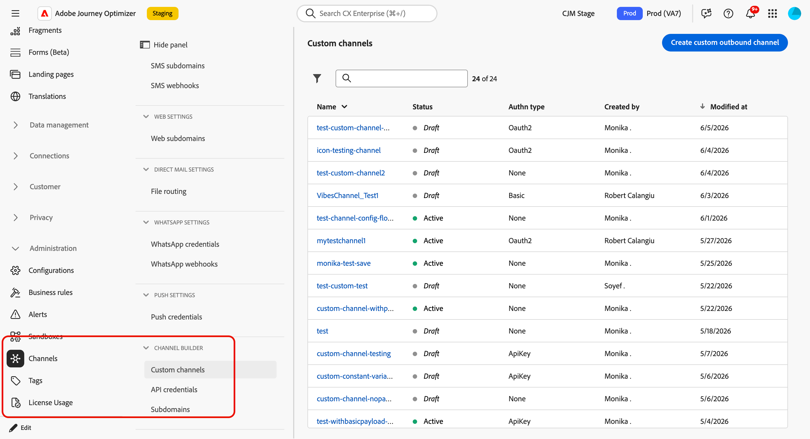
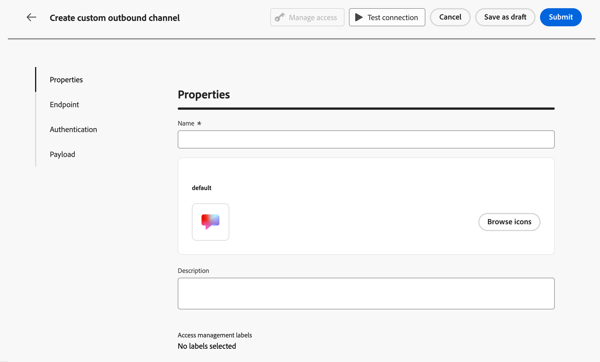
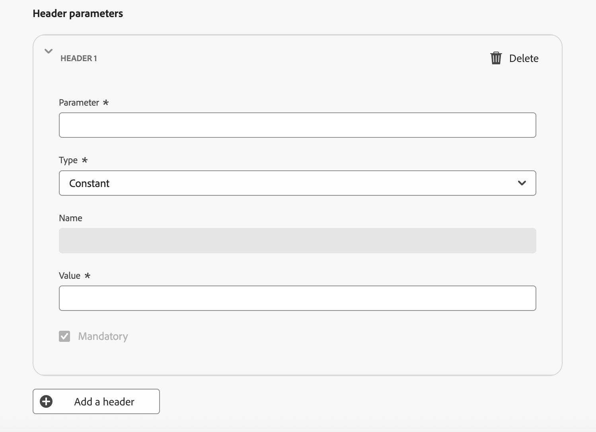
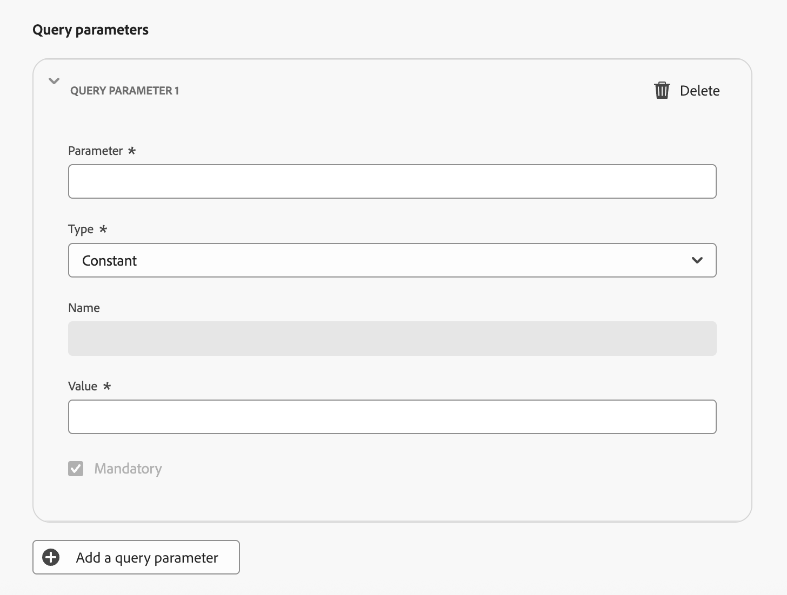

# 設定自訂頻道 {#create-custom-channel}

>[!CONTEXTUALHELP]
>id="ajo_custom_channel_settings"
>title="關於自訂頻道"
>abstract="自訂通道可讓Adobe Journey Optimizer透過您自己的API端點將個人化訊息傳送至外部系統。 定義一般屬性、端點、驗證和裝載，然後測試並啟用新的自訂頻道。 完成後，您就可以在建立管道設定時使用它，讓行銷人員可以在歷程及行銷活動中使用。"
>additional-url="" text="開始使用自訂頻道"

<!--Contextual help final location TBC (here or in Settings subsection-->

若要在行銷活動和歷程中使用自訂頻道，管理員必須先建立頻道。 這涉及定義端點、驗證、節流原則和訊息裝載結構。

**頻道產生器**&#x200B;區段是定義新自訂頻道的中央介面。 <!--It is accessible to users with the **[!UICONTROL Administrator]** role. -->它可讓您建立及設定自訂通道，也可管理API認證，以及委派子網域。

>[!IMPORTANT]
>
>若要存取Channel Builder、建立和管理自訂頻道，您必須授予&#x200B;**檢視自訂頻道**&#x200B;和&#x200B;**管理自訂頻道**&#x200B;許可權。<!--[Learn more](../administration/high-low-permissions.md)--> 在[本節](../administration/permissions.md)中瞭解如何管理許可權。

## 存取及管理自訂頻道 {#access-channel-builder}

若要存取&#x200B;**頻道產生器**&#x200B;並管理您的自訂頻道，請遵循下列步驟。

1. 前往左側導覽邊欄中的&#x200B;**[!UICONTROL 管理]** > **[!UICONTROL 管道]**。

1. 選取&#x200B;**[!UICONTROL 頻道產生器]**&#x200B;區段下的&#x200B;**[!UICONTROL 自訂頻道]**。

   {width="70%"}

1. 詳細目錄會列出您沙箱中的所有自訂管道，包括其目前狀態以及用於連線至外部端點的驗證型別。

1. 您可以依狀態（**草稿**、**作用中**&#x200B;或&#x200B;**已封存**） （建立者）來篩選自訂頻道，並按名稱搜尋。

1. 若要編輯管道，請在詳細目錄中按一下管道名稱、進行變更並儲存。 對於使用中頻道，您只能編輯某些欄位 — [瞭解更多](#test-activate)。

   >[!CAUTION]
   >
   >修改作用中頻道的節流或重試設定，會立即對所有執行中和未來的執行生效。

1. 若要封存管道，請從詳細目錄開啟它，然後按一下&#x200B;**[!UICONTROL 封存]**。

   封存使用中管道會將其從所有選取項下拉式清單（行銷活動動作選擇器、歷程動作調色盤、協調的行銷活動管道清單、管道設定和內容範本）中移除。 已使用此管道的現有歷程和行銷活動可繼續正常運作。

## 建立自訂頻道 {#create-channel}

若要建立新的自訂管道，請遵循下列步驟。

1. 按一下&#x200B;**[!UICONTROL 建立自訂頻道]**&#x200B;按鈕，開啟頻道建立表單。 首先定義自訂管道的一般設定。

   {width="70%"}

1. 在&#x200B;**[!UICONTROL 屬性]**&#x200B;區段中，為您的自訂頻道輸入&#x200B;**[!UICONTROL 名稱]**。 此名稱會出現在歷程畫布、行銷活動動作選擇器及協調的行銷活動頻道清單中。

   >[!NOTE]
   >
   >名稱必須是唯一的、以字母(A-Z)開頭、僅包含英數字元或特殊字元( _、.、-)，並且應大於1個字元。

1. 您可以從預設圖示資料庫中選取圖示，或從電腦中選取SVG檔案。

   >[!NOTE]
   >
   >檔案不得大於150KB。

   此圖示將顯示在歷程畫布中的頻道名稱旁。 如果未上傳任何圖示，則會使用預設的圖示。

1. 輸入選用的&#x200B;**[!UICONTROL 描述]**。

<!--
1. Optionally, assign **[!UICONTROL Access labels]** to restrict access to this channel based on data usage policies. Learn more
-->

## 設定端點設定 {#endpoint-configuration}

您必須設定端點，這是外部傳訊系統的HTTP URL。 當設定檔符合促銷活動或歷程的資格時，[!DNL Journey Optimizer]會使用個人化裝載將POST要求傳送至此端點。

{width="70%"}

1. 在&#x200B;**[!UICONTROL 端點組態]**&#x200B;區段中，輸入外部傳訊系統的主機&#x200B;**[!UICONTROL URL]**。

   <!--The HTTP method to is currently set to **POST**.-->

   >[!IMPORTANT]
   >您的外部傳訊系統必須公開[!DNL Journey Optimizer]可以透過HTTP POST呼叫的HTTPS端點。 端點必須：
   >
   >* 接受您的管道所定義的裝載格式(JSON)。
   >* 支援Channel Builder中可用的其中一種驗證方法。 [了解更多](#authentication-settings)
   >* 傳回HTTP 2xx回應以確認成功收到請求。

1. 視需要新增&#x200B;**[!UICONTROL 標頭]**。 標頭是在HTTP要求層級傳輸的機碼值組。 它們會與每個要求一併傳送至您的端點，通常用於驗證權杖、內容型別規格或外部系統所需的任何其他中繼資料。

   <!--At minimum, `Content-Type` and `Charset` are available as default headers.-->

   

   對於每個標頭，您可以定義其值是否為：

   * **[!UICONTROL Constant]** — 每個要求中設定一次且包含的靜態值。 例如，您可以定義值為`application/json`的`Content-Type`引數或值為`UTF-8`的`Charset`引數。
   * **[!UICONTROL 變數]** — 如果在此輸入預設值，除非在管道設定中覆寫，否則會使用此值。 例如，您可以為在執行階段解析的使用者ID定義變數。 [深入瞭解](custom-channel-configuration.md) <!--From Custom actions section: For these parameters, you can define where to get this information (example: events, data sources), pass values manually or use the advanced expression editor for advanced use cases. Advanced uses cases can be data manipulation and other function usage. Refer to this [page](expression/expressionadvanced.md).-->

1. 可選擇使用相同的常數/變數模式，新增&#x200B;**[!UICONTROL 查詢引數]**。 查詢引數會在傳送時附加至端點URL。 常數引數一律會新增相同的值；變數引數會在傳送時解析，例如從設定檔傳遞使用者識別碼。

   {width="70%"}

1. 在&#x200B;**[!UICONTROL 原則組態]**&#x200B;區段中，定義[!DNL Journey Optimizer]如何處理要求輸送量和失敗。 這對於確保您的外部系統能夠處理大量請求並避免超出需求非常重要。

   

   * **[!UICONTROL 啟用節流]** — 預設為停用。 設定每秒要求數上限（預設值： **5,000c**）。 一旦達到限制，請求就會排入佇列，並儘快傳送。
   * **[!UICONTROL 啟用重試]** — 預設為啟用。 設定失敗要求的重試次數上限（預設值： **3**，可設定的範圍： 0-10）。 這有助於避免在暫時性失敗期間讓端點不知所措。
   * **[!UICONTROL 逾時]** — 預設值： **5,000毫秒**。 設定在認為要求失敗之前等待端點回應的時間上限。     <!--* **[!UICONTROL Enable cache]** – Disabled by default. Set the caching duration (default TTL: **600 seconds**). After the TTL (Time To Live) expires, the next request is sent to the endpoint. Caching is useful for endpoints that return the same response for identical requests, reducing load and improving performance.-->

## 驗證設定 {#authentication-settings}

>[!CONTEXTUALHELP]
>id="ajo_custom_channel_authentication"
>title="定義驗證型別"
>abstract="驗證可確保只將授權請求傳送到外部傳訊系統。 您可以從數種驗證方法中選擇，包括API金鑰、基本驗證和OAuth 2.0。 啟動後，Adobe Journey Optimizer會自動為該頻道產生一組API初始認證，可在API認證詳細目錄中管理。 不過，即使您之後可以變更認證，您也必須在此提供驗證詳細資訊，以在啟用通道之前測試與端點的連線。"
>additional-url="" text="深入瞭解API認證"

選取您需要用於此通道的&#x200B;**[!UICONTROL 驗證型別]**。 可用的選項取決於外部傳訊系統支援的驗證方法。

{width="70%"}

提供端點所需的驗證詳細資料。

* **[!UICONTROL 無]** — 要求傳送時不含認證。
* **[!UICONTROL API金鑰]** — 提供金鑰名稱、值和位置（查詢引數或標頭）。
* **[!UICONTROL 基本驗證]** — 提供使用者名稱和密碼。
* **[!UICONTROL OAuth 2.0]** — 設定OAuth 2.0驗證的裝載。
  <!--* **[!UICONTROL Custom]** – Define the authentication configuration using a JSON payload.-->

當驗證型別不是&#x200B;**None**&#x200B;時，[!DNL Journey Optimizer]會在啟用時自動產生此管道的初始API認證集。 您可以變更這些認證，並在API認證詳細目錄中建立新的認證。 [深入瞭解](custom-channel-api-credentials.md) <!--TBC-->

不過，在啟用通道之前，必須在此提供驗證詳細資訊，以測試與端點的連線。 可以使用&#x200B;**[!UICONTROL 測試連線]**&#x200B;按鈕來驗證驗證設定。 [了解更多](#test-activate)

## 裝載設定 {#payload-configuration}

>[!CONTEXTUALHELP]
>id="ajo_custom_channel_payload_config"
>title="啟用頻道設定的欄位"
>abstract="如果已啟用，此欄中的欄位會出現在通道設定中，可讓管理員為每個設定設定設定不同的值（例如，每個品牌或地區設定不同的傳送者ID）。 這對於可能會因行銷活動或歷程內容而異的欄位非常有用，例如寄件者資訊或訊息範本。"
>additional-url="" text="在自訂通道設定中設定動態引數"

<!--Create a page on Custom channel config to explain how to use the payload in a channel configuration.-->

當設定檔符合行銷活動或歷程中的資格時，會將裝載傳送至端點。

在裝載設定中，定義訊息裝載的結構，以及行銷人員可以編寫和個人化的欄位。

1. 按一下&#x200B;**[!UICONTROL 定義承載]**，然後選擇如何定義承載：

   * **[!UICONTROL 貼上範例JSON裝載]** — 貼上代表性的JSON物件，然後[!DNL Journey Optimizer]自動推斷出其中的結構描述。
   * **[!UICONTROL 匯入JSON結構描述]** （即將推出） — 上傳完整的JSON結構描述檔案。

     >[!AVAILABILITY]
     >
     >此功能尚未提供。 這將在未來版本中新增。

1. 產生結構描述後，[!DNL Journey Optimizer]會在表單檢視中顯示所有偵測到的欄位。

   

1. 針對每個欄位，設定下列設定：

   | 設定 | 說明 |
   | --- | --- |
   | **[!UICONTROL 預設值]** | 選填。 若在編寫時未提供個人化值，則使用。 |
   | **[!UICONTROL 類型]** | 唯讀，衍生自裝載。 支援的型別： `string`、`integer`、`decimal`、`boolean`、`dateTime`、`dateTimeOnly`、`dateOnly`、`listObject`、`listString`、`listInteger`、`listDecimal`、`listBoolean`、`listDateTime`、`listDateTimeOnly`、`listDateOnly`。 |
   | **[!UICONTROL 必要]** | 如果啟用，則行銷活動或歷程中使用管道時，欄位必須具有值。 缺少必要欄位會觸發驗證錯誤，導致無法啟用。 |
   | **[!UICONTROL 頻道設定]** | 如果啟用，欄位會出現在管道設定中，可讓管理員為每個設定設定設定不同的值（例如，每個品牌或區域不同的傳送者ID）。 [了解做法](custom-channel-configuration.md) |

   巢狀欄位使用點標籤法表示（例如，`image.id`）。<!--TBC-->

## 測試並啟動 {#test-activate}

當通道處於&#x200B;**[!UICONTROL 草稿]**&#x200B;狀態時，請使用熒幕上方的&#x200B;**[!UICONTROL 測試連線]**&#x200B;按鈕，將測試要求傳送至您的端點，並驗證端對端連線。

{width="70%"}

檢查外部系統的記錄，確認已收到具有預期驗證和承載的請求。

測試成功後，即可儲存或啟用通道。

* 按一下&#x200B;**[!UICONTROL 另存為草稿]**&#x200B;以儲存您的進度，而不讓頻道可用。
* 按一下「**[!UICONTROL 啟用]**」，讓頻道可用於頻道設定、行銷活動和歷程。

>[!IMPORTANT]
>
>啟用管道後，只有下列欄位可編輯：名稱、說明、圖示、節流以及重試設定。 端點URL、標頭、查詢引數、驗證和裝載結構已鎖定。<!--TBC-->

<!--TBC: An activated channel can be **archived** (hidden from all selection drop-downs while existing journeys and campaigns continue to function), but it cannot be **deleted**. Deletion is only possible while the channel is in **[!UICONTROL Draft]** status.TBC-->

## 後續步驟 {#next-steps}

您的自訂管道現已建立。 請依照下列剩餘步驟完成設定：

* [設定API認證](custom-channel-api-credentials.md) （如果通道使用驗證）
* [委派子網域](custom-channel-subdomains.md) （選用 — 需要連結追蹤）
* [建立管道設定](custom-channel-configuration.md)
