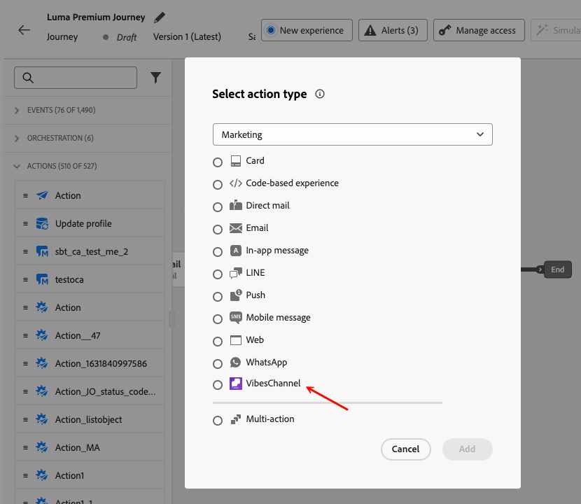
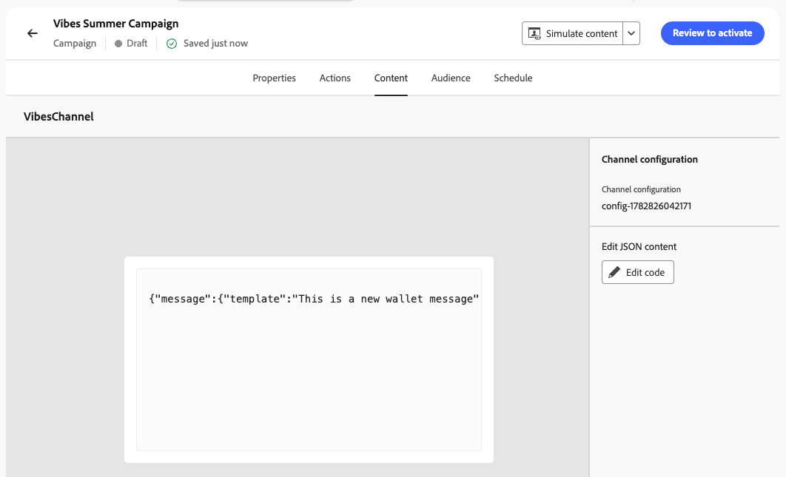

# 建立自訂管道體驗 {#create-custom-channel}

>[!BEGINSHADEBOX]

**在此頁面上：**&#x200B;瞭解如何在Adobe Journey Optimizer中將自訂頻道新增到歷程或行銷活動，並使用運算式編輯器編寫個人化訊息裝載。

>[!ENDSHADEBOX]

>[!AVAILABILITY]
>
>此功能為有限可用性。 請聯絡您的 Adobe 代表以取得存取權。

在[!DNL Journey Optimizer]中，您可以使用行銷活動和歷程中的自訂管道來傳遞訊息。 請依照下列步驟，設定您的自訂管道體驗。

>[!NOTE]
>
>在建立自訂管道體驗之前，請確定您的管理員已設定自訂管道。 [了解更多](configure-custom-channel.md)

## 透過歷程或行銷活動新增自訂動作 {#create-custom-channel-experience}

>[!CONTEXTUALHELP]
>id="ajo_journey_action_custom_channel"
>title="自訂管道動作"
>abstract="自訂管道動作會在輪廓到達歷程的此步驟時，向輪廓傳遞訊息。 標籤會識別歷程畫布中的活動，而動作則會參考定義了用於傳遞訊息的端點、承載和認證的自訂管道設定。 「**最佳化**」區段可包含內容實驗或定位規則，而「**逾時或錯誤**」區段則可定義動作失敗時的替代路徑。"
>additional-url="https://experienceleague.adobe.com/zh-hant/docs/journey-optimizer/using/orchestrate-journeys/about-journey-building/journey-action#add-action" text="開始使用自訂管道"


>[!BEGINTABS]

>[!TAB 新增自訂頻道至歷程]

自訂管道會顯示在歷程畫布浮動視窗的&#x200B;**[!UICONTROL 動作]**&#x200B;區段中，依照管道產生器中定義的顯示名稱和自訂圖示列出。

若要將自訂頻道動作新增至歷程：

1. [建立歷程](../building-journeys/journey-gs.md)。

1. 以[事件](../building-journeys/general-events.md)或[讀取對象](../building-journeys/read-audience.md)活動來開始您的歷程。

1. 從浮動視窗的&#x200B;**[!UICONTROL 動作]**&#x200B;區段拖放&#x200B;**[!UICONTROL 動作]**&#x200B;活動。 深入瞭解[動作活動](../building-journeys/journey-action.md)。

1. 在&#x200B;**[!UICONTROL 動作]**&#x200B;下拉式清單中，選取您要使用的自訂頻道。 自訂管道會依「管道產生器」中指派的名稱和圖示列出。

   {width="80%"}

1. 新增標籤至您的動作，按一下右側面板中的&#x200B;**[!DNL Configure action]**，然後選取要使用的&#x200B;**[!UICONTROL 頻道設定]**。 [瞭解如何建立自訂頻道設定](custom-channel-configuration.md#create-channel-config)

1. 在&#x200B;**[!UICONTROL 訊息]**&#x200B;區段中，按一下&#x200B;**[!UICONTROL 編輯內容]**&#x200B;以開啟裝載編輯器並編寫您的訊息。 [瞭解如何編寫內容](#author-content)

1. 視需要新增其他步驟，以完成您的歷程流程，然後發佈歷程。 [了解更多](../building-journeys/journey-gs.md)

>[!TAB 建立自訂頻道行銷活動]

若要在行銷活動中使用自訂頻道：

1. [建立行銷活動](../campaigns/create-campaign.md)。

1. 選取行銷活動型別：

   * **[!UICONTROL 已排程 — 行銷]** — 立即執行或在指定日期執行。 專為行銷訊息而設計，從UI設定。
   * **[!UICONTROL API觸發 — 行銷/異動]** — 透過API呼叫執行。 專為事件觸發訊息設計（例如訂單確認或密碼重設）。 [了解更多](../campaigns/api-triggered-campaigns.md)

1. 完成行銷活動設定：行銷活動屬性、[對象](../audience/about-audiences.md)和[排程](../campaigns/create-campaign.md#schedule)。

1. 在&#x200B;**[!UICONTROL 動作]**&#x200B;區段中，從頻道選取器中選取自訂頻道。 在您的沙箱上設定的所有自訂頻道都會與原生頻道一起顯示。

   {width="80%"}

1. 選取或建立要使用的&#x200B;**[!UICONTROL 頻道設定]**。 [瞭解如何建立管道設定](custom-channel-configuration.md#create-channel-config)

   {width="80%"}

1. 選擇性地啟用&#x200B;**[!UICONTROL 動作追蹤]**，以自動追蹤訊息裝載中包含的連結（需要為自訂管道設定的子網域）。 [瞭解如何委派自訂管道的子網域](custom-channel-subdomains.md#subdomain-delegation)

1. 在&#x200B;**[!UICONTROL 最佳化]**&#x200B;區段中，您可以：

   * **[!UICONTROL 建立目標規則]**，將不同的訊息傳送至您對象的不同區段。 [了解更多](../campaigns/create-campaign.md#targeting)
   * 按一下&#x200B;**[!UICONTROL 建立實驗]**，對您的自訂頻道訊息執行A/B測試。 [了解更多](../campaigns/create-campaign.md#content-experiment)

1. 按一下&#x200B;**[!UICONTROL 編輯內容]**&#x200B;以開啟裝載編輯器並編寫您的訊息。 [瞭解如何編寫內容](#author-content)

1. 檢閱及啟動行銷活動。 [了解更多](../campaigns/create-campaign.md)

>[!ENDTABS]

<!--
>[!TAB Add a custom channel to an orchestrated campaign]

Custom channels appear in the channel selection list in the orchestrated Campaigns canvas, below the native channels, with their custom icon and display name.

To add a custom channel in an orchestrated campaign:

1. Open or create an orchestrated campaign.

1. In the canvas, add a channel action node and select your custom channel from the list.

1. Select the **[!UICONTROL Channel configuration]** to use. Ensure the configuration includes the **[!UICONTROL Execution details]** section required for orchestrated campaigns.

1. Click **[!UICONTROL Edit content]** to open the payload editor and author your message. [Learn how to author content](#author-content)
-->

## 編寫您的自訂頻道內容 {#author-content}

內容編輯器會反映您在設定自訂頻道時定義的裝載結構。 按一下&#x200B;**[!UICONTROL 編輯代碼]**&#x200B;以開啟裝載編輯器並輸入您的訊息內容。

{width="80%"}

畫面會顯示您可以編寫和個人化的欄位。 您可以善用[!DNL Journey Optimizer]個人化編輯器及其所有個人化和編寫功能。 [了解更多](../personalization/personalization-build-expressions.md)

>[!NOTE]
>
>僅支援JSON裝載。 如果您的自訂頻道裝載不是JSON，您可以使用JSON包裝函式來封裝您的內容。 例如，如果您的裝載是XML，您可以將其包裝在JSON物件中，如下所示：
>
>```json
>{
>   "payload": "<xml>...</xml>"
>}
>```

### 個人化裝載 {#personalize}

承載編輯器中提供[!DNL Journey Optimizer]的完整個人化功能：

* **設定檔屬性** — 插入任何XDM設定檔屬性，例如`{{profile.person.name.firstName}}`或自訂身分，例如儲存在自訂名稱空間中的傳訊平台使用者ID。
* **內容屬性** — 使用歷程事件屬性，或在傳送時解析的行銷活動內容資料。
* **協助程式函式** — 使用內建字串、日期或算術函式來格式化值。 [了解更多](../personalization/functions/helpers.md)
* **運算式片段** — 跨多個管道和行銷活動重複使用共用的個人化邏輯。 [了解更多](../content-management/customizable-fragments.md)

>[!CAUTION]
>
>目前編寫時並沒有驗證裝載。 您可以使用&#x200B;**[!UICONTROL 模擬內容]**&#x200B;功能來驗證您的裝載是否為格式正確的JSON，以及所有個人化運算式是否都能正確解析您的測試設定檔。 [了解更多](test-custom-channel.md#simulate-content)

下列範例顯示具有設定檔個人化的JSON裝載：

```json
{
  "message": {
    "template": "Limited offer just for you, {{profile.person.name.firstName}}!",
    "header": "You have a FREE drink when you buy a King menu!"
  },
  "campaign_ref": {
    "id": "2grjya",
    "type": "loyalty",
    "url": "/companies/wNmRsLbu/campaigns/wallet/2grjya"
  }
}
```

```json
{
  "messaging_product": "mess",
  "recipient_type": "individual",
  "to": "{{profile.mobilePhone.number}}",
  "zipCode": 4001,
  "type": "image",
  "image": {
    "id": "1479537139650973",
    "caption": "The best succulent ever?"
  }
}
```

### 追蹤裝載中的連結 {#track-links}

若要在自訂管道裝載中包含追蹤連結，以便管道的報表控制面板自動追蹤及顯示點選，請使用下列控制面板語法包住URL：

```
{{url trackedUrl='' originalUrl='https://example.com/' type='TRACKED'}}
```

* `originalUrl` — 您要重新導向收件者的目的地URL。
* `trackedUrl` — 留空；[!DNL Journey Optimizer]會在傳送時自動填入啟用追蹤的重新導向URL。
* `type` — 必須設定為`TRACKED`。

>[!NOTE]
>
>連結追蹤需要為自訂頻道設定的子網域。 [瞭解如何委派自訂管道的子網域](custom-channel-subdomains.md#subdomain-delegation)

**範例 — 在承載中追蹤的連結：**

```json
{
  "receiver": "{{profile.mobilePhone.number}}",
  "min_api_version": 1,
  "sender": {
    "name": "Luma Rewards",
    "avatar": "https://avatar.example.com"
  },
  "tracking_data": "{{profile.person.name.firstName}}",
  "type": "text",
  "text": "Hello {{profile.person.name.firstName}}! Discover our new collection: {{url trackedUrl='' originalUrl='https://luma.com/collection' type='TRACKED'}}"
}
```

<!--
### Strict JSON mode {#strict-json}

The editor supports a **[!UICONTROL Strict JSON]** toggle:

* **Strict JSON: Off (default)** – The editor accepts any payload content, including personalization helpers and functions that may temporarily produce non-JSON syntax. A warning is displayed at the **Review to Activate** step if the payload is not well-formed JSON, prompting you to simulate and proof before publishing.
* **Strict JSON: On** – The editor validates that the payload is well-formed JSON as you type. At the **Review to Activate** step, [!DNL Journey Optimizer] validates the payload against the channel schema and flags missing required fields or type mismatches as errors that must be resolved before activation.
-->

## 啟用您的自訂頻道體驗 {#activate}

>[!IMPORTANT]
>
>在啟用之前預覽和測試您的自訂管道裝載。 [了解做法](test-custom-channel.md#preview-test)
>
>如果您的行銷活動或歷程受核准原則的約束，您必須在啟用之前請求核准。 [了解更多](../test-approve/gs-approval.md)

* **從歷程** — 按一下右上角區域中的&#x200B;**[!UICONTROL 發佈]**。 歷程開始上線，並開始呼叫您的外部端點以符合設定檔資格。 深入瞭解[發佈歷程](../building-journeys/journey-gs.md#publish-journey)。
* **從行銷活動** — 按一下&#x200B;**[!UICONTROL 檢閱以啟用]**，檢閱您的設定，然後按一下&#x200B;**[!UICONTROL 啟用]**。 此行銷活動會採用&#x200B;**[!UICONTROL 即時]**&#x200B;狀態（或如果已定義未來的開始日期，則為&#x200B;**[!UICONTROL 已排程]**）。 深入瞭解[啟用行銷活動](../campaigns/create-campaign.md#review-activate)。
