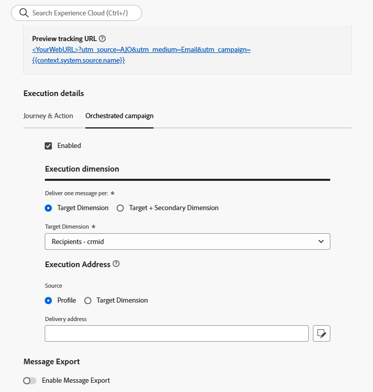

# 建立管道設定 {#create-channel-config}

管道設定會將您的自訂管道連結至行銷人員在建立行銷活動和歷程時選取的已命名、可重複使用的預設集。

若要建立自訂頻道的頻道設定，請遵循以下步驟。

1. 移至&#x200B;**[!UICONTROL 管理]** > **[!UICONTROL 管道]** > **[!UICONTROL 管道設定]**，然後按一下&#x200B;**[!UICONTROL 建立管道設定]**。 深入瞭解[建立管道設定](../configuration/channel-surfaces.md)。

1. 從&#x200B;**[!UICONTROL 選取管道]**&#x200B;下拉式清單中，選取其中一個已啟動的自訂管道。

   {width="100%"}

1. 如果選取的管道使用驗證（型別不是&#x200B;**無**），則會顯示&#x200B;**[!UICONTROL API認證]**&#x200B;欄位。 選取要用於此設定的認證。 [進一步瞭解API認證](custom-channel-api-credentials.md)

   {width="100%"}

1. 如果您已在[!DNL Journey Optimizer]中設定自訂管道的子網域，您可以選取要用於追蹤此設定之裝載中出現之連結的委派子網域。 [瞭解如何委派子網域](custom-channel-subdomains.md)

1. 如果選取的管道具有定義成端點URL之變數[&#128279;](create-custom-channel.md#endpoint-configuration)的標頭或查詢引數，則會顯示&#x200B;**[!UICONTROL 動態引數]**&#x200B;區段。

   輸入每個引數的值。 您可以使用個人化編輯器來插入動態值（例如，從設定檔解析的使用者識別碼）。 這可讓您根據每位收件者的設定檔資料自訂其請求。

   {width="100%"}

1. 如果自訂頻道具有啟用&#x200B;**[!UICONTROL 頻道設定]**&#x200B;核取方塊的裝載欄位，這些欄位會顯示在&#x200B;**[!UICONTROL 裝載設定]**&#x200B;區段中。 [了解更多](create-custom-channel.md#payload-configuration)

   {width="100%"}

   為此設定每個欄位設定適當的值。 這對於可能會因行銷活動或歷程內容而異的欄位非常有用，例如寄件者資訊或訊息範本。

1. 針對協調的行銷活動，請完成&#x200B;**[!UICONTROL 執行詳細資料]**&#x200B;區段以對應設定檔維度並指定執行地址。

   {width="80%"}

1. 按一下&#x200B;**[!UICONTROL 提交]**&#x200B;以儲存並啟動頻道設定。

<!--
>[!CAUTION]
>
>If your organization uses approval policies, you may need to request approval before activating journeys or campaigns that use this channel configuration. [Learn more](../test-approve/gs-approval.md)
-->

## 後續步驟 {#next-steps}

您的自訂管道現已完整設定。 行銷人員可以開始使用它來建置客戶體驗：

* [建立自訂管道體驗](create-custom-experience.md)
* [測試您的自訂頻道](test-custom-channel.md)
* [監視自訂通道](configure-custom-channel.md)
