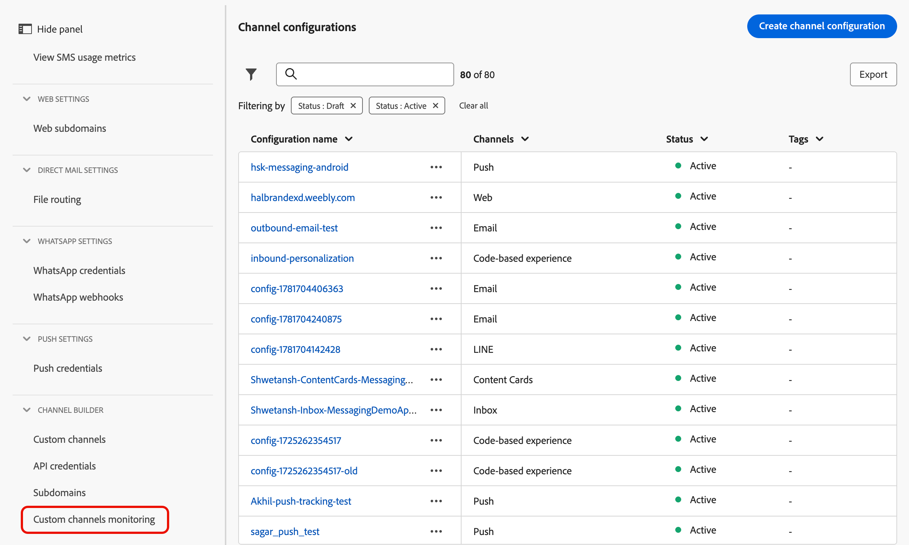
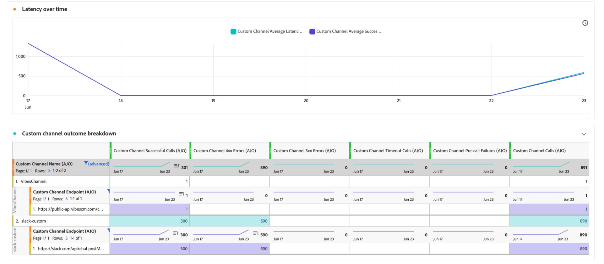

# 監視自訂通道 {#monitor-custom-channel}

自訂管道建立並啟動後，您可以[管理其生命週期](create-custom-channel.md#access-channel-builder)，並透過[!DNL Journey Optimizer]介面監控傳遞效能。

## 善用行銷活動和歷程報告 {#reporting}

[!DNL Journey Optimizer]為自訂管道提供現成可用的報告。

下列量度可用於即時(24h)和全域(CJA)報表中的自訂管道。<!--TBC and add or replace with CJA link when available-->

| 量度 | 說明 |
|--------|-------------|
| **嘗試的傳遞** | 傳送至外部端點的訊息總數。 |
| **成功傳遞** | 端點傳回HTTP 2xx回應的訊息。 |
| **設定檔已定位** | 已達到不重複設定檔的數量。 |
| **點擊次數** | 在承載中追蹤的連結點選次數。 需要委派給自訂管道的子網域。 |
| **錯誤/失敗** | 嘗試傳送失敗的次數，並依錯誤原因劃分。 |

深入瞭解[即時報告](../reports/live-report.md)和[全域報告](../reports/report-gs-cja.md)。 如需報告功能的詳細資訊，請參閱[本檔案](../reports/report-cja-manage.md)。

<!--
### Journey reports {#journey-reports}

To view delivery data for a custom channel action in a journey:

1. Open the journey from the **[!UICONTROL Journeys]** list.
1. Click **[!UICONTROL View report]** in the top-right area.
   * **[!UICONTROL Live report]** – Data for the last 24 hours.
   * **[!UICONTROL All time]** – Full lifetime data via Customer Journey Analytics (CJA).

### Campaign reports {#campaign-reports}

To view delivery data for a custom channel campaign:

1. Open the campaign from the **[!UICONTROL Campaigns]** list.
1. Click **[!UICONTROL Reports]** in the top-right area.

The campaign report includes execution count, successful deliveries, errors, and click data (if link tracking is enabled).
-->

## 監視傳遞效能 {#monitoring}

除了行銷活動和歷程報告，[!DNL Journey Optimizer]還提供專用的自訂管道監視儀表板。 從&#x200B;**[!UICONTROL 管理]** > **[!UICONTROL 管道]** > **[!UICONTROL 管道產生器]** > **[!UICONTROL 自訂管道監視]**&#x200B;存取它。

{width="100%"}

此儀表板可讓您在傳遞自訂通道訊息時，監視[!DNL Journey Optimizer]對外部端點進行API呼叫的可靠性和效能。 使用它可快速找出整合問題、延遲和節流限制。

**[!UICONTROL 自訂管道監視]**&#x200B;儀表板的功能與[!DNL Journey Optimizer]中的其他所有時間報告類似。 您可以選取時間範圍、依管道或端點篩選，並深入研究以檢視依賴每個自訂管道的行銷活動和歷程。 [了解更多](../reports/report-cja-manage.md)

### 自訂管道量度 {#monitoring-kpis}

**[!UICONTROL 自訂管道量度]**&#x200B;區段提供自訂管道呼叫的運作狀況與可靠性的整合檢視。

{width="100%"}

+++ 進一步瞭解自訂管道量度

* **[!UICONTROL 成功的呼叫]**：傳回有效回應且沒有錯誤的HTTP呼叫總數。

* **[!UICONTROL 4xx/5xx錯誤]**：由於使用者端(4xx)或伺服器端(5xx)錯誤，強調設定問題或端點失敗而失敗的呼叫數目。

* **[!UICONTROL 逾時呼叫]**：因超過最大回應時間而失敗的呼叫數。 這有助於顯示外部端點的延遲或效能問題。

* **[!UICONTROL 預先呼叫失敗]**：對外部端點進行HTTP呼叫之前失敗的自訂通道傳送數目。 這些失敗發生在[!DNL Journey Optimizer]自己的基礎結構層 — 而不是外部系統中。 共有三種類別：

  | 類別 | 說明 |
  |----------|-------------|
  | **驗證失敗** (`AUTH_*`) | [!DNL Journey Optimizer]無法取得或重新整理OAuth權杖或呼叫端點所需的認證。 檢查連結到通道設定的API認證是否有效且尚未過期。 |
  | **要求產生錯誤** (`REQUEST_GENERATION_ERROR`) | [!DNL Journey Optimizer]無法建構有效的HTTP要求 — 例如，因為無法解析URL範本或缺少必要的個人化欄位。 |
  | **HTTP剖析錯誤** (`HTTP_PARSE_ERROR`) | [!DNL Journey Optimizer]從端點收到回應，但無法將其剖析為可用的結構。 |

  >[!TIP]
  >
  >呼叫前失敗表示[!DNL Journey Optimizer]端或通道設定有問題，而不是您的外部端點有問題。 檢閱您的API憑證和必要的裝載欄位，開始疑難排解。

* **[!UICONTROL 平均延遲]**：所有HTTP呼叫的平均端對端回應時間（以毫秒為單位），包括成功的呼叫、錯誤和逾時。

<!--
* **[!UICONTROL Capped calls]**: Number of calls that were blocked due to capping limits, ensuring downstream systems are not overloaded.

* **[!UICONTROL Average RPS]**: Number of requests per second processed by the custom channel over the selected time range.

* **[!UICONTROL Average successful latency]**: Average end-to-end response time (in milliseconds) for successful calls only, excluding failed requests and timeouts.

* **[!UICONTROL Average queue time]**: Average time (in milliseconds) calls spent waiting in the execution queue before being sent. This only applies to throttled endpoints, where [!DNL Journey Optimizer] queues calls when the throughput limit is reached.
-->

+++

### 一段時間的自訂管道結果 {#outcomes-overtime}

{width="100%"}

**[!UICONTROL 一段時間的自訂管道結果]**&#x200B;圖表顯示所選時段內的HTTP呼叫KPI趨勢。 時間序列的詳細程度取決於所選的時間範圍：

* 對於7天報表，每個資料點都會顯示一天的KPI。
* 若為1天時間範圍，圖表會顯示每小時的KPI。
* 若為1小時時間範圍，圖表會顯示每分鐘的KPI。

### 一段時間的延遲 {#latency-overtime}

{width="100%"}

**[!UICONTROL 一段時間內的延遲]**&#x200B;圖表可顯示所選時段內的延遲量度趨勢。 此時間序列檢視可讓您追蹤效能模式、識別尖峰延遲期間，以及監視最佳化或系統變更隨時間流逝的影響。

### 自訂管道結果劃分 {#outcome-breakdown}

{width="100%"}

**[!UICONTROL 自訂管道結果劃分]**&#x200B;表格提供HTTP呼叫量度的階層式劃分 — 從最上層的每個端點的整體量度，到使用該端點的每個自訂管道的量度，一直到最下層依賴這些量度的促銷活動和歷程。

### 延遲劃分 {#latency-breakdown}

**[!UICONTROL 延遲劃分]**&#x200B;表格提供您自訂管道的延遲量度詳細劃分。 此檢視可協助您識別哪些特定端點或通道發生效能問題，讓您有效找出並解決延遲瓶頸。

### insight Builder {#insight-builder}

使用&#x200B;**[!UICONTROL Insight Builder]**，根據自訂管道量度建立自訂視覺效果和儀表板。 此工具可讓您結合多個KPI、套用篩選器，以及建立符合您監控和報告需求的量身打造檢視。 [了解更多](../reports/report-cja-manage.md#insight-builder)

## 疑難排解 {#troubleshooting}

如果您遇到自訂頻道的問題，下表列出常見症狀、可能的原因和建議的解決方案。

| 症狀 | 可能的原因 | 解決方法 |
|---------|----------------|------------|
| **HTTP 401 / 403錯誤** | 驗證失敗 — 認證過期或不正確。 | 在&#x200B;**[!UICONTROL 管理]** > **[!UICONTROL 管道]** > **[!UICONTROL API認證]**&#x200B;中更新認證。 |
| **HTTP 429錯誤** | 外部端點正在限制來自[!DNL Journey Optimizer]的請求。 | 檢閱端點的速率限制。 減少Channel Builder原則設定中的節流設定。 |
| **HTTP 5xx錯誤** | 外部系統故障或傳回伺服器錯誤。 | 檢查外部系統的健康情況儀表板。 在歷程動作活動上設定錯誤路徑，以正常處理暫時性失敗。 |
| **未解析的個人化權杖** | 運算式所參照的屬性不存在於設定檔中。 | 驗證XDM屬性路徑是否正確。 新增預設值遞補： `{{profile.person.name.firstName \| default("Valued Customer")}}`。 |
| **必要欄位驗證錯誤** | 編寫時必要的裝載欄位沒有值。 | 確保在內容編輯器中填入所有必填欄位。 或者，如果欄位確實是選用欄位，請在「管道產生器」中移除必要的限制。 |

<!--
## Related resources {#related}

* [Get started with custom channels](get-started-custom-channel.md)
* [Configure a custom channel](custom-channel-configuration.md)
* [Global report overview](../reports/report-gs-cja.md)
* [Journey live report](../reports/live-report.md
-->