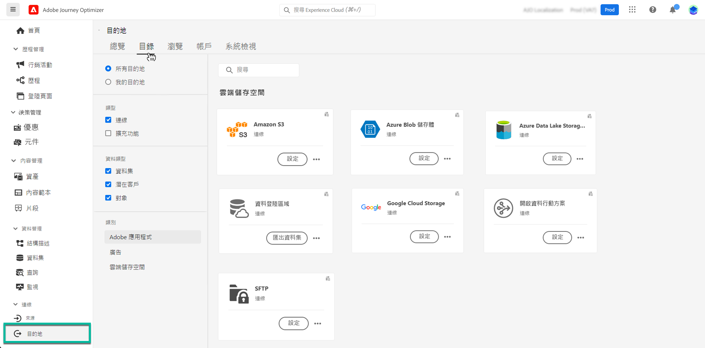

# 將資料集匯出至雲端儲存空間位置 {#export-datasets}

>[!AVAILABILITY]
>
>資料集導出功能目前處於測試版中，可供所有Adobe Journey Optimizer用戶使用。 如果您尚未擁有存取權，請與 Adobe 代表合作，取得目的地的存取權。

Journey Optimizer允許您與雲儲存位置建立即時連接，以導出資料集的內容。

通過定期導出資料，您可以確保客戶交互記錄完整且最新，將此資訊用於報告或分析目的，並維護對法律要求的遵守。

## 可用雲儲存目標 {#destinations}

您可以將資料集導出到6個雲儲存目標，這些目標可以從 **[!UICONTROL 目標]** 的 **[!UICONTROL 目錄]** 頁籤。

>[!AVAILABILITY]
>
>這些目的地均以Beta版提供，並且可能會更改。

有關每個目的地的詳細資訊可查閱Adobe Experience Platform檔案：

* [Amazon S3](https://experienceleague.adobe.com/docs/experience-platform/destinations/catalog/cloud-storage/amazon-s3.html)
* [Azure Blob](https://experienceleague.adobe.com/docs/experience-platform/destinations/catalog/cloud-storage/azure-blob.html)
* [Azure資料湖第2代](https://experienceleague.adobe.com/docs/experience-platform/destinations/catalog/cloud-storage/adls-gen2.html)
* [Data Landing Zone](https://experienceleague.adobe.com/docs/experience-platform/destinations/catalog/cloud-storage/data-landing-zone.html)
* [Google雲儲存](https://experienceleague.adobe.com/docs/experience-platform/destinations/catalog/cloud-storage/google-cloud-storage.html)
* [SFTP](https://experienceleague.adobe.com/docs/experience-platform/destinations/catalog/cloud-storage/sftp.html)

## 先決條件 {#prerequisites}

在開始導出資料集之前，請檢查以下先決條件：

* 要導出資料集，您需要 **管理目標**。 **查看目標**。 **激活目標**, **管理和激活資料集目標** [訪問控制權限](https://experienceleague.adobe.com/docs/experience-platform/access-control/home.html#permissions)。 閱讀 [訪問控制概述](https://experienceleague.adobe.com/docs/experience-platform/access-control/ui/overview.html) 或聯繫您的產品管理員以獲取所需權限。

* 此功能僅支援第一代資料的導出，即在 [Real-time Customer Data Platform產品說明](https://helpx.adobe.com/legal/product-descriptions/real-time-customer-data-platform-b2c-edition-prime-and-ultimate-packages.html)。 確保要導出的資料集不包含第二代資料。

## 導出資料集的主要步驟 {#main-steps}

將資料集導出到雲儲存位置的主要步驟如下：

有關每一步的詳細資訊可查閱Adobe Experience Platform檔案： [將資料集導出到雲儲存目標](https://experienceleague.adobe.com/docs/experience-platform/destinations/ui/activate/export-datasets.html?lang=en)。

1. **設定雲儲存目標**。 如果尚未執行此操作，請從目標目錄連接到雲儲存目標。 [瞭解如何建立新的目標連接](https://experienceleague.adobe.com/docs/experience-platform/destinations/ui/connect-destination.html?lang=en#setup)

   <!---->

1. **選擇雲儲存目標** 要導出資料集的位置。 在目標目錄中，按一下 **[!UICONTROL 導出資料集]** 按鈕，選擇要使用的連接。

   <!---->

   >[!NOTE]
   >
   >如果您正在將Adobe Journey Optimizer與即時客戶配置檔案一起使用，目標卡將顯示「激活」按鈕，允許您根據已啟用的權限導出資料集和激活此目標的段。

1. **選擇資料集** 導出到選定目標。

   <!---->

1. **計畫導出** 資料集。 指定導出應在何時啟動以及發生頻率。

   <!---->

1. **查看並確認導出** 檢查配置末尾顯示的摘要。

   <!---->

導出完成後，根據您配置的計畫將資料集的內容儲存在雲儲存位置。 [瞭解如何驗證資料集導出是否成功](https://experienceleague.adobe.com/docs/experience-platform/destinations/ui/activate/export-datasets.html#verify)
