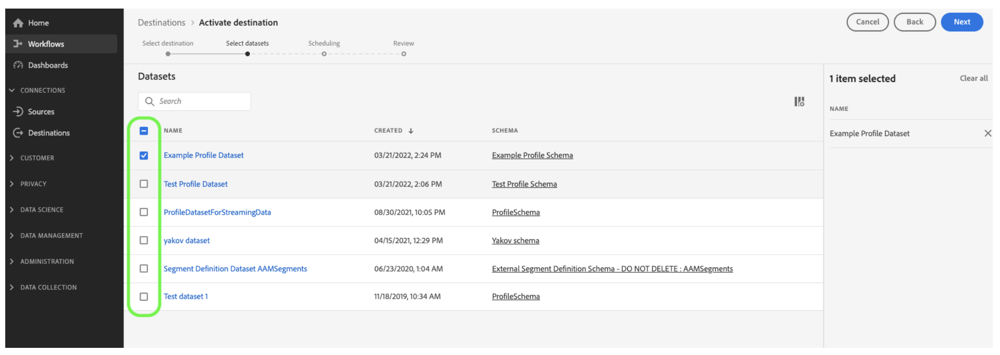

# 將資料集匯出至雲端儲存空間位置 {#export-datasets}

Journey Optimizer可讓您與雲端儲存位置建立即時連線，以匯出資料集的內容。

透過定期匯出資料，您可以確保擁有完整且最新的客戶互動記錄，以便隨時用於報告、封存或資料分析目的。

## 可用的雲端儲存空間目的地 {#destinations}

您可以將資料集匯出至6個雲端儲存空間目標，您可從以下位置存取： **[!UICONTROL 目的地]** 功能表，在 **[!UICONTROL 目錄]** 標籤。

Adobe Experience Platform檔案中提供每個目的地的詳細資訊：

* [Amazon S3](https://experienceleague.adobe.com/docs/experience-platform/destinations/catalog/cloud-storage/amazon-s3.html)
* [Azure Blob](https://experienceleague.adobe.com/docs/experience-platform/destinations/catalog/cloud-storage/azure-blob.html)
* [Azure Data Lake Gen 2](https://experienceleague.adobe.com/docs/experience-platform/destinations/catalog/cloud-storage/adls-gen2.html)
* [Data Landing Zone](https://experienceleague.adobe.com/docs/experience-platform/destinations/catalog/cloud-storage/data-landing-zone.html)
* [Google雲端儲存空間](https://experienceleague.adobe.com/docs/experience-platform/destinations/catalog/cloud-storage/google-cloud-storage.html)
* [SFTP](https://experienceleague.adobe.com/docs/experience-platform/destinations/catalog/cloud-storage/sftp.html)

## 可用於匯出的Journey Optimizer資料集 {#datasets}

從下表瞭解根據您的產品層級，您可以匯出哪些Journey Optimizer資料集(請參閱 [Journey Optimizer產品說明](https://helpx.adobe.com/tw/legal/product-descriptions/adobe-journey-optimizer.html){target="_blank"}) |資料集|說明|階層| |------- |------- |------- | | AJO BCC意見事件資料集 | AJO BCC意見事件資料集 | Prime | | AJO分類資料集 |從Journey Optimizer擷取電子郵件和推播應用程式回饋事件的資料集。 透過SDK建立。 | Prime | | AJO同意服務資料集 |儲存設定檔的同意資訊。 | Prime | | AJO電子郵件追蹤體驗事件資料集 |電子郵件通道的互動記錄，用於報表和建立受眾。  | Prime | | AJO實體資料集 |要儲存傳送給一般使用者之訊息的實體中繼資料的資料集。  | Prime | | AJO傳入活動事件資料集 |適用於Journey Optimizer網路和應用程式內管道的資料集，用於傳遞和互動事件。 | Prime | | AJO互動式訊息設定檔資料集 |儲存為支援API觸發的行銷活動而建立的設定檔 | Prime | | AJO訊息回饋事件資料集 |訊息傳遞記錄。 有關用於報告與對象建立目的，而從 Journey Optimizer 傳遞之所有訊息的資訊。 電子郵件 ISP 對退回郵件的意見也會記錄在此資料集。| Prime | | AJO設定檔計數器擴充功能 |保留包含counter_value和expiryDate的物件地圖，並以counter_id作為索引鍵 | Prime | | AJO推播設定檔資料集 |儲存設定檔的推播權杖。 | Prime | | AJO推播追蹤體驗事件資料集 |推播頻道的互動記錄，用於報表和建立受眾。  | Prime | | AJO表面資料集 |與Journey Optimizer輸入表面結構描述相關的空白資料集 | Prime | | AOOutputForUPSDataset |包含要回寫至UPS的所有AO對象會籍 | Prime | | Audience Orchestration設定檔資料集 |由「對象構成」對象的對象構成產生。 包含所有Audience Composition對象、其屬性和擴充資料 | Prime | |決定物件存放庫 — 活動 |也稱為使用者介面中的決定。 但是這些是使用者建立的物件，會將所有建置區塊放在一起，包括決策邏輯。 例如，針對特定位置（位置），應考量哪些優惠（優惠收藏），以及要對這些優惠方案使用哪個排名方法。 | Ultimate | |決定物件存放庫 — 遞補優惠 |這是使用者建立之其他型別選件的存放庫。 具體來說，如果他們沒有資格檢視個人化優惠且需要檢視某些內容，他們至少會看到遞補優惠。 此資料集包含此型別選件的屬性 | Ultimate | |決定物件存放庫 — 個人化優惠 |這是使用者建立之選件型別的存放庫。 因此，此資料集包含此類選件的相關屬性 | Ultimate | |決定物件存放庫 — 位置 |此為物件存放庫，定義需要顯示選件的位置。 | Ultimate | |歷程步驟事件 |擷取從Journey Optimizer產生並供Reporting等服務使用的所有歷程步驟體驗事件。 | Prime | |歷程 |中繼資料資料集存放歷程中每個步驟的資訊 | Prime | | ODE DecisionEvents — 生產決策 |每當我們根據請求做出決定時，就會將其計為決定事件 | Ultimate |

## 先決條件 {#prerequisites}

若要匯出資料集，您需要 [存取控制許可權](https://experienceleague.adobe.com/docs/experience-platform/access-control/home.html#permissions) 列於下方。 閱讀 [存取控制總覽](https://experienceleague.adobe.com/docs/experience-platform/access-control/ui/overview.html) 或聯絡您的產品管理員以取得必要許可權。

| 類別 | 權限 |
|--|--|
| 目的地 | 管理和啟用資料集目的地 |
| 資料管理 | 檢視資料集 |
| 目的地 | 檢視目的地 |

## 匯出資料集的主要步驟 {#main-steps}

將資料集匯出至雲端儲存位置的主要步驟如下：

Adobe Experience Platform檔案中提供每個步驟的詳細資訊： [將資料集匯出至雲端儲存空間目的地](https://experienceleague.adobe.com/docs/experience-platform/destinations/ui/activate/export-datasets.html).

1. **設定您的雲端儲存空間目的地**. 如果您尚未這麼做，請從目的地目錄連線至雲端儲存空間目的地。 [瞭解如何建立新的目的地連線](https://experienceleague.adobe.com/docs/experience-platform/destinations/ui/connect-destination.html#setup)

   <!---->

1. **選取雲端儲存空間目的地** 匯出資料集的位置。 在目的地目錄中，按一下 **[!UICONTROL 匯出資料集]** 按鈕，並選取要使用的連線。

   <!---->

   >[!NOTE]
   >
   >如果您搭配使用Adobe Journey Optimizer以及即時客戶設定檔，目的地卡片會顯示「啟用」按鈕，讓您根據已啟用許可權，匯出資料集並啟用此目的地的對象。

1. **選取資料集** 要匯出至所選目的地的檔案。 [進一步瞭解可用於匯出的Journey Optimizer資料集](#datasets)

   <!---->

1. **排程匯出** 您的資料集的。 指定匯出應該何時開始，以及應該發生的頻率。

   <!---->

1. **檢閱並確認匯出** 檢查組態結束時顯示的摘要。

   <!---->

匯出完成後，資料集的內容會根據您設定的排程儲存在雲端儲存位置。 [瞭解如何驗證成功的資料集匯出](https://experienceleague.adobe.com/docs/experience-platform/destinations/ui/activate/export-datasets.html#verify)
