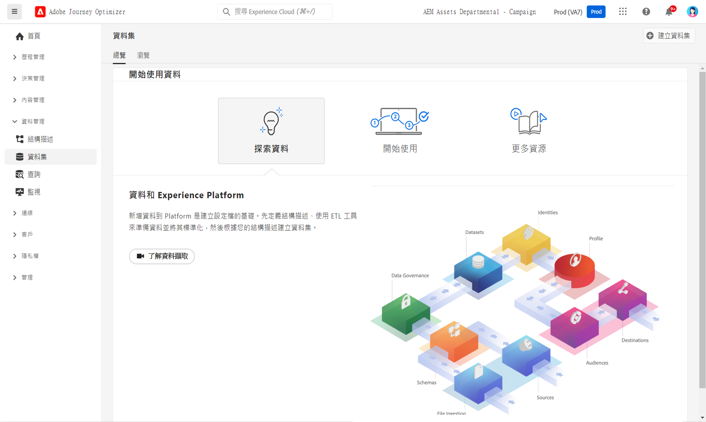
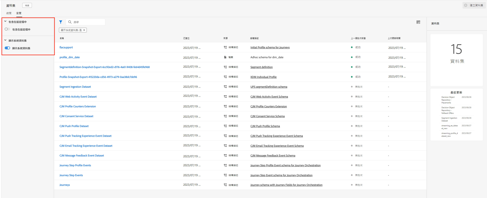
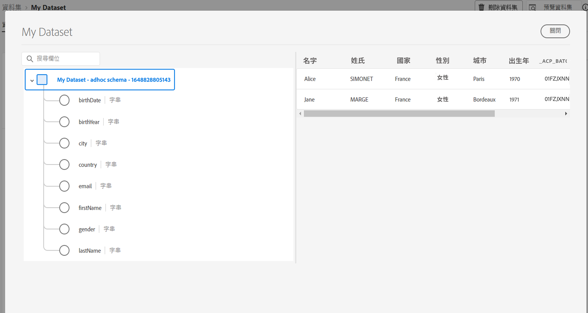

# 開始使用資料集 {#datasets-gs}

所有擷取至 Adobe Experience Platform 的資料都會以資料集的形式保留在資料湖。資料集是資料集合的儲存和管理結構，通常是包含方案 (欄) 和欄位 (列) 的表格。 

## 護欄和限制

* 自 2024 年 11 月 1 日起，串流分段已不再支援來自 [!DNL Journey Optimizer] 追蹤、回饋資料集的傳送、開啟事件。針對實作頻率上限或疲勞管理部分，請改用企業規則。 您可在[本章節](../conflict-prioritization/rule-sets.md)中找到更多詳細資料，包括[此處](https://experienceleaguecommunities.adobe.com/t5/journey-optimizer-blogs/elevate-customer-experience-with-daily-frequency-capping-in-ajo/ba-p/761510){target="_blank"}每日上限的使用案例說明。

* 自2025年2月起，存留時間(TTL)護欄正在推出至Journey Optimizer系統產生的資料集。 [了解更多](datasets-ttl.md)

## 存取資料集 {#access}

**使用者介面中的**&#x200B;資料集[!DNL Adobe Journey Optimizer]工作區可讓您探索資料並建立資料集。 若要開啟「資料集」儀表板，請在左側導覽中選取&#x200B;**資料集**。

選取&#x200B;**瀏覽**&#x200B;索引標籤，顯示貴組織所有可用資料集的清單。 系統會顯示每個列出資料集的詳細資料，包括其名稱、資料集所遵守的結構描述，以及最近一次擷取執行的狀態。 預設情況下，只會顯示您已擷取的資料集。如果要查看系統產生的資料集，請從篩選器啟用&#x200B;**顯示系統資料集**&#x200B;切換。

選取資料集名稱，以存取其「資料集」活動畫面，並查看所選取資料集的詳細資訊。 活動索引標籤包含將所使用訊息的比率視覺化的圖形，以及成功和失敗批次的清單。

若要預覽資料集，請選取熒幕右上角附近的&#x200B;**預覽資料集**，以預覽此資料集中最近成功的批次。 當資料集空白時，預覽連結會停用。

## [!DNL Journey Optimizer]個系統資料集 {#system-datasets}

本節列出[!DNL Journey Optimizer]使用的系統資料集。 若要檢視每個結構描述的欄位與屬性完整清單，請參閱 [Journey Optimizer 結構描述字典](https://experienceleague.adobe.com/tools/ajo-schemas/schema-dictionary.html?lang=zh-Hant){target="_blank"}。

>[!CAUTION]
>
> 系統資料集&#x200B;**不得修改**。 每次產品更新都會自動回復任何變更。

* 報告

   * _報告 - 訊息意見事件資料集_：訊息傳遞記錄檔。 有關用於報告與客群建立目的，而從 Journey Optimizer 傳遞之所有訊息的資訊。 電子郵件 ISP 對退回郵件的意見也會記錄在此資料集。
   * _報告 - 電子郵件追蹤體驗事件資料集_：用於報告與客群建立目的使用之電子郵件頻道的互動記錄。 儲存的資訊會通知終端使用者在電子郵件執行的動作 (開啟、按一下等)。
   * _報告 - 推播追蹤體驗事件資料集_：用於報告與客群建立目的使用之推播通知頻道的互動記錄。 儲存的資訊會通知終端使用者在推播通知執行的動作。
   * _報告 - 歷程步驟事件_：擷取從 Journey Optimizer 產生的所有歷程步驟體驗事件，供報告等服務使用。對於在 Customer Journey Analytics 建立 YoY 分析也很重要。繫結至歷程中繼資料。
   * _報告 - 歷程_：包含歷程每個步驟資訊的中繼資料資料集。
   * _報告 - 密件副本_：用於儲存密件副本電子郵件的傳遞記錄意見事件資料集。 用於報告用途。

* 同意

  _同意服務資料集_：儲存輪廓的同意資訊。

* Intelligent Services

  _傳送時間最佳化分數 / 參與分數_：輸出 Journey AI 的分數。

## 建立資料集{#create-datasets}

將資料新增至 [!DNL Adobe Experience Platform] 是建立輪廓的基礎。 然後，您將能夠善用 [!DNL Adobe Journey Optimizer] 的輪廓。首先定義結構描述，使用 ETL 工具準備和標準化資料，然後根據您的結構描述建立資料集。

您可以從結構描述或CSV檔案建立資料集。 有關如何建立資料集的詳細資訊，請參閱[!DNL Adobe Experience Platform]檔案：

* [使用現有結構描述建立資料集](https://experienceleague.adobe.com/en/docs/experience-platform/catalog/datasets/user-guide#schema){target="_blank"}
* [將CSV檔案對應到現有的XDM結構描述](https://experienceleague.adobe.com/en/docs/experience-platform/ingestion/tutorials/map-csv/existing-schema){target="_blank"}

觀看此影片，了解如何建立資料集、將資料對應至結構描述、新增資料，以及確認資料已擷取。

>[!VIDEO](https://video.tv.adobe.com/v/334293?quality=12)

## 資料治理

在資料集中，瀏覽&#x200B;**資料控管**&#x200B;索引標籤來檢查資料集和欄位層級的標籤。 資料控管會根據套用的原則類型來分類資料。

[!DNL Adobe Experience Platform] 的核心功能之一是將來自多個企業系統的資料彙整在一起，讓行銷人員更能識別、了解並吸引客戶。 此資料可能受貴組織或法律法規所定義的使用限制所約束。 因此，務必確保您的資料操作符合資料使用原則。

[!DNL Adobe Experience Platform Data Governance] 可讓您管理客戶資料，並確保符合適用於資料使用的法規、限制與原則。它在 Experience Platform 的各個層面發揮關鍵作用，包括編目、資料譜系、資料使用標籤、資料使用原則和控制資料在行銷活動的使用。

深入了解資料控管及資料使用標籤，請參閱[資料治理文件](https://experienceleague.adobe.com/docs/experience-platform/data-governance/labels/user-guide.html?lang=zh-Hant){target="_blank"}

## 範例與使用案例 {#samples}

* [教學課程 — 將資料擷取至Adobe Experience Platform](https://experienceleague.adobe.com/docs/experience-platform/ingestion/tutorials/ingest-batch-data.html?lang=zh-Hant){target="_blank"}
* [端對端使用案例](../audience/creating-test-profiles.md) — 建立結構描述、資料集和內嵌資料，以在[!DNL Adobe Journey Optimizer]中新增測試設定檔
* [查詢範例](../data/datasets-query-examples.md) - [!DNL Adobe Journey Optimizer]資料集和相關使用案例。

>[!MORELIKETHIS]
>
>* [資料集檔案](https://experienceleague.adobe.com/docs/experience-platform/catalog/datasets/overview.html?lang=zh-Hant){target="_blank"}
>* [資料擷取檔案](https://experienceleague.adobe.com/docs/experience-platform/ingestion/home.html?lang=zh-Hant){target="_blank"}。
>* [資料管理授權權益最佳實務](https://experienceleague.adobe.com/en/docs/experience-platform/landing/license/data-management-best-practices#data-management-best-practices){target="_blank"}
