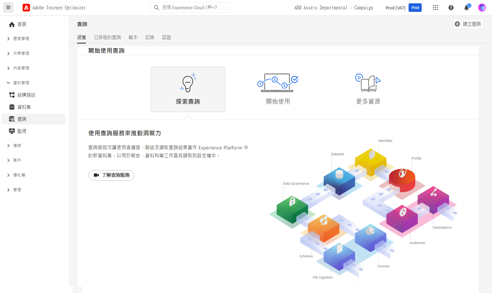

# 開始使用查詢 {#queries-gs}

查詢編輯器是 Adobe Experience Platform 查詢服務提供的互動式工具，允許您在 [!DNL Adobe Journey Optimizer] 使用者介面編寫、驗證和執行對客戶體驗資料的查詢。

查詢編輯器支援開發用於分析及資料瀏覽的查詢，並允許您執行用於開發的互動式查詢以及用於填入[資料集](get-started-datasets.md)的非互動式查詢。

在[本檔案](https://experienceleague.adobe.com/docs/experience-platform/query/ui/user-guide.html?lang=zh-Hant){target="_blank"}中瞭解如何使用查詢編輯器。

>[!MORELIKETHIS]
>
>* [查詢服務檔案](https://experienceleague.adobe.com/docs/experience-platform/query/home.html?lang=zh-Hant){target="_blank"}
>* [查詢服務概觀影片](https://experienceleague.adobe.com/docs/platform-learn/tutorials/queries/understanding-query-service.html?lang=zh-Hant){target="_blank"}
